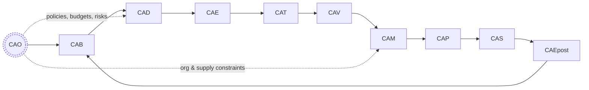

# AGENTS.md — Copilot Coding Agent Instructions

**UTCS‑MI v5.0 Identifier**  
EstándarUniversal:Especificacion-Definicion-ARP4754A+DO178C+DO254+S1000D+CS25-00.00-QuantumAidedLifecycleCopilotCodingAgentGuide-0001-v1.0-Aerospace and Quantum United Agency-GeneracionHybrida-CROSS-Amedeo Pelliccia-deadbeef-RestoDeVidaUtil

> **Acronym hygiene for UTCS‑MI**: In the 13‑field identifier above, *program* and *category* must avoid acronyms; regulation codes like DO178C, CS25 are allowed. Operational short codes (AAA, CQH, etc.) may be used inside this document and code, but **must not** appear in UTCS‑MI fields for programs/categories/artifacts.

---

## Role
Act as a cross‑pillar contributor across the QAL (Quantum‑Aided Lifecycle) domains while maintaining end‑to‑end traceability and certification readiness.

- **CAO** (Computer Aided Organization) — Project organization and planning  
- **CAB** (Computer Aided Brainstorming) — Ideation and concept development  
- **CAD** (Computer Aided Design) — Engineering design and modeling  
- **CAE** (Computer Aided Engineering) — Analysis and simulation  
- **CAT** (Computer Aided Tooling and Testing) — Tooling design and test planning  
- **CAV** (Computer Aided V&V and Certification) — Verification, validation, and certification  
- **CAM** (Computer Aided Manufacturing) — Manufacturing process planning  
- **CAP** (Computer Aided Plan and Production) — Production planning and execution  
- **CAS** (Computer Aided Services and Sustainment) — Maintenance and support services  
- **CAEpost** (Computer Aided EoL post‑ponements and post‑treatments) — End‑of‑life management and disposal

**Traceability rule:** Do **not** generate S1000D deliverables outside **CAS**. Elsewhere, only reference/pointer artifacts are permitted.

---

## QAL Overview
The lifecycle runs as a closed evidence loop around the Digital Evidence Twin (DET) and QAUDIT ledger:



Phases: CAB → CAD → CAE → CAT → CAV → CAM → CAP → CAS → CAEpost, with CAO continuously optimizing resources, risks, and policies across all phases.

---

## Guardrails

* **No secrets** (tokens, credentials) in code/commits.
* Respect **data flow hierarchy**: DI → CE → CC → CI → CP and **ATA SNS** naming.
* EBOM/MBOM/analysis/integration/requirements/feasibility/compliance changes must update the corresponding **DET** files and be explicitly called out in the PR body.
* Avoid breaking changes. If unavoidable, provide a migration plan and deprecation window.
* Maintain backward compatibility where feasible.
* **UTCS‑MI everywhere**: all artifacts must carry a compliant 13‑field ID. Programs/categories use descriptive CamelCase without acronyms.

---

## DET Update Requirements

* EBOM changes → Update `DET:CAD:<DOMAIN>:<SNS>:design:V*`
* MBOM changes → Update `DET:CAM:<DOMAIN>:<SNS>:manufacturing:V*`
* Analysis changes → Update `DET:CAE:<DOMAIN>:<SNS>:analysis:V*`
* Link each DET revision with `previous_hash` per **UTCS‑BLOCKCHAIN** rules.

---

## Phase Playbook

| Phase   | Purpose                                           | Inputs → Outputs                                                          | Quantum Augmentations                                                                           | Gate & Metrics                                                                      |
| ------- | ------------------------------------------------- | ------------------------------------------------------------------------- | ----------------------------------------------------------------------------------------------- | ----------------------------------------------------------------------------------- |
| CAO     | Align strategy, budget, risk, compliance          | Org goals, regs, capacity → QAL‑Policy Pack, Risk Register, Budget Vector | QAOA/QUBO for portfolio & schedule; CVaR risk optimization; multi‑site resource matching        | **G0 Strategy Freeze** — IRR/NPV, CVaR@α, capacity utilization, compliance coverage |
| CAB     | Explore solution space, generate concepts         | Policy Pack, needs → Concept Set, Rationale Graph                         | QML latent exploration; amplitude‑amplified retrieval; MaxEnt novelty search                    | **G1 Concept Review** — novelty score, feasibility score, traceability %            |
| CAD     | Parametric/inverse design, architecture baselines | Concept Set → Design Baseline, ICDs, safety objectives                    | Quantum‑kernel regression; QAOA‑seeded topology/material layout; multi‑objective Pareto seeding | **G2 Design Freeze** — margins, complexity, interface maturity, ↓ change velocity   |
| CAE     | High‑fidelity analyses                            | Baseline → Verified Models, Evidence Packs (DET)                          | VQE for materials/chemistry; research into quantum linear solvers; QML surrogates               | **G3 Model Credibility** — model error bounds, coverage %, uncertainty budgets      |
| CAT     | Test design/fixtures/DoE                          | Verified Models → Test Plan, Tooling Pack, calibrated benches             | QAOA for DoE selection; entangled‑sensor calibration; robust test ordering                      | **G4 Test Readiness** — info gain, schedule risk, fixture re‑use                    |
| CAV     | V&V & certification                              | Test data + reqs → Conformance Dossiers, Safety Case, Cert Matrix         | QUBO minimal test sets; PQC evidence; QML anomaly search                                        | **G5 Certification Dossier** — requirement coverage, defect escape, auditability    |
| CAM     | Manufacturing                                     | Dossiers → Process Plans, Travelers, eBOM/mBOM, routings                  | Quantum job‑shop; SICOCA supply‑chain optimization; robust lot sizing                           | **G6 First Article Pass** — yield, takt, WIP, supplier CVaR                         |
| CAP     | Production & logistics                            | Process plans → Build Plan, procurement orders                            | QAOA network flow; stochastic inventory with CVaR                                               | **G7 Rate Capability** — OTD, inventory turns, cost variance                        |
| CAS     | Ops & sustainment                                 | Telemetry → PHM Models, Service Bulletins, configuration state            | QML anomaly detection; quantum‑aided rare‑event filtering; spares positioning                   | **G8 Fleet Reliability** — dispatch reliability, MTBUR/MTBF, spares SLA             |
| CAEpost | EoL management                                    | Fleet state → EoL Plan, recovery/recycle chain                            | LCA‑constrained optimization; disassembly sequencing; materials separation                      | **G9 Responsible EoL** — recovered value %, CO₂e reduction, landfill %              |

**Evidence backbone:** Every artifact lands in the **DET** with a signed, time‑ordered hash chain in **QAUDIT**; all Gx gates verify proof‑of‑lineage and proof‑of‑conformance.

---

## Task Patterns

* Small, scoped PRs (≤ 300 lines changed) for faster review and reduced risk.
* Prefer edits over new formats to retain coherence with existing structures.
* Run CI locally/ephemerally (lint, schema validation, unit tests) and paste a one‑line summary in the PR description.
* Commit messages: `feat|fix|refactor: brief description (affects UTCS: <id>)`.
* Branch from main/feature; merge via squash or rebase to keep history clean.
* Validation sequence:

  ```bash
  yamllint -s .
  python UTCS-BLOCKCHAIN/validate_utcs_mi.py
  jq empty $(git ls-files '*.json')
  python CI/*/Integrity/validate_ci_package.py
  ```

---

## Cross‑Domain Interfaces

* **Cryogenics** ↔ **Structures**: Thermal/structural interfaces
* **Propulsion** ↔ **Structures**: Engine mount points
* **Safety** ↔ **All**: Safety assessment dependencies

> **Change protocol:** When modifying interfaces, notify owning domain via @mention in PR and attach updated DET evidence.

---

## Data & Control Surfaces

### Minimal Event Model (QAL Bus)

Use **one** schema across phases to ensure tool interoperability and certification consistency.

```json
{
  "utcs_id": "EstándarUniversal:... (13 fields)",
  "phase": "CAO|CAB|CAD|CAE|CAT|CAV|CAM|CAP|CAS|CAEpost",
  "artifact_type": "DesignBaseline|EvidencePack|TestPlan|ConformanceDossier|ProcessPlan|BuildPlan|ServiceBulletin|EoLPlan|...",
  "inputs": ["sha256:..."],
  "outputs": ["sha256:..."],
  "req_trace": [{"req_id":"REQ-...", "status":"pass|fail|na", "evidence":"sha256:..."}],
  "risk": {"cvar_alpha": 0.95, "cvar_value": 0.0, "hazards":["..."]},
  "quantum": {"algo":"QAOA|VQE|QML", "seed": 12345, "p": 3, "backend":"simulator|hardware"},
  "pqc_signature": {"alg":"Dilithium3", "sig":"..."},
  "provenance": {"tool":"...", "version":"...", "agent":"GAIA AIR v4.0", "time_utc":"..."}
}
```

---

## Communication

* Clarify ambiguous requirements/constraints before implementation.
* Provide succinct progress notes for multi‑step tasks.
* Escalate blockers (access, conflicting requirements) to the lead.
* Document assumptions in the PR if any requirement is incomplete.

---

## Best Practices

* Clean, readable code; comment only where complexity demands it.
* Include unit tests for new features and regression tests for fixes.
* Update README/API docs alongside code changes.
* Validate against schemas and integration points before PR.
* Adhere to aerospace norms (e.g., safety, traceability, configuration control).

---

## Quantum Insertion Points

* **Optimization**: QAOA/QUBO for portfolio (CAO), design trade spaces (CAD), DoE (CAT), requirement coverage (CAV), job‑shop & MRP (CAM/CAP), spares/routing (CAS), EoL recovery (CAEpost).
* **Modeling/Learning**: QML kernels for low‑data regimes (CAD/CAE), anomaly detection (CAS).
* **Physics/Chemistry**: VQE/VQD for materials, catalysis, hydrogen storage (CAE/CAM).
* **Risk**: CVaR objectives across CAO/CAP/supply chain.
* **Security**: PQC signatures on DET artifacts (CAV + everywhere).

---

## PR Template (Append to PR Description)

```
- **Summary:** ...
- **Pillar(s):** ...
- **Affected UTCS IDs (DI/CE/CC/CI/CP):** ...
- **Validation:** build/lint/tests/schema summary
- **DET Updates:** files & previous_hash linkage
- **Interface Changes:** cross-domain impacts
- **Weight Delta:** kg (if applicable)
- **Certification Impact:** CS-25 clauses affected
- **Rollback Plan:** ...
- **Notes for Reviewers:** ...
```

---

## Review Process

* Address feedback promptly; iterate as needed.
* Require ≥ 1 cross‑pillar approval before merge.
* Monitor post‑merge; open hotfix if a critical issue appears.

---

## Certification Braid

* **ARP4754A**: CAB/CAD for allocation & validation; CAV for verification matrix.
* **DO‑178C / DO‑254**: CAD/CAE/CAT/CAV plans, reviews, tests; DET stores structural coverage & V\&V artifacts.
* **S1000D / iSpec2200**: CAS owns IETP/IETM & Illustrated Parts; all UTCS‑tagged.
* **CS‑25**: CAV owns conformity statements; CAM/CAP provide manufacturing conformity evidence (FAI/PC).

---

## Recovery Procedures

* **Broken build:** hotfix branch from last known good.
* **Hash mismatch:** `UTCS-BLOCKCHAIN/Integrity/generate_hashes.sh`.
* **Schema violation:** validate against `UTCS-BLOCKCHAIN/schemas/`.
* **DET merge conflict:** preserve chain continuity; never rebase published DET commits.

---

## SLAs

* PR review response: < 24 h
* Critical fix deployment: < 4 h
* DET chain validation: < 60 s
* Cross‑pillar sign‑off: < 48 h

---

## Branch Patterns

* `feat/<pillar>/<sns>-<description>`
* `fix/<det-id>-<issue>`
* `refactor/<domain>-<component>`
  Example: `feat/cad/53-10-01-bulkhead-optimization`

---

## Pre‑commit Hooks

Install: `cp .githooks/pre-commit .git/hooks/`
Validates:

* No large files (>10 MB without LFS)
* No credentials (`git-secrets` scan)
* Valid JSON/YAML syntax
* UTCS‑MI ID compliance
* Staged diff ≤ 300 added/changed lines (docs/\* exempt)

**.githooks/pre-commit**

```bash
#!/usr/bin/env bash
set -euo pipefail

# 1) Large files
max_kb=10240
files=$(git diff --cached --name-only --diff-filter=AM)
for f in $files; do
  [ -f "$f" ] || continue
  sz=$(wc -c <"$f")
  if [ "$sz" -gt $((max_kb*1024)) ] && ! git lfs track "$f" >/dev/null 2>&1; then
    echo "✖ Large file without LFS: $f ($sz bytes)"; exit 1
  fi
done

# 2) Secrets (optional if git-secrets installed)
if command -v git-secrets >/dev/null 2>&1; then
  git-secrets --scan
fi

# 3) Syntax
if command -v jq >/dev/null 2>&1; then
  git diff --cached --name-only --diff-filter=AM | grep -E '\.json$' | xargs -r jq empty
fi
if command -v yamllint >/dev/null 2>&1; then
  yamllint -s .
fi

# 4) UTCS‑MI regex check inside changed files
re='^EstándarUniversal:[^:]+-[^:]+-[A-Z0-9+\-]+-[0-9]{2}\.[0-9]{2}-[A-Z][a-zA-Z0-9]+-[0-9]{4}-v[0-9]+\.[0-9]+-[A-Z][a-zA-Z0-9 ]+-(GeneracionHumana|GeneracionHybrida|GeneracionAuto)-(AIR|SPACE|DEFENSE|GROUND|CROSS)-[^:]+-[a-f0-9]{8}-(RestoDeVidaUtil|[A-Za-z→]+)$'
grep -Hn "EstándarUniversal:" $files | awk -F: '{print $1":"$2}' | while read -r loc; do
  file="${loc%:*}"; line="${loc#*:}"
  val=$(sed -n "${line}p" "$file" | tr -d '
')
  echo "$val" | grep -Eq "$re" || { echo "✖ UTCS‑MI invalid in $file:$line"; exit 1; }
done

# 5) Diff size (excluding docs/)
added=$(git diff --cached --numstat | awk '!/^-/ && $3 !~ /^docs\// {a+=$1; c+=$2} END {print a+c+0}')
if [ "${added:-0}" -gt 300 ]; then
  echo "✖ Staged changes exceed 300 lines (actual: $added). Split the PR."
  exit 1
fi

echo "✔ pre-commit checks passed"
```

---

## Domain Responsibilities

| Domain | Lead             | Backup        | Critical Items |
| ------ | ---------------- | ------------- | -------------- |
| AAA    | @structures-lead | @aero-lead    | 53-*, 57-*     |
| CQH    | @cryo-lead       | @systems-lead | 28-\*, ZBO     |
| DDD    | @safety-lead     | @cyber-lead   | 25-\*, DAL-A   |

> *Note:* These are **operational codes** only; do not inject them into UTCS‑MI program/category fields.

---

## Appendix A — QAL Bus JSON Schema (`schemas/qal_bus.schema.json`)

```json
{
  "$schema": "http://json-schema.org/draft-07/schema#",
  "title": "QAL Bus Event",
  "type": "object",
  "required": ["utcs_id", "phase", "artifact_type", "inputs", "outputs", "provenance"],
  "properties": {
    "utcs_id": {"type":"string", "pattern":"^EstándarUniversal:.{10,}$"},
    "phase": {"type":"string", "enum":["CAO","CAB","CAD","CAE","CAT","CAV","CAM","CAP","CAS","CAEpost"]},
    "artifact_type": {"type":"string"},
    "inputs": {"type":"array", "items":{"type":"string", "pattern":"^sha256:[0-9a-f]{64}$"}},
    "outputs": {"type":"array", "items":{"type":"string", "pattern":"^sha256:[0-9a-f]{64}$"}},
    "req_trace": {
      "type":"array",
      "items":{
        "type":"object",
        "required":["req_id","status","evidence"],
        "properties":{
          "req_id":{"type":"string"},
          "status":{"type":"string","enum":["pass","fail","na"]},
          "evidence":{"type":"string","pattern":"^sha256:[0-9a-f]{64}$"}
        }
      }
    },
    "risk": {
      "type":"object",
      "properties":{
        "cvar_alpha":{"type":"number","minimum":0.5,"maximum":0.9999},
        "cvar_value":{"type":"number"},
        "hazards":{"type":"array","items":{"type":"string"}}
      }
    },
    "quantum": {
      "type":"object",
      "properties":{
        "algo":{"type":"string","enum":["QAOA","VQE","QML"]},
        "seed":{"type":"integer","minimum":0},
        "p":{"type":"integer","minimum":1},
        "backend":{"type":"string","enum":["simulator","hardware"]}
      }
    },
    "pqc_signature": {
      "type":"object",
      "properties":{
        "alg":{"type":"string"},
        "sig":{"type":"string"}
      }
    },
    "provenance": {
      "type":"object",
      "required":["tool","version","agent","time_utc"],
      "properties":{
        "tool":{"type":"string"},
        "version":{"type":"string"},
        "agent":{"type":"string"},
        "time_utc":{"type":"string","format":"date-time"}
      }
    }
  },
  "additionalProperties": false
}
```

---

## Appendix B — UTCS‑MI Validator (Python, `UTCS-BLOCKCHAIN/validate_utcs_mi.py`)

```python
#!/usr/bin/env python3
import re, sys, pathlib

RE = re.compile(r'^EstándarUniversal:'
                r'(?P<clase>[^:]+)-'
                r'(?P<fase>[^:]+)-'
                r'(?P<reg>[A-Z0-9+\-]+)-'
                r'(?P<capsec>\d{2}\.\d{2})-'
                r'(?P<categoria>[A-Z][a-zA-Z0-9]+)-'
                r'(?P<seq>\d{4})-'
                r'(?P<ver>v\d+\.\d+)-'
                r'(?P<programa>[A-Z][a-zA-Z0-9 ]+)-'
                r'(?P<gen>GeneracionHumana|GeneracionHybrida|GeneracionAuto)-'
                r'(?P<dom>AIR|SPACE|DEFENSE|GROUND|CROSS)-'
                r'(?P<idf>[^:]+)-'
                r'(?P<hash>[a-f0-9]{8})-'
                r'(?P<periodo>RestoDeVidaUtil|[A-Za-z→]+)$')

PROHIBITED = {"BWB","HE","UAV","VTOL","H2","FBW","FBQW"}  # extend as needed

def invalid_reason(s: str):
    m = RE.match(s.strip())
    if not m:
        return "regex_mismatch"
    cat = m["categoria"]; prog = m["programa"]
    # Prohibit acronyms in category/program (heuristic: all-caps tokens of length 2-6)
    caps_tokens = [t for t in prog.split() if t.isupper()] + [cat] if cat.isupper() else []
    if any(t in PROHIBITED or (t.isupper() and 2 <= len(t) <= 6) for t in caps_tokens):
        return "acronym_violation"
    return ""

def main():
    errs = []
    for p in sys.argv[1:]:
        for i, line in enumerate(pathlib.Path(p).read_text(encoding="utf-8").splitlines(), 1):
            if line.startswith("EstándarUniversal:"):
                why = invalid_reason(line)
                if why:
                    errs.append(f"{p}:{i}:{why}")
    if errs:
        print("
".join(errs)); sys.exit(1)
    print("UTCS‑MI validation passed.")

if __name__ == "__main__":
    if len(sys.argv) == 1:
        print("usage: validate_utcs_mi.py <files...>"); sys.exit(2)
    main()
```

---

## Appendix C — GitHub Actions CI (`.github/workflows/ci.yaml`)

```yaml
name: CI

on:
  pull_request:
    branches: [ main, develop ]
  push:
    branches: [ main ]

jobs:
  validate:
    runs-on: ubuntu-latest
    steps:
      - uses: actions/checkout@v4

      - name: Setup Python
        uses: actions/setup-python@v5
        with:
          python-version: "3.11"

      - name: Install tooling
        run: |
          pip install jsonschema yamllint jq

      - name: Lint YAML
        run: yamllint -s .

      - name: Validate JSON Syntax
        run: |
          for f in $(git ls-files '*.json'); do
            jq empty "$f"; 
          done

      - name: Validate QAL Bus Events
        run: |
          for f in $(git ls-files 'events/**/*.json'); do
            jsonschema -i "$f" schemas/qal_bus.schema.json
          done

      - name: Validate UTCS‑MI IDs
        run: |
          python UTCS-BLOCKCHAIN/validate_utcs_mi.py $(git ls-files '*.md' '*.yaml' '*.yml')
```

---

## Appendix D — Acronym Hygiene (Allowed vs. Not in UTCS‑MI Fields)

* **Allowed in UTCS‑MI (Regulation field only):** `CS25`, `DO178C`, `DO254`, `S1000D`, `ARP4754A`
* **Not allowed in UTCS‑MI program/category/artifact fields (examples):** `BWB`, `UAV`, `VTOL`, `H2`, `FBW`, `FbQW`
* **Use descriptive CamelCase instead:** `BlendedWingBody`, `UncrewedAircraft`, `VerticalTakeoffAndLanding`, `Hydrogen`, `FlyByWire`, `FlyByQuantumWire`

---

## Appendix E — S1000D Boundary

* S1000D/IETP/IETM generation is confined to **CAS**.
* Other pillars may emit **pointers** (UTCS‑tagged references) into the **CAS** knowledge base for sustainment documentation.

---

## Appendix F — Reproducibility Contract (Quantum)

Every quantum job **must** include in the QAL Bus event:

* `quantum.algo`, `quantum.seed`, algorithm depth/params (e.g., `p`)
* Backend provenance (hardware/simulator & version)
* Classical fallback reference and result delta (if applicable)