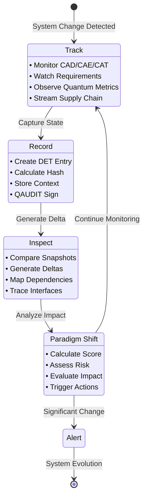

# AGUA-TRIPS Protocol Implementation

## Overview

The **AGUA-TRIPS Protocol** (Track → Record → Inspect → Paradigm Shift) provides system delta tracking for complex aerospace architectures within the QAL ecosystem. This implementation enables real-time monitoring, immutable recording, multi-dimensional inspection, and paradigm shift assessment for the BWB-Q100 program.

## Architecture



## Quick Start

### Installation

1. Ensure Python 3.8+ is installed
2. Install dependencies:
   ```bash
   pip install -r .github/requirements.txt
   pip install jsonschema pyyaml
   ```
3. Make the CLI executable:
   ```bash
   chmod +x trips.py
   ```

### Basic Usage

```bash
# Monitor system changes in real-time
python3 trips.py track --domain AAA --real-time

# Create a system snapshot
python3 trips.py record --snapshot v1.4 --context "Gamma configuration finalized"

# Compare two versions
python3 trips.py inspect v1.3 v1.4 --format=summary

# Assess paradigm shift
python3 trips.py paradigm v1.3 v1.4 --assess
```

## CLI Commands

### Track Command

Monitor system changes across different domains and components:

```bash
python3 trips.py track --domain <DOMAIN> [--real-time] [--types TYPE1 TYPE2 ...]
```

**Options:**
- `--domain`: Domain code (AAA, CQH, LIB, etc.)
- `--real-time`: Enable real-time monitoring
- `--types`: Specific change types to monitor (CAD, CAE, CAT, Requirements, Quantum, SupplyChain)

**Example Output:**
```
[TRACKING] BWB-Q100/AAA domain changes...
[16:45:23] CAD: Multi-bubble topology modified (10→12 vessels)
[16:45:24] CAE: Re-meshing triggered (847k elements)
[16:45:25] REQ: Fatigue life updated (195k→212k cycles)
```

### Record Command

Create immutable system snapshots with full context:

```bash
python3 trips.py record --snapshot <VERSION> --context "<DESCRIPTION>"
```

**Options:**
- `--snapshot`: Version identifier (e.g., v1.4)
- `--context`: Context description for the snapshot

**Example Output:**
```
[RECORDING] System snapshot v1.4...
✓ CAD models: 147 files (2.3 GB)
✓ CAE results: 89 analyses (1.8 GB)
✓ Requirements: 234 traced
✓ Quantum metrics: QC=0.79, CVaR=0.10
✓ DET hash: 0xfeedface8a7b9c6d5e4f3a2b1c0d9e8f7
✓ QAUDIT signature: Applied (Dilithium3)
[SUCCESS] Snapshot v1.4 recorded to blockchain
```

### Inspect Command

Compare system versions and generate delta analysis:

```bash
python3 trips.py inspect <FROM_VERSION> <TO_VERSION> [--format=summary|detailed]
```

**Options:**
- `FROM_VERSION`: Source version for comparison
- `TO_VERSION`: Target version for comparison
- `--format`: Output format (summary or detailed)

**Example Output:**
```
[INSPECTING] Delta between v1.3 → v1.4...
═══════════════════════════════════════════════════════
SYSTEM DELTA SUMMARY
───────────────────────────────────────────────────────
Architecture Changes:  3 major, 12 minor
Interface Updates:     3 modified (scores: +0.4 avg)
Requirements Impact:   147 satisfied, 1 new SC
Performance Delta:     Weight -340kg, Freq +4.1Hz
Quantum Confidence:    +0.06 (0.73→0.79)
Supply Chain:          1 new supplier, 2 modified
═══════════════════════════════════════════════════════
```

### Paradigm Command

Assess paradigm shift magnitude and impact:

```bash
python3 trips.py paradigm <FROM_VERSION> <TO_VERSION> --assess
```

**Example Output:**
```
[PARADIGM SHIFT ANALYSIS]
═══════════════════════════════════════════════════════
Shift Score:           3.7/10 (Incremental Evolution)
Innovation Index:      6.2/10 (Moderate novelty)
Risk Assessment:       LOW (CVaR within bounds)
Certification Impact:  MEDIUM (3 ICDs affected)
Rollback Feasibility:  NO (breaking changes detected)
Recommended Action:    PROCEED with validation
═══════════════════════════════════════════════════════
```

## System Delta Language (SΔL)

The System Delta Language provides standardized notation for describing changes:

### Operations
- `+` **Added**: New components or capabilities
- `-` **Removed**: Deprecated items or capabilities
- `~` **Modified**: Updated elements or configurations
- `↑` **Enhanced**: Improved metrics or performance
- `↓` **Degraded**: Reduced performance or capabilities
- `!` **Critical**: Breaking changes requiring attention

### Abstraction Levels
- **Component**: Individual parts or modules
- **Interface**: Connection points between components
- **Requirement**: Functional or performance requirements
- **Performance**: Measurable system characteristics
- **Architecture**: High-level system structure

### Delta Metrics
- **Magnitude**: Change significance (0-10 scale)
- **Risk**: Impact assessment (Low/Medium/High)
- **Impact**: Scope of influence (Local/System/Global)
- **Reversibility**: Whether change can be undone (Yes/No)

## Paradigm Shift Classification

| Score Range | Classification | Approval Required | Description |
|-------------|---------------|-------------------|-------------|
| 0-2 | **Patch** | Auto-approve | Bug fixes, parameter adjustments |
| 3-5 | **Incremental** | Review required | Component updates, minor improvements |
| 6-8 | **Architectural** | Board approval | Interface changes, structural modifications |
| 9-10 | **Revolutionary** | Strategic decision | Complete redesign, paradigm shifts |

## Integration with QAL Ecosystem

### DET Registry Integration

All TRIPS activities generate Digital Evidence Twin (DET) entries:

```json
{
  "det_id": "DET:TRIPS:AAA:monitoring:V1.0",
  "timestamp": "2025-09-03T00:00:00Z",
  "phase": "TRIPS",
  "artifact_type": "Track",
  "refs": {
    "ce": "CE-TRIPS-AAA-monitoring",
    "ci": "CI-TRIPS-AAA-monitoring"
  },
  "signature": {
    "algorithm": "Ed25519",
    "hash": "sha256:..."
  }
}
```

### QAUDIT Signatures

All system snapshots include post-quantum cryptographic signatures:

```json
{
  "qaudit_signature": "PQC-Dilithium3-75c3f7043df999bb",
  "signature_algorithm": "Dilithium3",
  "signed_data": "system_state_hash"
}
```

### QAL Bus Events

TRIPS activities emit events to the QAL Bus for ecosystem integration:

```json
{
  "event_type": "TRIPS.Record",
  "timestamp": "2025-09-03T00:00:00Z",
  "program": "BWB-Q100",
  "domain": "SYS",
  "payload": {
    "snapshot_id": "v1.4",
    "det_hash": "0x...",
    "qaudit_signature": "PQC-..."
  }
}
```

## Configuration

Create a configuration file at `~/.trips/config.yaml`:

```yaml
storage_path: "./trips_data"
det_registry: "./UTCS-BLOCKCHAIN/DET"
signature_algorithm: "Ed25519"
hash_algorithm: "SHA-256"
```

## Data Storage Structure

```
trips_data/
├── snapshots/           # System snapshots
│   ├── snapshot_v1.3.json
│   └── snapshot_v1.4.json
├── tracking/            # Real-time tracking data
│   └── track_AAA_*.json
├── inspections/         # Delta analysis results
│   └── inspect_v1.3_v1.4.json
├── paradigm/           # Paradigm shift assessments
│   └── paradigm_v1.3_v1.4.json
└── det/                # DET entries
    └── DET_TRIPS_*.json
```

## Validation

Validate TRIPS events against schemas:

```bash
# Validate specific files
python3 validate_trips.py trips_data/snapshots/snapshot_v1.4.json

# Validate all TRIPS data
python3 validate_trips.py --all
```

## Schema Files

- `schemas/agua_trips.schema.json`: Main TRIPS event schema
- `schemas/trips_system_delta.schema.json`: System Delta Language schema

## GitHub Actions Integration

The repository includes automated validation via GitHub Actions:

- Schema validation for TRIPS events
- CLI functionality testing
- QAL Bus event emission
- Integration with existing DET/QAUDIT systems

## Example Workflow

1. **Monitor Changes**: Use `track` to monitor system changes in real-time
2. **Create Baseline**: Use `record` to create a baseline snapshot
3. **Make Changes**: Implement system modifications
4. **Create New Snapshot**: Use `record` to capture the updated state
5. **Analyze Delta**: Use `inspect` to compare versions and identify changes
6. **Assess Impact**: Use `paradigm` to evaluate the significance of changes
7. **Take Action**: Based on paradigm shift score, proceed with appropriate approval process

## Best Practices

1. **Regular Snapshots**: Create snapshots at major milestones
2. **Meaningful Context**: Always provide descriptive context for snapshots
3. **Monitor Critical Domains**: Focus tracking on high-risk domains
4. **Review Paradigm Shifts**: Always review changes scoring >6.0
5. **Maintain Traceability**: Ensure all changes link to requirements

## Troubleshooting

### Common Issues

1. **Permission Errors**: Ensure `trips.py` is executable
2. **Schema Validation Failures**: Check event format against schemas
3. **Missing Dependencies**: Install required Python packages
4. **Storage Path Issues**: Verify configuration and permissions

### Logging

Enable detailed logging by setting environment variables:

```bash
export TRIPS_LOG_LEVEL=DEBUG
export TRIPS_LOG_FILE=trips.log
```

## Contributing

1. Follow existing code patterns
2. Add tests for new functionality
3. Update schemas for new event types
4. Validate against QAL ecosystem requirements
5. Include DET/QAUDIT integration for new features

## License

This implementation follows the repository's standard licensing terms and is integrated with the AQUA ecosystem's governance policies.