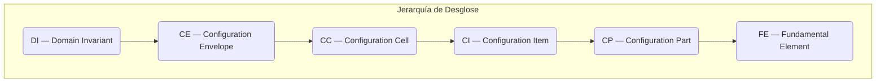

# Implementación de la Jerarquía de Dominios — BWB-Q100

**UTCS-MI v5.0:** `EstándarUniversal:Artefacto-DesgloseDeProducto-ATA+S1000D-PBS-BWB-Q100-v1.1-AerospaceAndQuantumUnitedAdvancedVenture-GeneracionHybrida-CROSS-AmedeoPelliccia-deadbeef-RestoDeVidaUtil`

## Resumen Ejecutivo

Este documento es el **Desglose de Producto (Product Breakdown Structure - PBS)** oficial para el programa de aeronave Blended Wing Body propulsada por hidrógeno (BWB-Q100). Su propósito es implementar la arquitectura de datos definida en el marco QAL, asignando cada sistema, componente y requisito a una estructura jerárquica y de dominios estandarizada.

La estructura sigue una descomposición de 6 niveles, desde el **Dominio Invariante (DI)** abstracto hasta el **Elemento Fundamental (FE)** tangible.



**Navegación:** Utilice el siguiente índice para saltar directamente a un dominio de interés. Cada dominio y nivel jerárquico cuenta con un ancla HTML para facilitar la vinculación cruzada.

---

## Índice CA (Constituent Article/Artifact)

* [CAO — Computer Aided Organization](#ca-cao)
* [CAB — Computer Aided Brainstorming](#ca-cab)
* [CAD — Computer Aided Design](#ca-cad)
* [CAE — Computer Aided Engineering](#ca-cae)
* [CAT — Computer Aided Tooling and Testing](#ca-cat)
* [CAV — Computer Aided V&V and Certification](#ca-cav)
* [CAM — Computer Aided Manufacturing](#ca-cam)
* [CAP — Computer Aided Plan and Production](#ca-cap)
* [CAS — Computer Aided Services and Sustainment](#ca-cas)
* [CAEpost — Computer Aided EoL Post‑treatments](#ca-caepost)

---

## Índice DI → CE → CC → CI → CP → FE (por dominio)

> Cada línea enlaza a los **sub‑anclajes** del dominio. Pega el **paquete de anclas** de más abajo para habilitar los saltos.

* **AAA — ARCHITECTURES\_AIRFRAMES\_AERODYNAMICS** · [DI](#di-aaa) · [CE](#ce-aaa) · [CC](#cc-aaa) · [CI](#ci-aaa) · [CP](#cp-aaa) · [FE](#fe-aaa)
* **AAP — AIRPORTS\_ADAPTATIONS** · [DI](#di-aap) · [CE](#ce-aap) · [CC](#cc-aap) · [CI](#ci-aap) · [CP](#cp-aap) · [FE](#fe-aap)
* **CCC — COCKPIT\_CABIN\_CARGO\_SYSTEMS** · [DI](#di-ccc) · [CE](#ce-ccc) · [CC](#cc-ccc) · [CI](#ci-ccc) · [CP](#cp-ccc) · [FE](#fe-ccc)
* **CQH — CRYOGENICS\_QUANTUM\_INTERFACES\_HYDROGEN\_CELLS** · [DI](#di-cqh) · [CE](#ce-cqh) · [CC](#cc-cqh) · [CI](#ci-cqh) · [CP](#cp-cqh) · [FE](#fe-cqh)
* **DDD — DEFENCE\_CYBERSECURITY\_SAFETY** · [DI](#di-ddd) · [CE](#ce-ddd) · [CC](#cc-ddd) · [CI](#ci-ddd) · [CP](#cp-ddd) · [FE](#fe-ddd)
* **EDI — ELECTRONICS\_DIGITAL\_INSTRUMENTS** · [DI](#di-edi) · [CE](#ce-edi) · [CC](#cc-edi) · [CI](#ci-edi) · [CP](#cp-edi) · [FE](#fe-edi)
* **EEE — ENVIRONMENTAL\_REMEDIATION\_CIRCULARITY** · [DI](#di-eee) · [CE](#ce-eee) · [CC](#cc-eee) · [CI](#ci-eee) · [CP](#cp-eee) · [FE](#fe-eee)
* **EER — ENERGY\_AND\_RENEWABLE** · [DI](#di-eer) · [CE](#ce-eer) · [CC](#cc-eer) · [CI](#ci-eer) · [CP](#cp-eer) · [FE](#fe-eer)
* **IIF — INFRASTRUCTURES\_AND\_FACILITIES\_VALUE\_CHAINS** · [DI](#di-iif) · [CE](#ce-iif) · [CC](#cc-iif) · [CI](#ci-iif) · [CP](#cp-iif) · [FE](#fe-iif)
* **IIS — INTELLIGENT\_SYSTEMS\_ONBOARD\_AI** · [DI](#di-iis) · [CE](#ce-iis) · [CC](#cc-iis) · [CI](#ci-iis) · [CP](#cp-iis) · [FE](#fe-iis)
* **LCC — LINKS\_COMMUNICATIONS\_CONTROL\_IoT** · [DI](#di-lcc) · [CE](#ce-lcc) · [CC](#cc-lcc) · [CI](#ci-lcc) · [CP](#cp-lcc) · [FE](#fe-lcc)
* **LIB — LOGISTICS\_INTEGRATED\_BLOCKCHAIN** · [DI](#di-lib) · [CE](#ce-lib) · [CC](#cc-lib) · [CI](#ci-lib) · [CP](#cp-lib) · [FE](#fe-lib)
* **MMM — MECHANICAL\_MATERIAL\_MONITORING** · [DI](#di-mmm) · [CE](#ce-mmm) · [CC](#cc-mmm) · [CI](#ci-mmm) · [CP](#cp-mmm) · [FE](#fe-mmm)
* **OOO — OPERATING\_SYSTEMS\_NAVIGATION\_HPC** · [DI](#di-ooo) · [CE](#ce-ooo) · [CC](#cc-ooo) · [CI](#ci-ooo) · [CP](#cp-ooo) · [FE](#fe-ooo)
* **PPP — PROPULSION\_AND\_FUEL / PROPULSION\_AND\_FUELS** · [DI](#di-ppp) · [CE](#ce-ppp) · [CC](#cc-ppp) · [CI](#ci-ppp) · [CP](#cp-ppp) · [FE](#fe-ppp)

---

## Índice de Dominios Tecnológicos

| Dominio | Descripción | Acceso Rápido |
| :--- | :--- | :--- |
| **AAA** | Arquitecturas, Aeroestructuras y Aerodinámica | [Ir a AAA](#aaa) |
| **AAP** | Adaptaciones para Aeropuertos y Soporte en Tierra | [Ir a AAP](#aap) |
| **CCC** | Sistemas de Cabina, Cockpit y Carga | [Ir a CCC](#ccc) |
| **CQH** | Criogenia, Interfaces Cuánticas e Hidrógeno | [Ir a CQH](#cqh) |
| **DDD** | Defensa, Ciberseguridad y Seguridad (Safety) | [Ir a DDD](#ddd) |
| **EDI** | Electrónica e Instrumentos Digitales | [Ir a EDI](#edi) |
| **EEE** | Medioambiente, Remediación y Circularidad | [Ir a EEE](#eee) |
| **EER** | Energía y Sistemas Renovables | [Ir a EER](#eer) |
| **IIF** | Infraestructuras, Instalaciones y Cadenas de Valor | [Ir a IIF](#iif) |
| **IIS** | Sistemas Inteligentes e IA a Bordo | [Ir a IIS](#iis) |
| **LCC** | Enlaces, Comunicaciones, Control e IoT | [Ir a LCC](#lcc) |
| **LIB** | Logística y Blockchain Integrado | [Ir a LIB](#lib) |
| **MMM** | Mecánica, Materiales y Monitorización | [Ir a MMM](#mmm) |
| **OOO** | Sistemas Operativos, Navegación y HPC | [Ir a OOO](#ooo) |
| **PPP** | Propulsión y Combustibles | [Ir a PPP](#ppp) |

---

<!-- DI→FE per domain: AAA -->
<a id="di-aaa"></a> <a id="ce-aaa"></a> <a id="cc-aaa"></a> <a id="ci-aaa"></a> <a id="cp-aaa"></a> <a id="fe-aaa"></a>

<!-- AAP -->
<a id="di-aap"></a> <a id="ce-aap"></a> <a id="cc-aap"></a> <a id="ci-aap"></a> <a id="cp-aap"></a> <a id="fe-aap"></a>

<!-- CCC -->
<a id="di-ccc"></a> <a id="ce-ccc"></a> <a id="cc-ccc"></a> <a id="ci-ccc"></a> <a id="cp-ccc"></a> <a id="fe-ccc"></a>

<!-- CQH -->
<a id="di-cqh"></a> <a id="ce-cqh"></a> <a id="cc-cqh"></a> <a id="ci-cqh"></a> <a id="cp-cqh"></a> <a id="fe-cqh"></a>

<!-- DDD -->
<a id="di-ddd"></a> <a id="ce-ddd"></a> <a id="cc-ddd"></a> <a id="ci-ddd"></a> <a id="cp-ddd"></a> <a id="fe-ddd"></a>

<!-- EDI -->
<a id="di-edi"></a> <a id="ce-edi"></a> <a id="cc-edi"></a> <a id="ci-edi"></a> <a id="cp-edi"></a> <a id="fe-edi"></a>

<!-- EEE -->
<a id="di-eee"></a> <a id="ce-eee"></a> <a id="cc-eee"></a> <a id="ci-eee"></a> <a id="cp-eee"></a> <a id="fe-eee"></a>

<!-- EER -->
<a id="di-eer"></a> <a id="ce-eer"></a> <a id="cc-eer"></a> <a id="ci-eer"></a> <a id="cp-eer"></a> <a id="fe-eer"></a>

<!-- IIF -->
<a id="di-iif"></a> <a id="ce-iif"></a> <a id="cc-iif"></a> <a id="ci-iif"></a> <a id="cp-iif"></a> <a id="fe-iif"></a>

<!-- IIS -->
<a id="di-iis"></a> <a id="ce-iis"></a> <a id="cc-iis"></a> <a id="ci-iis"></a> <a id="cp-iis"></a> <a id="fe-iis"></a>

<!-- LCC -->
<a id="di-lcc"></a> <a id="ce-lcc"></a> <a id="cc-lcc"></a> <a id="ci-lcc"></a> <a id="cp-lcc"></a> <a id="fe-lcc"></a>

<!-- LIB -->
<a id="di-lib"></a> <a id="ce-lib"></a> <a id="cc-lib"></a> <a id="ci-lib"></a> <a id="cp-lib"></a> <a id="fe-lib"></a>

<!-- MMM -->
<a id="di-mmm"></a> <a id="ce-mmm"></a> <a id="cc-mmm"></a> <a id="ci-mmm"></a> <a id="cp-mmm"></a> <a id="fe-mmm"></a>

<!-- OOO -->
<a id="di-ooo"></a> <a id="ce-ooo"></a> <a id="cc-ooo"></a> <a id="ci-ooo"></a> <a id="cp-ooo"></a> <a id="fe-ooo"></a>

<!-- PPP (alias FUEL/FUELS) -->
<a id="di-ppp"></a> <a id="ce-ppp"></a> <a id="cc-ppp"></a> <a id="ci-ppp"></a> <a id="cp-ppp"></a> <a id="fe-ppp"></a>

<!-- Main domain anchors -->
<a id="aaa"></a> <a id="aap"></a> <a id="ccc"></a> <a id="cqh"></a> <a id="ddd"></a> <a id="edi"></a> <a id="eee"></a> <a id="eer"></a> <a id="iif"></a> <a id="iis"></a> <a id="lcc"></a> <a id="lib"></a> <a id="mmm"></a> <a id="ooo"></a> <a id="ppp"></a>

---

## CA (Constituent Article/Artifact) — Fases QAL

<a id="ca-cao"></a>
### CAO — Computer Aided Organization

**Descripción:** Organización empresarial y estratégica del proyecto BWB-Q100.

| Atributo | Descripción |
| :--- | :--- |
| **📋 Alcance** | Gobernanza, estrategia empresarial, gestión de riesgos, políticas organizacionales |
| **🎯 Objetivos** | - Definir estructura organizacional para el programa BWB-Q100<br>- Establecer marcos de cumplimiento normativo<br>- Gestión de riesgos financieros y técnicos |
| **📊 KPIs** | ROI, NPV, cumplimiento regulatorio, gestión de riesgos |
| **🔗 Outputs** | Políticas organizacionales, matrices de riesgo, planes estratégicos |

<a id="ca-cab"></a>
### CAB — Computer Aided Brainstorming

**Descripción:** Fase de exploración y génesis conceptual del ecosistema QAL. Traduce necesidades del mercado y objetivos estratégicos en conceptos de solución diversos y evaluados.

| Atributo | Descripción |
| :--- | :--- |
| **📋 Alcance** | Exploración de espacios de diseño, generación de conceptos, análisis de viabilidad, estudios de trade-off |
| **🎯 Objetivos** | - Explorar configuraciones BWB innovadoras con algoritmos cuánticos<br>- Generar conceptos multi-burbuja para almacenamiento H₂<br>- Optimizar arquitecturas BLI y ZBO<br>- Seleccionar conceptos prometedores para CAD |
| **📊 KPIs** | Amplitud de exploración, calidad de conceptos, trazabilidad de requisitos, eficiencia del embudo, confianza cuántica |
| **🔗 Outputs** | [Selected-Concept-Set.json](C-AMEDEO-FRAMEWORK/CA-OPTIMISED/CAB-BRAINSTORMING/), [Rationale-Graph.json](C-AMEDEO-FRAMEWORK/CA-OPTIMISED/CAB-BRAINSTORMING/), [Feasibility-Scorecard.csv](C-AMEDEO-FRAMEWORK/CA-OPTIMISED/CAB-BRAINSTORMING/), DET:CAB:* |

#### Aumentos Cuánticos para CAB
- **QML Latent Space Navigation**: Exploración de espacios latentes de diseños con modelos de Machine Learning Cuántico
- **Grover's Algorithm**: Búsqueda acelerada en bases de datos de patentes y literatura científica
- **Maximum Entropy Principle**: Generación de conceptos hacia áreas radicalmente diferentes del espacio de diseño

#### Módulos Principales
1. **Análisis de Necesidades**: Captura estructurada de necesidades de stakeholders y descomposición de objetivos
2. **Exploración del Espacio de Soluciones**: Búsqueda en bases de datos, mapeo de tecnologías emergentes, arquitecturas morfológicas
3. **Generación de Conceptos**: Brainstorming digital, síntesis con algoritmos generativos, bocetos de baja fidelidad
4. **Análisis de Viabilidad**: Evaluaciones preliminares, estudios de trade-off multicriterio, ranking automatizado
5. **Selección de Conceptos**: Selección de candidatos prometedores, documentación de rationale, transferencia a CAD

#### Desafíos Específicos BWB-Q100
- **Recipientes de Presión Multi-Burbuja**: Alternativas a cilindros convencionales, configuraciones tetraédricas, células bio-inspiradas
- **Arquitecturas de Sistema H₂**: Conceptos ZBO (Zero Boil-Off), enfriamiento activo vs. aislamiento pasivo
- **Integración BLI**: Control de flujo activo, propulsión distribuida, integración aerodinámica

<a id="ca-cad"></a>
### CAD — Computer Aided Design

**Description:** Computer-aided design with focus on DI→CE→CC→CI→CP hierarchy and Digital Master Model (DMM) creation.

| Attribute | Description |
| :--- | :--- |
| **📋 Scope** | 3D models, technical specifications, EBOM/MBOM, parametric configurations, quantum-enhanced design |
| **🎯 Objectives** | - Develop detailed BWB-Q100 designs with multi-bubble vessel architecture<br>- Establish product hierarchy (PBS) and Digital Master Model<br>- Quantum-optimized weight and performance with inverse design capabilities |
| **📊 KPIs** | Δweight, Δcost, % reusability, design time, quantum optimization efficiency |
| **🔗 Outputs** | CAD models, technical drawings, EBOM/MBOM, DMM specifications, Interface Control Documents |

**📚 Comprehensive Specification:** See [CAD-DESIGN/README.md](CA-DEOPTIMISE/CAD-DESIGN/README.md) for complete pillar implementation including quantum enhancements, BWB-Q100 multi-bubble vessel design, Model-Based Definition (MBD), and Digital Evidence Twin (DET) integration.

<a id="ca-cae"></a>
### CAE — Computer Aided Engineering

**Descripción:** Ingeniería y análisis computacional para validación y verificación.

| Atributo | Descripción |
| :--- | :--- |
| **📋 Alcance** | Análisis FEM, CFD, simulaciones multi-física, validación de diseño |
| **🎯 Objetivos** | - Validar diseño estructural y aerodinámico<br>- Análisis de cargas globales y locales<br>- Certificación de márgenes de seguridad |
| **📊 KPIs** | Márgenes de seguridad, precisión de modelos, reproducibilidad |
| **🔗 Outputs** | Reportes de análisis, modelos validados, certificaciones |

<a id="ca-cat"></a>
### CAT — Computer Aided Tooling and Testing

**Descripción:** Herramientas y pruebas asistidas por computadora.

| Atributo | Descripción |
| :--- | :--- |
| **📋 Alcance** | Pipelines CI/CD, SBOM/SLSA, automatización de pruebas, herramientas de desarrollo |
| **🎯 Objetivos** | - Implementar DevSecOps para código crítico<br>- Automatización de pruebas y validación<br>- Gestión de vulnerabilidades |
| **📊 KPIs** | Cobertura SBOM, SLA de vulnerabilidades, tiempo de build |
| **🔗 Outputs** | Pipelines automatizados, reportes de seguridad, herramientas |

<a id="ca-cav"></a>
### CAV — Computer Aided V&V and Certification

**Descripción:** Verificación, validación y certificación asistida por computadora.

| Atributo | Descripción |
| :--- | :--- |
| **📋 Alcance** | Matrices de certificación, trazabilidad de requisitos, compliance |
| **🎯 Objetivos** | - Certificación EASA CS-25/FAA Part 25<br>- Cumplimiento DO-178C/DO-254<br>- Auditoría y trazabilidad completa |
| **📊 KPIs** | Cobertura de requisitos, auditorías pasadas, tiempo de certificación |
| **🔗 Outputs** | Certificados, matrices de compliance, reportes de auditoría |

<a id="ca-cam"></a>
### CAM — Computer Aided Manufacturing

**Descripción:** Manufactura asistida por computadora y control de calidad.

| Atributo | Descripción |
| :--- | :--- |
| **📋 Alcance** | Procesos de fabricación, FAI/SPC, control de calidad, yield optimization |
| **🎯 Objetivos** | - Optimizar procesos de manufactura BWB<br>- Implementar control estadístico (SPC)<br>- Minimizar scrap y rework |
| **📊 KPIs** | % scrap, % rework, Cp/Cpk, yield de producción |
| **🔗 Outputs** | Planes de manufactura, reportes FAI, datos SPC |

<a id="ca-cap"></a>
### CAP — Computer Aided Plan and Production

**Descripción:** Planificación y producción asistida por computadora.

| Atributo | Descripción |
| :--- | :--- |
| **📋 Alcance** | Logística, MRP/MPS, cadena de suministro, programación de producción |
| **🎯 Objetivos** | - Optimizar cadena de suministro BWB-Q100<br>- Planificación de recursos y materiales<br>- Gestión de inventarios JIT |
| **📊 KPIs** | OTD (On-Time Delivery), inventory turns, variación de costos |
| **🔗 Outputs** | Planes de producción, cronogramas, reportes logísticos |

<a id="ca-cas"></a>
### CAS — Computer Aided Services and Sustainment

**Descripción:** Servicios y sostenimiento asistido por computadora.

| Atributo | Descripción |
| :--- | :--- |
| **📋 Alcance** | Mantenimiento predictivo (PHM), S1000D IETP/IETM, configuración de estado |
| **🎯 Objetivos** | - Implementar mantenimiento predictivo<br>- Publicar documentación S1000D<br>- Optimizar disponibilidad operacional |
| **📊 KPIs** | MTBF/MTBUR, disponibilidad, costos de mantenimiento |
| **🔗 Outputs** | Manuales S1000D, sistemas PHM, reportes de estado |

<a id="ca-caepost"></a>
### CAEpost — Computer Aided EoL Post‑treatments

**Descripción:** Tratamientos post-vida útil asistidos por computadora.

| Atributo | Descripción |
| :--- | :--- |
| **📋 Alcance** | Reciclaje, recuperación de materiales, economía circular, sostenibilidad |
| **🎯 Objetivos** | - Maximizar recuperación de valor al final de vida<br>- Implementar economía circular<br>- Minimizar huella de carbono |
| **📊 KPIs** | % valor recuperado, reducción CO₂e, tasa de reciclaje |
| **🔗 Outputs** | Planes de desmontaje, reportes de sostenibilidad |

---

## AAA — Arquitecturas, Aeroestructuras y Aerodinámica

#### Nivel DI (Domain Invariant)

| Atributo | Descripción |
| :--- | :--- |
| **📋 Scope** | Todos los elementos estructurales, arquitectónicos y aerodinámicos. |
| **🔑 Críticos** | - Estructura presurizada multi-burbuja.<br>- Configuración Blended Wing Body (BWB).<br>- Integración de Ingestión de Capa Límite (BLI). |
| **Owner ATA** | 51, 52, 53, 54, 55, 56, 57 |

#### Nivel CE (Configuration Envelope)

| Atributo | Descripción |
| :--- | :--- |
| **Path** | `CE-CAD-Q100-AAA-ATA-[51-57]` |
| **🔗 Interfaces** | [CQH](#cqh) (Térmicas/Criogénicas), [PPP](#ppp) (Montajes de motor), [DDD](#ddd) (Safety). |
| **Alias** | *Structure Domain Lead* |

#### Nivel CC → FE (Desglose de Ejemplo)

| Nivel | ID (SNS) | Descripción |
| :--- | :--- | :--- |
| **CC** | `53-30` | Contenedor presurizado multi-burbuja (3 células). |
| **CI** | `53-30-TIES` | Sistema de rejilla de tirantes de tensión. |
| **CP** | `P/N 53-30-01-001` | Tirante de tensión de aleación Ti-6Al-4V. |
| **FE** | `Preload` | Tensión de precarga nominal: **45 kN**. |

---

## CQH — Criogenia, Interfaces Cuánticas e Hidrógeno

#### Nivel DI (Domain Invariant)

| Atributo | Descripción |
| :--- | :--- |
| **📋 Scope** | Almacenamiento de LH₂, sistema de Cero Boil-Off (ZBO), sensores cuánticos. |
| **🔑 Críticos** | - Capacidad de **8,500 kg** de Hidrógeno Líquido (LH₂).<br>- Operación a **20.3 K** (-252.85 °C). |
| **Owner ATA** | 28 (Combustible), 47 (Sistemas Inertes), Sistemas Cuánticos. |

#### Nivel CE (Configuration Envelope)

| Atributo | Descripción |
| :--- | :--- |
| **Path** | `CE-CAD-Q100-CQH-ATA-28` |
| **🔗 Interfaces** | [AAA](#aaa) (Estructural), [PPP](#ppp) (Suministro a celdas de combustible). |
| **Alias** | *Cryogenic Systems Lead* |

#### Nivel CC → FE (Desglose de Ejemplo)

| Nivel | ID (SNS) | Descripción |
| :--- | :--- | :--- |
| **CC** | `28-10` | Sistema de tanque de LH₂. |
| **CI** | `28-10-02` | Aislamiento Multi-Capa (MLI) de 60 capas. |
| **CP** | `P/N 28-10-02-001` | Segmento de manta de aislamiento MLI. |
| **FE** | `Boil-off Rate` | Tasa de evaporación: **< 0.1% por día**. |

---

## PPP — Propulsión y Combustibles

#### Nivel DI (Domain Invariant)

| Atributo | Descripción |
| :--- | :--- |
| **📋 Scope** | Celdas de combustible, motores eléctricos, ventiladores para BLI. |
| **🔑 Críticos** | - Potencia total: **15 MW**.<br>- Configuración: 4 motores eléctricos. |
| **Owner ATA** | 71-80 (Planta de Potencia). |

#### Nivel CE (Configuration Envelope)

| Atributo | Descripción |
| :--- | :--- |
| **Path** | `CE-CAD-Q100-PPP-ATA-71` |
| **🔗 Interfaces** | [AAA](#aaa) (Montajes), [CQH](#cqh) (Suministro H₂), [EDI](#edi) (Distribución de potencia). |
| **Alias** | *Propulsion Systems Lead* |

#### Nivel CC → FE (Desglose de Ejemplo)

| Nivel | ID (SNS) | Descripción |
| :--- | :--- | :--- |
| **CC** | `71-10` | Módulos de celdas de combustible (6 unidades). |
| **CI** | `71-10-01` | Pila de celdas de combustible de membrana de intercambio de protones (PEM). |
| **CP** | `P/N 71-10-01-001` | Ensamblaje de Membrana y Electrodo (MEA). |
| **FE** | `Efficiency` | Eficiencia de conversión (LH₂ a electricidad): **> 55%**. |

---

## DDD — Defensa, Ciberseguridad y Seguridad (Safety)

#### Nivel DI (Domain Invariant)

| Atributo | Descripción |
| :--- | :--- |
| **📋 Scope** | Sistemas DAL-A, protección contra rayos, ciberseguridad, caso de seguridad. |
| **🔑 Críticos** | - Cumplimiento normativo para certificación.<br>- Tolerancia a fallos catastróficos. |
| **Owner ATA** | 25 (Equipos/Mobiliario), 45 (Sistemas Centrales de Mantenimiento). |

#### Nivel CE (Configuration Envelope)

| Atributo | Descripción |
| :--- | :--- |
| **Path** | `CE-CAD-Q100-DDD-ATA-25` |
| **🔗 Interfaces** | Todos los dominios (evaluación de seguridad y riesgos). |
| **Alias** | *Safety Systems Lead* |

#### Nivel CC → FE (Desglose de Ejemplo)

| Nivel | ID (SNS) | Descripción |
| :--- | :--- | :--- |
| **CC** | `25-20` | Sistema de protección contra rayos (LPS). |
| **CI** | `25-20-01` | Malla de conducción de corriente (Lightning Grid). |
| **CP** | `P/N 25-20-01-001` | Correa de conexión a masa (Bonding Strap). |
| **FE** | `Bonding Resistance` | Resistencia de conexión a masa: **< 2.5 mΩ**. |

---

## CCC — Sistemas de Cabina, Cockpit y Carga

#### Nivel DI (Domain Invariant)

| Atributo | Descripción |
| :--- | :--- |
| **📋 Scope** | Configuración de cabina para 100 pasajeros, puesto de pilotaje, sistemas de carga. |
| **🔑 Críticos** | - Configuración de clase única.<br>- Experiencia de pasajero en un fuselaje no tradicional. |
| **Owner ATA** | 25 (Equipos/Mobiliario), 31 (Instrumentos), 33 (Luces). |

#### Nivel CE (Configuration Envelope)

| Atributo | Descripción |
| :--- | :--- |
| **Path** | `CE-CAD-Q100-CCC-ATA-25` |
| **🔗 Interfaces** | [AAA](#aaa) (Estructura), [EDI](#edi) (Aviónica y controles), [EEE](#eee) (Climatización). |
| **Alias** | *Cabin Systems Lead* |

#### Nivel CC → FE (Desglose de Ejemplo)

| Nivel | ID (SNS) | Descripción |
| :--- | :--- | :--- |
| **CC** | `25-30` | Asientos de pasajeros. |
| **CI** | `25-30-01` | Ensamblaje de asiento de pasajero. |
| **CP** | `P/N 25-30-01-001` | Estructura del asiento (Seat Frame). |
| **FE** | `Seat Pitch` | Distancia entre filas de asientos: **32 pulgadas**. |

---

## EDI — Electrónica e Instrumentos Digitales

#### Nivel DI (Domain Invariant)

| Atributo | Descripción |
| :--- | :--- |
| **📋 Scope** | Distribución de potencia 540 VDC, aviónica modular integrada (IMA), sistemas Fly-by-Wire. |
| **🔑 Críticos** | - Arquitectura de redundancia triplex para sistemas críticos.<br>- Gestión de alta potencia eléctrica. |
| **Owner ATA** | 24 (Potencia Eléctrica), 31 (Instrumentos), 34 (Navegación). |

#### Nivel CE (Configuration Envelope)

| Atributo | Descripción |
| :--- | :--- |
| **Path** | `CE-CAD-Q100-EDI-ATA-24` |
| **🔗 Interfaces** | [PPP](#ppp) (Generación de potencia), [LCC](#lcc) (Comunicaciones), [OOO](#ooo) (Software). |
| **Alias** | *Avionics Lead* |

#### Nivel CC → FE (Desglose de Ejemplo)

| Nivel | ID (SNS) | Descripción |
| :--- | :--- | :--- |
| **CC** | `24-10` | Sistema de distribución de potencia primaria. |
| **CI** | `24-10-01` | Unidad de control de potencia de estado sólido (SSPC). |
| **CP** | `P/N 24-10-01-001` | Módulo controlador de potencia. |
| **FE** | `Primary Voltage` | Voltaje del bus primario: **540 VDC**. |

---

## LCC — Enlaces, Comunicaciones, Control e IoT

#### Nivel DI (Domain Invariant)

| Atributo | Descripción |
| :--- | :--- |
| **📋 Scope** | Sistema Fly-by-Wire, enlaces de datos (Datalinks), red de sensores IoT a bordo. |
| **🔑 Críticos** | - Leyes de control para una configuración BWB inherentemente inestable.<br>- Actuación electro-hidrostática (EHA). |
| **Owner ATA** | 23 (Comunicaciones), 27 (Controles de Vuelo). |

#### Nivel CE (Configuration Envelope)

| Atributo | Descripción |
| :--- | :--- |
| **Path** | `CE-CAD-Q100-LCC-ATA-27` |
| **🔗 Interfaces** | [AAA](#aaa) (Superficies de control), [EDI](#edi) (Computadoras de control de vuelo). |
| **Alias** | *Flight Controls Lead* |

#### Nivel CC → FE (Desglose de Ejemplo)

| Nivel | ID (SNS) | Descripción |
| :--- | :--- | :--- |
| **CC** | `27-10` | Actuadores de control de vuelo primarios. |
| **CI** | `27-10-01` | Actuador de elevón. |
| **CP** | `P/N 27-10-01-001` | Unidad de actuación electro-hidrostática (EHA). |
| **FE** | `Actuator Rate` | Velocidad de actuación: **60 grados/segundo**. |

---

## EEE — Medioambiente, Remediación y Circularidad

#### Nivel DI (Domain Invariant)

| Atributo | Descripción |
| :--- | :--- |
| **📋 Scope** | Sistema de control ambiental (ECS), presurización de cabina, economía circular. |
| **🔑 Críticos** | - Mantener una altitud de cabina de **8,000 pies** a máxima altitud de crucero.<br>- Diseño para desmontaje y reciclaje. |
| **Owner ATA** | 21 (Aire Acondicionado), 36 (Neumática). |

#### Nivel CE (Configuration Envelope)

| Atributo | Descripción |
| :--- | :--- |
| **Path** | `CE-CAD-Q100-EEE-ATA-21` |
| **🔗 Interfaces** | [PPP](#ppp) (Aire de sangrado/energía), [CQH](#cqh) (Refrigeración), [AAA](#aaa) (Aislamiento). |
| **Alias** | *Environmental Lead* |

#### Nivel CC → FE (Desglose de Ejemplo)

| Nivel | ID (SNS) | Descripción |
| :--- | :--- | :--- |
| **CC** | `21-30` | Sistema de control de presión de cabina. |
| **CI** | `21-30-01` | Válvula de salida de flujo (Outflow Valve). |
| **CP** | `P/N 21-30-01-001` | Actuador de la válvula de mariposa. |
| **FE** | `Pressure Differential` | Máxima presión diferencial: **58 kPa (8.4 PSI)**. |

---

## MMM — Mecánica, Materiales y Monitorización

#### Nivel DI (Domain Invariant)

| Atributo | Descripción |
| :--- | :--- |
| **📋 Scope** | Sistemas mecánicos (tren de aterrizaje, hidráulica), ciencia de materiales, monitorización de la salud estructural (SHM). |
| **🔑 Críticos** | - Diseño del tren de aterrizaje para un BWB.<br>- Frenos eléctricos. |
| **Owner ATA** | 29 (Potencia Hidráulica), 32 (Tren de Aterrizaje). |

#### Nivel CE (Configuration Envelope)

| Atributo | Descripción |
| :--- | :--- |
| **Path** | `CE-CAD-Q100-MMM-ATA-32` |
| **🔗 Interfaces** | [AAA](#aaa) (Estructura), [DDD](#ddd) (Monitorización de salud), [EDI](#edi) (Control de frenos). |
| **Alias** | *Mechanical Systems Lead* |

#### Nivel CC → FE (Desglose de Ejemplo)

| Nivel | ID (SNS) | Descripción |
| :--- | :--- | :--- |
| **CC** | `32-10` | Tren de aterrizaje principal. |
| **CI** | `32-10-01` | Ensamblaje del amortiguador (Strut Assembly). |
| **CP** | `P/N 32-10-01-001` | Cilindro del amortiguador (Shock Strut). |
| **FE** | `Design Limit Load` | Carga de diseño límite (DLL): **150%**. |

---

## IIS — Sistemas Inteligentes e IA a Bordo

#### Nivel DI (Domain Invariant)

| Atributo | Descripción |
| :--- | :--- |
| **📋 Scope** | Inteligencia artificial a bordo, mantenimiento predictivo (PHM), sistemas de autonomía. |
| **🔑 Críticos** | - Nivel de autonomía ASI 3 (Asistencia Inteligente Selectiva).<br>- Certificación de software basado en IA. |
| **Owner ATA** | 42 (Aviónica Modular Integrada), Sistemas de IA. |

#### Nivel CE (Configuration Envelope)

| Atributo | Descripción |
| :--- | :--- |
| **Path** | `CE-CAD-Q100-IIS-ATA-42` |
| **🔗 Interfaces** | [DDD](#ddd) (Safety), [LCC](#lcc) (Control), [OOO](#ooo) (Plataforma de ejecución). |
| **Alias** | *AI Systems Lead* |

#### Nivel CC → FE (Desglose de Ejemplo)

| Nivel | ID (SNS) | Descripción |
| :--- | :--- | :--- |
| **CC** | `42-10` | Plataforma de cómputo de alto rendimiento (Core Compute). |
| **CI** | `42-10-01` | Clúster de GPUs para inferencia. |
| **CP** | `P/N 42-10-01-001` | Módulo de cómputo GPU (GPU Blade). |
| **FE** | `Compute Power` | Potencia de cómputo: **> 100 TFLOPS**. |

---

## OOO — Sistemas Operativos, Navegación y HPC

#### Nivel DI (Domain Invariant)

| Atributo | Descripción |
| :--- | :--- |
| **📋 Scope** | Sistema operativo de tiempo real (RTOS), sistemas de navegación, computación de alto rendimiento (HPC). |
| **🔑 Críticos** | - Cumplimiento **DO-178C Nivel A** para el RTOS y funciones críticas.<br>- Particionamiento temporal y espacial robusto. |
| **Owner ATA** | 34 (Navegación), 42 (Sistemas de Cómputo). |

#### Nivel CE (Configuration Envelope)

| Atributo | Descripción |
| :--- | :--- |
| **Path** | `CE-CAD-Q100-OOO-ATA-34` |
| **🔗 Interfaces** | [EDI](#edi) (Hardware de aviónica), [IIS](#iis) (Ejecución de modelos de IA). |
| **Alias** | *Software Lead* |

#### Nivel CC → FE (Desglose de Ejemplo)

| Nivel | ID (SNS) | Descripción |
| :--- | :--- | :--- |
| **CC** | `42-40` | Kernel del sistema operativo de tiempo real (RTOS). |
| **CI** | `42-40-01` | Imagen binaria del sistema operativo. |
| **CP** | `P/N 42-40-01-001` | Binario del Kernel (Kernel Binary). |
| **FE** | `Code Coverage` | Cobertura de código MCDC: **100%**. |

---

## EER — Energía y Sistemas Renovables

#### Nivel DI (Domain Invariant)

| Atributo | Descripción |
| :--- | :--- |
| **📋 Scope** | Almacenamiento de energía en baterías, sistemas de regeneración, posible integración solar. |
| **🔑 Críticos** | - Baterías de Litio-Azufre (Li-S) con **500 kWh** de capacidad.<br>- Gestión térmica de baterías de alta densidad. |
| **Owner ATA** | 24 (Potencia Eléctrica), Sistemas de Energías Renovables. |

#### Nivel CE (Configuration Envelope)

| Atributo | Descripción |
| :--- | :--- |
| **Path** | `CE-CAD-Q100-EER-ATA-24` |
| **🔗 Interfaces** | [PPP](#ppp) (Celdas de combustible), [EDI](#edi) (Distribución), [DDD](#ddd) (Seguridad de baterías). |
| **Alias** | *Energy Systems Lead* |

#### Nivel CC → FE (Desglose de Ejemplo)

| Nivel | ID (SNS) | Descripción |
| :--- | :--- | :--- |
| **CC** | `24-20` | Paquetes de baterías. |
| **CI** | `24-20-01` | Módulo de batería. |
| **CP** | `P/N 24-20-01-001` | Ensamblaje de celdas. |
| **FE** | `Cycle Life` | Vida útil en ciclos: **> 5000 ciclos**. |

---

## AAP — Adaptaciones para Aeropuertos y Soporte en Tierra

#### Nivel DI (Domain Invariant)

| Atributo | Descripción |
| :--- | :--- |
| **📋 Scope** | Interfaces de soporte en tierra (GSE), repostaje de H₂, compatibilidad con infraestructura aeroportuaria. |
| **🔑 Críticos** | - Longitud de campo requerida: **2,200 metros**.<br>- Procedimientos de repostaje seguros para LH₂. |
| **Owner ATA** | Interfaces de Soporte en Tierra (GSE). |

#### Nivel CE (Configuration Envelope)

| Atributo | Descripción |
| :--- | :--- |
| **Path** | `CE-CAD-Q100-AAP-GSE` |
| **🔗 Interfaces** | [CQH](#cqh) (Repostaje), [EDI](#edi) (Unidad de potencia en tierra - GPU). |
| **Alias** | *Ground Ops Lead* |

#### Nivel CC → FE (Desglose de Ejemplo)

| Nivel | ID (SNS) | Descripción |
| :--- | :--- | :--- |
| **CC** | `GSE-10` | Equipo de repostaje de hidrógeno (H₂ Bowser). |
| **CI** | `GSE-10-01` | Bomba de transferencia criogénica. |
| **CP** | `P/N GSE-10-01-001` | Impulsor de la bomba. |
| **FE** | `Flow Rate` | Tasa de flujo de repostaje: **100 kg/minuto**. |

---

## IIF — Infraestructuras, Instalaciones y Cadenas de Valor

#### Nivel DI (Domain Invariant)

| Atributo | Descripción |
| :--- | :--- |
| **📋 Scope** | Instalaciones de fabricación, línea de ensamblaje, cadena de suministro. |
| **🔑 Críticos** | - Cadencia de producción: **10 aeronaves por mes**.<br>- Fabricación de grandes estructuras de material compuesto. |
| **Owner ATA** | Instalaciones de Fabricación. |

#### Nivel CE (Configuration Envelope)

| Atributo | Descripción |
| :--- | :--- |
| **Path** | `CE-CAM-Q100-IIF-FAC` |
| **🔗 Interfaces** | Todos los dominios con componentes físicos (para fabricación y ensamblaje). |
| **Alias** | *Production Lead* |

#### Nivel CC → FE (Desglose de Ejemplo)

| Nivel | ID (SNS) | Descripción |
| :--- | :--- | :--- |
| **CC** | `FAC-20` | Nave de ensamblaje final. |
| **CI** | `FAC-20-01` | Plantilla de ensamblaje principal (Main Assembly Jig). |
| **CP** | `P/N FAC-20-01-001` | Conjunto de utillaje y fijaciones. |
| **FE** | `Takt Time` | Tiempo de ciclo de producción: **3 días**. |

---

## LIB — Logística y Blockchain Integrado

#### Nivel DI (Domain Invariant)

| Atributo | Descripción |
| :--- | :--- |
| **📋 Scope** | Seguimiento de piezas, cadena de suministro digital, implementación de UTCS-BLOCKCHAIN. |
| **🔑 Críticos** | - Trazabilidad completa y auditable de cada componente (Part Traceability).<br>- Integridad de los registros de mantenimiento. |
| **Owner ATA** | Cadena de Suministro, Blockchain. |

#### Nivel CE (Configuration Envelope)

| Atributo | Descripción |
| :--- | :--- |
| **Path** | `CE-CAP-Q100-LIB-LOG` |
| **🔗 Interfaces** | Todos los dominios (para el seguimiento de sus componentes y datos). |
| **Alias** | *Supply Chain Lead* |

#### Nivel CC → FE (Desglose de Ejemplo)

| Nivel | ID (SNS) | Descripción |
| :--- | :--- | :--- |
| **CC** | `LOG-10` | Sistema de identificación y seguimiento de partes. |
| **CI** | `LOG-10-01` | Sistema de identificación por radiofrecuencia (RFID). |
| **CP** | `P/N LOG-10-01-001` | Etiqueta RFID para componentes críticos. |
| **FE** | `Throughput` | Capacidad de transacciones del sistema: **1000 TPS**. |

---

## Digital Evidence Twin Integration

Todas las actividades documentadas en este índice generan evidencia inmutable a través del **Digital Evidence Twin (DET)**:

```json
{
  "det_id": "DET:CAX:<DOMAIN>:<SNS>:<ACTIVITY>:V<REV>",
  "ts": "<ISO8601>",
  "inputs": { "refs": {"ce": "<CE-ID>", "ci": "<CI-ID>"} },
  "processing": { "tool": "<stack@version>", "params": {} },
  "outputs": { "metrics": {}, "units": "SI" },
  "hash": "<sha256>",
  "sig": { "alg": "Ed25519", "by": "<domain-lead>" }
}
```

---

*Parte del C-AMEDEO Framework para aeronaves BWB-Q100 propulsadas por hidrógeno.*