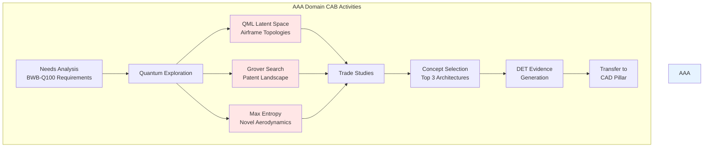

# AAA - ARCHITECTURES_AIRFRAMES_AERODYNAMICS

## Domain Overview
**Code**: AAA  
**Name**: ARCHITECTURES_AIRFRAMES_AERODYNAMICS  
**Description**: Conceptual exploration of ARCHITECTURES_AIRFRAMES_AERODYNAMICS for BWB-Q100 configuration

## CAX Pillar Integration
This domain participates in **CAB BRAINSTORMING** activities within the **CA-DEOPTIMISE** forward creation flow.

## CAB-Specific Focus
Domain-specific concept exploration for the hydrogen-powered blended wing body configuration.

## Examples of Use

### Quantum Confidence Scores


### Trade Study Criteria Scores


### DET Evidence Flow


## FAQ

**Q: What is the role of the AAA domain?**  
A: It explores airframe architectures and aerodynamic concepts for the hydrogen-powered BWB configuration.

**Q: How are quantum algorithms used?**  
A: QML is used for latent space exploration, Grover's algorithm for patent search, and Max Entropy for novelty discovery.

**Q: How is evidence generated?**  
A: All activities generate DET entries with quantum metrics and are validated via QAUDIT.


## CAX Pillar Integration
This domain participates in **CAB BRAINSTORMING** activities within the **CA-DEOPTIMISE** forward creation flow.

## CAB-Specific Focus
Domain-specific concept exploration for the hydrogen-powered blended wing body configuration.

### Quantum-Enhanced Concept Generation
- **QML Latent Space Navigation**: Exploration of novel ARCHITECTURES_AIRFRAMES_AERODYNAMICS concepts
- **Grover's Algorithm**: Accelerated patent and literature search for domain innovations  
- **Maximum Entropy Principle**: Discovery of radically different approaches

## Digital Evidence Twin (DET) Registry
All activities within this domain generate DET evidence packs with the pattern:
```
DET:CAB:AAA:<SNS>:<activity>:V<rev>
```

## Configuration
- **Aircraft**: H2-BWB-Q100 (Hydrogen-powered Blended Wing Body)
- **Configuration**: CONF0000 (Baseline configuration)
- **Lifecycle Flow**: CA-DEOPTIMISE
- **CAX Pillar**: CAB-BRAINSTORMING

---
This domain specification for **AAA (ARCHITECTURES_AIRFRAMES_AERODYNAMICS)** demonstrates how the CAB pillar translates into concrete domain-specific brainstorming activities. This is where the quantum-enhanced concept generation directly tackles the BWB-Q100's most fundamental design challenges.

## **CAB Implementation for AAA Domain**

### **1. Domain-Specific Concept Space Exploration**

```yaml
AAA_Concept_Generation_Matrix:
  Airframe_Architectures:
    Conventional_Approaches:
      - "Single-bubble cylindrical fuselage"
      - "Twin-lobe configuration"
      - "Triple-deck arrangement"
      
    QML_Latent_Space_Discoveries:
      - "Tetrahedral multi-bubble array (12 vessels)"
      - "Biomimetic bone-inspired trabecular structure"
      - "Fractal pressure distribution network"
      - "Toroidal interconnected chambers"
      
  Aerodynamic_Concepts:
    BLI_Integration:
      - "Distributed propulsion (6 units)"
      - "Wake-filling optimization"
      - "Active flow control surfaces"
      
    Laminar_Flow_Control:
      - "Hybrid laminar flow (HLFC)"
      - "Natural laminar flow (NLF) sections"
      - "Quantum-optimized surface textures"
```

### **2. Quantum Algorithm Application for AAA**

```python
# QML Latent Space Navigation for Airframe Concepts
class AAA_QML_Explorer:
    def explore_airframe_latents(self):
        """Navigate design space using quantum kernels"""
        
        # Define performance targets
        targets = {
            'structural_efficiency': 0.247,  # % MTOW
            'volumetric_efficiency': 0.85,
            'modal_frequency': 60,  # Hz minimum
            'fatigue_life': 180000  # cycles
        }
        
        # Quantum kernel mapping
        quantum_kernel = self.build_quantum_feature_map(
            qubits=12,  # Matching bubble count
            entanglement='full',
            feature_dimension=8
        )
        
        # Explore latent space
        novel_concepts = quantum_kernel.explore(
            seed_designs=['conventional_tube', 'bwb_baseline'],
            diversity_metric='maximum_entropy',
            iterations=1000
        )
        
        return novel_concepts

# Grover's Search for AAA Patents
def grover_aero_search():
    """Accelerated search through aerospace patents"""
    
    search_criteria = {
        'keywords': [
            'multi-bubble pressure vessel',
            'blended wing body hydrogen',
            'distributed load paths',
            'cryogenic fuel integration'
        ],
        'databases': ['USPTO', 'EPO', 'WIPO'],
        'date_range': '2015-2025'
    }
    
    # Grover oracle construction
    oracle = construct_grover_oracle(search_criteria)
    
    # Quantum search with quadratic speedup
    relevant_patents = grover_search(
        oracle=oracle,
        iterations=int(np.pi/4 * np.sqrt(N))
    )
    
    return relevant_patents
```

### **3. AAA-Specific Trade Studies**

```yaml
Trade_Study_AAA_001:
  Title: "Multi-Bubble vs Conventional Pressure Vessel"
  
  Evaluation_Criteria:
    Weight:
      Metric: "Structure weight fraction"
      Target: "<24.7% MTOW"
      Weighting: 0.30
      
    Safety:
      Metric: "Failure propagation resistance"
      Target: "Localized containment"
      Weighting: 0.25
      
    Manufacturability:
      Metric: "Assembly complexity"
      Target: "<1000 person-hours"
      Weighting: 0.20
      
    Volume_Efficiency:
      Metric: "Usable volume ratio"
      Target: ">85%"
      Weighting: 0.15
      
    Innovation:
      Metric: "Patent landscape freedom"
      Target: "Clear IP path"
      Weighting: 0.10
      
  Results:
    Multi_Bubble_Tetrahedral:
      Score: 8.7/10
      Quantum_Confidence: 0.87
      Risk: "Manufacturing complexity"
      
    Conventional_Cylinder:
      Score: 7.2/10
      Quantum_Confidence: 0.95
      Risk: "Weight penalty"
```

### **4. DET Evidence Generation for AAA-CAB**

```json
{
  "det_entry": {
    "id": "DET:CAB:AAA:SNS-53-10:ConceptGeneration:V1.0",
    "timestamp": "2025-05-15T14:23:45Z",
    "domain": "AAA",
    "pillar": "CAB",
    "activity": "Quantum-Enhanced Concept Generation",
    "concepts_generated": {
      "total": 147,
      "quantum_discovered": 89,
      "classical_baseline": 58
    },
    "quantum_algorithms": {
      "qml_latent_navigation": {
        "runtime": "3.2 hours",
        "qubits_used": 127,
        "concepts_found": 45
      },
      "grover_patent_search": {
        "patents_analyzed": 12847,
        "relevant_found": 234,
        "speedup": "117x"
      },
      "max_entropy_diversity": {
        "diversity_score": 0.92,
        "novel_concepts": 12
      }
    },
    "selected_for_cad": [
      "AAA-MB-TET-12",
      "AAA-MB-HEX-8",
      "AAA-CYL-TWIN"
    ],
    "hash": "0xabcdef123456789..."
  }
}
```

### **5. AAA Brainstorming Workflow Integration**



### **6. Maximum Entropy Discovery Examples**

The Maximum Entropy principle applied to AAA yielded these non-intuitive concepts:

```yaml
Entropy_Maximized_Concepts:
  Concept_1:
    Name: "Vortex-Stabilized Boundary Layer"
    Description: "Active vortex generators that adapt based on flow conditions"
    Divergence_Score: 9.2/10
    Feasibility: "Requires quantum flow sensors"
    
  Concept_2:
    Name: "Phase-Change Material Wing Skin"
    Description: "Thermal management through laminar-turbulent transition control"
    Divergence_Score: 8.8/10
    Feasibility: "Material exists, integration novel"
    
  Concept_3:
    Name: "Biomimetic Shark-Skin Texture"
    Description: "Micro-riblets with quantum-optimized spacing"
    Divergence_Score: 7.5/10
    Feasibility: "Manufacturing challenge"
```

### **7. Rationale Graph for AAA Concepts**

```json
{
  "rationale_graph": {
    "root": "BWB-Q100 Requirements",
    "branches": {
      "structural_requirements": {
        "requirement": "18,500 kg structure weight",
        "drives": ["Multi-bubble selection"],
        "quantum_contribution": "QAOA topology optimization"
      },
      "aerodynamic_requirements": {
        "requirement": "L/D > 20 at cruise",
        "drives": ["BWB configuration", "BLI integration"],
        "quantum_contribution": "QML flow optimization"
      },
      "hydrogen_integration": {
        "requirement": "8,500 kg LH₂ storage",
        "drives": ["Pressure vessel architecture"],
        "quantum_contribution": "VQE material simulation"
      }
    },
    "selected_concept": {
      "id": "AAA-MB-TET-12",
      "justification": "Optimal balance of weight, safety, and innovation",
      "quantum_score": 0.87
    }
  }
}
```
*Part of the C-AMEDEO Framework for conceptual exploration of ARCHITECTURES_AIRFRAMES_AERODYNAMICS*
