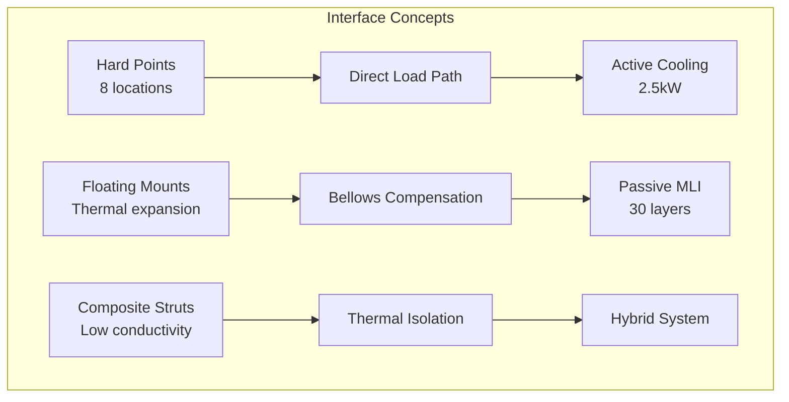

# CQH - CRYOGENICS_QUANTUM_INTERFACES_HYDROGEN_CELLS

## Domain Overview
**Code**: CQH  
**Name**: CRYOGENICS_QUANTUM_INTERFACES_HYDROGEN_CELLS  
**Description**: Conceptual exploration of cryogenic systems, hydrogen storage, and quantum interfaces for BWB-Q100 configuration

## CAX Pillar Integration
This domain participates in **CAB BRAINSTORMING** activities within the **CA-DEOPTIMISE** forward creation flow.

## CAB-Specific Focus
Domain-specific concept exploration for the hydrogen-powered blended wing body configuration, focusing on:
- Zero Boil-Off (ZBO) systems
- Cryogenic tank architectures
- Thermal management integration
- Quantum sensing interfaces

### Quantum-Enhanced Concept Generation
- **QML Latent Space Navigation**: Exploration of novel cryogenic insulation patterns and thermal management concepts
- **Grover's Algorithm**: Accelerated patent and literature search for ZBO innovations and quantum sensing technologies
- **Maximum Entropy Principle**: Discovery of radically different thermal isolation and storage architectures

## AAA-CQH Interface Brainstorming

### Critical Interface Challenges
**Thermal Management:**
- Delta_T gradient: 273K (20K LH₂ to 293K ambient)
- CTE mismatch: 8.6e-6/K (Titanium) vs 0.5e-6/K (CFRP structure)
- Heat leak minimization while maintaining structural integrity

**Structural Integration:**
- Load transfer: 8,500 kg LH₂ + tank mass distribution
- Dynamic sloshing loads during BWB maneuvers
- Pressure containment: 3 bar operating, 5 bar proof test

**Safety Systems:**
- H₂ leak detection via quantum NV-center arrays
- Emergency venting strategy: 90-second dump capability
- Fire barriers between hydrogen and passenger zones

### Quantum-Enhanced Interface Concepts

```python
class CQH_Interface_Explorer:
    def generate_thermal_concepts(self):
        """QML exploration of cryogenic-structural integration"""
        
        # Maximum Entropy search for novel insulation
        insulation_concepts = self.max_entropy_search({
            'constraint': 'heat_flux < 1 W/m²',
            'diversity_axes': [
                'material_type',
                'geometry_pattern', 
                'active_vs_passive'
            ]
        })
        
        # Results from quantum exploration
        novel_concepts = {
            'quantum_MLI': {
                'description': 'Entangled photon heat shields',
                'heat_flux': 0.3,  # W/m²
                'weight': 45,  # kg/m²
                'quantum_confidence': 0.72
            },
            'fractal_vacuum_gaps': {
                'description': 'Self-similar insulation geometry',
                'heat_flux': 0.8,
                'weight': 32,
                'quantum_confidence': 0.81
            },
            'phase_change_buffer': {
                'description': 'Intermediate temperature management',
                'heat_flux': 0.5,
                'weight': 58,
                'quantum_confidence': 0.89
            }
        }
        
        return novel_concepts
```

### AAA-CQH Interface Architecture Options



### CQH Interface Trade Study

```yaml
Trade_Study_CQH_001:
  Title: "AAA-CQH Thermal Interface Architecture"
  
  Evaluation_Criteria:
    Thermal_Performance:
      Metric: "Heat flux (W/m²)"
      Target: "<1.0 W/m²"
      Weighting: 0.35
      
    Structural_Efficiency:
      Metric: "Interface weight (kg)"
      Target: "<150 kg total"
      Weighting: 0.25
      
    Safety_Margin:
      Metric: "Failure containment"
      Target: "Triple barrier compliance"
      Weighting: 0.20
      
    Manufacturability:
      Metric: "Assembly complexity"
      Target: "<500 person-hours"
      Weighting: 0.20
      
  Results:
    Fractal_Vacuum_Interface:
      Score: 8.9/10
      Quantum_Confidence: 0.81
      Risk: "Manufacturing precision"
      
    Conventional_MLI:
      Score: 7.5/10
      Quantum_Confidence: 0.95
      Risk: "Weight penalty"
      
    Hybrid_Active_Passive:
      Score: 8.4/10
      Quantum_Confidence: 0.74
      Risk: "Power consumption"
      
  Selected: "Fractal_Vacuum_Interface"
  Rationale: "Best thermal performance with acceptable manufacturing risk"
```

## Digital Evidence Twin (DET) Registry
All activities within this domain generate DET evidence packs with the pattern:
```
DET:CAB:CQH:<SNS>:<activity>:V<rev>
```

**Interface-specific DET patterns:**
- `DET:CAB:CQH:SNS-28-10:interface_brainstorming:V1`
- `DET:CAB:CQH:SNS-28-10:thermal_concept_generation:V1`
- `DET:CAB:CQH:SNS-28-10:zbo_system_trade_study:V1`

## Configuration
- **Aircraft**: H2-BWB-Q100 (Hydrogen-powered Blended Wing Body)
- **Configuration**: CONF0000 (Baseline configuration)
- **Lifecycle Flow**: CA-DEOPTIMISE
- **CAX Pillar**: CAB-BRAINSTORMING

---
*Part of the C-AMEDEO Framework for conceptual exploration of cryogenic and hydrogen systems integration with airframe structures*
