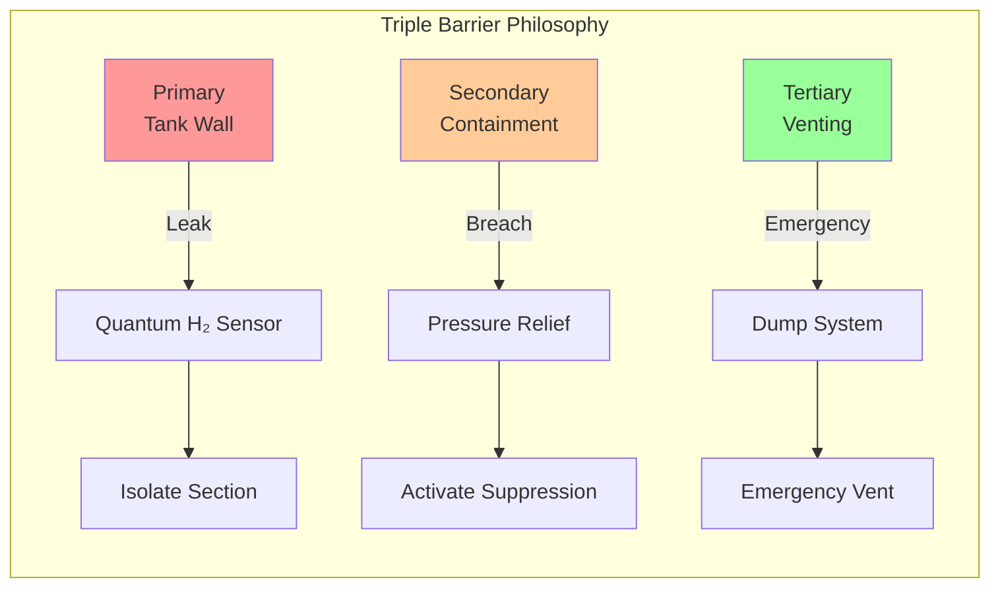

# DDD - DEFENCE_CYBERSECURITY_SAFETY

## Domain Overview
**Code**: DDD  
**Name**: DEFENCE_CYBERSECURITY_SAFETY  
**Description**: Conceptual exploration of defense systems, cybersecurity protocols, and safety assurance for BWB-Q100 configuration

## CAX Pillar Integration
This domain participates in **CAB BRAINSTORMING** activities within the **CA-DEOPTIMISE** forward creation flow.

## CAB-Specific Focus
Domain-specific concept exploration for the hydrogen-powered blended wing body configuration, focusing on:
- Quantum-resistant security architectures
- Fail-safe mechanism design
- Cyber-physical protection systems
- Emergency response protocols

### Quantum-Enhanced Concept Generation
- **QML Latent Space Navigation**: Exploration of novel security patterns and fault-tolerant system architectures
- **Grover's Algorithm**: Accelerated vulnerability assessment and threat landscape analysis
- **Maximum Entropy Principle**: Discovery of radically different safety barrier and defense concepts

## AAA-DDD Interface Brainstorming

### Critical Interface Challenges
**Physical Security:**
- H₂ containment: Triple barrier philosophy implementation
- Fire zone protection: 60-minute rating requirements
- Crash energy absorption: 9g forward, 6g downward loads

**Cyber Security:**
- Quantum resistance: Post-quantum cryptography implementation
- Air gap design: Physical isolation of critical flight systems
- Sensor authentication: Quantum signature verification

**System Safety:**
- Redundancy architecture: Dissimilar backup systems
- Fail-safe design: Passive safe states for all systems
- Emergency response: 90-second evacuation capability

### Quantum-Enhanced DDD Interface Concepts

```python
class DDD_Quantum_Security:
    def design_quantum_safe_architecture(self):
        """Generate quantum-resistant security concepts"""
        
        # Grover-resistant key length calculations
        key_requirements = self.calculate_grover_resistance({
            'current_bits': 256,
            'quantum_threat_timeline': '2030-2040',
            'safety_margin': 2.0
        })
        
        security_architecture = {
            'physical_layer': {
                'quantum_sensors': 'NV-center tampering detection',
                'fiber_monitoring': 'Quantum key distribution',
                'confidence': 0.91
            },
            'crypto_layer': {
                'algorithm': 'Lattice-based (CRYSTALS-Dilithium)',
                'key_length': 512,  # Post-quantum safe
                'confidence': 0.95
            },
            'system_layer': {
                'architecture': 'Byzantine fault tolerant',
                'voting': '2-out-of-3 quantum verified',
                'confidence': 0.88
            }
        }
        
        return security_architecture
```

### Safety Barrier Concept Matrix



### DDD Interface Trade Study

```yaml
Trade_Study_DDD_001:
  Title: "AAA-DDD Security and Safety Integration"
  
  Evaluation_Criteria:
    Security_Strength:
      Metric: "Quantum resistance level"
      Target: "2040+ threat timeline"
      Weighting: 0.30
      
    Safety_Assurance:
      Metric: "Fault tolerance (9s)"
      Target: "10⁻⁹ per flight hour"
      Weighting: 0.30
      
    System_Complexity:
      Metric: "Integration complexity"
      Target: "Manageable implementation"
      Weighting: 0.25
      
    Emergency_Response:
      Metric: "Response time (seconds)"
      Target: "<90 seconds evacuation"
      Weighting: 0.15
      
  Results:
    Quantum_Triple_Barrier:
      Score: 8.7/10
      Quantum_Confidence: 0.88
      Risk: "Implementation complexity"
      
    Enhanced_Conventional:
      Score: 7.9/10
      Quantum_Confidence: 0.93
      Risk: "Future quantum threats"
      
    Hybrid_Architecture:
      Score: 8.2/10
      Quantum_Confidence: 0.82
      Risk: "Integration challenges"
      
  Selected: "Quantum_Triple_Barrier"
  Rationale: "Best long-term security with acceptable implementation risk"
```

### Quantum Security Architecture

```yaml
Security_Framework:
  Physical_Protection:
    Structure_Monitoring:
      - "Quantum strain sensors (diamond NV-centers)"
      - "Entanglement-based intrusion detection"
      - "Fiber optic security mesh"
    Access_Control:
      - "Biometric with quantum verification"
      - "Multi-factor authentication cascade"
      - "Temporal access windows"
      
  Cyber_Protection:
    Post_Quantum_Crypto:
      Algorithm: "CRYSTALS-Dilithium + Kyber"
      Key_Length: 512  # bits
      Update_Frequency: "Every 24 hours"
    Network_Architecture:
      Topology: "Air-gapped critical systems"
      Monitoring: "Quantum-enhanced intrusion detection"
      Isolation: "Physical switches for flight systems"
      
  System_Safety:
    Fault_Tolerance:
      Method: "Byzantine fault tolerance"
      Voting: "2-out-of-3 quantum-verified"
      Backup: "Dissimilar redundant systems"
    Emergency_Systems:
      H2_Dump: "90-second full evacuation"
      Fire_Suppression: "Multi-zone halon system"
      Isolation: "Automatic system shutdown"
```

### Emergency Response Integration

```yaml
Emergency_Protocols:
  H2_Leak_Response:
    Detection: "Quantum sensor array (<1 second)"
    Isolation: "Automatic valve closure (<5 seconds)"
    Venting: "Controlled dump initiation (<10 seconds)"
    
  Fire_Response:
    Detection: "Multi-spectral quantum sensors"
    Suppression: "Zone-specific agent deployment"
    Evacuation: "Automated escape route lighting"
    
  Cyber_Attack_Response:
    Detection: "Quantum anomaly identification"
    Isolation: "Air-gap activation (<2 seconds)"
    Recovery: "Verified system state restoration"
    
  System_Failure_Response:
    Monitoring: "Continuous quantum health checks"
    Switching: "Automatic redundant system activation"
    Notification: "Quantum-secured emergency signals"
```

## Digital Evidence Twin (DET) Registry
All activities within this domain generate DET evidence packs with the pattern:
```
DET:CAB:DDD:<SNS>:<activity>:V<rev>
```

**Interface-specific DET patterns:**
- `DET:CAB:DDD:SNS-20-10:interface_brainstorming:V1`
- `DET:CAB:DDD:SNS-20-10:quantum_security_architecture:V1`
- `DET:CAB:DDD:SNS-20-10:safety_barrier_design:V1`

## Configuration
- **Aircraft**: H2-BWB-Q100 (Hydrogen-powered Blended Wing Body)
- **Configuration**: CONF0000 (Baseline configuration)
- **Lifecycle Flow**: CA-DEOPTIMISE
- **CAX Pillar**: CAB-BRAINSTORMING

---
*Part of the C-AMEDEO Framework for conceptual exploration of defense, cybersecurity, and safety systems integration with BWB airframe*
