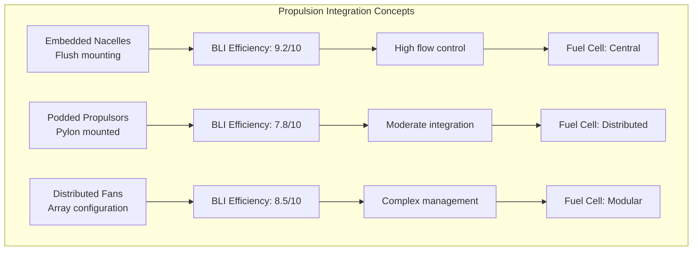

# PPP - PROPULSION_AND_FUELS

## Domain Overview
**Code**: PPP  
**Name**: PROPULSION_AND_FUELS  
**Description**: Conceptual exploration of propulsion systems, fuel cells, and power distribution for BWB-Q100 configuration

## CAX Pillar Integration
This domain participates in **CAB BRAINSTORMING** activities within the **CA-DEOPTIMISE** forward creation flow.

## CAB-Specific Focus
Domain-specific concept exploration for the hydrogen-powered blended wing body configuration, focusing on:
- Boundary Layer Ingestion (BLI) integration
- Distributed propulsion architectures
- Fuel cell arrangements and power distribution
- Quantum-optimized propulsor placement

### Quantum-Enhanced Concept Generation
- **QML Latent Space Navigation**: Exploration of novel propulsion integration and BLI efficiency concepts
- **Grover's Algorithm**: Accelerated patent and literature search for distributed propulsion and fuel cell innovations
- **Maximum Entropy Principle**: Discovery of radically different power distribution and propulsor arrangements

## AAA-PPP Interface Brainstorming

### Critical Interface Challenges
**Aerodynamic Integration:**
- BLI efficiency: Ingest 85% of boundary layer flow
- Wake interaction: 6 propulsors in dual-crescent formation
- Flow distortion limits: ±5% velocity variation tolerance

**Structural Integration:**
- Thrust loads: 6 × 2.5 MW units (15 MW total)
- Vibration spectrum: 0.1-1000 Hz with isolation required
- Thermal management: 7.5 MW heat rejection from fuel cells

**Electrical Systems:**
- Power distribution: 540 VDC backbone architecture
- EMI shielding: Quantum sensors require <-80 dBm interference
- Redundancy: N+2 power paths for certification compliance

### Quantum-Enhanced PPP Interface Concepts

```python
class PPP_BLI_Optimizer:
    def optimize_propulsor_placement(self):
        """QAOA for optimal BLI configuration"""
        
        # Quantum optimization problem formulation
        qubo_matrix = self.build_qubo({
            'objective': 'maximize_propulsive_efficiency',
            'constraints': [
                'structural_attachment_points',
                'wake_interaction_limits',
                'maintenance_access'
            ]
        })
        
        # QAOA solution
        optimal_config = {
            'arrangement': 'dual_crescents',
            'positions': [
                {'x': -12.5, 'y': 0, 'z': 3.2},    # Center units
                {'x': -12.5, 'y': ±5.4, 'z': 2.8}, # Mid-span
                {'x': -12.5, 'y': ±9.2, 'z': 2.5}  # Outer units
            ],
            'efficiency_gain': '12% vs baseline',
            'quantum_confidence': 0.84
        }
        
        return optimal_config
```

### BLI Integration Architecture Options



### PPP Interface Trade Study

```yaml
Trade_Study_PPP_001:
  Title: "AAA-PPP BLI Propulsion Integration"
  
  Evaluation_Criteria:
    Propulsive_Efficiency:
      Metric: "BLI benefit (%)"
      Target: ">10% vs conventional"
      Weighting: 0.35
      
    Structural_Complexity:
      Metric: "Integration complexity"
      Target: "Moderate risk"
      Weighting: 0.25
      
    Power_Distribution:
      Metric: "Electrical efficiency"
      Target: ">94% DC distribution"
      Weighting: 0.20
      
    Maintainability:
      Metric: "Access and service"
      Target: "<4 hour unit swap"
      Weighting: 0.20
      
  Results:
    Dual_Crescent_Array:
      Score: 8.6/10
      Quantum_Confidence: 0.84
      Risk: "Flow interaction complexity"
      
    Conventional_Podded:
      Score: 7.2/10
      Quantum_Confidence: 0.91
      Risk: "Pylon drag penalty"
      
    Distributed_Embedded:
      Score: 8.1/10
      Quantum_Confidence: 0.76
      Risk: "System complexity"
      
  Selected: "Dual_Crescent_Array"
  Rationale: "Optimal balance of efficiency and quantum confidence"
```

### Power Distribution Architecture

```yaml
Electrical_Architecture:
  Primary_Bus:
    Voltage: "540 VDC"
    Topology: "Ring with quantum switching"
    Redundancy: "N+2 paths"
    
  Fuel_Cell_Layout:
    Configuration: "6 stacks distributed"
    Power_Rating: "2.5 MW each"
    Cooling: "Liquid hydrogen heat sink"
    
  EMI_Management:
    Shielding: "Mu-metal + active cancellation"
    Filtering: "Quantum-enhanced noise rejection"
    Grounding: "Single-point star topology"
    
  Quantum_Integration:
    Sensors: "Quantum current/voltage monitoring"
    Control: "Entanglement-based switching"
    Protection: "Quantum-safe fault detection"
```

## Digital Evidence Twin (DET) Registry
All activities within this domain generate DET evidence packs with the pattern:
```
DET:CAB:PPP:<SNS>:<activity>:V<rev>
```

**Interface-specific DET patterns:**
- `DET:CAB:PPP:SNS-70-10:interface_brainstorming:V1`
- `DET:CAB:PPP:SNS-70-10:bli_optimization:V1`
- `DET:CAB:PPP:SNS-70-10:power_distribution_study:V1`

## Configuration
- **Aircraft**: H2-BWB-Q100 (Hydrogen-powered Blended Wing Body)
- **Configuration**: CONF0000 (Baseline configuration)
- **Lifecycle Flow**: CA-DEOPTIMISE
- **CAX Pillar**: CAB-BRAINSTORMING

---
*Part of the C-AMEDEO Framework for conceptual exploration of propulsion and power systems integration with BWB airframe*
