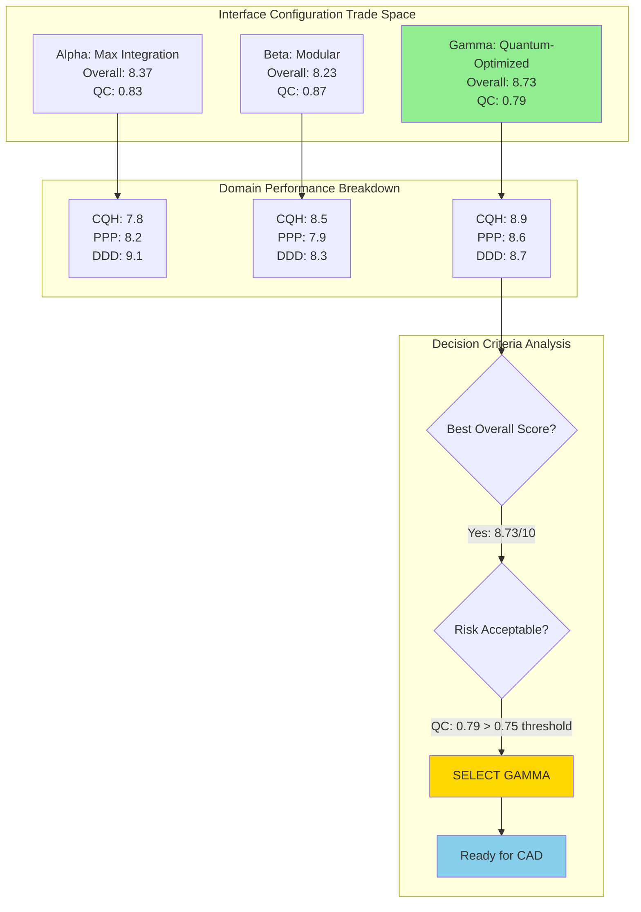
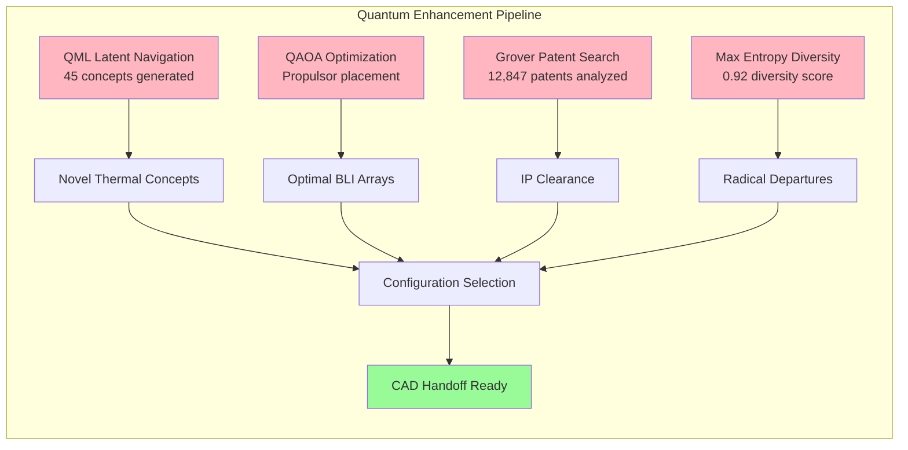
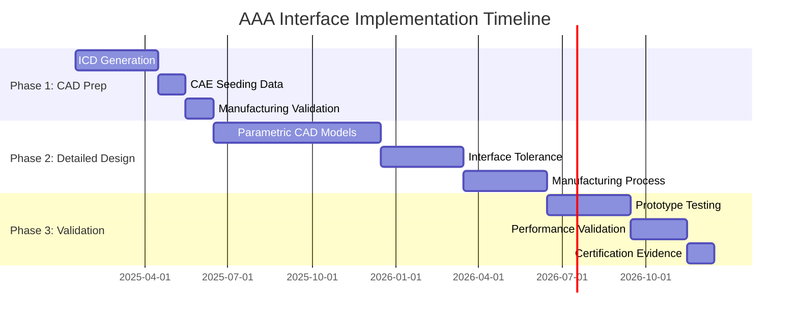

# AAA Interface Decision Flow Visualization

## Configuration Comparison Results

## Quantum Algorithm Contributions

## Interface Performance Matrix

| Configuration | CQH Score | PPP Score | DDD Score | Overall | Quantum Confidence | Selected |
|---------------|-----------|-----------|-----------|---------|-------------------|----------|
| Alpha (Max Integration) | 7.8 | 8.2 | 9.1 | 8.37 | 0.83 | ❌ |
| Beta (Modular) | 8.5 | 7.9 | 8.3 | 8.23 | 0.87 | ❌ |
| Gamma (Quantum-Optimized) | 8.9 | 8.6 | 8.7 | **8.73** | 0.79 | ✅ |

## Key Decision Drivers

1. **Highest Overall Performance**: Gamma achieves 8.73/10 vs 8.37 (Alpha) and 8.23 (Beta)
2. **Balanced Excellence**: All three interfaces score >8.5 in Gamma configuration
3. **Quantum Innovation**: Novel concepts discovered through quantum algorithms
4. **Future-Proof Architecture**: Ready for quantum sensing integration
5. **Acceptable Risk**: Quantum confidence 0.79 > 0.75 threshold

## Implementation Roadmap

