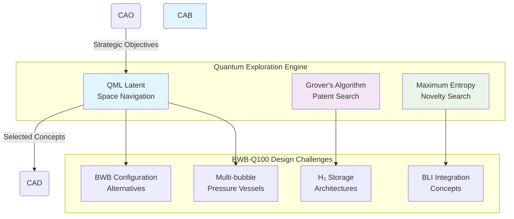

# CAB-BRAINSTORMING — Computer-Aided Brainstorming Pillar

**UniversalStandard:** Component-PillarDefinition-QAL-CAB-BrainstormingAssisted-v1.1-C-AMEDEO-Framework-CAB-Brainstorming-AmedeoPelliccia-ca-deoptimise-BrainstormingDefinition

## Purpose and Mission

The **CAB (Computer-Aided Brainstorming)** pillar is the **exploration and conceptual genesis phase** of the QAL ecosystem in the **CA-DEOPTIMISE forward creation flow**. Its mission is to translate market needs and strategic objectives defined in CAO into a diverse and evaluated set of solution concepts for the BWB-Q100 hydrogen-powered aircraft.

CAB acts as an innovation funnel, utilizing computational tools to explore vast design spaces, generate novel ideas, and select the most promising candidates for development in CAD.

## Quantum-Enhanced Innovation Engine

### Quantum Augmentations



## Key Modules and Functionalities

| Module | Primary Functionalities | Key Output Artifacts |
| :-- | :-- | :-- |
| **Needs Analysis** | Stakeholder requirements capture; Market analysis; Technology landscape mapping | Needs-Analysis.json; Market-Requirements.yaml |
| **Solution Space Exploration** | Patent database mining; Technology mapping; Morphological analysis | Technology-Map.json; Patent-Landscape.csv |
| **Concept Generation** | Digital brainstorming; Generative algorithms; Low-fidelity sketches | Concept-Sketches.svg; Concept-Library.json |
| **Feasibility Analysis** | Preliminary evaluation; Multi-criteria trade-offs; Automated ranking | Feasibility-Scorecard.csv; Trade-Study-Report.pdf |
| **Concept Selection** | Promising candidate selection; Rationale documentation; CAD handoff | Selected-Concept-Set.json; Rationale-Graph.json |

## BWB-Q100 Focus Areas

### Multi-Bubble Pressure Vessels
- Explore alternatives to conventional cylindrical pressure vessels
- Consider tetrahedral arrays, fractal distributions, bio-inspired cells
- Trade-off: fatigue life vs. weight vs. volume efficiency vs. manufacturing complexity

### Hydrogen System Architecture
- Zero Boil-Off (ZBO) concepts: active cooling, passive insulation, hybrid approaches
- Integration with BWB configuration constraints
- Novel cryogenic insulation geometries discovered through quantum exploration

### Boundary Layer Ingestion (BLI)
- Active flow control concepts
- Distributed propulsion architectures
- Integration with BWB aerodynamics

## Structure

```
CAB-BRAINSTORMING/
├── H2-BWB-Q100-CONF0000/          # BWB-Q100 configuration baseline
│   ├── concepts/                   # Generated concepts and artifacts
│   │   ├── Selected-Concept-Set.json
│   │   └── Concept-Sketches.svg
│   ├── feasibility/               # Feasibility studies and trade-offs
│   │   ├── Feasibility-Scorecard.csv
│   │   └── Trade-Study-Report.pdf
│   ├── quantum-models/            # Quantum algorithm outputs
│   │   └── Quantum-Exploration-Results.json
│   └── [15 Domain Directories]/   # All QAL framework domains
│       ├── AAA-ARCHITECTURES_AIRFRAMES_AERODYNAMICS/
│       ├── AAP-AIRPORTS_ADAPTATIONS/
│       ├── CCC-COCKPIT_CABIN_CARGO_SYSTEMS/
│       ├── CQH-CRYOGENICS_QUANTUM_INTERFACES_HYDROGEN_CELLS/
│       ├── DDD-DEFENCE_CYBERSECURITY_SAFETY/
│       ├── EDI-ELECTRONICS_DIGITAL_INSTRUMENTS/
│       ├── EEE-ENVIRONMENTAL_REMEDIATION_CIRCULARITY/
│       ├── EER-ENERGY_AND_RENEWABLE/
│       ├── IIF-INFRASTRUCTURES_AND_FACILITIES_VALUE_CHAINS/
│       ├── IIS-INTELLIGENT_SYSTEMS_ONBOARD_AI/
│       ├── LCC-LINKS_COMMUNICATIONS_CONTROL_IoT/
│       ├── LIB-LOGISTICS_INTEGRATED_BLOCKCHAIN/
│       ├── MMM-MECHANICAL_MATERIAL_MONITORING/
│       ├── OOO-OPERATING_SYSTEMS_NAVIGATION_HPC/
│       └── PPP-PROPULSION_AND_FUELS/
├── README.md (this file)
└── .gitkeep
```

## Artifacts Generated

### Primary Outputs
- **Selected-Concept-Set.json**: Top 1-3 concepts with CAE seeding information
- **Rationale-Graph.json**: Complete decision traceability network
- **Feasibility-Scorecard.csv**: Multi-criteria evaluation matrix
- **Quantum-Exploration-Results.json**: Complete quantum algorithm provenance

### Digital Evidence Twin (DET) Registry
All CAB activities generate immutable evidence with pattern:
```
DET:CAB:<DOMAIN>:<SNS>:<activity>:V<rev>
```

Example DET events:
- `concept_generation`: QML exploration with algorithm parameters
- `feasibility_analysis`: Multi-criteria assessment results  
- `trade_study`: Pareto frontier analysis
- `concept_selection`: Final selection rationale with quantum confidence

## Integration Points

### Inputs from CAO
- QAL-Policy-Pack with strategic objectives
- Market needs and stakeholder requirements
- Risk tolerance and budget constraints
- Technology readiness assessments

### Outputs to CAD
- Selected concept configurations with geometric parameters
- CAE seeding hints (mesh density, boundary conditions, key load paths)
- Material specifications and manufacturing constraints
- Performance targets and safety margins

### Cross-Domain Coordination
Each domain maintains bidirectional traceability through ALIAS patterns:
```yaml
aliases:
  structural_analysis: "ALIAS:AAA:MMM:STRUCTURAL-ANALYSIS"
  hydrogen_storage: "ALIAS:CQH:PPP:H2-INTEGRATION"
  quantum_processing: "ALIAS:OOO:CAB:QUANTUM-ALGORITHMS"
```

## DET Integration Pattern

CAB activities generate evidence through standardized DET patterns:

```json
{
  "det_id": "DET:CAB:<DOMAIN>:<SNS>:<activity>:V<rev>",
  "phase": "CAB",
  "artifact_type": "Concept|Feasibility|Trade-Study|Selection",
  "inputs": ["sha256:<cao-objectives>", "sha256:<market-needs>"],
  "outputs": ["sha256:<concept-set>", "sha256:<rationale-graph>"],
  "refs": {
    "ce": "CE-CAB-<DOMAIN>-<SNS>-<descriptor>",
    "ci": "CI-CAB-<DOMAIN>-<SNS>-<descriptor>"
  },
  "quantum": {
    "algorithm": "QML|Grover|MaxEntropy",
    "backend": "<quantum-backend>",
    "seed": "<random-seed>",
    "confidence": "<quantum-confidence-score>"
  },
  "processing": {
    "tool": "CAB-Explorer",
    "version": "v1.0",
    "params": "<algorithm-parameters>"
  },
  "meta": {
    "owner": "<responsible-engineer>",
    "created": "<iso-timestamp>",
    "evidence_chain": ["sha256:<previous-det>"]
  }
}
```

## Compliance Framework

CAB ensures regulatory compliance through:
- **Requirements Traceability**: Every concept traces to original market needs
- **Quantum Algorithm Validation**: All quantum explorations logged with provenance
- **Decision Rationale**: Complete documentation of concept selection criteria
- **Evidence Chain**: Immutable DET chain from market needs to selected concepts

## Handoff to CAD

The Selected-Concept-Set.json must include:
- `CAE_Seeding` section with key load paths and mesh density hints
- `boundary_condition_hints` for simulation setup
- `key_features` with quantified benefits (e.g., "15% weight reduction vs. conventional")
- `quantum_score` indicating confidence in quantum-generated insights
- `DET_hash` for immutable evidence chain

## Validation Rules

- All YAML files must validate against yamllint
- Concept sets must include CAE seeding information
- DET patterns must include quantum algorithm parameters (seed, backend, algorithm)
- Cross-domain references must use proper ALIAS patterns
- Rationale graphs must maintain bidirectional traceability

## KPIs and Metrics

- **Exploration Breadth**: Number of solutions explored vs. selected
- **Concept Quality**: Feasibility and novelty scores of generated concepts  
- **Requirements Traceability**: % of final concepts traceable to original need
- **Funnel Efficiency**: Conversion rate from ideas to viable concepts
- **Quantum Confidence**: Algorithm confidence scores for quantum-generated concepts