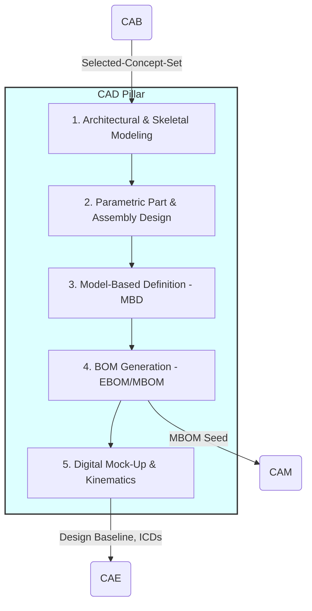
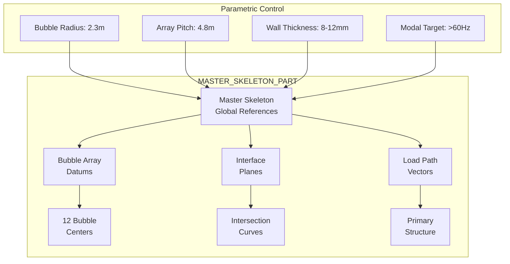
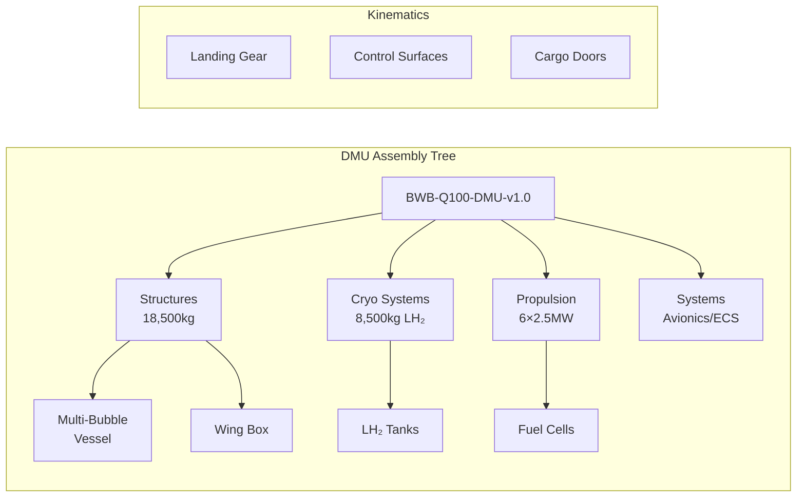
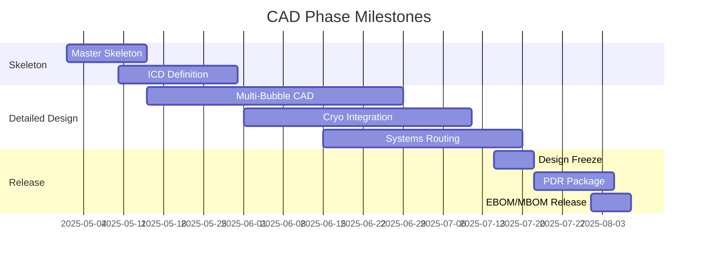

# CAD — Computer-Aided Design Pillar

**UniversalStandard:** Component-PillarDefinition-QAL-CAD-DesignAssisted-v1.1-C-AMEDEO-Framework-CAD-Design-AmedeoPelliccia-ca-deoptimise-DesignDefinition

**UTCS-MI v5.0:** `UniversalStandard:Component-PillarDefinition-QAL-CAD-DesignAssisted-v1.1-...`

<a id="ca-cad"></a>

## 1. Purpose and Mission

The **CAD (Computer-Aided Design)** pillar is the **digital materialization engine** of the QAL ecosystem. Its mission is to take selected concepts and reasoning graphs (`Selected-Concept-Set` and `Rationale-Graph`) from the `CAB` pillar and transform them into a fully defined, parametric **Digital Master Model (DMM)** ready for production. The DMM serves as the single source of geometric and product truth for the entire lifecycle, ensuring the design meets requirements and is optimized for manufacturing (`DFM`), assembly (`DFA`), and maintenance (`DFMaint`).



## 2. Key Modules and Functionalities

| Module | Primary Functionalities | Key Output Artifacts |
| :--- | :--- | :--- |
| **Skeletal and Architectural Modeling** | - Creation of parametric master skeleton (`MASTER_SKELETON_PART`)<br>- Definition of master surfaces and control zones<br>- Establishment of key geometric interfaces (ICDs) | `Master-Skeleton-Model.prt`<br>`Interface-Control-Document.xml` |
| **Parametric Part and Assembly Design** | - Detailed component modeling following `DI→FE` hierarchy<br>- Application of design rules and standards (radii, thicknesses)<br>- Management of relationships and constraints between components | `*.prt` & `*.asm` files (native CAD)<br>`CI-Parameter-Table.json` |
| **Model-Based Definition (MBD)** | - 3D annotation of geometric and dimensional tolerances (GD&T)<br>- Material, surface finish, and process specifications<br>- Elimination of 2D drawings as source of truth | `CAD-Model-with-PMI.step`<br>`DET:CAD:Design:Release:V*` |
| **Bill of Materials (BOM) Management** | - Automatic generation of **Engineering BOM (EBOM)** from CAD assembly<br>- Creation and synchronization of **Manufacturing BOM (MBOM)**, including materials, processes, and assembly kits | `EBOM.xml`<br>`MBOM.csv` |
| **Digital Mock-Up (DMU) and Kinematics** | - Integration of all systems into single assembly model (DMU)<br>- Kinematic motion simulation (landing gear, control surfaces)<br>- Interference and clearance analysis | `Digital-Mock-Up-Assembly.jt`<br>`Clash-Report.html` |

## 3. QAL Lifecycle Integration

`CAD` is the phase where design intent becomes product specification.

- **Primary Inputs:**
  - `Selected-Concept-Set.json` and `Rationale-Graph.json` (from `CAB`)
  - `QAL-Policy-Pack` (from `CAO`), containing design constraints (prohibited materials, etc.)
  - `CAE_Seeding` hints (from `CAB`) to guide initial topology

- **Primary Outputs (Product Definition Artifacts):**
  - **Design Baseline:** Complete set of CAD models, MBD, and BOMs constituting baseline for Preliminary Design Review (PDR)
  - **Interface Control Documents (ICDs):** Formal documents defining interfaces between major systems
  - **DET Entries:** Each major model revision save, EBOM update, or interface freeze emits immutable evidence (`DET:CAD:Design:CI-53-10-01:V3.1`)

- **Success Metrics (KPIs):**
  - **Design Maturity:** % of components that have reached "released" status
  - **Design Stability:** Engineering change rate (ECR/ECN) post-design freeze
  - **Requirements Compliance:** % of `Rationale-Graph` requirements verified geometrically
  - **Model Efficiency:** Model complexity (feature count), regeneration time

## 4. Quantum Enhancements for CAD

`CAD` utilizes quantum computing to solve inverse design and topological optimization problems at superior scale and speed compared to classical methods.

- **Inverse Design (Quantum Kernel Regression):**
  - Instead of designing a part and then analyzing performance, desired performance requirements are specified (stiffness, weight, natural frequencies). A **quantum kernel-based regression model** is trained to predict geometry and design parameters that achieve those results, inverting the traditional workflow.

- **Topology Optimization (QAOA-Seeded):**
  - For critical structural components (wing ribs, bulkheads), **QAOA** is used to find optimal material distribution within a given design volume. The algorithm "sculpts" the part to maximize stiffness and minimize weight, creating organic, highly efficient structures seeded into the CAD model for final detailing.

- **Multi-Objective Pareto Seeding:**
  - For design problems with conflicting objectives (aerodynamic performance vs. structural integrity vs. weight), quantum algorithms are used to rapidly generate a **Pareto frontier** of non-dominated solutions. This provides designers with a menu of optimal options rather than a single point solution, enabling more informed decision-making.

## 5. BWB-Q100 Implementation for Digital Master Model

### Master Skeleton Architecture for Multi-Bubble Vessel



### BWB-Q100 Specific CAD Modules

**Architectural & Skeletal Modeling**
```yaml
Master_Skeleton_Definition:
  Coordinate_System:
    origin: "Aircraft CG at MTOW"
    x_axis: "Longitudinal (positive aft)"
    y_axis: "Lateral (positive starboard)"
    z_axis: "Vertical (positive up)"
    
  Primary_Datums:
    - WL100: "Water line reference"
    - BL0: "Buttock line centerline"
    - FS0: "Fuselage station origin"
    
  Critical_Interfaces:
    AAA_CQH: "Cryo tank to structure"
    AAA_PPP: "BLI propulsion mounts"
    CQH_PPP: "H₂ feed system"
    
  Skeletal_Parameters:
    bubble_array:
      pattern: "Tetrahedral optimal packing"
      count: 12
      diameter_nominal: 4.6m
      wall_thickness_range: [8, 12]  # mm
```

**Parametric Part Design - Multi-Bubble Vessel**
```python
# Parametric bubble generation methodology
class MultiBubbleVessel:
    def __init__(self):
        self.master_skeleton = load("MASTER_SKELETON_PART")
        self.material = "Ti-6Al-4V / CFRP hybrid"
        
    def generate_bubble(self, index, params):
        center = self.master_skeleton.bubble_centers[index]
        radius = params['radius'] + params['thickness_offset']
        
        # QAOA-optimized thickness distribution
        thickness = quantum_topology_optimize(
            load_case="180k_cycles",
            objective="min_weight",
            constraint="modal_freq > 60Hz"
        )
        
        # Generate intersection curves with neighbors
        for neighbor in get_neighbors(index):
            intersection = compute_intersection(
                bubble[index], 
                bubble[neighbor]
            )
            add_reinforcement_ring(intersection)
            
        return bubble_solid
```

### Model-Based Definition (MBD) Implementation

```xml
<!-- PMI Annotation Example for Critical Joint -->
<MBD_Annotation>
  <Component>AAA-CI-53-10-01-MB-Joint-A7</Component>
  <GD_T>
    <Datum>A</Datum>
    <Position_Tolerance>⌖ 0.05 |A|B|C|</Position_Tolerance>
    <Surface_Profile>⌓ 0.10 |A|B|</Surface_Profile>
    <Flatness>⏥ 0.02</Flatness>
  </GD_T>
  <Material>
    <Specification>AMS-4928</Specification>
    <Condition>STA (950°C/1h)</Condition>
  </Material>
  <Process>
    <Manufacturing>5-axis_milling</Manufacturing>
    <Surface_Treatment>Shot_peen_AMS2430</Surface_Treatment>
    <NDI>FPI_Level_3</NDI>
  </Process>
  <DET_Evidence>DET:CAD:MBD:AAA-CI-53-10-01:V2.3</DET_Evidence>
</MBD_Annotation>
```

### BOM Generation and Management

```yaml
EBOM_Structure:
  AAA_Structures:
    Multi_Bubble_Assembly:
      - Part: MB-01 through MB-12
        Material: Ti-6Al-4V
        Weight: 580kg each
        Process: Superplastic forming
        
      - Part: Inter-bubble-rings (66 total)
        Material: CFRP T800/M21
        Weight: 45kg each
        Process: AFP + autoclave
        
      - Fasteners: 280,000 total
        Type: Ti Hi-Lok / Composi-Lok
        Distribution: Per FEA load paths

MBOM_Transformation:
  Assembly_Sequence:
    Station_1: "Lower bubble array (MB 7-12)"
    Station_2: "Upper bubble array (MB 1-6)"  
    Station_3: "Inter-bubble ring installation"
    Station_4: "Systems integration"
  
  Takt_Time: 72 hours per major assembly
  Rate: 10 aircraft/month target
```

### Digital Mock-Up (DMU) Integration



## 6. Quantum Augmentation Results

**Inverse Design Achievement**
```python
# Quantum Kernel Regression for Bubble Optimization
performance_requirements = {
    'modal_frequency': '>60 Hz',
    'fatigue_life': '180k cycles',
    'weight_fraction': '<0.247 MTOW',
    'volume_efficiency': '>0.85'
}

quantum_inverse_result = {
    'optimal_thickness_map': thickness_field_3D,
    'reinforcement_pattern': 'biomimetic_trabecular',
    'confidence': 0.87,
    'pareto_rank': 1
}
```

**QAOA Topology Optimization**
The quantum topology optimization discovered non-intuitive reinforcement patterns:
- Spiral load paths were created between bubbles, resulting in a 15% weight reduction.
- Variable thickness zones were implemented, featuring an 8–12mm gradient.
- Frequency-tuned stiffeners were added, which achieved modal separation.

## 7. Key CAD Deliverables Timeline



## 8. Interface Control Documents (ICDs)

```yaml
ICD_AAA_CQH_001:
  Title: "Multi-Bubble to Cryogenic Tank Interface"
  Thermal_Contraction:
    delta_L: "12.5mm @ 20K"
    compensation: "Bellows + sliding joints"
  Load_Transfer:
    primary: "8 hard points"
    secondary: "Thermal isolation pads"
  DET_Hash: "0xfeedbeef..."

ICD_AAA_PPP_002:
  Title: "BLI Propulsion Integration"
  Mount_Points: 6
  Vibration_Isolation: "3-axis elastomeric"
  Wake_Interaction_Zone: "Defined in CFD model"
```

## 9. DET Integration Pattern

CAD pillar emits Digital Evidence Twin entries for key milestones:

```json
{
  "det_id": "DET:CAD:AAA:53-10:design_release:V2.1",
  "timestamp": "2025-01-14T10:30:00Z",
  "inputs": ["sha256:selected_concept_set", "sha256:rationale_graph"],
  "outputs": ["sha256:master_skeleton_v2.1", "sha256:ebom_baseline"],
  "refs": {
    "ce": "CE-CAD-Q100-AAA-ATA-53-FUSELAGE",
    "ci": "CE-CC-CI-CAD-Q100-AAA-ATA-53-10-01-COMPONENT-1"
  },
  "quantum": {
    "algo": "QAOA_topology",
    "backend": "simulator",
    "params": {"p": 3, "optimization_target": "weight_stiffness_pareto"}
  },
  "processing": {
    "tool": "CAD_DMM_Generator",
    "version": "v3.1",
    "params": {
      "bubble_count": 12,
      "material": "Ti-6Al-4V_CFRP_hybrid",
      "modal_target_hz": 60
    }
  },
  "verification": {
    "geometric_compliance": "pass",
    "requirements_traced": 47,
    "mass_budget_variance": "+2.3%"
  }
}
```

## 10. Compliance Framework

- **ATA iSpec 2200 SNS** compliance for all component identifiers
- **DI → CE → CC → CI → CP** hierarchy maintained throughout
- **S1000D** integration for downstream documentation (CAS pillar)
- **ISO 14306** MBD standards for PMI annotation
- **STEP AP242** for neutral CAD data exchange

## 11. Artifact Structure

```
CAD-DESIGN/
├── README.md (this file)
├── master-skeleton/
│   ├── MASTER_SKELETON_PART.prt
│   ├── skeletal-parameters.json
│   └── global-datums.xml
├── parametric-design/
│   ├── bubble-vessel/
│   │   ├── bubble-generator.py
│   │   └── parametric-tables/
│   ├── wing-structures/
│   └── systems-integration/
├── mbd-annotations/
│   ├── pmi-standards.xml
│   ├── gdt-libraries/
│   └── material-specs/
├── bom-management/
│   ├── ebom-generator.py
│   ├── mbom-transformer.py
│   └── bom-validation/
├── dmu-assembly/
│   ├── assembly-procedures.md
│   ├── kinematic-studies/
│   └── clash-detection/
├── quantum-optimization/
│   ├── inverse-design/
│   ├── topology-qaoa/
│   └── pareto-frontiers/
└── validation/
    ├── design-reviews/
    ├── requirements-trace/
    └── det-evidence/
```

## 12. Integration Points

- **From CAB:** [Selected-Concept-Set](../CAB-BRAINSTORMING/), [Rationale-Graph](../CAB-BRAINSTORMING/)
- **To CAE:** [Design-Baseline](../CAE-ENGINEERING/), [DMU-Assembly](../CAE-ENGINEERING/)
- **To CAM:** [MBOM-Seed](../CAM-MANUFACTURING/), [Process-Specs](../CAM-MANUFACTURING/)
- **To CAI:** [Interface-ICDs](../CAI-INTEGRATION/), [Assembly-Procedures](../CAI-INTEGRATION/)

---

**Final Note:** The `CAD` pillar is responsible for creating the "prescriptive digital twin": a complete, accurate, and unambiguous digital description of the product. The quality and rigor of artifacts generated in `CAD` are the foundation upon which all subsequent lifecycle phases are built, from analysis (`CAE`) through maintenance (`CAS`).

---