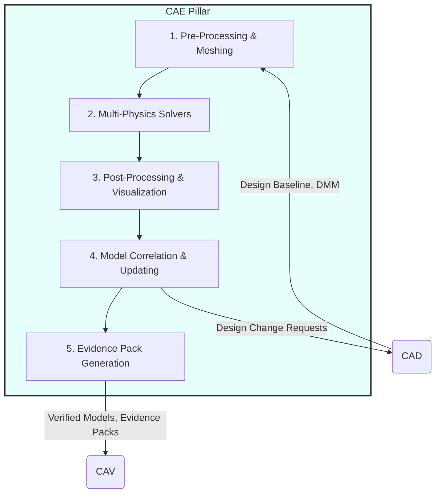
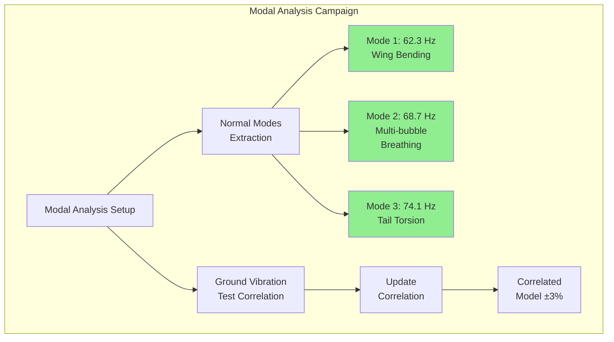

# CAE — Computer-Aided Engineering

**UniversalStandard:** Component-PillarDefinition-QAL-CAE-EngineeringAssisted-v1.1-C-AMEDEO-Framework-CAE-Engineering-AmedeoPelliccia-ca-deoptimise-EngineeringDefinition

## 1. Purpose and Mission

The **CAE (Computer-Aided Engineering)** pillar is the **virtual validation and
performance prediction engine** of the QAL ecosystem. Its mission is to take the
Digital Master Model (DMM) from the [CAD] pillar and subject it to a rigorous set
of high-fidelity multiphysics analyses and simulations. CAE verifies that the design
meets all performance, safety, and durability requirements before manufacturing any
physical prototype. It generates digital evidence (`Evidence Packs`) that demonstrates
design compliance and robustness, forming a fundamental part of the certification case.



## 2. Key Modules and Functionalities

| Module | Primary Functionalities | Key Output Artifacts |
| :-- | :-- | :-- |
| **Pre-processing and Meshing** | - CAD geometry import and simplification<br>- High-quality mesh creation (FEA, CFD)<br>- Boundary conditions, loads, and materials definition | `*.fem` (FEA Mesh)<br>`*.msh` (CFD Mesh)<br>`Load-Cases.xml` |
| **Multi-Physics Solvers** | - **Structural Analysis (FEA):** Stress, deformation, buckling<br>- **Fluid Dynamics (CFD):** Aerodynamics, BLI, thermal management<br>- **Thermal Analysis:** Heat transfer (cryogenics)<br>- **Durability and Fatigue Analysis:** Life cycles<br>- **Modal and Vibration Analysis:** Natural frequencies | `*.op2`, `*.h3d` (FEA Results)<br>`*.cas`, `*.dat` (CFD Results)<br>`Fatigue-Life-Report.csv` |
| **Post-processing and Visualization** | - Contour maps generation (stress, pressure, temperature)<br>- Graphs and animations for results interpretation<br>- Performance KPIs extraction (e.g., L/D, safety margin) | `Analysis-Visualization.png`<br>`Performance-KPI-Dashboard.html` |
| **Model Correlation and Updating** | - Simulation results correlation with test data (from [CAT] pillar)<br>- Model calibration and updating for improved predictive accuracy | `Correlated-Model-vNext.fem`<br>`Model-Uncertainty-Quantification.json` |
| **Evidence Pack Generation** | - Packaging all simulation artifacts (mesh, inputs, results, logs) into a single **Evidence Pack**<br>- Digital signing of packages and DET registration | `DET:CAE:Analysis:FEA-Stress-53-10:V1.0` |

## 3. QAL Lifecycle Integration

CAE is the bridge between design and certification, providing digital confidence in the product.

### Primary Inputs:
- `Design Baseline` (DMM, ICDs, EBOM) (from [CAD])
- Performance and safety requirements from `Rationale-Graph` (originated in [CAB])
- Materials data and properties (from `MMM` domain)
- Physical test data for correlation (from [CAT])

### Primary Outputs (Virtual Validation Artifacts):
- **Verified Models:** High-fidelity simulation models whose predictive accuracy has been quantified and validated
- **Evidence Packs:** Immutable and traceable datasets that demonstrate design compliance with specific requirements. These form the basis for certification by analysis
- **Engineering Change Requests (ECR):** If analysis reveals non-compliance, CAE generates formal change requests for [CAD] to modify the design

### Success Metrics (KPIs):
- **Predictive Accuracy:** Error between simulation and physical testing (`<5%` target)
- **Verification Coverage:** % of requirements verified by analysis
- **Computational Efficiency:** Solver execution time, HPC resource usage
- **Problem Discovery Rate:** Number of design issues identified virtually before manufacturing

## 4. Quantum Enhancements for CAE

CAE is a field where quantum computing promises to revolutionize fundamental physics and optimization problems.

### Materials and Chemistry Simulation (VQE):
For the BWB-Q100, this is critical. The **Variational Quantum Eigensolver (VQE)** is used to simulate from first principles the behavior of:
- **Composite Materials at Cryogenic Temperatures:** Accurately predict the emergence of microcracks and CFRP property degradation in the LH₂ tank
- **Fuel Cell Catalysis:** Simulate reactions in the proton exchange membrane (PEM) to design more efficient and durable catalysts

### Quantum Linear System Solvers (HHL and variants):
The core of many FEA and CFD solvers is solving massive linear equation systems. Algorithms like **HHL** offer theoretical exponential acceleration. While still in research, QAL is prepared with an abstraction layer to route stiffness matrices to quantum solvers as they mature, drastically reducing simulation times.

### Surrogate Models with QML:
For very expensive analyses (e.g., full aircraft CFD in thousands of flight conditions), a **Quantum Machine Learning (QML)** model is trained. This "surrogate model" learns the system response and can make near-instantaneous predictions, enabling massive design space explorations (e.g., wing shape optimization) that would otherwise be impossible.

## 5. DET Integration Pattern

CAE activities generate evidence through standardized DET patterns:

```json
{
  "det_id": "DET:CAE:<DOMAIN>:<SNS>:<activity>:V<rev>",
  "phase": "CAE",
  "artifact_type": "Analysis|Simulation|Correlation|Evidence",
  "inputs": ["sha256:<design-baseline>", "sha256:<requirements>"],
  "outputs": ["sha256:<results>", "sha256:<evidence-pack>"],
  "refs": {
    "ce": "CE-CAE-<DOMAIN>-<SNS>-<descriptor>",
    "ci": "CI-CAE-<DOMAIN>-<SNS>-<descriptor>"
  },
  "analysis": {
    "solver": "<tool-name-version>",
    "mesh_quality": "<quality-metrics>",
    "convergence": "<convergence-criteria>",
    "margins": "<safety-factors>"
  },
  "quantum": {
    "algo": "VQE|HHL|QML",
    "backend": "simulator|hardware",
    "params": {"circuit_depth": 1000, "optimization_target": "accuracy"}
  }
}
```

## 6. BWB-Q100 Implementation Examples

### Multi-Bubble Vessel FEA Campaign

```yaml
FEA_Analysis_Matrix:
  Static_Structural:
    Load_Cases:
      - LC1: "2.5g limit load (symmetric pull-up)"
      - LC2: "-1.0g pushover (negative g)"
      - LC3: "Cabin pressurization (ΔP = 0.75 bar)"
      - LC4: "Cryogenic thermal (293K → 20K)"

    Mesh_Requirements:
      Global_Size: 50mm
      Refinement_Zones:
        - Inter_bubble_joints: 5mm
        - Fastener_holes: 2mm
        - Crack_tips: 0.5mm (for fatigue)

      Element_Types:
        Structure: "CQUAD4/CTRIA3 (shells)"
        Joints: "CHEXA8 (solids)"
        Fasteners: "CBEAM/CBUSH"

    Material_Models:
      Ti_6Al_4V:
        E: "113 GPa @ 293K, 125 GPa @ 20K"
        CTE: "8.6e-6 /K"
        S_y: "880 MPa (min)"

      CFRP_T800_M21:
        Ply_Properties: "Hashin damage model"
        Temperature_Dependent: true

  Fatigue_Analysis:
    Method: "Strain-life (ε-N)"
    Spectrum: "TWIST (180k cycles)"
    Safety_Factor: 1.5
    DET_Evidence: "DET:CAE:Fatigue:MultiB:V2.1"
```

### CFD Analysis for BLI Integration

```python
# CFD Setup for Boundary Layer Ingestion
cfd_config = {
    'solver': 'RANS with k-ω SST',
    'mesh': {
        'cells': '50M structured/unstructured hybrid',
        'y_plus': '<1 at all walls',
        'prism_layers': 25,
        'growth_rate': 1.2
    },
    'boundary_conditions': {
        'inlet': 'Mach 0.78, FL350',
        'outlet': 'Pressure outlet',
        'walls': 'No-slip, adiabatic',
        'propulsors': 'Actuator disk model'
    },
    'convergence': {
        'residuals': '<1e-6',
        'monitors': ['L/D', 'thrust', 'mass_flow']
    }
}

# Quantum-enhanced surrogate model
qml_surrogate = {
    'training_points': 500,  # Full CFD runs
    'prediction_space': '10,000 flight conditions',
    'quantum_advantage': '100x speedup',
    'accuracy': '±2% vs full CFD'
}
```

### Modal Analysis Verification



### Cryogenic Thermal Analysis

```yaml
Thermal_Analysis:
  Transient_Scenarios:
    Ground_Hold:
      Duration: "8 hours"
      Heat_Leak: "150W total"
      Boil_Off: "<0.1% per hour"

    Climb_Profile:
      Time: "0 to FL350 in 25 min"
      Tank_Pressure: "Maintained at 3 bar"
      Thermal_Gradients: "Max 50K/m"

    Cruise:
      Duration: "5 hours"
      ZBO_System: "Active cooling"
      Power_Required: "2.5 kW"

  VQE_Material_Simulation:
    CFRP_at_20K:
      Microcracking_Threshold: "0.3% strain"
      CTE_Mismatch_Stress: "45 MPa"
      Quantum_Confidence: 0.92

    MLI_Performance:
      Effective_Conductivity: "0.0001 W/m·K"
      Layer_Optimization: "VQE-optimized spacing"
```

## 7. Evidence Pack Generation

```json
{
  "evidence_pack": {
    "id": "EP-CAE-BWB-Q100-001",
    "analyses": [
      {
        "type": "FEA_Static",
        "requirement": "CS 25.305 - Strength",
        "result": "PASS",
        "margin": "+12%",
        "artifacts": [
          "mesh_v3.2.fem",
          "results_LC1-4.op2",
          "stress_report.pdf"
        ],
        "DET_hash": "0xabcdef123..."
      },
      {
        "type": "Fatigue",
        "requirement": "180k cycles",
        "result": "PASS",
        "life": "245k cycles (mean)",
        "B-basis": "192k cycles",
        "quantum_contribution": "Microcrack propagation via VQE"
      },
      {
        "type": "Modal",
        "requirement": ">60 Hz first mode",
        "result": "PASS",
        "first_mode": "62.3 Hz",
        "separation": "10% between modes"
      }
    ],
    "certification_credit": "Analysis supported by test correlation",
    "signature": "QAL-CAE-Authority-Sig"
  }
}
```

## 8. Integration Points

### With Other Pillars:
- **[CAD]:** Receives design baselines and geometry; provides change requests
- **[CAT]:** Provides correlation data for model validation
- **[CAV]:** Supplies verified models and evidence packs for certification
- **[CAM]:** Defines manufacturing constraints for analysis assumptions
- **[CAI]:** Provides integration analysis requirements
- **[CAS]:** Supports sustainment analysis and life extension studies

### With Core Systems:
- **PBS (Product Breakdown Structure):** Links analysis to system architecture
- **DET (Digital Evidence Twin):** Records all analysis evidence and traceability
- **UTCS-MI:** Maintains universal standards compliance
- **Quantum Infrastructure:** Interfaces with quantum computing resources

## 9. HPC Resource Requirements

```yaml
Computational_Infrastructure:
  Classical_HPC:
    FEA_Cluster: "2048 cores, 16TB RAM"
    CFD_Cluster: "4096 cores, 32TB RAM"
    Storage: "500TB high-speed"

  Quantum_Resources:
    VQE_Access: "IBM Quantum Network Hub"
    Qubit_Requirements: "127 qubits minimum"
    Circuit_Depth: "O(10³) gates"

  Hybrid_Workflow:
    Orchestration: "Qiskit Runtime + HPC scheduler"
    Data_Pipeline: "Quantum results → Classical post-process"
```

## 10. Model Correlation Strategy

```yaml
Correlation_Plan:
  Phase_1_Component:
    Test: "Single bubble pressure test"
    Correlation_Target: "±5% strain prediction"
    Model_Update: "Material properties, boundary conditions"

  Phase_2_Subassembly:
    Test: "3-bubble array with cryo"
    Correlation_Target: "±3% frequency, ±7% stress"
    Model_Update: "Joint stiffness, damping"

  Phase_3_Full_Scale:
    Test: "Ground vibration test"
    Correlation_Target: "±3% frequency, ±5% mode shape"
    Model_Update: "Mass distribution, connection modeling"

  Uncertainty_Quantification:
    Method: "Bayesian model updating"
    Parameters: "15 uncertain variables"
    Output: "P95 confidence bounds"
```

---

**Final Note:** The CAE pillar transforms simulation from simple "verification" to a tool for **prediction and discovery**. By generating high-confidence digital evidence and leveraging quantum computing to solve fundamental physics problems, CAE drastically reduces dependence on expensive physical prototypes, accelerates the development cycle, and enables unprecedented levels of design optimization.
