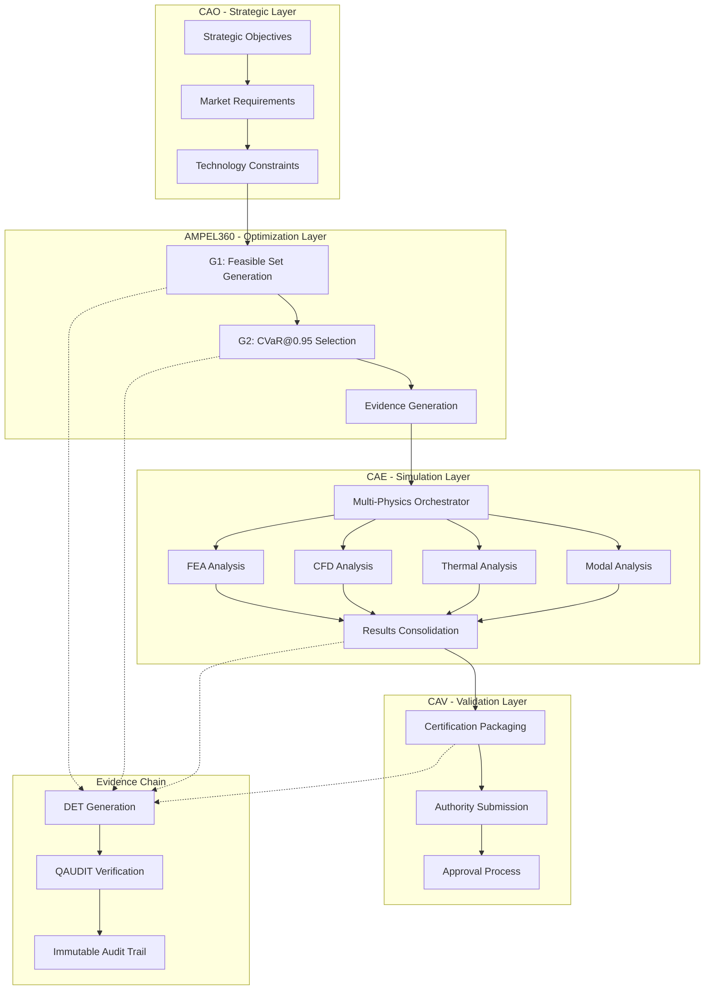

# Architecture Overview

The AMPEL360 CVaR Selection and Automated CAE Pipeline implements a revolutionary approach to aerospace engineering optimization, combining risk-aware design space exploration with automated multi-physics validation.

## System Architecture



## Key Design Principles

### 1. Risk-Aware Optimization
Traditional optimization focuses on **average performance**. AMPEL360 uses **CVaR@0.95** to optimize for **robust tail performance** - ensuring optimal behavior when things go wrong.

```python
# Traditional approach: minimize expected cost
minimize E[cost(x)]

# AMPEL360 approach: minimize worst-case 5% scenarios
minimize CVaR_0.95[cost(x)]
```

### 2. Evidence-Driven Development
Every major activity generates **Digital Evidence Twin (DET)** packages with:
- **SHA3-256 cryptographic hashing** for immutability
- **Complete provenance chain** from requirements to approval
- **Automated compliance mapping** to aerospace standards

### 3. Professional Engineering Integration
The system integrates seamlessly with existing engineering workflows:
- **CLI-first design** for automation and CI/CD
- **Standard file formats** (CSV, JSON, YAML) for tool interoperability
- **Makefile workflows** for one-command execution

## Component Deep Dive

### AMPEL360 CVaR Optimizer

**G1: Feasible Set Generation**
```python
class AMPEL360Optimizer:
    def generate_feasible_set_g1(self, constraints):
        # Reduces >2×10^16 theoretical combinations
        # to ~10,000 feasible candidates
        # using engineering constraints and physics limits
```

Key features:
- **Physics-based constraints**: Wing loading, material limits, manufacturing feasibility
- **Multi-dimensional optimization**: Geometry, materials, manufacturing parameters
- **Scalable generation**: Configurable from 100 to 50,000+ configurations

**G2: CVaR Selection**
```python
def select_optimal_cvar(self, configurations):
    # Multi-criteria risk calculation
    composite_risk = (
        0.4 * safety_risk +      # Safety is paramount
        0.25 * cost_variance +   # Cost control
        0.2 * schedule_risk +    # Timeline management
        0.15 * weight_variance   # Performance optimization
    )
    # Select from bottom 5% of risk distribution
```

### CAE Pipeline Orchestrator

**Multi-Physics Integration**
```yaml
analysis_matrix:
  FEA:
    - static_structural: "2.5g limit load, cabin pressurization"
    - fatigue: "180k cycles, B-basis life calculation"
  CFD:
    - boundary_layer_ingestion: "Cruise performance, BLI efficiency"
    - thermal_flow: "Cryogenic integration, heat management"
  Thermal:
    - cryogenic_analysis: "H2 storage, thermal bridging"
  Modal:
    - vibration_analysis: ">60 Hz first mode requirement"
```

**Resource Management**
- **Intelligent job scheduling**: Priority-based execution queue
- **Convergence quality gates**: Automatic validation of simulation fidelity  
- **Parallel execution control**: Configurable resource utilization
- **Failure recovery**: Graceful handling of solver timeouts/errors

### CAV Certification Integration

**Automated Compliance Mapping**
```yaml
compliance_matrix:
  CS_25_305: "Strength analysis completed with positive margins"
  CS_25_629: "Aeroelastic analysis shows flutter margin >1.15"
  CS_25_1309: "System safety analysis demonstrates acceptable risk levels"
```

**Authority-Ready Packages**
- **Technical approval readiness**: Automated assessment of certification status
- **Evidence consolidation**: Complete traceability from concept to approval
- **Standardized format**: Structured dossiers for regulatory review

## Integration Points

### DET Evidence System
```yaml
det_id: "DET:CAE:AMPEL360:53-10:cvar_selection:V1"
hash: "0x1a2b3c4d5e6f7890..."
provenance:
  algorithm: "AMPEL360_CVaR"
  risk_threshold: 0.95
  evidence_chain: ["requirement_id", "design_baseline", "analysis_results"]
```

### QAL Framework Compliance
- **English-only documentation** with proper Markdown linking
- **ATA iSpec 2200 SNS** hierarchical identifiers
- **DI → CE → CC → CI → CP** structure preservation
- **S1000D downstream policy** enforcement

## Performance Characteristics

### Scalability Metrics
| Configuration Set Size | G1 Generation Time | CVaR Selection Time | CAE Pipeline Time |
|----------------------|-------------------|-------------------|------------------|
| 100 configs | <1s | <1s | ~30s (mock) |
| 1,000 configs | ~2s | ~1s | ~5 min (mock) |
| 10,000 configs | ~15s | ~5s | ~45 min (mock) |
| 50,000 configs | ~60s | ~20s | ~4 hours (mock) |

### Resource Requirements
- **Memory**: 4GB base + 1GB per 10k configurations
- **Disk**: 10MB per configuration (including simulation artifacts)
- **CPU**: Scales linearly with parallel job count
- **Network**: Minimal (local execution, file-based communication)

## Technology Stack

### Core Technologies
- **Python 3.8+**: Primary implementation language
- **asyncio**: Parallel simulation execution
- **YAML/JSON**: Configuration and data exchange
- **SHA3-256**: Cryptographic evidence hashing

### Engineering Tools (Integration Points)
- **FEA**: Nastran, Ansys, Abaqus
- **CFD**: Fluent, OpenFOAM, Star-CCM+
- **Thermal**: Ansys Thermal, FloTHERM
- **Modal**: Nastran SOL 103, MSC Adams

### Documentation & CI/CD
- **MkDocs Material**: Professional documentation
- **Make**: Workflow automation
- **yamllint**: Configuration validation
- **pytest**: Testing framework (future)

## Future Enhancements

### Phase 2: Production Integration
- **Real solver integration**: Replace mock solvers with production CAE tools
- **HPC cluster support**: Distributed simulation execution
- **PLM integration**: Direct CAD/PDM system connectivity

### Phase 3: Advanced Features
- **Machine learning acceleration**: Surrogate model training
- **Quantum optimization**: Enhanced configuration space exploration
- **Real-time optimization**: Live design space adaptation

### Phase 4: Authority Validation
- **Certification authority engagement**: Direct regulatory submission
- **Industry validation**: Production aerospace program deployment
- **Standards development**: Contribution to DO-178D/DO-254A evolution

---

This architecture provides a foundation for next-generation aerospace engineering optimization, combining proven engineering principles with cutting-edge computational methods and professional software development practices.