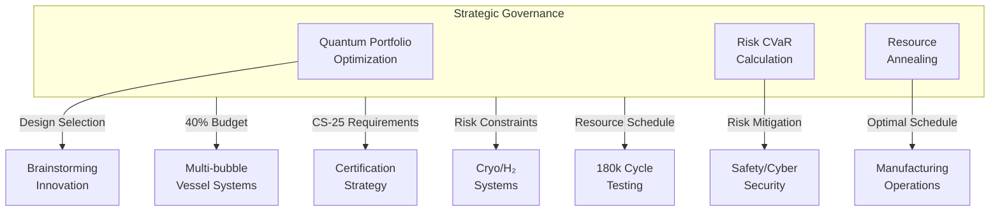

# BWB-Q100 Strategic Governance Artifacts

**UniversalStandard:** CAO-GovernanceArtifacts-BWB-Q100-QuantumAugmented-v1.0-C-AMEDEO-Framework-StrategicOperatingSystem-AmedeoPelliccia-ca-deoptimise-GovernanceDefinition

## Overview

This directory contains the core strategic governance artifacts for the BWB-Q100 (Blended Wing Body with Hydrogen propulsion) program, implementing quantum-augmented strategic operations within the CAO (Computer-Aided Organization) pillar.

## Strategic Artifacts

### [QAL-Policy-Pack.json](governance/QAL-Policy-Pack.json)
**Digital Governance Framework**
- Quantum computing governance policies
- Decision authority matrix for BWB-Q100
- Budget allocation policies (40% vessel / 35% aero / 25% cryo)
- Risk management policies with CVaR thresholds
- Compliance requirements framework

### [Strategic-Objectives.yaml](governance/Strategic-Objectives.yaml)  
**BWB-Q100 Strategic Goals**
- Mission: First H₂-powered BWB aircraft certification
- Technical objectives per domain (AAA, CQH, MMM, etc.)
- Gate milestones: 30k/120k/180k cycle validation
- Quantum enhancement KPIs
- Success metrics and compliance alignment

### [Budget-Vector.json](resources/Budget-Vector.json)
**Resource Allocation Framework**
- **€2.5B** total program budget over 10 years
- **40%** Multi-bubble pressure vessel systems
- **35%** BWB aerodynamics development
- **25%** Cryogenic H₂ systems
- **€50M** Quantum computing integration
- CVaR risk-adjusted budgeting

### [Risk-Register.json](compliance/Risk-Register.json)
**Quantum-Enhanced Risk Management**
- 13 major risks across technical, schedule, financial, safety categories
- CVaR α=0.95 risk assessment methodology
- Quantum optimization for risk mitigation
- Program CVaR: 0.09 (ACCEPTABLE vs 0.10 tolerance)
- Immutable DET evidence links

### [Compliance-Matrix.json](compliance/Compliance-Matrix.json)
**Regulatory Compliance Framework**
- **CS-25** Special Conditions for BWB and H₂ systems
- **DO-178C/DO-254** DAL-A software/hardware compliance
- **Environmental** ICAO CORSIA, EU ETS alignment
- **47 total requirements** with quantum-enhanced tracking
- Post-quantum cryptography for audit evidence

## Quantum Computing Integration

### Strategic Operating System Architecture
The CAO pillar serves as the quantum-augmented meta-layer governing all other pillars through:

### QAOA Portfolio Optimization
- **Multi-bubble vessel design selection** with >$2×10^{16}$ configuration space reduction
- **BWB aerodynamic optimization** for optimal L/D ratio and stability
- **Material selection optimization** for H₂ compatibility and fatigue resistance

### CVaR Risk Optimization  
- **Tail risk protection** against extreme events in strategic planning
- **α=0.95** confidence level for 95th percentile risk assessment
- **Continuous monitoring** with automated escalation triggers

### Quantum Annealing Resource Scheduling
- **180k cycle testing program** coordination across multiple facilities
- **Supply chain optimization** with >90% constraint satisfaction
- **Human resource allocation** for 750+ person development team

## Implementation Flow



## Key Performance Indicators

### Strategic Alignment
- **Schedule adherence**: >95% target vs quarterly gate reviews
- **Budget variance**: <5% target vs quarterly financial reviews  
- **Risk profile**: CVaR ≤ 0.10 target vs monthly risk assessments

### Quantum Enhancement Metrics
- **QAOA convergence**: <24h target vs 120h classical baseline
- **CVaR accuracy**: >99.5% target vs 95% Monte Carlo baseline
- **Resource optimization**: >90% constraint satisfaction vs 70% manual baseline

## Compliance and Audit

### DET Integration
All strategic decisions generate immutable evidence through:
- **Pattern**: `DET:CAO:BWB:<SNS>:<activity>:V<rev>`
- **Quantum signatures**: PQC-Dilithium3 for strategic decisions
- **Blockchain anchoring**: Tamper-proof audit trail
- **Quarterly audits**: Comprehensive compliance reviews

### Regulatory Milestones
- **2027 Q2**: Special Conditions application submitted
- **2029 Q4**: Certification plan approved  
- **2030 Q4**: Type Certificate obtained
- **2032 Q3**: Production rate 10 aircraft/month achieved

## Directory Structure

```
H2-BWB-Q100-CONF0000/
├── governance/
│   ├── QAL-Policy-Pack.json
│   └── Strategic-Objectives.yaml
├── resources/
│   └── Budget-Vector.json
├── compliance/
│   ├── Risk-Register.json
│   └── Compliance-Matrix.json
├── stakeholders/
├── knowledge/
└── security/
```

## Integration Points

### With QAL Ecosystem
- **AMPEL360**: Strategic optimization and risk management
- **AQUA-OS BRIDGE**: Governance policy enforcement
- **GAIA AIR RTOS**: Security and access control integration
- **CADET**: Circularity and sustainability assurance

### With CAX Pillars
- **[CAD]**: Design constraints and resource allocations
- **[CAE]**: Analysis standards and risk tolerances  
- **[CAT]**: Testing policies and quality gates
- **[CAV]**: Verification and validation requirements
- **[CAM]**: Manufacturing constraints and capabilities

---

**Metadata:**
- **Owner Domain**: CAO
- **SNS**: 96  
- **Criticality**: DAL-A
- **Effectivity**: All BWB-Q100 variants
- **Last Updated**: 2025-01-01T00:00:00Z

*Part of the C-AMEDEO Framework - Quantum-Augmented Strategic Operating System*