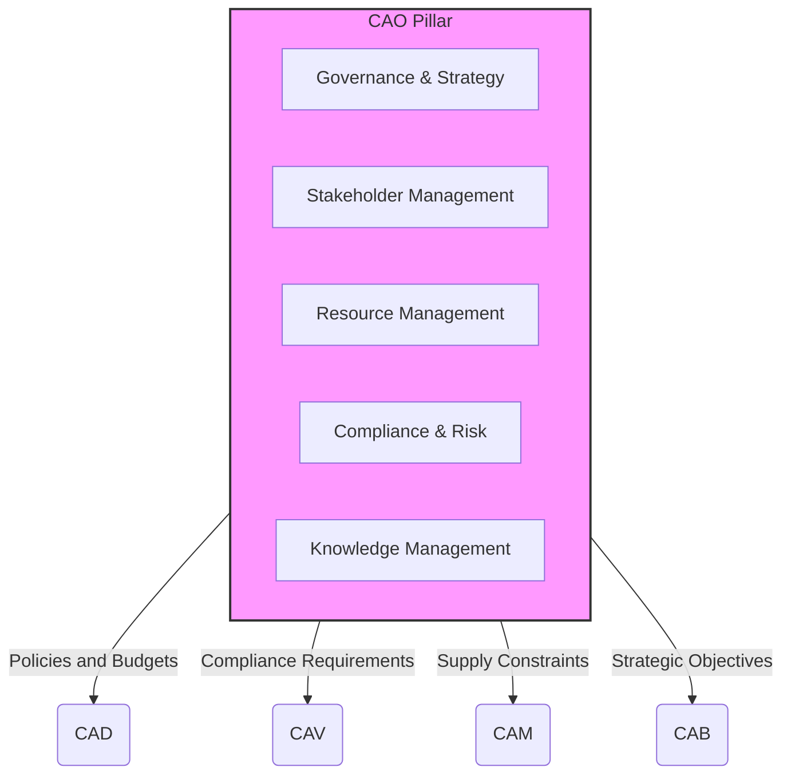

# CAO — Computer-Aided Organization

**UniversalStandard:** Component-PillarDefinition-QAL-CAO-OrganizationAssisted-v1.1-C-AMEDEO-Framework-CAO-Organization-AmedeoPelliccia-ca-deoptimise-OrganizationDefinition

## 1. Purpose and Mission

The **CAO (Computer-Aided Organization)** pillar serves as the **strategic operating system** of the QAL ecosystem. Its mission is to define, manage, and optimize the organizational structure, governance, resources, and compliance framework. CAO establishes the "rules of engagement" and provides the operational context within which all other pillars ([CAD], [CAE], [CAT], [CAV], [CAM], [CAP], [CAI], [CAS]) execute their functions, ensuring alignment with strategic objectives.



## 2. Key Modules and Functionalities

| Module | Primary Functionalities | Key Output Artifacts |
| :-- | :-- | :-- |
| **Governance and Strategy** | Mission/Vision definition; Strategic KPIs; Org charts; RACI matrices; Policy management | QAL-Policy-Pack.json; Strategic-Objectives.yaml |
| **Stakeholder Management** | Stakeholder registry; Communication plans; Feedback traceability | Stakeholder-Matrix.csv; Communication-Plan.md |
| **Resource Management** | Budget allocation; Capacity planning; Procurement policies | Budget-Vector.json; Resource-Capacity-Map.xml |
| **Compliance and Risk** | Regulatory compliance; Risk registry; Audit orchestration | Compliance-Matrix.xlsx; Risk-Register.json |
| **Knowledge Management** | Metadata standards; Documentation portal; Lessons learned | Metadata-Standard.schema.json; Lessons-Learned-DB |
| **Security and Access** | Identity management; Security policies; Access control | Access-Control-Policy.xml |

## 3. QAL Lifecycle Integration

CAO is not a sequential phase, but rather a **continuous process** that supervises and governs the entire lifecycle.

### Primary Inputs:
- Business and investor goals
- Market regulations and industry standards
- Resource capacity (human, financial, technological)
- Performance and risk data from other pillars

### Primary Outputs (Governing Artifacts):
- **QAL-Policy Pack:** Digital policy set that other pillars must consume and apply
- **Risk Register:** Master risk register that informs design decisions ([CAD]) and V&V ([CAV])
- **Budget Vector:** Resource allocation that constrains options in phases like [CAM] and [CAP]
- **DET Entries:** CAO generates immutable evidence for strategic decisions, budget approvals, and policy changes

### Success Metrics (KPIs):
- **Strategic Alignment:** % of projects aligned with strategic objectives
- **Resource Efficiency:** Capacity utilization, budget variance
- **Compliance Health:** Number of non-conformances in audits
- **Risk Management:** Value at Risk (VaR / CVaR) of project portfolio

## 4. Quantum Enhancements for CAO

CAO leverages quantum computing for complex strategic-level optimization, particularly demonstrated in the **BWB-Q100** program:

### Portfolio Optimization (QAOA/QUBO):
- **Multi-bubble vessel design selection**: Reduce >$2×10^{16}$ configuration space to ~10,000 factible alternatives
- **BWB aerodynamic optimization**: Optimal wing planform and control surface placement for L/D >25
- **Material selection optimization**: H₂-compatible materials for 180k cycle fatigue life at cryogenic temperatures
- **Budget allocation optimization**: €2.5B program budget with 40%/35%/25% allocation strategy

### Risk Optimization (CVaR):
- **Tail risk protection**: CVaR α=0.95 assessment protecting against extreme events in H₂ and BWB certification
- **Multi-category risk management**: Technical (≤0.10), Schedule (≤0.05), Financial (≤0.08), Safety (≤0.01) CVaR thresholds
- **Continuous monitoring**: Real-time risk dashboard with automated escalation triggers
- **Quantum Monte Carlo**: >99.5% accuracy vs 95% classical Monte Carlo baseline

### Resource Scheduling and Allocation (Quantum Annealing):
- **180k cycle testing coordination**: Optimal scheduling across multiple test facilities and equipment
- **Supply chain optimization**: >90% constraint satisfaction vs 70% manual scheduling
- **Human resource allocation**: 750+ person development team across 15 domains and 7 CAX pillars
- **Quantum resource management**: Optimal allocation of IBM Quantum, D-Wave, and simulator access

## 5. DET Integration Pattern

CAO activities generate evidence through standardized DET patterns:

```json
{
  "det_id": "DET:CAO:<DOMAIN>:<SNS>:<activity>:V<rev>",
  "phase": "CAO",
  "artifact_type": "Strategy|Policy|Budget|Risk|Compliance",
  "inputs": ["sha256:<previous-version>", "sha256:<stakeholder-inputs>"],
  "outputs": ["sha256:<policy-pack>", "sha256:<budget-vector>"],
  "refs": {
    "ce": "CE-CAO-<DOMAIN>-<SNS>-<descriptor>",
    "ci": "CI-CAO-<DOMAIN>-<SNS>-<descriptor>"
  },
  "risk": {
    "cvar_alpha": 0.95,
    "cvar_value": "<calculated-risk>",
    "hazards": ["organizational", "financial", "compliance"]
  },
  "quantum": {
    "algo": "QAOA",
    "backend": "simulator",
    "params": {"p": 3, "optimization_target": "portfolio_roi"}
  }
}
```

## 6. Compliance Framework

CAO ensures organizational compliance across multiple dimensions:

### Regulatory Standards:
- **EASA CS-25:** Airworthiness requirements
- **DO-178C:** Software development assurance
- **DO-254:** Hardware development assurance
- **DO-326A/ED-202A:** Cybersecurity requirements
- **ISO 9001:** Quality management systems
- **ISO 14001:** Environmental management

### Industry Standards:
- **ATA iSpec 2200:** Subject numbering system
- **S1000D:** Technical documentation
- **CSRD:** Corporate sustainability reporting
- **GRI:** Global reporting initiative

## 7. Artifact Structure

```
CAO-ORGANIZATION/
├── README.md (this file)
├── H2-BWB-Q100-CONF0000/           # BWB-Q100 Program Implementation
│   ├── README.md                   # Program overview and integration
│   ├── governance/
│   │   ├── QAL-Policy-Pack.json   # Digital governance with quantum policies
│   │   └── Strategic-Objectives.yaml # BWB-Q100 strategic goals & KPIs
│   ├── resources/
│   │   └── Budget-Vector.json     # €2.5B budget with quantum allocation
│   ├── compliance/
│   │   ├── Risk-Register.json     # CVaR-optimized risk management
│   │   └── Compliance-Matrix.json # CS-25, DO-178C, environmental compliance
│   ├── stakeholders/              # BWB-Q100 stakeholder management
│   ├── knowledge/                 # Quantum-enhanced knowledge management
│   └── security/                  # Post-quantum cryptography policies
├── governance/                     # General CAO governance templates
│   ├── QAL-Policy-Pack.json
│   ├── Strategic-Objectives.yaml
│   └── RACI-Matrix.xlsx
├── stakeholders/
│   ├── Stakeholder-Matrix.csv
│   ├── Communication-Plan.md
│   └── engagement-logs/
├── resources/
│   ├── Budget-Vector.json
│   ├── Resource-Capacity-Map.xml
│   └── procurement-policies/
├── compliance/
│   ├── Compliance-Matrix.xlsx
│   ├── Risk-Register.json
│   └── audit-reports/
├── knowledge/
│   ├── Metadata-Standard.schema.json
│   ├── Lessons-Learned-DB/
│   └── documentation-portal/
└── security/
    ├── Access-Control-Policy.xml
    └── identity-management/
```

## 8. Integration Points

### With Other Pillars:
- **[CAD]:** Provides design constraints and resource allocations
- **[CAE]:** Defines analysis standards and risk tolerances
- **[CAT]:** Establishes testing policies and quality gates
- **[CAV]:** Sets verification and validation requirements
- **[CAM]:** Defines manufacturing constraints and capabilities
- **[CAP]:** Provides production planning parameters
- **[CAI]:** Establishes integration governance
- **[CAS]:** Sets sustainment and support policies

### With Core Systems:
- **AMPEL360:** Strategic optimization and risk management
- **AQUA-OS BRIDGE:** Governance policy enforcement
- **GAIA AIR RTOS:** Security and access control integration
- **CADET:** Circularity and sustainability assurance
- **TRACES:** Cross-domain traceability management

---

**Final Note:** CAO ensures the organization not only "does projects right" (efficiency), but also "does the right projects" (effectiveness). The BWB-Q100 program exemplifies this through quantum-augmented strategic decision making, where QAOA portfolio optimization, CVaR risk management, and quantum annealing resource scheduling provide the structure and discipline necessary for breakthrough innovation in sustainable aviation. The framework integrates seamlessly with the QAL ecosystem, providing immutable DET evidence chains and post-quantum cryptographic security for all strategic decisions.

---

*Part of the C-AMEDEO Framework - Forward Creation Flow (CA-DEOPTIMISE)*
