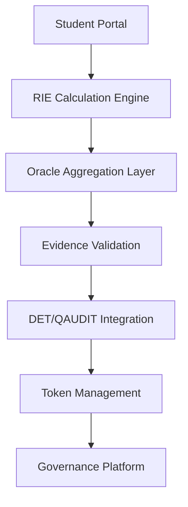

# MBA High Tech & Strategic Developments - Deployment Roadmap

**EstándarUniversal:** DeploymentRoadmap-PlanImplementacion-EU-Ready-24.00-PlanDespliegue-0001-v1.0-Aerospace And Quantum United Advanced Venture-GeneracionHybrida-CROSS-Amedeo Pelliccia-roadmap01-RestoDeVidaUtil

## Executive Summary

This deployment roadmap outlines the 24-month implementation plan for the MBA High Tech & Strategic Developments framework, including the European Impact Ranking (RIE) system, dual-layer Teknia token economy, and tri-chamber governance model. The plan balances rapid value delivery with risk mitigation and regulatory compliance.

## Phase Overview

### Phase 0: Foundation & Pilot (Months 0-3)
**Theme**: "Proof of Concept & Regulatory Foundations"

**Objectives:**
- Establish legal and compliance framework
- Develop core technical infrastructure  
- Launch internal pilot with limited cohort
- Validate basic RIE calculation methodology

**Key Deliverables:**
- [ ] Legal opinion on MiCA/GDPR compliance
- [ ] Core RIE calculation engine (v0.1)
- [ ] Basic Teknia token specifications
- [ ] Internal pilot with 10 students
- [ ] Initial governance council formation

**Success Criteria:**
- Legal compliance framework approved
- RIE pilot shows consistent scoring
- Token mechanics validated internally
- Governance councils operational

**Risks & Mitigations:**
- **Regulatory uncertainty**: Conservative token design + legal sandbox participation
- **Technical complexity**: MVP approach with manual fallbacks
- **Stakeholder alignment**: Regular communication + clear expectations

### Phase 1: Limited Deployment (Months 4-9)
**Theme**: "Real-World Validation & EU Integration"

**Objectives:**
- Deploy RIE system to first full cohort (30-40 students)
- Integrate with 3-5 EU project calls
- Establish industry partnerships
- Launch Teknia-M (merit) tokens

**Key Deliverables:**
- [ ] Production RIE system with oracle integration
- [ ] 6-8 EU proposals submitted through program
- [ ] 5-10 industry partnership agreements
- [ ] Teknia-M tokens minted based on real RIE scores
- [ ] Public RIE dashboard launched

**Success Criteria:**
- **EU Success Rate**: >12% (meeting average)
- **Industry Engagement**: >70% students with signed LOIs
- **RIE Reliability**: <5% disputes, >95% oracle accuracy
- **Token Adoption**: >80% student participation

**Risks & Mitigations:**
- **Low EU success rate**: Diversify call portfolio + strengthen consortium building
- **Oracle reliability issues**: Multiple fallback mechanisms + human review processes
- **Industry partnership delays**: Start relationship building in Phase 0

### Phase 2: Scale & Optimize (Months 10-15)
**Theme**: "Scaling Excellence & Standards Integration"

**Objectives:**
- Scale to 60-80 students across 2 cohorts
- Launch Teknia-C (credit) token economy
- Integrate with 2-3 technical standards bodies
- Establish self-sustaining funding model

**Key Deliverables:**
- [ ] Teknia-C credit system operational
- [ ] Scholarship pool funded by project overheads
- [ ] Standards contributions to EASA/ETSI/ISO
- [ ] Automated evidence validation pipeline
- [ ] External audit and compliance review

**Success Criteria:**
- **EU Success Rate**: >15% (above average)
- **Self-Funding**: 40% costs covered by overheads
- **Standards Impact**: 3+ accepted contributions
- **Credit Utilization**: >60% allocated credits used

**Risks & Mitigations:**
- **Scaling challenges**: Gradual expansion + robust infrastructure
- **Funding shortfalls**: Diverse revenue streams + contingency planning
- **Standards adoption slow**: Focus on high-impact, achievable contributions

### Phase 3: Maturity & Expansion (Months 16-24)
**Theme**: "Sustainable Operations & Knowledge Transfer"

**Objectives:**
- Achieve fully sustainable operations
- Document and transfer methodology
- Explore replication to other institutions
- Establish long-term governance model

**Key Deliverables:**
- [ ] Fully self-sustaining financial model
- [ ] Comprehensive methodology documentation
- [ ] Replication toolkit for other institutions
- [ ] Long-term governance transition plan
- [ ] Impact assessment and future roadmap

**Success Criteria:**
- **Financial Sustainability**: 100% self-funding
- **EU Success Rate**: Sustained >15%
- **Graduate Placement**: >90% in deep tech roles
- **Institutional Interest**: 3+ institutions expressing interest

**Risks & Mitigations:**
- **Market changes**: Flexible program structure + continuous adaptation
- **Governance stability**: Clear succession planning + institutional backing
- **Competition**: Focus on unique value proposition + continuous innovation

## Detailed Implementation Plans

### Technical Infrastructure Development

**Core Systems Architecture:**

**Development Priorities:**
1. **Month 0-1**: RIE calculation engine and basic student portal
2. **Month 2-3**: Oracle integration framework and evidence validation
3. **Month 4-5**: Teknia-M token minting and management
4. **Month 6-7**: Advanced analytics and reporting dashboard
5. **Month 8-9**: Teknia-C credit system and redemption platform
6. **Month 10-12**: Full automation and scaling optimizations

### Partnership Development Strategy

**EU Institutional Partnerships:**
- **European Commission**: DG Research & Innovation liaison
- **European Innovation Council**: EIC Pathfinder and Accelerator alignment
- **European Space Agency**: Space technology collaboration
- **Clean Aviation JU**: Sustainable aviation projects

**Industry Partnership Timeline:**
- **Month 0-3**: Target identification and initial outreach
- **Month 4-6**: LOI negotiation and framework agreements  
- **Month 7-9**: Pilot project launches and mentor assignments
- **Month 10-12**: Expand to full partnership ecosystem
- **Month 13+**: Mature relationships with outcome tracking

**Academic Network Building:**
- **Technical Universities**: STEM talent pipeline
- **Business Schools**: Management skill integration
- **Research Institutes**: Deep tech project collaboration
- **Innovation Hubs**: Entrepreneurship and venture development

### Governance Evolution

**Phase 0-1**: **Bootstrap Governance**
- Interim councils with founding members
- Basic decision-making processes
- Manual coordination and communication

**Phase 2**: **Operational Governance**
- Full tri-chamber structure operational
- Formal voting and decision procedures
- Regular council meetings and reporting

**Phase 3**: **Mature Governance**
- Self-sustaining governance processes
- Clear succession and renewal mechanisms
- Integration with broader institutional governance

### Risk Management Framework

**Technical Risks:**
- **Oracle Failures**: Multi-oracle redundancy + manual fallbacks
- **Scalability Issues**: Cloud-native architecture + load testing
- **Security Vulnerabilities**: Regular audits + penetration testing

**Regulatory Risks:**
- **MiCA Changes**: Conservative design + legal monitoring + pivot capability
- **GDPR Compliance**: Privacy-by-design + regular assessments
- **Educational Regulations**: Stakeholder engagement + compliance tracking

**Operational Risks:**
- **Faculty Resistance**: Change management + incentive alignment
- **Student Adoption**: User experience focus + clear value proposition
- **Industry Skepticism**: Pilot successes + transparent metrics

**Financial Risks:**
- **Funding Delays**: Diversified sources + contingency reserves
- **Cost Overruns**: Careful budgeting + regular monitoring
- **Revenue Shortfalls**: Conservative projections + flexible scaling

## Success Metrics and KPIs

### Primary Success Indicators

**Academic Excellence:**
- **RIE Score Distribution**: Target 75th percentile >800 points
- **EU Proposal Quality**: Average evaluation scores >threshold for funding
- **Academic Publications**: Student-authored papers in quality venues
- **Standards Contributions**: Accepted contributions to major standards

**EU Integration Success:**
- **Funding Success Rate**: Target >15% (vs ~12% average)
- **Consortium Participation**: Students active in 20+ EU projects
- **Policy Impact**: Contributions cited in EU policy documents
- **Network Effects**: Alumni active in EU research ecosystem

**Industry Relevance:**
- **Placement Rate**: >90% employed in deep tech within 6 months
- **Industry Partnerships**: 20+ active industry mentors and partners
- **Venture Creation**: 5+ student-founded ventures with external funding
- **Technology Transfer**: Patents and licenses from student work

**Sustainability Metrics:**
- **Financial Self-Sufficiency**: 100% costs covered by earned revenue
- **Stakeholder Satisfaction**: >80% satisfaction across all stakeholder groups
- **Continuous Improvement**: Year-over-year improvement in key metrics
- **Knowledge Transfer**: Successful replication at other institutions

### Monitoring and Evaluation

**Real-Time Dashboards:**
- Student progress and RIE score tracking
- EU proposal pipeline and success rates  
- Industry engagement and partnership health
- Financial performance and sustainability metrics

**Regular Reporting:**
- **Monthly**: Operational metrics and progress updates
- **Quarterly**: Comprehensive performance review and governance reporting
- **Annually**: Full impact assessment and strategic review

**External Validation:**
- **Independent Audits**: Annual external validation of claims and metrics
- **Peer Review**: Academic peer evaluation of methodology and outcomes
- **Industry Assessment**: Regular industry advisory board evaluation
- **Student Feedback**: Continuous feedback collection and analysis

## Change Management Strategy

### Stakeholder Communication
- **Regular Updates**: Monthly newsletters and quarterly reports
- **Transparent Metrics**: Public dashboard with key performance indicators
- **Success Stories**: Regular highlighting of student and program achievements
- **Challenge Discussion**: Open communication about obstacles and solutions

### Adaptation Mechanisms
- **Quarterly Reviews**: Regular assessment and course correction opportunities
- **Stakeholder Feedback**: Formal mechanisms for collecting and incorporating feedback
- **Pilot Programs**: Small-scale testing of new ideas before full implementation
- **Version Control**: Systematic approach to program evolution and improvement

### Lessons Learned Integration
- **Retrospectives**: Regular team retrospectives to capture lessons learned
- **Best Practices**: Documentation and sharing of effective approaches
- **Failure Analysis**: Systematic analysis of setbacks and failures for improvement
- **Knowledge Management**: Comprehensive knowledge base for future reference

## Conclusion

This deployment roadmap provides a structured, risk-aware approach to implementing the MBA High Tech & Strategic Developments framework. The phased approach allows for learning and adaptation while maintaining momentum toward the goal of creating a truly innovative, impactful, and sustainable educational program that bridges STEM excellence with business acumen and European policy relevance.

The success of this implementation will depend on strong stakeholder commitment, careful attention to regulatory compliance, and a relentless focus on delivering real value to students, industry, and the broader European innovation ecosystem.

---

**Next Steps:**
1. Secure legal opinions on token framework
2. Establish initial governance councils
3. Begin technical infrastructure development
4. Initiate stakeholder partnership discussions
5. Launch Phase 0 pilot planning

---

© 2025 AerospaceAndQuantumUnitedAdvancedVenture. Deployment under CAB-BRAINSTORMING pillar.