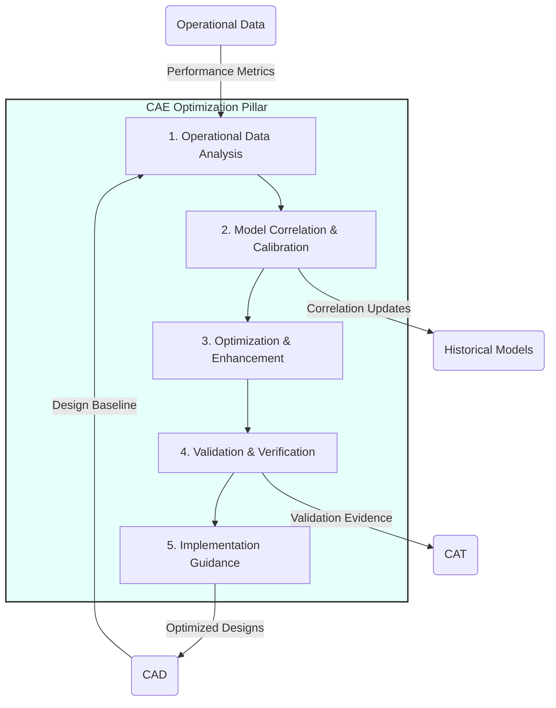
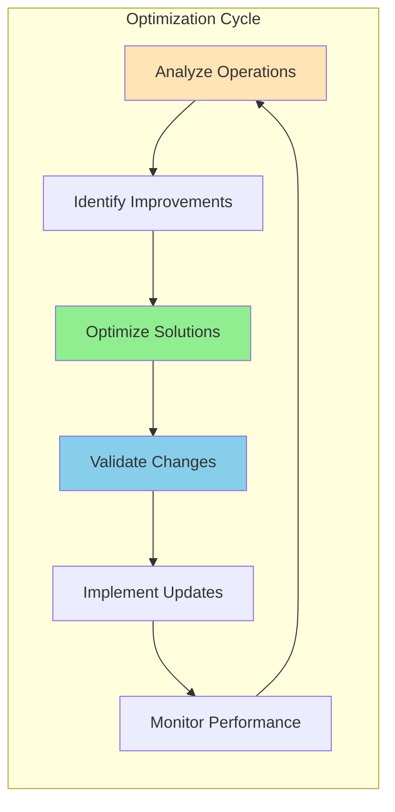

# CAE — Computer-Aided Engineering (Restoration & Evolution)

**UniversalStandard:** Component-PillarDefinition-QAL-CAE-EngineeringOptimized-v1.1-C-AMEDEO-Framework-CAE-Engineering-AmedeoPelliccia-ca-optimised-EngineeringOptimization

## 1. Purpose and Mission (Optimization Context)

The **CAE (Computer-Aided Engineering)** pillar in the restoration and evolution context serves as the **adaptive analysis and optimization engine** for existing systems and continuous improvement. Its mission is to analyze operational data, identify optimization opportunities, and validate enhancement proposals through advanced simulation techniques. CAE provides the analytical foundation for system evolution, performance improvement, and life extension decisions.



## 2. Optimization Modules and Capabilities

| Module | Optimization Functionalities | Evolution Artifacts |
| :-- | :-- | :-- |
| **Operational Data Integration** | Real-world performance analysis; Degradation pattern identification; Usage profile optimization; Anomaly detection | Performance-Trend-Analysis.json; Degradation-Models.yaml; Usage-Optimization.csv |
| **Adaptive Model Correlation** | Continuous model updating; Real-time calibration; Uncertainty reduction; Predictive accuracy improvement | Adaptive-Models.fem; Real-Time-Correlation.json; Uncertainty-Bounds.yaml |
| **Multi-Objective Optimization** | Performance vs efficiency trade-offs; Cost-benefit optimization; Sustainability improvements; Risk minimization | Pareto-Fronts.csv; Trade-Off-Analysis.json; Optimization-Results.yaml |
| **Digital Twin Evolution** | Physics-informed learning; Predictive maintenance; Performance forecasting; System health monitoring | Digital-Twin-v2.model; Health-Monitoring.json; Predictive-Maintenance.yaml |
| **Quantum-Enhanced Optimization** | Quantum optimization algorithms; Enhanced material simulation; Complex system optimization; Hybrid classical-quantum workflows | Quantum-Optimization.qasm; VQE-Results.json; Hybrid-Workflow.yaml |

## 3. QAL Lifecycle Integration

CAE optimization operates within the canonical QAL flow (`CAB → CAD → CAE → CAT → CAV → CAM → CAP → CAS → CAEpost`) while focusing on continuous improvement and adaptive performance enhancement for existing systems.

### Primary Inputs:
- Operational performance data and sensor readings
- Historical analysis results and lessons learned
- Enhancement requirements and improvement targets
- Environmental and usage condition changes

### Primary Outputs (Optimization Artifacts):
- **Optimized Configurations:** Enhanced system parameters and design modifications
- **Performance Predictions:** Forecasted improvements and validation evidence
- **Evolution Roadmaps:** Phased improvement plans with risk assessments
- **Adaptive Models:** Self-updating simulation models based on operational feedback

### Optimization Metrics (KPIs):
- **Performance Improvement:** Quantified enhancement over baseline (`>10%` target)
- **Model Accuracy Evolution:** Predictive accuracy improvement over time
- **Optimization Convergence:** Time to reach optimal solutions
- **Implementation Success Rate:** % of optimized designs successfully implemented

## 4. Quantum-Enhanced Optimization

CAE leverages quantum computing for advanced optimization and evolutionary analysis:

### Adaptive Materials Optimization (VQE):
- Real-time material property adjustment based on operational conditions
- Quantum simulation of degradation mechanisms and mitigation strategies
- Optimization of material replacement strategies for enhanced performance

### Multi-Variable Optimization (QAOA):
- Simultaneous optimization of multiple system parameters
- Trade-off optimization between competing objectives
- Resource allocation optimization for maximum performance impact

### Predictive Evolution (Quantum ML):
- Learning-based prediction of optimal evolutionary paths
- Quantum-enhanced pattern recognition in operational data
- Automated optimization recommendation systems

### Complex System Optimization (Quantum Annealing):
- Large-scale system configuration optimization
- Integration optimization across multiple subsystems
- Network optimization for distributed system performance

## 5. DET Evolution Pattern

CAE optimization activities generate evolutionary evidence:

```json
{
  "det_id": "DET:CAE:OPT:<DOMAIN>:<SNS>:<optimization>:V<rev>",
  "phase": "CAE-OPTIMIZATION",
  "artifact_type": "Optimization|Enhancement|Evolution|Validation",
  "inputs": ["sha256:<operational-data>", "sha256:<baseline-models>"],
  "outputs": ["sha256:<optimized-config>", "sha256:<performance-prediction>"],
  "refs": {
    "ce": "CE-CAE-OPT-<DOMAIN>-<SNS>-<descriptor>",
    "ci": "CI-CAE-OPT-<DOMAIN>-<SNS>-<descriptor>"
  },
  "optimization": {
    "algorithm": "<optimization-method>",
    "objectives": ["performance", "efficiency", "cost", "sustainability"],
    "constraints": ["safety", "regulatory", "operational"],
    "improvement": "<quantified-enhancement>"
  },
  "evolution": {
    "baseline_performance": "<historical-metrics>",
    "optimized_performance": "<predicted-metrics>",
    "implementation_risk": "<risk-assessment>",
    "validation_status": "<verification-results>"
  }
}
```

## 6. Circular Optimization Framework

### Performance Enhancement Cycles



### Continuous Learning Integration

```yaml
Learning_Framework:
  Data_Collection:
    Sources: ["sensors", "maintenance_logs", "performance_metrics"]
    Frequency: "real-time, daily, weekly"
    Quality_Gates: ["validation", "completeness", "accuracy"]

  Model_Evolution:
    Update_Triggers: ["performance_drift", "new_data", "operational_changes"]
    Validation_Criteria: ["accuracy_improvement", "robustness", "stability"]
    Rollback_Strategy: ["performance_degradation", "validation_failure"]

  Optimization_Cycles:
    Frequency: "quarterly_major, monthly_minor"
    Scope: ["component", "subsystem", "system", "fleet"]
    Success_Metrics: ["performance_gain", "efficiency_improvement", "cost_reduction"]
```

## 7. Optimization Artifact Structure

```
CAE-ENGINEERING/
├── README.md                           # This file
├── optimization-framework/
│   ├── algorithms/                     # Optimization algorithms
│   ├── objectives/                     # Multi-objective definitions
│   └── constraints/                    # Optimization constraints
├── adaptive-models/
│   ├── calibration/                    # Model calibration data
│   ├── correlation/                    # Correlation updates
│   └── validation/                     # Validation results
├── performance-analysis/
│   ├── trends/                         # Performance trend analysis
│   ├── degradation/                    # Degradation modeling
│   └── predictions/                    # Performance predictions
├── quantum-optimization/
│   ├── algorithms/                     # Quantum optimization algorithms
│   ├── results/                        # Quantum computation results
│   └── validation/                     # Quantum vs classical validation
└── implementation-guidance/
    ├── roadmaps/                       # Implementation roadmaps
    ├── risk-assessments/               # Risk analysis
    └── success-metrics/                # Success measurement criteria
```

## 8. Integration with Forward Flow

### Enhancement Request Generation

```yaml
Enhancement_Pipeline:
  Performance_Gap_Analysis:
    Current_State: "baseline_performance_metrics"
    Target_State: "optimization_objectives"
    Gap_Identification: "performance_shortfalls"

  Optimization_Proposals:
    Technical_Solutions: "engineering_modifications"
    Implementation_Plans: "phased_deployment_strategy"
    Resource_Requirements: "personnel_equipment_budget"

  Validation_Strategy:
    Simulation_Validation: "CAE_optimization_models"
    Test_Validation: "CAT_verification_plan"
    Field_Validation: "operational_pilot_programs"

  Integration_Handoff:
    To_CAD: "design_modification_requests"
    To_CAM: "manufacturing_optimization_requirements"
    To_CAI: "integration_enhancement_specifications"
```

### Continuous Improvement Loop

```python
# Optimization Feedback Loop
class CAEOptimizationEngine:
    def __init__(self):
        self.performance_data = []
        self.optimization_history = []
        self.quantum_backend = None

    def analyze_performance(self, operational_data):
        """Analyze current system performance"""
        trends = self.extract_trends(operational_data)
        degradation = self.model_degradation(operational_data)
        opportunities = self.identify_optimization_opportunities(trends, degradation)
        return opportunities

    def optimize_configuration(self, objectives, constraints):
        """Multi-objective optimization with quantum enhancement"""
        if self.quantum_backend:
            # Quantum optimization for complex parameter spaces
            quantum_result = self.quantum_optimize(objectives, constraints)
            classical_result = self.classical_optimize(objectives, constraints)
            return self.hybrid_solution(quantum_result, classical_result)
        else:
            return self.classical_optimize(objectives, constraints)

    def validate_optimization(self, optimized_config):
        """Validate optimization through simulation and prediction"""
        simulation_results = self.run_optimization_simulation(optimized_config)
        performance_prediction = self.predict_performance(optimized_config)
        risk_assessment = self.assess_implementation_risk(optimized_config)
        return {
            'simulation': simulation_results,
            'prediction': performance_prediction,
            'risk': risk_assessment
        }
```

## 9. CADET Integration (Circularity Assurance)

### Optimization Evidence Tracking

```yaml
CADET_Optimization_Integration:
  Evidence_Generation:
    Optimization_Proposals: "DET:CAE:OPT:proposal:V<rev>"
    Validation_Results: "DET:CAE:OPT:validation:V<rev>"
    Implementation_Outcomes: "DET:CAE:OPT:outcome:V<rev>"

  Traceability_Links:
    Performance_Baselines: "link_to_historical_DET"
    Optimization_Rationale: "link_to_analysis_DET"
    Implementation_Evidence: "link_to_CAM_CAI_DET"

  Circularity_Metrics:
    Resource_Efficiency: "optimized_vs_baseline_resource_usage"
    Performance_Enhancement: "quantified_performance_improvements"
    Sustainability_Impact: "environmental_and_social_benefits"

  Continuous_Validation:
    Performance_Monitoring: "ongoing_performance_tracking"
    Optimization_Effectiveness: "actual_vs_predicted_improvements"
    Feedback_Integration: "lessons_learned_incorporation"
```

### Learning and Knowledge Propagation

```json
{
  "knowledge_evolution": {
    "optimization_patterns": {
      "successful_strategies": "documented_best_practices",
      "failure_modes": "identified_anti_patterns",
      "adaptation_rules": "context_specific_guidelines"
    },
    "model_improvements": {
      "accuracy_enhancements": "calibration_refinements",
      "capability_extensions": "new_physics_integration",
      "validation_updates": "correlation_improvements"
    },
    "quantum_evolution": {
      "algorithm_advancement": "quantum_algorithm_improvements",
      "hardware_capabilities": "quantum_backend_evolution",
      "hybrid_optimization": "classical_quantum_integration"
    }
  }
}
```

---

**Optimization Note:** The CAE optimization pillar transforms traditional analysis into a **continuous evolution engine**. By integrating operational feedback, leveraging quantum-enhanced optimization, and maintaining adaptive models, CAE enables systems to continuously improve performance, efficiency, and sustainability throughout their operational lifecycle.