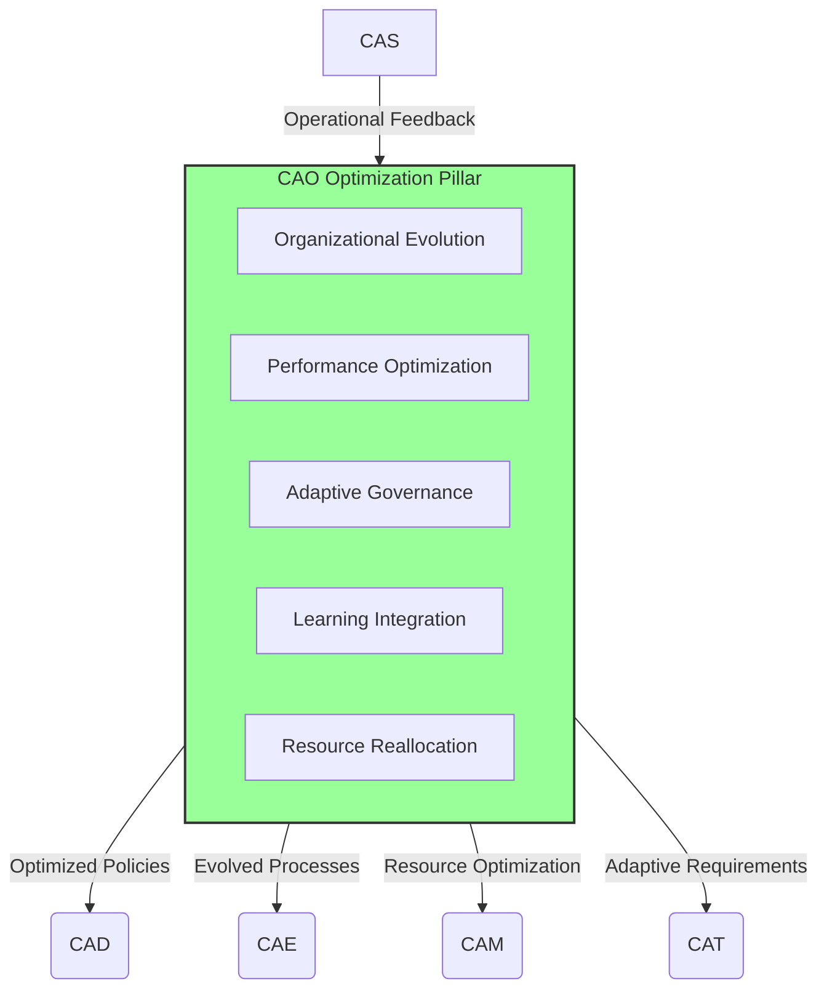
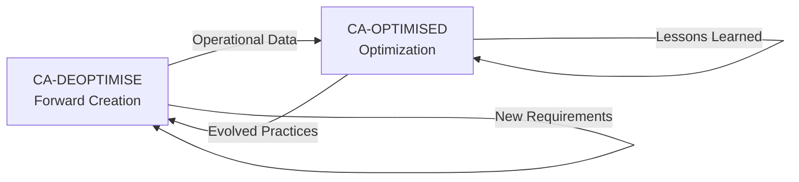

# CAO — Computer-Aided Organization (Restoration & Evolution)

**UniversalStandard:** Component-PillarDefinition-QAL-CAO-OrganizationOptimized-v1.1-C-AMEDEO-Framework-CAO-Organization-AmedeoPelliccia-ca-optimised-OrganizationOptimization

## 1. Purpose and Mission (Optimization Context)

The **CAO (Computer-Aided Organization)** pillar in the **CA-OPTIMISED** flow serves as the **adaptive strategic engine** for organizational evolution. Its mission is to continuously optimize organizational structure, governance, resources, and compliance framework based on operational feedback and lessons learned. CAO in this context focuses on restoration, evolution, and adaptive optimization of organizational capabilities.



## 2. Optimization Modules and Capabilities

| Module | Optimization Functionalities | Evolution Artifacts |
| :-- | :-- | :-- |
| **Organizational Evolution** | Adaptive structure optimization; Role evolution; Gap analysis; Team optimization | Org-Evolution-Plan.yaml; Capability-Gap-Analysis.json |
| **Performance Optimization** | KPI analysis; Resource optimization; Process improvements; Bottleneck resolution | Performance-Dashboard.json; Optimization-Metrics.csv |
| **Adaptive Governance** | Policy assessment; Framework evolution; Decision optimization; Feedback integration | Governance-Evolution.yaml; Policy-Effectiveness.json |
| **Learning Integration** | Lessons integration; Best practice propagation; Knowledge capture; Improvement cycles | Learning-Repository.db; Best-Practices-Registry.yaml |
| **Resource Reallocation** | Dynamic reallocation; Capacity optimization; Portfolio rebalancing; Resource sharing | Resource-Optimization.json; Investment-Rebalance.yaml |
| **Compliance Evolution** | Compliance optimization; Risk mitigation evolution; Audit integration; Automation | Compliance-Evolution.json; Risk-Mitigation-Updates.yaml |

## 3. QAL Lifecycle Integration

CAO in the CA-OPTIMISED flow operates within the canonical QAL sequence (`CAB → CAD → CAE → CAT → CAV → CAM → CAP → CAS → CAEpost`) as a **continuous improvement engine** that learns from operational experience and evolves organizational capabilities across all phases.

### Primary Inputs (From Operations):
- Operational performance data from [CAS]
- Lessons learned from all lifecycle phases
- Stakeholder feedback and adaptation requirements
- Compliance audit findings and recommendations
- Resource utilization and efficiency metrics

### Evolution Outputs:
- **Evolved Policy Pack:** Updated policies based on operational learning
- **Optimized Resource Allocation:** Dynamic resource reallocation based on performance
- **Adaptive Governance Framework:** Evolved governance based on effectiveness metrics
- **Enhanced DET Patterns:** Refined evidence collection based on operational insights (`DET:CAO:Evolution:Optimization:V*`)

### Optimization Metrics (KPIs):
- **Adaptation Velocity:** Time to implement organizational improvements
- **Learning Efficiency:** Rate of lesson integration into policies
- **Resource Optimization:** Improvement in resource utilization efficiency
- **Governance Effectiveness:** Reduction in decision-making bottlenecks
- **Compliance Automation:** Percentage of automated compliance processes

## 4. Quantum-Enhanced Optimization

CAO leverages quantum computing for advanced organizational optimization:

### Adaptive Portfolio Optimization (QAOA/VQE):
- Dynamically rebalance project portfolios based on changing strategic priorities and operational feedback
- Optimize resource allocation across evolving organizational needs

### Multi-Objective Optimization (Quantum ML):
- Simultaneously optimize multiple organizational objectives (efficiency, innovation, compliance, sustainability)
- Learn optimal trade-offs from historical performance data

### Organizational Network Optimization:
- Optimize communication networks and collaboration patterns
- Identify and strengthen weak links in organizational connectivity

### Predictive Resource Planning (Quantum Annealing):
- Anticipate future resource needs based on operational trends
- Optimize long-term capacity planning with uncertainty quantification

## 5. DET Evolution Pattern

CAO optimization activities generate evolutionary evidence:

```json
{
  "det_id": "DET:CAO:<DOMAIN>:<SNS>:optimization:V<rev>",
  "phase": "CAO",
  "artifact_type": "Optimization|Evolution|Learning|Adaptation",
  "inputs": [
    "sha256:<operational-data>",
    "sha256:<lessons-learned>",
    "sha256:<performance-metrics>"
  ],
  "outputs": [
    "sha256:<evolved-policies>",
    "sha256:<optimized-resources>",
    "sha256:<adaptive-governance>"
  ],
  "refs": {
    "ce": "CE-CAO-OPT-<DOMAIN>-<SNS>-<descriptor>",
    "ci": "CI-CAO-OPT-<DOMAIN>-<SNS>-<descriptor>"
  },
  "evolution": {
    "baseline_version": "V<prev>",
    "improvement_metrics": {
      "efficiency_gain": 0.15,
      "adaptation_speed": "2.3x",
      "learning_integration": 0.87
    },
    "optimization_target": "multi_objective"
  },
  "quantum": {
    "algo": "VQE",
    "backend": "simulator",
    "params": {"layers": 4, "optimization": "multi_objective"}
  }
}
```

## 6. Circular Optimization Framework

CAO in CA-OPTIMISED emphasizes circular improvement and sustainability:

### Sustainability Optimization:
- **Circular Resource Management:** Optimize resource reuse and lifecycle extension
- **Waste Reduction:** Minimize organizational waste through process optimization
- **Environmental Impact:** Reduce carbon footprint through operational efficiency

### Knowledge Circularity:
- **Lesson Propagation:** Ensure lessons learned circulate across all domains
- **Best Practice Evolution:** Continuously evolve best practices based on outcomes
- **Institutional Memory:** Preserve and evolve organizational knowledge

### Process Circularity:
- **Continuous Improvement Loops:** Implement closed-loop optimization cycles
- **Feedback Integration:** Systematically integrate operational feedback
- **Adaptive Evolution:** Enable organizational adaptation based on changing requirements

## 7. Optimization Artifact Structure

```
CAO-ORGANIZATION/ (CA-OPTIMISED)
├── README.md (this file)
├── evolution/
│   ├── Org-Evolution-Plan.yaml
│   ├── Capability-Gap-Analysis.json
│   └── evolution-history/
├── performance/
│   ├── Performance-Dashboard.json
│   ├── Optimization-Metrics.csv
│   └── trend-analysis/
├── governance/
│   ├── Governance-Evolution.yaml
│   ├── Policy-Effectiveness.json
│   └── adaptive-frameworks/
├── learning/
│   ├── Learning-Repository.db
│   ├── Best-Practices-Registry.yaml
│   └── lesson-integration/
├── resources/
│   ├── Resource-Optimization.json
│   ├── Investment-Rebalance.yaml
│   └── capacity-planning/
└── compliance/
    ├── Compliance-Evolution.json
    ├── Risk-Mitigation-Updates.yaml
    └── automation-enhancements/
```

## 8. Integration with Forward Flow

### Bi-directional Learning:
- **CA-DEOPTIMISE → CA-OPTIMISED:** Lessons from forward creation inform optimization
- **CA-OPTIMISED → CA-DEOPTIMISE:** Optimization insights improve forward creation

### Continuous Evolution Cycle:


### Cross-Flow Synchronization:
- **Policy Synchronization:** Ensure policy evolution is synchronized across flows
- **Resource Optimization:** Share optimized resource allocation strategies
- **Compliance Harmonization:** Maintain compliance consistency across flows

## 9. CADET Integration (Circularity Assurance)

CAO optimization specifically supports CADET's circularity mission:

### Circularity Metrics:
- **Resource Reuse Rate:** Track and optimize organizational resource reuse
- **Process Efficiency:** Measure and improve process circularity
- **Knowledge Recycling:** Ensure effective knowledge reuse and evolution

### Sustainability KPIs:
- **Carbon Footprint Reduction:** Organizational carbon impact optimization
- **Waste Minimization:** Organizational waste reduction metrics
- **Lifecycle Extension:** Optimize asset and process lifecycle extension

---

**Optimization Philosophy:** CAO in CA-OPTIMISED ensures the organization maintains operational excellence while continuously evolving to meet changing requirements and optimizing for sustainability, efficiency, and adaptability.

---

*Part of the C-AMEDEO Framework - Restoration & Evolution Flow (CA-OPTIMISED)*
