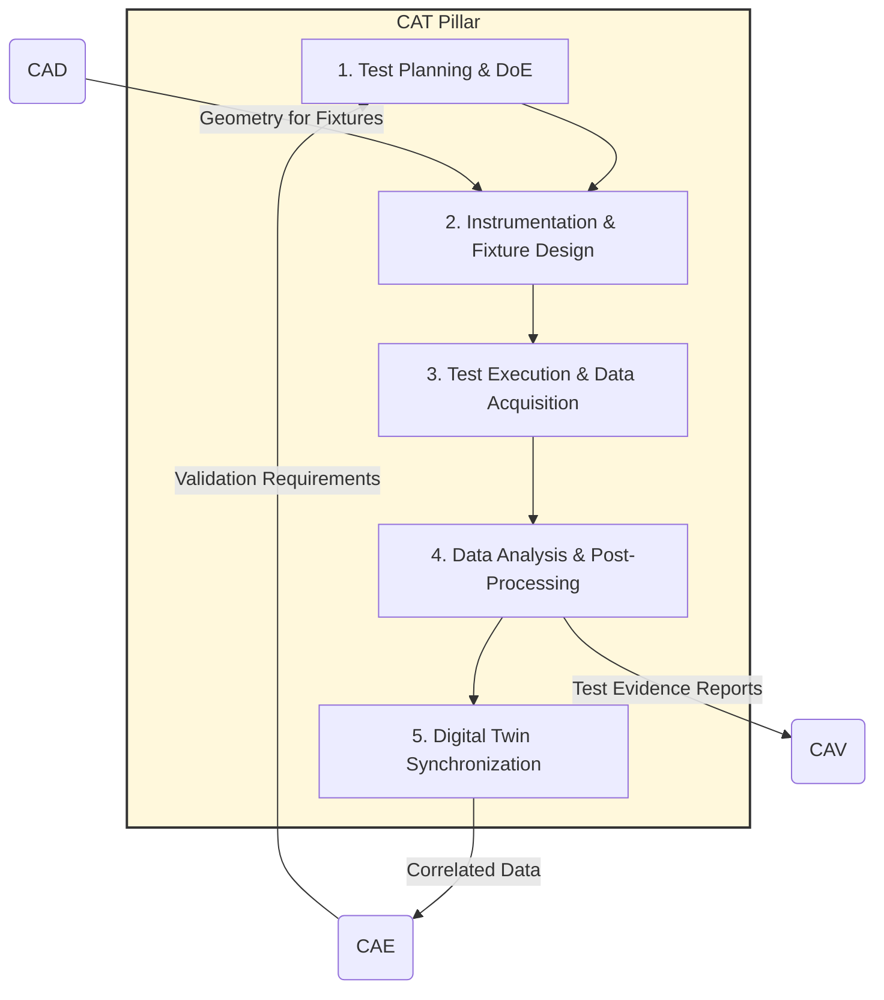

# CAT — Computer-Aided Testing
## Pruebas Asistidas por Computador

**UTCS-MI v5.0:** `UniversalStandard:Component-DefinitionOfPillar-QAL-CAT-ComputerAidedTesting-v1.1`

---

## 1. Purpose and Mission

The **CAT (Computer-Aided Testing)** pillar is the **physical validation engine and reality anchor** of the QAL ecosystem. Its mission is to plan, execute, and analyze a rigorous physical testing program to validate [CAE](../CAE-ENGINEERING/) predictions, correlate digital models, and generate empirical evidence for certification. CAT is the bridge where "bits meet atoms," ensuring that the digital twin is not only internally consistent but is a faithful reflection of the physical reality of the product.



## 2. Key Modules and Functionalities

| Module | Main Functionalities | Key Output Artifacts |
| :--- | :--- | :--- |
| **Test Planning and DoE** | - Master Test Plan creation (Building Block Approach)<br>- Design of Experiments (DoE) to maximize information with minimum tests<br>- Resource planning (test benches, personnel, budget) | `Master-Test-Plan.xml`<br>`Design-of-Experiments-Matrix.csv` |
| **Instrumentation and Fixture Design** | - Selection and calibration of sensors (traditional and quantum)<br>- CAD design of fixtures, test benches, and specimen holders<br>- Data acquisition systems (DAS) development | `Instrumentation-Plan.xlsx`<br>`Test-Fixture-Models.step`<br>`DAS-Configuration.ini` |
| **Test Execution and Acquisition** | - Automated or supervised test sequence execution<br>- Real-time data acquisition and raw storage<br>- Environmental conditions and test configuration logging | `Raw-Test-Data.tdms`<br>`Test-Execution-Log.txt` |
| **Data Analysis and Post-processing** | - Filtering, cleaning, and processing of raw data<br>- Test results comparison with [CAE](../CAE-ENGINEERING/) predictions<br>- Detailed test report creation | `Processed-Data.csv`<br>`Test-vs-CAE-Correlation-Report.pdf` |
| **Digital Twin Synchronization** | - CAE model update with correlated test data<br>- Post-correlation model uncertainty quantification<br>- Immutable test event evidence generation | `Correlated-Model-parameters.json`<br>`DET:CAT:Test:GVT:V1.0` |

## 3. QAL Lifecycle Integration

CAT operates within the canonical QAL flow (`CAB → CAD → CAE → CAT → CAV → CAM → CAP → CAS → CAEpost`) as the final validator of the design and analysis chain, providing "field truth."

### Main Inputs:
- Validation requirements and predictions from [CAE](../CAE-ENGINEERING/) Evidence Packs
- [CAD](../CAD-DESIGN/) models from DMM for fixture design and instrumentation planning
- Certification Plan (from [CAV](../CAV-VERIFICATION/)) to define which tests require authority witness

### Main Outputs (Physical Evidence Artifacts):
- **Correlated Test Reports:** Formal documents comparing physical results with digital predictions and quantifying error
- **Correlated Models:** Updated versions of [CAE](../CAE-ENGINEERING/) models that have been "tuned" with real-world data
- **Test Evidence for Certification:** DET Evidence Packs containing all data and metadata from a physical test, digitally signed, for use in [CAV](../CAV-VERIFICATION/) certification dossier

### Success Metrics (KPIs):
- **Model Fidelity:** Percentage error between [CAE](../CAE-ENGINEERING/) and CAT post-correlation
- **Test Efficiency:** Information obtained per cost/time ratio
- **First-Time-Right Rate:** % of tests validating CAE predictions without redesign
- **Validation Coverage:** % of key requirements validated with physical evidence

## 4. Quantum Enhancements for CAT

CAT leverages quantum computing to optimize test planning and achieve measurement precision levels impossible with classical sensors.

### Test Plan Optimization (QAOA/QUBO):
The complete test program (thousands of potential test points) is formulated as a combinatorial optimization problem. **QAOA** is used to select the minimum subset of test points that maximizes requirement coverage and model uncertainty reduction, subject to budget and time constraints. This ensures maximum test program efficiency.

### Quantum Sensors (Quantum Sensing):
For ultra-precise measurements, quantum sensors are integrated into test benches:
- **NV-Center Magnetometers:** For unprecedented precision mapping of magnetic fields around 540 VDC high-power systems, validating electromagnetic interference (EMI) models
- **Atomic Gyroscopes:** For calibrating Inertial Reference Systems (IRS) with stability and precision orders of magnitude superior to classical systems
- **Quantum Imaging:** Using entangled light for non-destructive inspection (NDI) of composite materials, detecting microcracks much smaller than those detectable with conventional ultrasound or X-rays

### Calibration with Entangled Sensors:
Entangled sensor pairs are used to eliminate common noise in complex measurement system calibration, such as wind tunnels, achieving uncertainty reduction in aerodynamic measurements.

## 5. BWB-Q100 Test Campaign Implementation

### Master Test Plan - Building Block Approach

```mermaid
graph TD
    subgraph "Level 1: Coupons"
        C1[Material Characterization<br/>293K to 20K]
        C2[Fatigue Specimens<br/>R=-1, R=0.1]
        C3[Joint Elements<br/>Fastener Testing]
    end
    
    subgraph "Level 2: Elements"
        E1[Single Bubble<br/>Pressure Test]
        E2[Inter-bubble Joint<br/>Static & Fatigue]
        E3[Cryo Panel<br/>Thermal Cycling]
    end
    
    subgraph "Level 3: Subcomponents"
        S1[3-Bubble Array<br/>Combined Loads]
        S2[Fuel Cell Module<br/>Performance Test]
        S3[BLI Duct<br/>Wind Tunnel]
    end
    
    subgraph "Level 4: Full Scale"
        F1[Ground Vibration<br/>Test (GVT)]
        F2[Static Test<br/>Article]
        F3[Fatigue Test<br/>180k cycles]
    end
    
    C1 & C2 & C3 --> E1 & E2 & E3
    E1 & E2 & E3 --> S1 & S2 & S3
    S1 & S2 & S3 --> F1 & F2 & F3
```

### Critical Test Campaigns

#### Multi-Bubble Fatigue Test (180k cycles)
- **Test Article:** 3-bubble subcomponent (1:4 scale)
- **Setup:** 6-DOF hydraulic test rig with thermal chamber (-55°C to +70°C)
- **Phases:** 
  - Phase 1: 0-30,000 cycles (inspections every 5,000)
  - Phase 2: 30,001-120,000 cycles (inspections every 10,000)
  - Phase 3: 120,001-180,000 cycles (inspections every 5,000)
- **Correlation:** CAE prediction vs test result analysis
- **DET Evidence:** `DET:CAT:Test:Fatigue:V1.0`

#### Cryogenic System Validation
- **Test Article:** Full-scale LH₂ tank module
- **Sequence:** Fill cycle, hold test (72h), thermal cycling (500 cycles)
- **Measurements:** Quantum sensors for pump monitoring and thermal gradients
- **Validation:** CFRP microcracking threshold verification

#### Ground Vibration Test (GVT)
- **Configuration:** Full aircraft (first prototype)
- **Setup:** Soft suspension, 4× electrodynamic shakers, 450 accelerometers
- **Enhancement:** Atomic gyros for reference
- **Results:** Modal analysis with MAC correlation > 0.95

## 6. Digital Evidence Twin Integration

All CAT activities generate immutable evidence through the DET framework:

```yaml
DET_Evidence_Pattern:
  test_id: "CAT-BWB-{TEST_TYPE}-{SEQUENCE}"
  namespace: "DET:CAT:{DOMAIN}:{SNS}:{activity}:V{rev}"
  evidence_types:
    - test_data: "Raw sensor measurements"
    - correlation: "CAE vs test comparison"
    - calibration: "Sensor calibration certificates"
    - environment: "Test conditions and setup"
  quantum_data:
    - sensor_precision: "Quantum sensor measurements"
    - optimization: "QAOA test selection results"
  signatures:
    - cryptographic: "Ed25519 digital signature"
    - quantum: "Post-quantum cryptography ready"
```

## 7. Test Campaign Timeline

The BWB-Q100 physical test campaign follows a structured 18-month timeline:

1. **Coupons Phase** (Months 1-3): Material and fastener testing
2. **Elements Phase** (Months 4-6): Single components and joints
3. **Subcomponents Phase** (Months 7-9): Multi-bubble arrays and modules
4. **Full Scale Phase** (Months 10-18): GVT, static test, and fatigue testing

## 8. Integration with Other Pillars

### Input Dependencies:
- **[CAD](../CAD-DESIGN/):** Geometric models for fixture design
- **[CAE](../CAE-ENGINEERING/):** Analysis predictions for validation
- **[CAM](../CAM-MANUFACTURING/):** Manufacturing process constraints

### Output Dependencies:
- **[CAV](../CAV-VERIFICATION/):** Test evidence for certification
- **[CAE](../CAE-ENGINEERING/):** Model correlation and updates
- **[CAS](../CAS-SUSTAINMENT/):** Operational validation data

---

**Final Note:** The CAT pillar is much more than a simple "testing department." It is an integral component of the digital thread that closes the loop between the virtual and physical worlds. By optimizing planning and employing next-generation sensors, CAT not only validates design but continuously enriches and improves the digital twin, increasing confidence in simulations and accelerating certification.

---

*Part of the C-AMEDEO Framework for Computer-Aided Testing and Physical Validation*