# CAO Home Dashboard Wireframe

## Executive Summary

The CAO (Computer-Aided Organization) Home Dashboard provides a centralized view of organizational governance artifacts, integrating policies, budgets, risks, and digital evidence through the QAL ecosystem. This wireframe defines the user interface and navigation flow for Program Managers and CAO Administrators.

## Dashboard Layout Overview

```mermaid
graph TB
    subgraph "CAO Home Dashboard"
        Header["`**CAO - Computer-Aided Organization**
        BWB-Q100 Program Dashboard`"]
        
        KPIs["`**Key Performance Indicators**
        📊 Budget Health: €9.6M allocated (FY2026Q2)
        📈 Policy Compliance: 95% 
        ⚠️ Active Risks: 2 High, 3 Medium
        🔒 DET Integrity: 100% verified`"]
        
        subgraph "Main Content Area"
            PolicyCard["`**🏛️ Policies**
            QAL Policy Pack v1.0
            📋 2 active policies
            📅 Last updated: 2025-09-02
            🔗 DET:CAO:Policy:QAL-0007:V1.0`"]
            
            BudgetCard["`**💰 Budget Allocation**
            FY2026Q2 Vector
            💵 €9.6M total allocation
            📊 5 domain allocations
            🔗 DET:CAO:Budget:FY26Q2:V1.0`"]
            
            RiskCard["`**⚠️ Risk Register**
            BWB-Q100 Risk Portfolio
            🔥 2 high-severity risks
            📊 CVaR α=0.95 methodology
            🔗 Multiple DET refs`"]
        end
        
        subgraph "Quick Actions"
            AddPolicy["`➕ Add Policy`"]
            UpdateBudget["`💸 Update Budget`"]
            CreateRisk["`⚠️ Log Risk`"]
            ViewCompliance["`📋 View Compliance`"]
        end
        
        Footer["`🔗 DET Evidence Explorer | 📊 Analytics | ⚙️ Settings`"]
    end
    
    Header --> KPIs
    KPIs --> PolicyCard
    KPIs --> BudgetCard  
    KPIs --> RiskCard
    PolicyCard --> AddPolicy
    BudgetCard --> UpdateBudget
    RiskCard --> CreateRisk
    Footer --> ViewCompliance
```



## Detailed Component Specifications

### 1. Header Section
- **CAO Program Title**: "Computer-Aided Organization - BWB-Q100 Program Dashboard"
- **User Context**: Current user, role, and last login
- **Navigation Breadcrumbs**: CAO → H2-BWB-Q100-CONF0000 → Dashboard

### 2. Key Performance Indicators (KPIs) - for DEMO purposes
```mermaidor 
graph LR
    subgraph "KPI Dashboard"
        Budget["`**Budget Health**
        💰 €9.6M allocated
        📈 85% utilized
        🎯 On track`"]
        
        Compliance["`**Policy Compliance**
        ✅ 95% compliant
        📋 47 total requirements
        ⚠️ 3 pending reviews`"]
        
        Risk["`**Risk Profile**
        🔥 Risk Score: 2.8/5.0
        📊 CVaR: 0.09 (acceptable)
        ⚠️ 5 active risks`"]
        
        DET["`**DET Integrity**
        🔒 100% verified
        📋 4 evidence chains
        ⏱️ Last sync: 2h ago`"]
    end
```

### 3. Policy Management Card

```mermaid
graph TB
    subgraph "Policy Pack Card"
        PolicyHeader["`**🏛️ QAL Policy Pack v1.0**
        Status: Active | Owner: CAO-Compliance`"]
        
        PolicyList["`**Active Policies:**
        • POL-CRYO-MAT-01: Cryogenic Materials
        • POL-GATES-CAE-CAT-01: Quality Gates`"]
        
        PolicyActions["`**Actions:**
        🔍 View Details | ✏️ Edit | 📊 Impact Analysis
        🔗 DET Evidence: DET:CAO:Policy:QAL-0007:V1.0`"]
        
        PolicyHeader --> PolicyList
        PolicyList --> PolicyActions
    end
```


### 4. Budget Vector Card

```mermaid
graph TB
    subgraph "Budget Allocation Card"
        BudgetHeader["`**💰 FY2026Q2 Budget Vector**
        Total: €9.6M | Period: Apr-Jun 2026`"]
        
        BudgetBreakdown["`**Domain Allocations:**
        • AAA (CAE): €2.4M | AAA (CAT): €3.1M
        • CQH (CAE): €1.85M | CQH (CAT): €2.25M
        • DDD (CAV): €1.2M`"]
        
        BudgetConstraints["`**Key Constraints:**
        ⚠️ GVT completion required for AAA-CAT
        📊 Evidence pack coverage ≥90% for AAA-CAE
        🔗 DET Evidence: DET:CAO:Budget:FY26Q2:V1.0`"]
        
        BudgetHeader --> BudgetBreakdown
        BudgetBreakdown --> BudgetConstraints
    end
```


### 5. Risk Register Card

```mermaid
graph TB
    subgraph "Risk Register Card"
        RiskHeader["`**⚠️ BWB-Q100 Risk Portfolio**
        Methodology: CVaR α=0.95 | Status: Monitored`"]
        
        HighRisks["`**High-Severity Risks:**
        🔥 R-AAA-001: Multi-bubble fatigue life (5×3)
        📊 R-CQH-002: Quantum sensor supply (4×3)`"]
        
        RiskActions["`**Actions:**
        📈 Risk Analysis | 🎯 Mitigation Plans | 📊 CVaR Dashboard
        🔗 DET Evidence: Multiple linked`"]
        
        RiskHeader --> HighRisks
        HighRisks --> RiskActions
    end
```


## Navigation Flow


## Mobile-Responsive Design

```mermaid
graph TB
    subgraph "Mobile Layout (≤768px)"
        MobileHeader["`**CAO Dashboard**
        BWB-Q100`"]
        
        MobileKPIs["`**KPIs (Carousel)**
        💰 Budget: €9.6M ➜
        📊 Compliance: 95% ➜
        ⚠️ Risks: 5 active ➜`"]
        
        MobileCards["`**Stacked Cards**
        🏛️ Policies ↓
        💰 Budget ↓  
        ⚠️ Risks ↓`"]
        
        MobileActions["`**Bottom Actions**
        ➕ Add | 📊 View | ⚙️ Settings`"]
        
        MobileHeader --> MobileKPIs
        MobileKPIs --> MobileCards
        MobileCards --> MobileActions
    end
```



## Integration Points

### QAL Bus Event Handling
- **Real-time Updates**: Dashboard subscribes to CAO.PolicyPublished, CAO.BudgetAllocated, CAO.RiskRegisterUpdated events
- **Event Display**: Recent events shown in a sidebar or notification area
- **Auto-refresh**: Dashboard components auto-update when relevant events are received

### DET Evidence Integration
- **Evidence Links**: Every artifact card shows direct links to corresponding DET entries
- **Verification Status**: Real-time validation of DET signatures and integrity
- **Audit Trail**: Click-through to complete evidence chain visualization

### Search and Filtering

```mermaid
graph LR
    SearchBar["`🔍 Search: policies, risks, budgets...`"]
    
    FilterBy["`Filter by:
    📅 Date Range
    🏷️ Domain (AAA, CQH, DDD)
    📊 Status (Active, Draft, Archived)
    ⚠️ Risk Level (High, Medium, Low)`"]
    
    SortBy["`Sort by:
    📅 Last Updated
    💰 Budget Amount
    ⚠️ Risk Severity
    📋 Alphabetical`"]
```


## Accessibility Features

- **Keyboard Navigation**: Full tab support for all interactive elements
- **Screen Reader Support**: Proper ARIA labels and descriptions
- **High Contrast Mode**: Toggle for visual accessibility
- **Font Scaling**: Responsive typography with user-controlled sizing
- **Focus Indicators**: Clear visual focus states for all controls

## Technical Implementation Notes

### Frontend Framework Recommendations
- **React/Vue.js**: Component-based architecture for dashboard cards
- **D3.js/Chart.js**: For KPI visualizations and trend charts
- **WebSocket Integration**: Real-time updates from QAL Bus events
- **PWA Support**: Offline capability for critical governance data

### Backend Integration
- **REST API**: Standard CRUD operations for CAO artifacts
- **GraphQL**: Efficient querying for dashboard aggregations
- **WebSocket Events**: Real-time QAL Bus event streaming
- **DET Verification**: Background services for signature validation

This wireframe provides a comprehensive foundation for implementing the CAO Home Dashboard, ensuring it effectively serves as the central hub for organizational governance in the QAL ecosystem.
