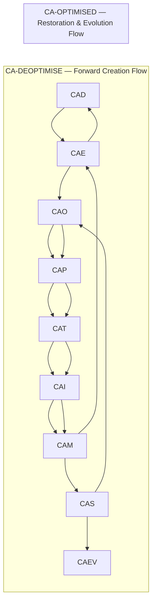
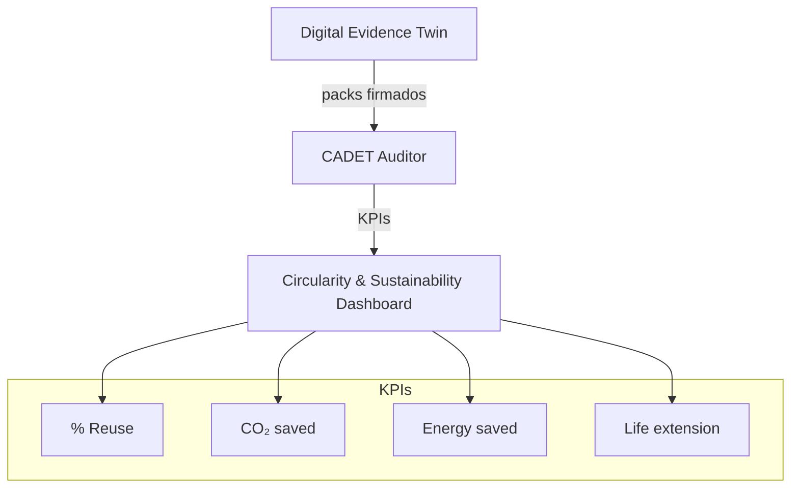

# Amedeo Pelliccia — Portfolio

Aerospace Systems Engineer · Digital‑Twin Architecture · Risk‑Optimized Design
Project Coordinator — Capgemini Engineering (Madrid) · Founder — GAIA Quantum Aerospace
Master's Candidate — Project Management (EAE Business School, 2025–2028)

[](https://github.com/Robbbo-T)
[](https://linkedin.com/in/amedeopelliccia)
[](https://opensource.org/licenses/MIT)
[](#)

---

**EstándarUniversal:** DocumentoTecnico-Divulgacion-ISO9001-IntroduccionSeccionPrincipal-PersonalPortfolioReadme-0001-v1.0-AerospaceAndQuantumUnitedAdvancedVenture-GeneracionHybrida-CROSS-AmedeoPelliccia-9f3a7c2e-RestoDeVidaUtil

> UTCS‑MI v5.0 identifier (13 campos) aplicado al artefacto de portafolio público.

---

## Mission (one‑liner)

Unify the aerospace lifecycle—design (CAD/CAM/CAE/PLM), production (SCADA/ROS/NC), and operations/services (ATM, cockpit/FBW, nav/comm, MRO/EOL/procurement)—under a single, time‑synchronized, evidence‑producing, quantum‑extensible operating fabric.

## TL;DR

* **AMPEL360** compresses a $>2×10^16$ design space to \~10,000 feasible candidates, then selects an optimum via **CVaR** risk minimization.
* **AQUA‑OS BRIDGE** is the deterministic, certifiable digital backbone with **DET** (Digital Evidence Twin) and a **Quantum Abstraction Layer**.
* **GAIA AIR RTOS** provides ARINC 653‑style robust partitioning for safety‑critical execution.
* **C‑AMEDEO** enforces a circular, perpetual lifecycle (DEOPTIMISE → OPTIMISED).
* **CADET** continuously audits circularity using immutable evidence from the DET.

## What I’m Building

### AMPEL360‑BWB‑Q Program

**Program Type:** Integrated Aerospace Development Program
**Primary Objective:** Design, certify, produce, and operate a hydrogen‑powered Blended Wing Body (BWB) aircraft through a unified digital framework that optimizes performance, manages technical‑financial risk, and ensures certifiable safety and traceability end‑to‑end.

**Program Constituents (3 pillars):**

1. **AMPEL360** — Algorithmic Design & Configuration Selection Framework
2. **AQUA‑OS BRIDGE** — Mixed Operating System (MOS), the unified digital backbone
3. **GAIA AIR RTOS** — Safety‑certifiable real‑time execution foundation

---

### 1) AMPEL360 — Algorithmic Design & Configuration Selection

**Nature:** Two‑stage algorithmic reduction and risk‑aware selection.
**Phase I – Feasible Enumeration:** MILP/CP‑SAT prune to \~10,000 candidates under physics, safety, compatibility.
**Phase II – Risk‑Based Selection:** CVaR model selects the configuration with the most robust technical‑financial profile.
**Formal Output:** A definitive, risk‑optimized configuration ready for detailed design inside AQUA‑OS.

### 2) AQUA‑OS BRIDGE — Mixed Operating System (MOS)

**Deterministic Control Plane:** Time/space partitioning aligned with ARINC 653; built on GAIA AIR RTOS.
**Digital Evidence Twin · DET:** WORM evidence for every action; audit‑grade traceability.
**Quantum Abstraction Layer (QAL):** Offload non‑critical optimizations to quantum resources while keeping safety‑critical paths on certified classical hardware.
**Formal Function:** A single source of truth, determinism, and evidence across lifecycle.

### 3) GAIA AIR RTOS — Real‑Time Operating System

**Nature:** Safety‑certifiable, partitioned RTOS for avionics/robotics/IoT.
**Core Principle:** Robust partitioning ensures non‑critical failures cannot propagate to safety‑critical partitions.
**Subsidiary Technology:** **GAIA AIR INFRANET**, the deterministic, secure protocol for intra‑ecosystem data exchange.
**Formal Function:** Guarantees safety, security, and predictability for time‑critical functions.

### 4) C‑AMEDEO — Circular Assisted Methods for Evolutive Developments and Entangled Operations

*© Amedeo Pelliccia 2025*

**Purpose:** Govern the complete lifecycle using two complementary flows.



**Pillars (glossary):**
**CAD** (Design), **CAE** (Engineering), **CAO** (Organization & Ops), **CAP** (Process/Safety/V\&V/Compliance), **CAT** (Source & Code Systems), **CAI** (Integrations), **CAM** (Manufacturing), **CAS** (Sustainment), **CAEV** (Evolution).

### 5) CADET — Circularity Assurance by Digital Evolutive Twin

*© Amedeo Pelliccia 2025*

**Role:** Assurance layer that audits DET evidence to prove circularity and sustainability.

* Traceability verification across DEOPTIMISE→OPTIMISED
* Circularity KPIs (reuse %, waste reduction, life‑extension)
* Automated sustainability reporting (ISO 14001, CSRD, GRI)
* Lifecycle closure audits with evidence‑backed directives

---

## Why It Matters

* **Single source of truth:** twin + evidence
* **Determinism + agility:** certification rigor with fast iteration
* **Energy‑as‑Policy:** targeted −20–40% energy/CO₂ vs baseline
* **Circular economy:** perpetual, auditable lifecycle via C‑AMEDEO + CADET

---

## C‑AMEDEO — Interactive Index (Matrix Overview)

> **Numbering standard (hard rule).** All **CE** use **ATA iSpec 2200 Subject Numbering System (SNS)** — `ATA CC-SS[-SS]` — and every deliverable resolves to an **S1000D Data Module Code (DMC)**:
>
> `DMC = <MIC>-<ATA SNS>-<DC>-<IC>-<ICV>-<LC>-<ISSUE>`
>
> where **MIC** (Model Identification Code) = `Q100`, **SNS** follows ATA, **DC** (Disassembly Code), **IC/ICV** (Information Code / Variant), **LC** (Language Code), **ISSUE** per S1000D. Non-ATA binders are prohibited in CE names; use DI-only for cross-domain notes.

The matrix below organizes the **15 technological domains** across both lifecycle flows. Links navigate to the public GitHub structure for **H2‑BWB‑Q100‑CONF0000**.

> Base path prefix:
> `https://github.com/Robbbo-T/Robbbo-T/tree/main/C-AMEDEO-FRAMEWORK/<FLOW>/<CAX_PILLAR>/H2-BWB-Q100-CONF0000/`

### Phase 1 — **CA‑DEOPTIMISE** (Forward Creation Flow)

#### CAD‑DESIGN (Design artifacts: models, drawings, specs)

**Domain Invariants (DI) — roots**

* **AAA** → [DI-CAD-Q100-AAA-CONF0000](https://github.com/Robbbo-T/Robbbo-T/tree/main/C-AMEDEO-FRAMEWORK/CA-DEOPTIMISE/CAD-DESIGN/H2-BWB-Q100-CONF0000/AAA-ARCHITECTURES_AIRFRAMES_AERODYNAMICS)
* **MMM** → [DI-CAD-Q100-MMM-CONF0000](https://github.com/Robbbo-T/Robbbo-T/tree/main/C-AMEDEO-FRAMEWORK/CA-DEOPTIMISE/CAD-DESIGN/H2-BWB-Q100-CONF0000/MMM-MECHANICAL_MATERIAL_MONITORING)
* **EEE** → [DI-CAD-Q100-EEE-CONF0000](https://github.com/Robbbo-T/Robbbo-T/tree/main/C-AMEDEO-FRAMEWORK/CA-DEOPTIMISE/CAD-DESIGN/H2-BWB-Q100-CONF0000/EEE-ENVIRONMENTAL_REMEDIATION_CIRCULARITY)
* **DDD** → [DI-CAD-Q100-DDD-CONF0000](https://github.com/Robbbo-T/Robbbo-T/tree/main/C-AMEDEO-FRAMEWORK/CA-DEOPTIMISE/CAD-DESIGN/H2-BWB-Q100-CONF0000/DDD-DEFENCE_CYBERSECURITY_SAFETY)
* **EER** → [DI-CAD-Q100-EER-CONF0000](https://github.com/Robbbo-T/Robbbo-T/tree/main/C-AMEDEO-FRAMEWORK/CA-DEOPTIMISE/CAD-DESIGN/H2-BWB-Q100-CONF0000/EER-ENERGY_AND_RENEWABLE)
* **OOO** → [DI-CAD-Q100-OOO-CONF0000](https://github.com/Robbbo-T/Robbbo-T/tree/main/C-AMEDEO-FRAMEWORK/CA-DEOPTIMISE/CAD-DESIGN/H2-BWB-Q100-CONF0000/OOO-OPERATING_SYSTEMS_NAVIGATION_HPC)
* **PPP** → [DI-CAD-Q100-PPP-CONF0000](https://github.com/Robbbo-T/Robbbo-T/tree/main/C-AMEDEO-FRAMEWORK/CA-DEOPTIMISE/CAD-DESIGN/H2-BWB-Q100-CONF0000/PPP-PROPULSION_AND_FUELS)
* **EDI** → [DI-CAD-Q100-EDI-CONF0000](https://github.com/Robbbo-T/Robbbo-T/tree/main/C-AMEDEO-FRAMEWORK/CA-DEOPTIMISE/CAD-DESIGN/H2-BWB-Q100-CONF0000/EDI-ELECTRONICS_DIGITAL_INSTRUMENTS)
* **LIB** → [DI-CAD-Q100-LIB-CONF0000](https://github.com/Robbbo-T/Robbbo-T/tree/main/C-AMEDEO-FRAMEWORK/CA-DEOPTIMISE/CAD-DESIGN/H2-BWB-Q100-CONF0000/LIB-LOGISTICS_INTEGRATED_BLOCKCHAIN)
* **LCC** → [DI-CAD-Q100-LCC-CONF0000](https://github.com/Robbbo-T/Robbbo-T/tree/main/C-AMEDEO-FRAMEWORK/CA-DEOPTIMISE/CAD-DESIGN/H2-BWB-Q100-CONF0000/LCC-LINKS_COMMUNICATIONS_CONTROL_IoT)
* **IIF** → [DI-CAD-Q100-IIF-CONF0000](https://github.com/Robbbo-T/Robbbo-T/tree/main/C-AMEDEO-FRAMEWORK/CA-DEOPTIMISE/CAD-DESIGN/H2-BWB-Q100-CONF0000/IIF-INFRASTRUCTURES_AND_FACILITIES_VALUE_CHAINS)
* **CCC** → [DI-CAD-Q100-CCC-CONF0000](https://github.com/Robbbo-T/Robbbo-T/tree/main/C-AMEDEO-FRAMEWORK/CA-DEOPTIMISE/CAD-DESIGN/H2-BWB-Q100-CONF0000/CCC-COCKPIT_CABIN_CARGO_SYSTEMS)
* **CQH** → [DI-CAD-Q100-CQH-CONF0000](https://github.com/Robbbo-T/Robbbo-T/tree/main/C-AMEDEO-FRAMEWORK/CA-DEOPTIMISE/CAD-DESIGN/H2-BWB-Q100-CONF0000/CQH-CRYOGENICS_QUANTUM_INTERFACES_HYDROGEN_CELLS)
* **IIS** → [DI-CAD-Q100-IIS-CONF0000](https://github.com/Robbbo-T/Robbbo-T/tree/main/C-AMEDEO-FRAMEWORK/CA-DEOPTIMISE/CAD-DESIGN/H2-BWB-Q100-CONF0000/IIS-INTELLIGENT_SYSTEMS_ONBOARD_AI)
* **AAP** → [DI-CAD-Q100-AAP-CONF0000](https://github.com/Robbbo-T/Robbbo-T/tree/main/C-AMEDEO-FRAMEWORK/CA-DEOPTIMISE/CAD-DESIGN/H2-BWB-Q100-CONF0000/AAP-AIRPORTS_ADAPTATIONS)

---

### CE Index — **ATA‑aligned** (CAD‑DESIGN · CA‑DEOPTIMISE)

> **Política de cruce ATA↔Dominios** (resumen): CE ancladas a ATA, **OwnerDomain** canónico, **CoDomains** listados. Publicación S1000D genera **DMC** únicos; los aliases de dominio apuntan al DMC canónico.

> **Reglas de numeración (no exclusivas).**
>
> 1. Cada **CE** comienza por su **ATA iSpec 2200 (SNS)**.
> 2. **Un capítulo ATA puede pertenecer a múltiples dominios** (no hay asignación exclusiva).
> 3. Para evitar duplicidades, cada CE tiene un **OwnerDomain** canónico y **CoDomains** referenciados; los índices de otros dominios enlazan a la CE canónica (symlink/alias).
> 4. Los envoltorios no‑ATA viven sólo en **DI**.

* **AAA** (Airframe & Aerodynamics)

  * **ATA 04** — Airworthiness Limitations (ALS/SSID) → `CE-CAD-Q100-AAA-ATA-04-AIRWORTHINESS-LIMITS`
  * **ATA 05** — Time Limits & Maintenance Checks → `CE-CAD-Q100-AAA-ATA-05-TIME-LIMITS-CHECKS`
  * **ATA 02** — Weight & Balance → `CE-CAD-Q100-AAA-ATA-02-WEIGHT-BALANCE`
  * **ATA 06** — Dimensions & Areas → `CE-CAD-Q100-AAA-ATA-06-DIMENSIONS-AREAS`
  * **ATA 07** — Lifting & Shoring → `CE-CAD-Q100-AAA-ATA-07-LIFTING-SHORING`
  * **ATA 08** — Leveling & Weighing → `CE-CAD-Q100-AAA-ATA-08-LEVELING-WEIGHING`
  * **ATA 09** — Towing & Taxiing → `CE-CAD-Q100-AAA-ATA-09-TOWING-TAXIING`
  * **ATA 11** — Placards & Markings → `CE-CAD-Q100-AAA-ATA-11-PLACARDS-MARKINGS`
  * **ATA 18** — Vibration & Noise (incl. GVT) → `CE-CAD-Q100-AAA-ATA-18-VIBRATION-NOISE`
  * **ATA 20** — Standard Practices (Airframe) → `CE-CAD-Q100-AAA-ATA-20-STANDARD-PRACTICES`
  * **ATA 50** — Cargo/Accessory Compartments → `CE-CAD-Q100-AAA-ATA-50-CARGO-ACCESS`
  * **ATA 51** — Standard Practices — Structures → `CE-CAD-Q100-AAA-ATA-51-STRUCTURES`
  * **ATA 52** — Doors → `CE-CAD-Q100-AAA-ATA-52-DOORS`
  * **ATA 53** — Fuselage → `CE-CAD-Q100-AAA-ATA-53-FUSELAGE`
  * **ATA 54** — Nacelles/Pylons → `CE-CAD-Q100-AAA-ATA-54-NACELLES-PYLONS`
  * **ATA 55** — Stabilizers → `CE-CAD-Q100-AAA-ATA-55-STABILIZERS`
  * **ATA 56** — Windows → `CE-CAD-Q100-AAA-ATA-56-WINDOWS`
  * **ATA 57** — Wings → `CE-CAD-Q100-AAA-ATA-57-WINGS`

* **MMM** (Mechanical & Material Monitoring)

  * **ATA 26** — Fire Protection → `CE-CAD-Q100-MMM-ATA-26-FIRE-PROTECTION-MON`
  * **ATA 27** — Flight Controls → `CE-CAD-Q100-MMM-ATA-27-FLIGHT-CONTROLS-MON`
  * **ATA 29** — Hydraulic Power → `CE-CAD-Q100-MMM-ATA-29-HYDRAULIC-MON`
  * **ATA 32** — Landing Gear → `CE-CAD-Q100-MMM-ATA-32-LG-MON`
  * **ATA 36** — Pneumatic → `CE-CAD-Q100-MMM-ATA-36-PNEUMATIC-MON`
  * **ATA 53** — Fuselage SHM → `CE-CAD-Q100-MMM-ATA-53-SHM-FUSELAGE`
  * **ATA 57** — Wing SHM → `CE-CAD-Q100-MMM-ATA-57-SHM-WING`

* **EEE** (Environmental & Circularity)

  * **ATA 12** — Servicing — Routine Maintenance → `CE-CAD-Q100-EEE-ATA-12-SERVICING`
  * **ATA 21** — Air Conditioning → `CE-CAD-Q100-EEE-ATA-21-ENV-AIRCOND`
  * **ATA 36** — Pneumatic (Bleed Mgmt) → `CE-CAD-Q100-EEE-ATA-36-BLEED-MGMT`
  * **ATA 38** — Water & Waste → `CE-CAD-Q100-EEE-ATA-38-WATER-WASTE`
  * **ATA 49** — APU (Energy Recovery) → `CE-CAD-Q100-EEE-ATA-49-APU-ENERGY`

* **DDD** (Defence/Cyber/Safety)

  * **ATA 23** — Communications Security → `CE-CAD-Q100-DDD-ATA-23-COMMS-SEC`
  * **ATA 31** — Indicating/Recording (Security) → `CE-CAD-Q100-DDD-ATA-31-RECORDING-ASSURE`
  * **ATA 34** — Navigation Integrity → `CE-CAD-Q100-DDD-ATA-34-NAV-INTEGRITY`
  * **ATA 45** — EWIS Safety → `CE-CAD-Q100-DDD-ATA-45-EWIS-SAFETY`
  * **ATA 46** — Information Systems Security → `CE-CAD-Q100-DDD-ATA-46-INFOSYS-SEC`
  * **ATA 42 (Spec)** — Digital Information Security Baseline → `CE-CAD-Q100-DDD-ATA42-SPEC-CYBER` (Spec 42 mapping)

* **EER** (Energy & Renewable)

  * **ATA 24** — Electrical Power → `CE-CAD-Q100-EER-ATA-24-ELECTRICAL-POWER`
  * **ATA 36** — Pneumatic (Energy) → `CE-CAD-Q100-EER-ATA-36-PNEUMATIC`
  * **ATA 49** — APU → `CE-CAD-Q100-EER-ATA-49-APU`
  * **ATA 73** — Engine Fuel & Control (H₂) → `CE-CAD-Q100-EER-ATA-73-H2-FUEL-CONTROL`

* **OOO** (Operating Systems, Navigation, HPC)

  * **ATA 22** — Auto Flight → `CE-CAD-Q100-OOO-ATA-22-AUTOFLIGHT`
  * **ATA 23** — Communications → `CE-CAD-Q100-OOO-ATA-23-COMMS` *(CoDomains: EDI, LCC, DDD)*
  * **ATA 31** — Indicating/Recording → `CE-CAD-Q100-OOO-ATA-31-INDICATING` *(CoDomains: EDI, IIS)*
  * **ATA 34** — Navigation → `CE-CAD-Q100-OOO-ATA-34-NAV` *(CoDomains: IIS, LCC, DDD)*
  * **ATA 46** — Information Systems → `CE-CAD-Q100-OOO-ATA-46-INFOSYS` *(CoDomains: EDI, IIS)*

* **PPP** (Propulsion & Fuels)

  * **ATA 70** — Std Practices Powerplant → `CE-CAD-Q100-PPP-ATA-70-STD-PRACT-PP`
  * **ATA 71** — Powerplant → `CE-CAD-Q100-PPP-ATA-71-POWERPLANT`
  * **ATA 72** — Engine — Turbine → `CE-CAD-Q100-PPP-ATA-72-ENGINE`
  * **ATA 73** — Engine Fuel & Control → `CE-CAD-Q100-PPP-ATA-73-FUEL-CONTROL` *(CoDomains: EER, CQH)*
  * **ATA 74** — Ignition → `CE-CAD-Q100-PPP-ATA-74-IGNITION`
  * **ATA 75** — Air → `CE-CAD-Q100-PPP-ATA-75-AIR` *(CoDomain: EER)*
  * **ATA 76** — Engine Controls → `CE-CAD-Q100-PPP-ATA-76-CONTROLS`
  * **ATA 77** — Engine Indicating → `CE-CAD-Q100-PPP-ATA-77-INDICATING` *(CoDomains: EER, IIS)*
  * **ATA 78** — Exhaust → `CE-CAD-Q100-PPP-ATA-78-EXHAUST`
  * **ATA 79** — Oil → `CE-CAD-Q100-PPP-ATA-79-OIL`
  * **ATA 80** — Starting → `CE-CAD-Q100-PPP-ATA-80-STARTING` *(CoDomain: LIB-S2000 for parts flow)*

* **EDI** (Electronics & Digital Instruments)

  * **ATA 23** — Communications → `CE-CAD-Q100-EDI-ATA-23-COMMS`
  * **ATA 31** — Indicating/Recording → `CE-CAD-Q100-EDI-ATA-31-DISPLAYS`
  * **ATA 33** — Lights → `CE-CAD-Q100-EDI-ATA-33-LIGHTS` *(CoDomain: EER for energy)*
  * **ATA 45** — EWIS → `CE-CAD-Q100-EDI-ATA-45-EWIS`
  * **ATA 46** — Information Systems → `CE-CAD-Q100-EDI-ATA-46-INFOSYS`

* **LIB** (Logistics & Blockchain)

  * **ATA Spec 2000** — Book 1 Provisioning → `CE-CAD-Q100-LIB-S2000-BK1-PROVISIONING` *(CoDomains: IIF, AAP)*
  * **ATA Spec 2000** — Book 2 Procurement → `CE-CAD-Q100-LIB-S2000-BK2-PROCUREMENT`
  * **ATA Spec 2000** — Book 7 AIDC/RFID → `CE-CAD-Q100-LIB-S2000-BK7-AIDC` *(CoDomains: LCC, EDI)*
  * **ATA Spec 2500** — Electronic Transfer Records → `CE-CAD-Q100-LIB-S2500-TRANSFER` *(CoDomains: AAP, IIF)*

* **LCC** (Links/Comms/Control/IoT)

  * **ATA 23** — Communications Network → `CE-CAD-Q100-LCC-ATA-23-NETWORK`
  * **ATA 34** — Navigation Data Links → `CE-CAD-Q100-LCC-ATA-34-DATALINK`
  * **ATA 46** — Information Systems (IoT) → `CE-CAD-Q100-LCC-ATA-46-IOT`

* **IIF** (Infrastructures & Facilities)

  * **ATA 09** — Towing Facilities → `CE-CAD-Q100-IIF-ATA-09-TOWING`
  * **ATA 10** — Parking/Mooring → `CE-CAD-Q100-IIF-ATA-10-PARKING`
  * **ATA 49** — APU Ground Interfaces → `CE-CAD-Q100-IIF-ATA-49-APU-GROUND`

* **CCC** (Cockpit/Cabin/Cargo)

  * **ATA 25** — Equipment/Furnishings → `CE-CAD-Q100-CCC-ATA-25-EQUIP-FURN`
  * **ATA 35** — Oxygen → `CE-CAD-Q100-CCC-ATA-35-OXYGEN`
  * **ATA 38** — Water/Waste → `CE-CAD-Q100-CCC-ATA-38-WATER-WASTE`
  * **ATA 44** — Cabin Systems → `CE-CAD-Q100-CCC-ATA-44-CABIN`

* **CQH** (Cryogenics/Quantum/H₂ Cells)

  * **ATA 28** — Fuel (LH₂ distribution) → `CE-CAD-Q100-CQH-ATA-28-FUEL-LH2`
  * **ATA 36** — Pneumatic (purge) → `CE-CAD-Q100-CQH-ATA-36-PURGE`
  * **ATA 35** — Oxygen (cryogenic interfaces) → `CE-CAD-Q100-CQH-ATA-35-OXYGEN`
  * **ATA 73** — Engine Fuel/Control (H₂) → `CE-CAD-Q100-CQH-ATA-73-H2-ENGINE-FUEL`

* **IIS** (Intelligent Systems On‑board AI)

  * **ATA 22** — Auto Flight (AI control assist) → `CE-CAD-Q100-IIS-ATA-22-AI-AF`
  * **ATA 31** — Indicating/Recording (AI analytics) → `CE-CAD-Q100-IIS-ATA-31-AI-IR`
  * **ATA 34** — Navigation (AI assistance) → `CE-CAD-Q100-IIS-ATA-34-AI-NAV`
  * **ATA 46** — Information Systems (AI/RTOS) → `CE-CAD-Q100-IIS-ATA-46-AI-RTOS`

* **AAP** (Airports Adaptations)

  * **ATA 09** — Ground Handling → `CE-CAD-Q100-AAP-ATA-09-GROUND`
  * **ATA 10** — Parking/Mooring → `CE-CAD-Q100-AAP-ATA-10-PARKING`
  * **ATA 49** — GPU/Power Interfaces → `CE-CAD-Q100-AAP-ATA-49-GPU`

---

> **S1000D binding.** For each **CE**, the publication pipeline will instantiate **DMRL** entries and generate **DMCs** with `MIC=Q100`, `SNS=<ATA>`, `DC/IC/ICV` per content type (e.g., Description, Removal/Installation, Test, Fault Isolation), and register them under the DI.

### **ATA ↔ Dominios — Matriz de cruce (extracto)**

|       ATA | Descripción breve             | OwnerDomain | CoDomains     |
| --------: | ----------------------------- | ----------- | ------------- |
|        02 | Weight & Balance              | AAA         | —             |
|        06 | Dimensions & Areas            | AAA         | —             |
|        11 | Placards & Markings           | AAA         | CCC           |
|        18 | Vibration & Noise             | AAA         | MMM           |
|        20 | Standard Practices (Airframe) | AAA         | DDD           |
|        23 | Communications                | OOO         | EDI, LCC, DDD |
|        24 | Electrical Power              | EER         | EDI           |
|        28 | Fuel (LH₂)                    | CQH         | PPP, EER      |
|        31 | Indicating/Recording          | OOO         | EDI, IIS      |
|        34 | Navigation                    | OOO         | IIS, LCC, DDD |
|        36 | Pneumatic                     | EER         | EEE, MMM, CQH |
|        38 | Water & Waste                 | EEE         | CCC           |
| 42 (Spec) | Digital Info Security         | DDD         | OOO, LCC, EDI |
|        45 | EWIS                          | DDD         | EDI, LCC, AAA |
|        46 | Information Systems           | OOO         | EDI, IIS      |
|        49 | APU                           | EER         | IIF, AAP      |
|     70–80 | Powerplant suite              | PPP         | EER, CQH, IIS |
|     S2000 | e-Business backbone           | LIB         | LCC, EDI      |
|     S2500 | Asset transfer records        | LIB         | AAP, IIF      |

> **Nota:** Esta matriz es **no exhaustiva**; sirve de guía de cruce. La fuente de verdad es el **owner** de la CE (ruta canónica) y los **co‑domains** apuntan mediante alias.

### Phase 2 — **CA‑OPTIMISED** (Restoration & Evolution Flow)

**CA‑OPTIMISED** (Restoration & Evolution Flow)
All pillars/domains mirror **Phase 1** structure. Links begin at:

* CAD‑DESIGN root:
  [https://github.com/Robbbo-T/Robbbo-T/tree/main/C-AMEDEO-FRAMEWORK/CA-OPTIMISED/CAD-DESIGN/H2-BWB-Q100-CONF0000/](https://github.com/Robbbo-T/Robbbo-T/tree/main/C-AMEDEO-FRAMEWORK/CA-OPTIMISED/CAD-DESIGN/H2-BWB-Q100-CONF0000/)
* CAE‑ENGINEERING root:
  [https://github.com/Robbbo-T/Robbbo-T/tree/main/C-AMEDEO-FRAMEWORK/CA-OPTIMISED/CAE-ENGINEERING/H2-BWB-Q100-CONF0000/](https://github.com/Robbbo-T/Robbbo-T/tree/main/C-AMEDEO-FRAMEWORK/CA-OPTIMISED/CAE-ENGINEERING/H2-BWB-Q100-CONF0000/)
* … and similarly for CAO, CAP, CAT, CAM, CAI, CAS, CAEV under `CA‑OPTIMISED/`.

> **Note:** Where feasible, Phase 2 artifacts reference Phase 1 evidence via DET cross‑links to maintain a continuous, verifiable digital thread.

---

## Governance & Compliance (concise)

* **Safety & Systems:** ARP4754A, ARP4761, DO‑178C, DO‑254, DO‑297
* **Airworthiness:** EASA CS‑25 / FAA 14 CFR Part 25 (applicable sub‑parts)
* **Security:** DO‑326A/ED‑202A, NIST SP 800‑53
* **Sustainability:** ISO 14001, CSRD, GRI
* **Quality:** AS9100, ISO 9001
* **Supportability:** MSG‑3, ATA iSpec 2200/S1000D

## Contribution & Contact

* **Issues & Roadmap:** use GitHub Issues/Projects in the public repositories.
* **Speaking/Advisory:** via LinkedIn.
* **Licensing:** unless otherwise specified, MIT for code; documentation under CC BY‑SA 4.0.

---

### Versioning

* **This file:** v1.0.0
* **Change log:** Introduced UTCS‑MI v5.0 identifier; added TL;DR; consolidated index; added Mermaid lifecycle diagram; normalized terminology.

## Appendix — Proof Points & DET↔CADET Matrix

**Objetivo.** Mostrar cómo cada artefacto CAX emite evidencia (DET) y cómo **CADET** la audita en KPIs de circularidad y sostenibilidad.

### A1. Proof Points (muestras representativas)

| Pillar (CAX) | Representative Artifact                                          | DET evidence (id · hash · sig)                     | Evidence Triggers               | CADET KPIs (ejemplo)                                         | Proof Point                                                           |
| ------------ | ---------------------------------------------------------------- | -------------------------------------------------- | ------------------------------- | ------------------------------------------------------------ | --------------------------------------------------------------------- |
| **CAD**      | `.../CAD-DESIGN/.../AAA/.../CI-...-53-10-01-CB-PRIMARY-GRID/` v2 | `DET:CAD:Q100:53-10:CB:V2` · `a9f3d2e1…` · Ed25519 | Save model, Rev bump, MBOM sync | **Reuse% 42**, CO₂-saved **120 kg**, Energy-saved **38 kWh** | Reducción de masa de retrabajo en CB Grid gracias a reuso de features |
| **CAE**      | `.../CAE-ENGINEERING/.../GLOBAL-FEM-LOADS-ANALYSIS/`             | `DET:CAE:FEM:GLB-V5` · `bb12c4…` · Dilithium2      | Solver run, Mesh QC≥0.9         | ΔMargen **+0.12**, Reproducibilidad **100%**                 | Cierre de margen sin penalización de peso                             |
| **CAM**      | `.../CAM-MANUFACTURING/.../FAI-REPORT/`                          | `DET:CAM:FAI:CB-ASSY-V3` · `ccaa11…` · Ed25519     | FAI ok, SPC dentro de Cp/Cpk    | Scrap **−22%**, Rework **−18%**                              | Disminución scrap por kit “as-designed”                               |
| **CAI**      | `.../CAI/.../ICD/INSTALLATION-RECORDS/`                          | `DET:CAI:ICD:V4` · `77aa99…` · Ed25519             | ICD sign, Install flight-auth   | Integración-defects **0**, Tiempo integración **−30%**       | Integración first-time-right                                          |
| **CAS**      | `.../CAS-SUSTAINMENT/.../SERVICE-BULLETIN/`                      | `DET:CAS:SB:Q100-53-10` · `ff09ab…` · Ed25519      | SB issue, Config update         | MTBF **+28%**, Disponibilidad **0.98**                       | Extensión de vida útil post-refuerzo                                  |
| **CAT**      | `.../CAT-SOURCE_CODE_SYSTEMS/AQUA-OS_BRIDGE/v22.0/`              | `DET:CAT:SBOM:CYCLONEDX-V1` · `d0c0de…` · Ed25519  | SBOM gen, Sig ok, CI pass       | SBOM-Coverage **92%**, Vuln-fix SLA **<7d**                  | Trazabilidad supply-chain lista para auditoría                        |

> **Evidence Triggers:** cada transición “guardar/ejecutar/publicar” emite un *evidence pack* (inputs, parámetros, outputs, logs, firma).
> **Prueba auditable:** si no hay DET, no existe.

---

### A2. DET→CADET KPI Map (qué calcula CADET por cada CAX)

| CAX     | DET fields consumidos                           | KPIs de CADET (ejemplos)                                           |
| ------- | ----------------------------------------------- | ------------------------------------------------------------------ |
| **CAD** | `rev`, `author`, `bom.delta`, `footprint.delta` | %Reuso (features / MBOM), Δpeso, Δcoste, lead-time decisión        |
| **CAE** | `meshQ`, `seed`, `cases`, `margins`             | Cobertura de casos, Reproducibilidad, Δmargen vs req., QoR solver  |
| **CAM** | `FAI`, `SPC`, `trace.lot`, `asRun`              | Scrap%, Rework%, Cp/Cpk, OEE                                       |
| **CAI** | `icd.rev`, `install.log`, `tests`               | Incidencias integración, Tiempo integración, %interfaces validadas |
| **CAS** | `wo.close`, `sensor.trend`, `config.delta`      | MTBF/MTBUR, TAT MRO, Disponibilidad, Extensión EoL                 |
| **CAT** | `sbom`, `slsa`, `sign`, `vuln`                  | Cobertura SBOM, SLA vulnerabilidades, Integridad firma             |

---

### A3. Mini-Dashboard (estático de referencia)

**Circularidad (último corte):**

* **Reuse%:** 42% (objetivo 35%)
* **CO₂ saved:** 120 kg
* **Energy saved:** 38 kWh
* **EoL pospuesto:** +14 meses



> **Cómo actualizar datos:** el dashboard lee agregados de DET (`sbom, bom.delta, asRun, sensor.trend`). CADET recalcula KPIs en cada *pack* y fija el corte por versión/fecha y **CONF** (p. ej., `Q100-CONF0000`).

---

### A4. Formato de evidencia (schema mínimo)

```json
{
  "det_id": "DET:CAM:FAI:CB-ASSY-V3",
  "ts": "2025-08-31T12:04:55Z",
  "inputs": { "ref": "CI-...-PRIMARY-GRID", "rev": "C" },
  "processing": { "tool": "AQUA-OS:cam-ci@22.0", "params": { "spc": ["Cp","Cpk"] }},
  "outputs": { "faiv": "OK", "cp": 1.37, "cpk": 1.21 },
  "hash": "ccaa11...",
  "sig": { "alg": "Ed25519", "by": "build-bot@gaia" }
}
```

---

### A5. DET Event Cheatsheet (opcional)

**Objetivo.** Normalizar los eventos DET emitidos por AQUA‑OS/GAIA AIR INFRANET para que todos los *evidence packs* tengan el mismo *shape*.

| Evento                   | `det_id` (patrón)                | Trigger típico                 | Campos mínimos                                                                          | Firma              |
| ------------------------ | -------------------------------- | ------------------------------ | --------------------------------------------------------------------------------------- | ------------------ |
| `save_model`             | `DET:CAD:<DI/CE/CA/CI>:V<rev>`   | Guardar CAD / bump de revisión | `ts, inputs.ref, inputs.rev, processing.tool, outputs.rev, hash, sig`                   | Ed25519            |
| `solver_run`             | `DET:CAE:<solver>:<case>-V<rev>` | Ejecución solver, `meshQ≥0.9`  | `ts, inputs.meshQ, processing.params, outputs.margins, reproducibility.seed, hash, sig` | Dilithium2/Ed25519 |
| `ci_build`               | `DET:CAT:CI:<mod>-V<rev>`        | Build CI/CD exitoso            | `ts, inputs.commit, processing.tool, outputs.artifacts[], tests.passed, hash, sig`      | Ed25519            |
| `sbom_generate`          | `DET:CAT:SBOM:<spec>-V<rev>`     | Generación SBOM y verificación | `ts, inputs.repo, outputs.sbom, slsa.level, vuln.summary, hash, sig`                    | Ed25519            |
| `install_signoff`        | `DET:CAI:ICD:<sys>-V<rev>`       | Instalación y firma de ICD     | `ts, inputs.icd.rev, install.log, tests, outputs.status, hash, sig`                     | Ed25519            |
| `service_bulletin_issue` | `DET:CAS:SB:<area>-V<rev>`       | Emisión de SB / config update  | `ts, inputs.config.delta, outputs.sb.id, wo.refs[], mtbf.delta, hash, sig`              | Ed25519            |

**Esqueleto de evento (plantilla):**

```json
{
  "det_id": "DET:<CAX>:<topic>:<tag>-V<rev>",
  "ts": "<ISO8601>",
  "inputs": { /* referencias a CIs, commits, BOM/MBOM, etc. */ },
  "processing": { "tool": "<stack@version>", "params": { /* claves contextuales */ }},
  "outputs": { /* métricas y artefactos clave */ },
  "hash": "<sha256/keccak>",
  "sig": { "alg": "Ed25519|Dilithium2", "by": "<actor@domain>" }
}
```


