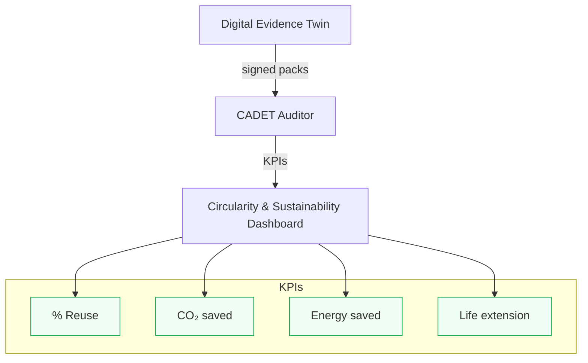

# Amedeo Pelliccia — Portfolio

Aerospace Systems Engineer · Digital‑Twin Architecture · Risk‑Optimized Design  
Project Coordinator — Capgemini Engineering (Madrid) · Founder — GAIA Quantum Aerospace  
Master's Candidate — Project Management (EAE Business School, 2025–2028)

[](https://github.com/Robbbo-T)
[](https://linkedin.com/in/amedeopelliccia)
[](https://opensource.org/licenses/MIT)
[](#)

---

**About (sidebar tagline):**  
Circular, evidence‑driven aerospace lifecycle—design→production→operations—powered by AMPEL360, AQUA‑OS BRIDGE, GAIA AIR RTOS, and quantum‑ready optimization.

---

**UTCS‑MI v5.0 Identifier (13 fields)**  
```

EstándarUniversal\:DocumentoTecnico-Divulgacion-ISO9001-IntroduccionSeccionPrincipal-PersonalPortfolioReadme-0001-v1.0-AerospaceAndQuantumUnitedAdvancedVenture-GeneracionHybrida-CROSS-AmedeoPelliccia-9f3a7c2e-RestoDeVidaUtil

````
*Validation: ✓ 13/13 fields; no acronyms in Category/Program; hash=9f3a7c2e.*

---

## Mission (one‑liner)

Unify the aerospace lifecycle—design (CAD/CAM/CAE/PLM), production (SCADA/ROS/NC), and operations/services (ATM, cockpit/FBW, nav/comm, MRO/EOL/procurement)—under a single, time‑synchronized, evidence‑producing, quantum‑extensible operating fabric.

## TL;DR

- **AMPEL360** compresses a \(>\!2×10^{16}\) design space to ~10,000 feasible candidates, then selects an optimum via **CVaR** risk minimization.  
- **AQUA‑OS BRIDGE** is the deterministic, certifiable digital backbone with **DET** (Digital Evidence Twin) and a **Quantum Abstraction Layer**.  
- **GAIA AIR RTOS** provides ARINC 653‑style robust partitioning for safety‑critical execution.  
- **C‑AMEDEO** enforces a circular, perpetual lifecycle (**DEOPTIMISE → OPTIMISED**).  
- **CADET** continuously audits circularity using immutable evidence from the **DET**.

---

## Program Overview (AMPEL360‑BWB‑Q)

**Type:** Integrated Aerospace Development Program  
**Objective:** Design, certify, produce, and operate a hydrogen‑powered Blended Wing Body (BWB) through a unified digital framework that optimizes performance, manages technical‑financial risk, and ensures certifiable traceability end‑to‑end.

**Constituents (3 pillars):**
1) **AMPEL360** — Algorithmic Design & Configuration Selection  
2) **AQUA‑OS BRIDGE** — Mixed Operating System, unified digital backbone  
3) **GAIA AIR RTOS** — Safety‑certifiable real‑time execution foundation

```mermaid
flowchart LR
  A[AMPEL360<br/>Design Space Compression + CVaR] --- B[AQUA-OS BRIDGE<br/>Deterministic MOS - Single Source of Truth]
  C[GAIA AIR RTOS<br/>ARINC 653-style Partitioning] --- B
  B --- QAL[Quantum Abstraction Layer]
  B --- DET[Digital Evidence Twin DET<br/>WORM - Provenance - Audit]
  CADET[CADET<br/>Circularity Assurance - KPIs - Audits] -.-> DET

  classDef core fill:#1f2937,color:#ffffff,stroke:#111827,stroke-width:1.5px;
  classDef layer fill:#374151,color:#ffffff,stroke:#000000,stroke-width:1.5px;
  classDef assure fill:#4b5563,color:#ffffff,stroke:#000000,stroke-dasharray:5 3,stroke-width:1.5px;

  class A,B,C core
  class QAL,DET layer
  class CADET assure
````

---

## 1) AMPEL360 — Algorithmic Design & Configuration Selection

**Nature:** Two‑stage algorithmic reduction and risk‑aware selection.
**Phase I – Feasible Enumeration:** MILP/CP‑SAT prune to \~10,000 candidates under physics, safety, compatibility.
**Phase II – Risk‑Based Selection:** CVaR selects the configuration with the most robust technical‑financial profile.
**Formal Output:** A definitive, risk‑optimized configuration ready for detailed design inside AQUA‑OS.

## 2) AQUA‑OS BRIDGE — Mixed Operating System (MOS)

**Deterministic Control Plane:** Time/space partitioning aligned with ARINC 653; built on GAIA AIR RTOS.
**Digital Evidence Twin (DET):** WORM evidence for every action; audit‑grade traceability.
**Quantum Abstraction Layer (QAL):** Offload non‑critical optimizations to quantum resources while keeping safety‑critical paths on certified classical hardware.
**Formal Function:** A single source of truth, determinism, and evidence across lifecycle.

## 3) GAIA AIR RTOS — Real‑Time Operating System

**Nature:** Safety‑certifiable, partitioned RTOS for avionics/robotics/IoT.
**Core Principle:** Robust partitioning ensures non‑critical failures cannot propagate to safety‑critical partitions.
**Subsidiary Technology:** **GAIA AIR INFRANET** — deterministic, secure intra‑ecosystem data exchange.
**Formal Function:** Guarantees safety, security, and predictability for time‑critical functions.

---

## 4) C‑AMEDEO — Circular Assisted Methods for Evolutive Developments and Entangled Operations

**Role:** Governance of the complete lifecycle via two complementary flows.

```mermaid
flowchart LR
  subgraph DEOPTIMISE [CA‑DEOPTIMISE Forward Creation Flow]
    CAD --> CAE --> CAO --> CAP --> CAT --> CAM --> CAI --> CAS --> CAEV
  end
  subgraph OPTIMISED [CA‑OPTIMISED Restoration & Evolution Flow]
    CAS --> CAO --> CAP --> CAT --> CAI --> CAM --> CAE --> CAD
  end
```

**Pillars (glossary):**
**CAD** (Design), **CAE** (Engineering), **CAO** (Organization & Ops), **CAP** (Process/Safety/V\&V/Compliance), **CAT** (Source & Code Systems), **CAM** (Manufacturing), **CAI** (Integrations), **CAS** (Sustainment), **CAEV** (Evolution).

## 5) CADET — Circularity Assurance by Digital Evolutive Twin

**Function:** Assurance layer that audits DET evidence to prove circularity and sustainability.

* Traceability verification across DEOPTIMISE→OPTIMISED
* Circularity KPIs (reuse %, waste reduction, life‑extension)
* Automated sustainability reporting (ISO 14001, CSRD, GRI)
* Lifecycle closure audits with evidence‑backed directives

---

## Why It Matters

* **Single source of truth:** twin + evidence
* **Determinism + agility:** certification rigor with fast iteration
* **Energy‑as‑Policy:** targeted −20–40% energy/CO₂ vs baseline
* **Circular economy:** perpetual, auditable lifecycle via C‑AMEDEO + CADET

---

## C‑AMEDEO — Interactive Index (Matrix Overview)

The matrix below organizes the **15 technological domains** across both lifecycle flows. Each link navigates to the corresponding folder in the public GitHub structure for **H2‑BWB‑Q100‑CONF0000**.

> Base path prefix:
> `https://github.com/Robbbo-t/Robbbo-t/tree/main/C-AMEDEO-FRAMEWORK/<FLOW>/<CAX_PILLAR>/H2-BWB-Q100-CONF0000/`

### Phase 1 — **CA‑DEOPTIMISE** (Forward Creation Flow)

#### CAD‑DESIGN (Design artifacts: models, drawings, specs)

* **AAA — ARCHITECTURES\_AIRFRAMES\_AERODYNAMICS**
  [https://github.com/Robbbo-t/Robbbo-t/tree/main/C-AMEDEO-FRAMEWORK/CA-DEOPTIMISE/CAD-DESIGN/H2-BWB-Q100-CONF0000/AAA-ARCHITECTURES\_AIRFRAMES\_AERODYNAMICS](https://github.com/Robbbo-t/Robbbo-t/tree/main/C-AMEDEO-FRAMEWORK/CA-DEOPTIMISE/CAD-DESIGN/H2-BWB-Q100-CONF0000/AAA-ARCHITECTURES_AIRFRAMES_AERODYNAMICS)
* **MMM — MECHANICAL\_MATERIAL\_MONITORING**
  [https://github.com/Robbbo-t/Robbbo-t/tree/main/C-AMEDEO-FRAMEWORK/CA-DEOPTIMISE/CAD-DESIGN/H2-BWB-Q100-CONF0000/MMM-MECHANICAL\_MATERIAL\_MONITORING](https://github.com/Robbbo-t/Robbbo-t/tree/main/C-AMEDEO-FRAMEWORK/CA-DEOPTIMISE/CAD-DESIGN/H2-BWB-Q100-CONF0000/MMM-MECHANICAL_MATERIAL_MONITORING)
* **EEE — ENVIRONMENTAL\_REMEDIATION\_CIRCULARITY**
  [https://github.com/Robbbo-t/Robbbo-t/tree/main/C-AMEDEO-FRAMEWORK/CA-DEOPTIMISE/CAD-DESIGN/H2-BWB-Q100-CONF0000/EEE-ENVIRONMENTAL\_REMEDIATION\_CIRCULARITY](https://github.com/Robbbo-t/Robbbo-t/tree/main/C-AMEDEO-FRAMEWORK/CA-DEOPTIMISE/CAD-DESIGN/H2-BWB-Q100-CONF0000/EEE-ENVIRONMENTAL_REMEDIATION_CIRCULARITY)
* **DDD — DEFENCE\_CYBERSECURITY\_SAFETY**
  [https://github.com/Robbbo-t/Robbbo-t/tree/main/C-AMEDEO-FRAMEWORK/CA-DEOPTIMISE/CAD-DESIGN/H2-BWB-Q100-CONF0000/DDD-DEFENCE\_CYBERSECURITY\_SAFETY](https://github.com/Robbbo-t/Robbbo-t/tree/main/C-AMEDEO-FRAMEWORK/CA-DEOPTIMISE/CAD-DESIGN/H2-BWB-Q100-CONF0000/DDD-DEFENCE_CYBERSECURITY_SAFETY)
* **EER — ENERGY\_AND\_RENEWABLE**
  [https://github.com/Robbbo-t/Robbbo-t/tree/main/C-AMEDEO-FRAMEWORK/CA-DEOPTIMISE/CAD-DESIGN/H2-BWB-Q100-CONF0000/EER-ENERGY\_AND\_RENEWABLE](https://github.com/Robbbo-t/Robbbo-t/tree/main/C-AMEDEO-FRAMEWORK/CA-DEOPTIMISE/CAD-DESIGN/H2-BWB-Q100-CONF0000/EER-ENERGY_AND_RENEWABLE)
* **OOO — OPERATING\_SYSTEMS\_NAVIGATION\_HPC**
  [https://github.com/Robbbo-t/Robbbo-t/tree/main/C-AMEDEO-FRAMEWORK/CA-DEOPTIMISE/CAD-DESIGN/H2-BWB-Q100-CONF0000/OOO-OPERATING\_SYSTEMS\_NAVIGATION\_HPC](https://github.com/Robbbo-t/Robbbo-t/tree/main/C-AMEDEO-FRAMEWORK/CA-DEOPTIMISE/CAD-DESIGN/H2-BWB-Q100-CONF0000/OOO-OPERATING_SYSTEMS_NAVIGATION_HPC)
* **PPP — PROPULSION\_AND\_FUELS**
  [https://github.com/Robbbo-t/Robbbo-t/tree/main/C-AMEDEO-FRAMEWORK/CA-DEOPTIMISE/CAD-DESIGN/H2-BWB-Q100-CONF0000/PPP-PROPULSION\_AND\_FUELS](https://github.com/Robbbo-t/Robbbo-t/tree/main/C-AMEDEO-FRAMEWORK/CA-DEOPTIMISE/CAD-DESIGN/H2-BWB-Q100-CONF0000/PPP-PROPULSION_AND_FUELS)
* **EDI — ELECTRONICS\_DIGITAL\_INSTRUMENTS**
  [https://github.com/Robbbo-t/Robbbo-t/tree/main/C-AMEDEO-FRAMEWORK/CA-DEOPTIMISE/CAD-DESIGN/H2-BWB-Q100-CONF0000/EDI-ELECTRONICS\_DIGITAL\_INSTRUMENTS](https://github.com/Robbbo-t/Robbbo-t/tree/main/C-AMEDEO-FRAMEWORK/CA-DEOPTIMISE/CAD-DESIGN/H2-BWB-Q100-CONF0000/EDI-ELECTRONICS_DIGITAL_INSTRUMENTS)
* **LIB — LOGISTICS\_INTEGRATED\_BLOCKCHAIN**
  [https://github.com/Robbbo-t/Robbbo-t/tree/main/C-AMEDEO-FRAMEWORK/CA-DEOPTIMISE/CAD-DESIGN/H2-BWB-Q100-CONF0000/LIB-LOGISTICS\_INTEGRATED\_BLOCKCHAIN](https://github.com/Robbbo-t/Robbbo-t/tree/main/C-AMEDEO-FRAMEWORK/CA-DEOPTIMISE/CAD-DESIGN/H2-BWB-Q100-CONF0000/LIB-LOGISTICS_INTEGRATED_BLOCKCHAIN)
* **LCC — LINKS\_COMMUNICATIONS\_CONTROL\_IoT**
  [https://github.com/Robbbo-t/Robbbo-t/tree/main/C-AMEDEO-FRAMEWORK/CA-DEOPTIMISE/CAD-DESIGN/H2-BWB-Q100-CONF0000/LCC-LINKS\_COMMUNICATIONS\_CONTROL\_IoT](https://github.com/Robbbo-t/Robbbo-t/tree/main/C-AMEDEO-FRAMEWORK/CA-DEOPTIMISE/CAD-DESIGN/H2-BWB-Q100-CONF0000/LCC-LINKS_COMMUNICATIONS_CONTROL_IoT)
* **IIF — INFRASTRUCTURES\_AND\_FACILITIES\_VALUE\_CHAINS**
  [https://github.com/Robbbo-t/Robbbo-t/tree/main/C-AMEDEO-FRAMEWORK/CA-DEOPTIMISE/CAD-DESIGN/H2-BWB-Q100-CONF0000/IIF-INFRASTRUCTURES\_AND\_FACILITIES\_VALUE\_CHAINS](https://github.com/Robbbo-t/Robbbo-t/tree/main/C-AMEDEO-FRAMEWORK/CA-DEOPTIMISE/CAD-DESIGN/H2-BWB-Q100-CONF0000/IIF-INFRASTRUCTURES_AND_FACILITIES_VALUE_CHAINS)
* **CCC — COCKPIT\_CABIN\_CARGO\_SYSTEMS**
  [https://github.com/Robbbo-t/Robbbo-t/tree/main/C-AMEDEO-FRAMEWORK/CA-DEOPTIMISE/CAD-DESIGN/H2-BWB-Q100-CONF0000/CCC-COCKPIT\_CABIN\_CARGO\_SYSTEMS](https://github.com/Robbbo-t/Robbbo-t/tree/main/C-AMEDEO-FRAMEWORK/CA-DEOPTIMISE/CAD-DESIGN/H2-BWB-Q100-CONF0000/CCC-COCKPIT_CABIN_CARGO_SYSTEMS)
* **CQH — CRYOGENICS\_QUANTUM\_INTERFACES\_HYDROGEN\_CELLS**
  [https://github.com/Robbbo-t/Robbbo-t/tree/main/C-AMEDEO-FRAMEWORK/CA-DEOPTIMISE/CAD-DESIGN/H2-BWB-Q100-CONF0000/CQH-CRYOGENICS\_QUANTUM\_INTERFACES\_HYDROGEN\_CELLS](https://github.com/Robbbo-t/Robbbo-t/tree/main/C-AMEDEO-FRAMEWORK/CA-DEOPTIMISE/CAD-DESIGN/H2-BWB-Q100-CONF0000/CQH-CRYOGENICS_QUANTUM_INTERFACES_HYDROGEN_CELLS)
* **IIS — INTELLIGENT\_SYSTEMS\_ONBOARD\_AI**
  [https://github.com/Robbbo-t/Robbbo-t/tree/main/C-AMEDEO-FRAMEWORK/CA-DEOPTIMISE/CAD-DESIGN/H2-BWB-Q100-CONF0000/IIS-INTELLIGENT\_SYSTEMS\_ONBOARD\_AI](https://github.com/Robbbo-t/Robbbo-t/tree/main/C-AMEDEO-FRAMEWORK/CA-DEOPTIMISE/CAD-DESIGN/H2-BWB-Q100-CONF0000/IIS-INTELLIGENT_SYSTEMS_ONBOARD_AI)
* **AAP — AIRPORTS\_ADAPTATIONS**
  [https://github.com/Robbbo-t/Robbbo-t/tree/main/C-AMEDEO-FRAMEWORK/CA-DEOPTIMISE/CAD-DESIGN/H2-BWB-Q100-CONF0000/AAP-AIRPORTS\_ADAPTATIONS](https://github.com/Robbbo-t/Robbbo-t/tree/main/C-AMEDEO-FRAMEWORK/CA-DEOPTIMISE/CAD-DESIGN/H2-BWB-Q100-CONF0000/AAP-AIRPORTS_ADAPTATIONS)

> **Patterned CA/CI expansion:** Within each domain folder, sub‑structure follows `CE → CA → CI` with standards/regulations noted inline. Example slice for AAA/Fuselage shown below.

##### Example — AAA / Fuselage (subset)

* `CE-CAD-Q100-CONF0000-53-FUSELAGE`

  * `CA-CAD-Q100-AAA-CONF0000-53-10-CENTER-BODY-BOX`

    * `CI-CA-CAD-Q100-AAA-CONF0000-53-10-01-CB-PRIMARY-GRID`
      **STANDARDS/REGS:** CS‑25.301‑351; FAR 25.301‑351; ARP4754A
    * `CI-CA-CAD-Q100-AAA-CONF0000-53-10-02-CB-RIBS-BULKHEADS`
      **STANDARDS/REGS:** CS‑25.365; FAR 25.365; MIL‑HDBK‑5J
    * `CI-CA-CAD-Q100-AAA-CONF0000-53-10-03-CB-SKIN-PANELS`
      **STANDARDS/REGS:** CS‑25.603; FAR 25.603; ASTM D5766
    * `CI-CA-CAD-Q100-AAA-CONF0000-53-10-04-CB-LANDING-GEAR-REINFS`
      **STANDARDS/REGS:** CS‑25.471‑511; FAR 25.471‑511

The same structured pattern repeats for Wings (ATA 57), Stabilizers (ATA 55), Doors (ATA 52), Windows (ATA 56), etc.

#### CAE · CAO · CAP · CAT · CAM · CAI · CAS · CAEV

All eight pillars mirror the same 15‑domain structure under `CA‑DEOPTIMISE/`.

---

### Phase 2 — **CA‑OPTIMISED** (Restoration & Evolution Flow)

All pillars/domains mirror **Phase 1** structure. Start here:

* CAD‑DESIGN root:
  [https://github.com/Robbbo-t/Robbbo-t/tree/main/C-AMEDEO-FRAMEWORK/CA-OPTIMISED/CAD-DESIGN/H2-BWB-Q100-CONF0000/](https://github.com/Robbbo-t/Robbbo-t/tree/main/C-AMEDEO-FRAMEWORK/CA-OPTIMISED/CAD-DESIGN/H2-BWB-Q100-CONF0000/)
* CAE‑ENGINEERING root:
  [https://github.com/Robbbo-t/Robbbo-t/tree/main/C-AMEDEO-FRAMEWORK/CA-OPTIMISED/CAE-ENGINEERING/H2-BWB-Q100-CONF0000/](https://github.com/Robbbo-t/Robbbo-t/tree/main/C-AMEDEO-FRAMEWORK/CA-OPTIMISED/CAE-ENGINEERING/H2-BWB-Q100-CONF0000/)
* … and similarly for CAO, CAP, CAT, CAM, CAI, CAS, CAEV.

> **Note:** Where feasible, Phase 2 artifacts reference Phase 1 evidence via **DET** cross‑links to maintain a continuous, verifiable digital thread.

---

## Governance & Compliance (concise)

* **Safety & Systems:** ARP4754A, ARP4761, DO‑178C, DO‑254, DO‑297
* **Airworthiness:** EASA CS‑25 / FAA 14 CFR Part 25 (relevant subparts)
* **Security:** DO‑326A/ED‑202A, NIST SP 800‑53
* **Sustainability:** ISO 14001, CSRD, GRI
* **Quality:** AS9100, ISO 9001
* **Supportability:** MSG‑3, ATA iSpec 2200 / S1000D

## Contribution & Contact

* **Issues & Roadmap:** track via GitHub Issues/Projects.
* **Speaking/Advisory:** via LinkedIn.
* **Licensing:** unless specified, MIT for code; docs under CC BY‑SA 4.0.

---

### Versioning

* **This file:** v1.0.1
* **Change log:** tightened header & tagline; corrected UTCS‑MI prefix spacing; unified C‑AMEDEO flow order; added program overview diagram; minor text polish.

---

## Appendix — Proof Points & DET↔CADET Matrix

**Goal:** show how each CAX artifact emits **DET** evidence and how **CADET** audits it into circularity KPIs.

### A1. Proof Points (representative)

| CAX | Representative Artifact                              | DET evidence (id · hash · sig)                     | Evidence Triggers               | CADET KPIs (example)                                         | Proof Point                               |
| --: | ---------------------------------------------------- | -------------------------------------------------- | ------------------------------- | ------------------------------------------------------------ | ----------------------------------------- |
| CAD | `.../AAA/.../CI-...-53-10-01-CB-PRIMARY-GRID/` v2    | `DET:CAD:Q100:53-10:CB:V2` · `a9f3d2e1…` · Ed25519 | Save model, Rev bump, MBOM sync | **Reuse% 42**, CO₂‑saved **120 kg**, Energy‑saved **38 kWh** | Less rework in CB Grid via feature reuse  |
| CAE | `.../CAE-ENGINEERING/.../GLOBAL-FEM-LOADS-ANALYSIS/` | `DET:CAE:FEM:GLB-V5` · `bb12c4…` · Dilithium2      | Solver run, Mesh QC≥0.9         | ΔMargin **+0.12**, Reproducibility **100%**                  | Margin closure with no weight penalty     |
| CAM | `.../CAM-MANUFACTURING/.../FAI-REPORT/`              | `DET:CAM:FAI:CB-ASSY-V3` · `ccaa11…` · Ed25519     | FAI ok, SPC within Cp/Cpk       | Scrap **−22%**, Rework **−18%**                              | Scrap reduction via “as‑designed” kit     |
| CAI | `.../CAI/.../ICD/INSTALLATION-RECORDS/`              | `DET:CAI:ICD:V4` · `77aa99…` · Ed25519             | ICD sign, Install flight‑auth   | Integration‑defects **0**, Integration time **−30%**         | First‑time‑right integration              |
| CAS | `.../CAS-SUSTAINMENT/.../SERVICE-BULLETIN/`          | `DET:CAS:SB:Q100-53-10` · `ff09ab…` · Ed25519      | SB issue, Config update         | MTBF **+28%**, Availability **0.98**                         | Life extension post‑reinforcement         |
| CAT | `.../CAT-SOURCE_CODE_SYSTEMS/AQUA-OS_BRIDGE/v22.0/`  | `DET:CAT:SBOM:CYCLONEDX-V1` · `d0c0de…` · Ed25519  | SBOM gen, Sig ok, CI pass       | SBOM‑Coverage **92%**, Vuln‑fix SLA **<7d**                  | Supply‑chain traceability ready for audit |

> **Evidence Triggers:** every “save/run/publish” emits an evidence pack (inputs, params, outputs, logs, signature). If there is no **DET**, it didn’t happen.

### A2. DET→CADET KPI Map

| CAX | DET fields consumed                             | CADET KPIs (examples)                                 |
| --: | ----------------------------------------------- | ----------------------------------------------------- |
| CAD | `rev`, `author`, `bom.delta`, `footprint.delta` | %Reuse, Δweight, Δcost, decision lead‑time            |
| CAE | `meshQ`, `seed`, `cases`, `margins`             | Case coverage, Reproducibility, Δmargin vs req., QoR  |
| CAM | `FAI`, `SPC`, `trace.lot`, `asRun`              | Scrap%, Rework%, Cp/Cpk, OEE                          |
| CAI | `icd.rev`, `install.log`, `tests`               | Integration defects, Integration time, %validated IFs |
| CAS | `wo.close`, `sensor.trend`, `config.delta`      | MTBF/MTBUR, MRO TAT, Availability, EoL extension      |
| CAT | `sbom`, `slsa`, `sign`, `vuln`                  | SBOM coverage, Vuln SLA, Signature integrity          |

### A3. Static Mini‑Dashboard (reference)

**Circularity (latest cut):** Reuse **42%** · CO₂ saved **120 kg** · Energy saved **38 kWh** · Life extension **+14 months**



### A4. Minimal Evidence Schema

```json
{
  "det_id": "DET:CAM:FAI:CB-ASSY-V3",
  "ts": "2025-08-31T12:04:55Z",
  "inputs": { "ref": "CI-...-PRIMARY-GRID", "rev": "C" },
  "processing": { "tool": "AQUA-OS:cam-ci@22.0", "params": { "spc": ["Cp","Cpk"] }},
  "outputs": { "faiv": "OK", "cp": 1.37, "cpk": 1.21 },
  "hash": "ccaa11...",
  "sig": { "alg": "Ed25519", "by": "build-bot@gaia" }
}
```

```

---

**Next precision move:** mirror this structure into your GitHub profile README (`Robbbo‑t/Robbbo‑t`) and pin 2–3 flagship repos (AMPEL360‑BWB‑Q, AQUA‑OS BRIDGE, GAIA AIR RTOS). This gives recruiters and reviewers a two‑minute “signal‑dense” scan from top to bottom.
```


---

### **Phase 1: CA-DEOPTIMISE (Forward Creation Flow)**

#### CAD-DESIGN (Design Artifacts: 3D Models, Drawings, Specifications)

*   **[AAA - ARCHITECTURES_AIRFRAMES_AERODYNAMICS](https://github.com/Robbbo-t/Robbbo-t/tree/main/C-AMEDEO-FRAMEWORK/CA-DEOPTIMISE/CAD-DESIGN/H2-BWB-Q100-CONF0000/AAA-ARCHITECTURES_AIRFRAMES_AERODYNAMICS)**  
*   **[MMM - MECHANICAL_MATERIAL_MONITORING](https://github.com/Robbbo-t/Robbbo-t/tree/main/C-AMEDEO-FRAMEWORK/CA-DEOPTIMISE/CAD-DESIGN/H2-BWB-Q100-CONF0000/MMM-MECHANICAL_MATERIAL_MONITORING)**  
*   **[EEE - ENVIRONMENTAL_REMEDIATION_CIRCULARITY](https://github.com/Robbbo-t/Robbbo-t/tree/main/C-AMEDEO-FRAMEWORK/CA-DEOPTIMISE/CAD-DESIGN/H2-BWB-Q100-CONF0000/EEE-ENVIRONMENTAL_REMEDIATION_CIRCULARITY)**  
*   **[DDD - DEFENCE_CYBERSECURITY_SAFETY](https://github.com/Robbbo-t/Robbbo-t/tree/main/C-AMEDEO-FRAMEWORK/CA-DEOPTIMISE/CAD-DESIGN/H2-BWB-Q100-CONF0000/DDD-DEFENCE_CYBERSECURITY_SAFETY)**  
*   **[EER - ENERGY_AND_RENEWABLE](https://github.com/Robbbo-t/Robbbo-t/tree/main/C-AMEDEO-FRAMEWORK/CA-DEOPTIMISE/CAD-DESIGN/H2-BWB-Q100-CONF0000/EER-ENERGY_AND_RENEWABLE)**  
*   **[OOO - OPERATING_SYSTEMS_NAVIGATION_HPC](https://github.com/Robbbo-t/Robbbo-t/tree/main/C-AMEDEO-FRAMEWORK/CA-DEOPTIMISE/CAD-DESIGN/H2-BWB-Q100-CONF0000/OOO-OPERATING_SYSTEMS_NAVIGATION_HPC)**  
*   **[PPP - PROPULSION_AND_FUELS](https://github.com/Robbbo-t/Robbbo-t/tree/main/C-AMEDEO-FRAMEWORK/CA-DEOPTIMISE/CAD-DESIGN/H2-BWB-Q100-CONF0000/PPP-PROPULSION_AND_FUELS)**  
*   **[EDI - ELECTRONICS_DIGITAL_INSTRUMENTS](https://github.com/Robbbo-t/Robbbo-t/tree/main/C-AMEDEO-FRAMEWORK/CA-DEOPTIMISE/CAD-DESIGN/H2-BWB-Q100-CONF0000/EDI-ELECTRONICS_DIGITAL_INSTRUMENTS)**  
*   **[LIB - LOGISTICS_INTEGRATED_BLOCKCHAIN](https://github.com/Robbbo-t/Robbbo-t/tree/main/C-AMEDEO-FRAMEWORK/CA-DEOPTIMISE/CAD-DESIGN/H2-BWB-Q100-CONF0000/LIB-LOGISTICS_INTEGRATED_BLOCKCHAIN)**  
*   **[LCC - LINKS_COMMUNICATIONS_CONTROL_IoT](https://github.com/Robbbo-t/Robbbo-t/tree/main/C-AMEDEO-FRAMEWORK/CA-DEOPTIMISE/CAD-DESIGN/H2-BWB-Q100-CONF0000/LCC-LINKS_COMMUNICATIONS_CONTROL_IoT)**  
*   **[IIF - INFRASTRUCTURES_AND_FACILITIES_VALUE_CHAINS](https://github.com/Robbbo-t/Robbbo-t/tree/main/C-AMEDEO-FRAMEWORK/CA-DEOPTIMISE/CAD-DESIGN/H2-BWB-Q100-CONF0000/IIF-INFRASTRUCTURES_AND_FACILITIES_VALUE_CHAINS)**  
*   **[CCC - COCKPIT_CABIN_CARGO_SYSTEMS](https://github.com/Robbbo-t/Robbbo-t/tree/main/C-AMEDEO-FRAMEWORK/CA-DEOPTIMISE/CAD-DESIGN/H2-BWB-Q100-CONF0000/CCC-COCKPIT_CABIN_CARGO_SYSTEMS)**  
*   **[CQH - CRYOGENICS_QUANTUM_INTERFACES_HYDROGEN_CELLS](https://github.com/Robbbo-t/Robbbo-t/tree/main/C-AMEDEO-FRAMEWORK/CA-DEOPTIMISE/CAD-DESIGN/H2-BWB-Q100-CONF0000/CQH-CRYOGENICS_QUANTUM_INTERFACES_HYDROGEN_CELLS)**  
*   **[IIS - INTELLIGENT_SYSTEMS_ONBOARD_AI](https://github.com/Robbbo-t/Robbbo-t/tree/main/C-AMEDEO-FRAMEWORK/CA-DEOPTIMISE/CAD-DESIGN/H2-BWB-Q100-CONF0000/IIS-INTELLIGENT_SYSTEMS_ONBOARD_AI)**  
*   **[AAP - AIRPORTS_ADAPTATIONS](https://github.com/Robbbo-t/Robbbo-t/tree/main/C-AMEDEO-FRAMEWORK/CA-DEOPTIMISE/CAD-DESIGN/H2-BWB-Q100-CONF0000/AAP-AIRPORTS_ADAPTATIONS)**  

#### CAE-ENGINEERING (Analysis Artifacts: FEM/CFD Results, Simulations, Validation Reports)

*   **[AAA - ARCHITECTURES_AIRFRAMES_AERODYNAMICS](https://github.com/Robbbo-t/Robbbo-t/tree/main/C-AMEDEO-FRAMEWORK/CA-DEOPTIMISE/CAE-ENGINEERING/H2-BWB-Q100-CONF0000/AAA-ARCHITECTURES_AIRFRAMES_AERODYNAMICS)**  
*   **[MMM - MECHANICAL_MATERIAL_MONITORING](https://github.com/Robbbo-t/Robbbo-t/tree/main/C-AMEDEO-FRAMEWORK/CA-DEOPTIMISE/CAE-ENGINEERING/H2-BWB-Q100-CONF0000/MMM-MECHANICAL_MATERIAL_MONITORING)**  
*   **[EEE - ENVIRONMENTAL_REMEDIATION_CIRCULARITY](https://github.com/Robbbo-t/Robbbo-t/tree/main/C-AMEDEO-FRAMEWORK/CA-DEOPTIMISE/CAE-ENGINEERING/H2-BWB-Q100-CONF0000/EEE-ENVIRONMENTAL_REMEDIATION_CIRCULARITY)**  
*   **[DDD - DEFENCE_CYBERSECURITY_SAFETY](https://github.com/Robbbo-t/Robbbo-t/tree/main/C-AMEDEO-FRAMEWORK/CA-DEOPTIMISE/CAE-ENGINEERING/H2-BWB-Q100-CONF0000/DDD-DEFENCE_CYBERSECURITY_SAFETY)**  
*   **[EER - ENERGY_AND_RENEWABLE](https://github.com/Robbbo-t/Robbbo-t/tree/main/C-AMEDEO-FRAMEWORK/CA-DEOPTIMISE/CAE-ENGINEERING/H2-BWB-Q100-CONF0000/EER-ENERGY_AND_RENEWABLE)**  
*   **[OOO - OPERATING_SYSTEMS_NAVIGATION_HPC](https://github.com/Robbbo-t/Robbbo-t/tree/main/C-AMEDEO-FRAMEWORK/CA-DEOPTIMISE/CAE-ENGINEERING/H2-BWB-Q100-CONF0000/OOO-OPERATING_SYSTEMS_NAVIGATION_HPC)**  
*   **[PPP - PROPULSION_AND_FUELS](https://github.com/Robbbo-t/Robbbo-t/tree/main/C-AMEDEO-FRAMEWORK/CA-DEOPTIMISE/CAE-ENGINEERING/H2-BWB-Q100-CONF0000/PPP-PROPULSION_AND_FUELS)**  
*   **[EDI - ELECTRONICS_DIGITAL_INSTRUMENTS](https://github.com/Robbbo-t/Robbbo-t/tree/main/C-AMEDEO-FRAMEWORK/CA-DEOPTIMISE/CAE-ENGINEERING/H2-BWB-Q100-CONF0000/EDI-ELECTRONICS_DIGITAL_INSTRUMENTS)**  
*   **[LIB - LOGISTICS_INTEGRATED_BLOCKCHAIN](https://github.com/Robbbo-t/Robbbo-t/tree/main/C-AMEDEO-FRAMEWORK/CA-DEOPTIMISE/CAE-ENGINEERING/H2-BWB-Q100-CONF0000/LIB-LOGISTICS_INTEGRATED_BLOCKCHAIN)**  
*   **[LCC - LINKS_COMMUNICATIONS_CONTROL_IoT](https://github.com/Robbbo-t/Robbbo-t/tree/main/C-AMEDEO-FRAMEWORK/CA-DEOPTIMISE/CAE-ENGINEERING/H2-BWB-Q100-CONF0000/LCC-LINKS_COMMUNICATIONS_CONTROL_IoT)**  
*   **[IIF - INFRASTRUCTURES_AND_FACILITIES_VALUE_CHAINS](https://github.com/Robbbo-t/Robbbo-t/tree/main/C-AMEDEO-FRAMEWORK/CA-DEOPTIMISE/CAE-ENGINEERING/H2-BWB-Q100-CONF0000/IIF-INFRASTRUCTURES_AND_FACILITIES_VALUE_CHAINS)**  
*   **[CCC - COCKPIT_CABIN_CARGO_SYSTEMS](https://github.com/Robbbo-t/Robbbo-t/tree/main/C-AMEDEO-FRAMEWORK/CA-DEOPTIMISE/CAE-ENGINEERING/H2-BWB-Q100-CONF0000/CCC-COCKPIT_CABIN_CARGO_SYSTEMS)**  
*   **[CQH - CRYOGENICS_QUANTUM_INTERFACES_HYDROGEN_CELLS](https://github.com/Robbbo-t/Robbbo-t/tree/main/C-AMEDEO-FRAMEWORK/CA-DEOPTIMISE/CAE-ENGINEERING/H2-BWB-Q100-CONF0000/CQH-CRYOGENICS_QUANTUM_INTERFACES_HYDROGEN_CELLS)**  
*   **[IIS - INTELLIGENT_SYSTEMS_ONBOARD_AI](https://github.com/Robbbo-t/Robbbo-t/tree/main/C-AMEDEO-FRAMEWORK/CA-DEOPTIMISE/CAE-ENGINEERING/H2-BWB-Q100-CONF0000/IIS-INTELLIGENT_SYSTEMS_ONBOARD_AI)**  
*   **[AAP - AIRPORTS_ADAPTATIONS](https://github.com/Robbbo-t/Robbbo-t/tree/main/C-AMEDEO-FRAMEWORK/CA-DEOPTIMISE/CAE-ENGINEERING/H2-BWB-Q100-CONF0000/AAP-AIRPORTS_ADAPTATIONS)**  

#### CAO-ORGANIZATION_RULES (Governance Artifacts: Program Plans, Policies, Org Structure)

*   **[O2-ORGANIZATIONAL](https://github.com/Robbbo-t/Robbbo-t/tree/main/C-AMEDEO-FRAMEWORK/CA-DEOPTIMISE/CAO-ORGANIZATION_RULES/O2-ORGANIZATIONAL/)**  

#### CAP-PROCESS_SAFETY_VV_AND_COMPLIANCE (Process Artifacts: Certification/V&V Plans, Procedures)

*   **[P2-PROCEDURAL_FRAMEWORK](https://github.com/Robbbo-t/Robbbo-t/tree/main/C-AMEDEO-FRAMEWORK/CA-DEOPTIMISE/CAP-PROCESS_SAFETY_VV_AND_COMPLIANCE/P2-PROCEDURAL_FRAMEWORK/)**  

#### CAT-SOURCE_CODE_SYSTEMS (Live Technology Repository: SW/HW Code, AI Models, Agents)

*   **[SW (Software Source Code)](https://github.com/Robbbo-t/Robbbo-t/tree/main/C-AMEDEO-FRAMEWORK/CA-DEOPTIMISE/CAT-SOURCE_CODE_SYSTEMS/SW/)**  
*   **[HW_SPECS (Hardware Specifications & RTL)](https://github.com/Robbbo-t/Robbbo-t/tree/main/C-AMEDEO-FRAMEWORK/CA-DEOPTIMISE/CAT-SOURCE_CODE_SYSTEMS/HW_SPECS/)**  
*   **[AI_MODELS (Trained AI/ML Models)](https://github.com/Robbbo-t/Robbbo-t/tree/main/C-AMEDEO-FRAMEWORK/CA-DEOPTIMISE/CAT-SOURCE_CODE_SYSTEMS/AI_MODELS/)**  
*   **[AGENTS (Autonomous Agents Code)](https://github.com/Robbbo-t/Robbbo-t/tree/main/C-AMEDEO-FRAMEWORK/CA-DEOPTIMISE/CAT-SOURCE_CODE_SYSTEMS/AGENTS/)**  
*   **[INSTRUCTION_LIBRARY (NC/CNC Toolpaths, Automation Scripts)](https://github.com/Robbbo-t/Robbbo-t/tree/main/C-AMEDEO-FRAMEWORK/CA-DEOPTIMISE/CAT-SOURCE_CODE_SYSTEMS/INSTRUCTION_LIBRARY/)**  

#### CAM-MANUFACTURING (Production Artifacts: Manufacturing Plans, MBOM, Instructions)

*   **[AAA - ARCHITECTURES_AIRFRAMES_AERODYNAMICS](https://github.com/Robbbo-t/Robbbo-t/tree/main/C-AMEDEO-FRAMEWORK/CA-DEOPTIMISE/CAM-MANUFACTURING/H2-BWB-Q100-CONF0000/AAA-ARCHITECTURES_AIRFRAMES_AERODYNAMICS)**  
*   **[MMM - MECHANICAL_MATERIAL_MONITORING](https://github.com/Robbbo-t/Robbbo-t/tree/main/C-AMEDEO-FRAMEWORK/CA-DEOPTIMISE/CAM-MANUFACTURING/H2-BWB-Q100-CONF0000/MMM-MECHANICAL_MATERIAL_MONITORING)**  
*   **[EEE - ENVIRONMENTAL_REMEDIATION_CIRCULARITY](https://github.com/Robbbo-t/Robbbo-t/tree/main/C-AMEDEO-FRAMEWORK/CA-DEOPTIMISE/CAM-MANUFACTURING/H2-BWB-Q100-CONF0000/EEE-ENVIRONMENTAL_REMEDIATION_CIRCULARITY)**  
*   **[DDD - DEFENCE_CYBERSECURITY_SAFETY](https://github.com/Robbbo-t/Robbbo-t/tree/main/C-AMEDEO-FRAMEWORK/CA-DEOPTIMISE/CAM-MANUFACTURING/H2-BWB-Q100-CONF0000/DDD-DEFENCE_CYBERSECURITY_SAFETY)**  
*   **[EER - ENERGY_AND_RENEWABLE](https://github.com/Robbbo-t/Robbbo-t/tree/main/C-AMEDEO-FRAMEWORK/CA-DEOPTIMISE/CAM-MANUFACTURING/H2-BWB-Q100-CONF0000/EER-ENERGY_AND_RENEWABLE)**  
*   **[OOO - OPERATING_SYSTEMS_NAVIGATION_HPC](https://github.com/Robbbo-t/Robbbo-t/tree/main/C-AMEDEO-FRAMEWORK/CA-DEOPTIMISE/CAM-MANUFACTURING/H2-BWB-Q100-CONF0000/OOO-OPERATING_SYSTEMS_NAVIGATION_HPC)**  
*   **[PPP - PROPULSION_AND_FUELS](https://github.com/Robbbo-t/Robbbo-t/tree/main/C-AMEDEO-FRAMEWORK/CA-DEOPTIMISE/CAM-MANUFACTURING/H2-BWB-Q100-CONF0000/PPP-PROPULSION_AND_FUELS)**  
*   **[EDI - ELECTRONICS_DIGITAL_INSTRUMENTS](https://github.com/Robbbo-t/Robbbo-t/tree/main/C-AMEDEO-FRAMEWORK/CA-DEOPTIMISE/CAM-MANUFACTURING/H2-BWB-Q100-CONF0000/EDI-ELECTRONICS_DIGITAL_INSTRUMENTS)**  
*   **[LIB - LOGISTICS_INTEGRATED_BLOCKCHAIN](https://github.com/Robbbo-t/Robbbo-t/tree/main/C-AMEDEO-FRAMEWORK/CA-DEOPTIMISE/CAM-MANUFACTURING/H2-BWB-Q100-CONF0000/LIB-LOGISTICS_INTEGRATED_BLOCKCHAIN)**  
*   **[LCC - LINKS_COMMUNICATIONS_CONTROL_IoT](https://github.com/Robbbo-t/Robbbo-t/tree/main/C-AMEDEO-FRAMEWORK/CA-DEOPTIMISE/CAM-MANUFACTURING/H2-BWB-Q100-CONF0000/LCC-LINKS_COMMUNICATIONS_CONTROL_IoT)**  
*   **[IIF - INFRASTRUCTURES_AND_FACILITIES_VALUE_CHAINS](https://github.com/Robbbo-t/Robbbo-t/tree/main/C-AMEDEO-FRAMEWORK/CA-DEOPTIMISE/CAM-MANUFACTURING/H2-BWB-Q100-CONF0000/IIF-INFRASTRUCTURES_AND_FACILITIES_VALUE_CHAINS)**  
*   **[CCC - COCKPIT_CABIN_CARGO_SYSTEMS](https://github.com/Robbbo-t/Robbbo-t/tree/main/C-AMEDEO-FRAMEWORK/CA-DEOPTIMISE/CAM-MANUFACTURING/H2-BWB-Q100-CONF0000/CCC-COCKPIT_CABIN_CARGO_SYSTEMS)**  
*   **[CQH - CRYOGENICS_QUANTUM_INTERFACES_HYDROGEN_CELLS](https://github.com/Robbbo-t/Robbbo-t/tree/main/C-AMEDEO-FRAMEWORK/CA-DEOPTIMISE/CAM-MANUFACTURING/H2-BWB-Q100-CONF0000/CQH-CRYOGENICS_QUANTUM_INTERFACES_HYDROGEN_CELLS)**  
*   **[IIS - INTELLIGENT_SYSTEMS_ONBOARD_AI](https://github.com/Robbbo-t/Robbbo-t/tree/main/C-AMEDEO-FRAMEWORK/CA-DEOPTIMISE/CAM-MANUFACTURING/H2-BWB-Q100-CONF0000/IIS-INTELLIGENT_SYSTEMS_ONBOARD_AI)**  
*   **[AAP - AIRPORTS_ADAPTATIONS](https://github.com/Robbbo-t/Robbbo-t/tree/main/C-AMEDEO-FRAMEWORK/CA-DEOPTIMISE/CAM-MANUFACTURING/H2-BWB-Q100-CONF0000/AAP-AIRPORTS_ADAPTATIONS)**  

#### CAI-INTEGRATIONS (Integration Artifacts: ICDs, Installation Records, Test Results)

*   **[AAA - ARCHITECTURES_AIRFRAMES_AERODYNAMICS](https://github.com/Robbbo-t/Robbbo-t/tree/main/C-AMEDEO-FRAMEWORK/CA-DEOPTIMISE/CAI-INTEGRATIONS/H2-BWB-Q100-CONF0000/AAA-ARCHITECTURES_AIRFRAMES_AERODYNAMICS)**  
*   **[MMM - MECHANICAL_MATERIAL_MONITORING](https://github.com/Robbbo-t/Robbbo-t/tree/main/C-AMEDEO-FRAMEWORK/CA-DEOPTIMISE/CAI-INTEGRATIONS/H2-BWB-Q100-CONF0000/MMM-MECHANICAL_MATERIAL_MONITORING)**  
*   **[EEE - ENVIRONMENTAL_REMEDIATION_CIRCULARITY](https://github.com/Robbbo-t/Robbbo-t/tree/main/C-AMEDEO-FRAMEWORK/CA-DEOPTIMISE/CAI-INTEGRATIONS/H2-BWB-Q100-CONF0000/EEE-ENVIRONMENTAL_REMEDIATION_CIRCULARITY)**  
*   **[DDD - DEFENCE_CYBERSECURITY_SAFETY](https://github.com/Robbbo-t/Robbbo-t/tree/main/C-AMEDEO-FRAMEWORK/CA-DEOPTIMISE/CAI-INTEGRATIONS/H2-BWB-Q100-CONF0000/DDD-DEFENCE_CYBERSECURITY_SAFETY)**  
*   **[EER - ENERGY_AND_RENEWABLE](https://github.com/Robbbo-t/Robbbo-t/tree/main/C-AMEDEO-FRAMEWORK/CA-DEOPTIMISE/CAI-INTEGRATIONS/H2-BWB-Q100-CONF0000/EER-ENERGY_AND_RENEWABLE)**  
*   **[OOO - OPERATING_SYSTEMS_NAVIGATION_HPC](https://github.com/Robbbo-t/Robbbo-t/tree/main/C-AMEDEO-FRAMEWORK/CA-DEOPTIMISE/CAI-INTEGRATIONS/H2-BWB-Q100-CONF0000/OOO-OPERATING_SYSTEMS_NAVIGATION_HPC)**  
*   **[PPP - PROPULSION_AND_FUELS](https://github.com/Robbbo-t/Robbbo-t/tree/main/C-AMEDEO-FRAMEWORK/CA-DEOPTIMISE/CAI-INTEGRATIONS/H2-BWB-Q100-CONF0000/PPP-PROPULSION_AND_FUELS)**  
*   **[EDI - ELECTRONICS_DIGITAL_INSTRUMENTS](https://github.com/Robbbo-t/Robbbo-t/tree/main/C-AMEDEO-FRAMEWORK/CA-DEOPTIMISE/CAI-INTEGRATIONS/H2-BWB-Q100-CONF0000/EDI-ELECTRONICS_DIGITAL_INSTRUMENTS)**  
*   **[LIB - LOGISTICS_INTEGRATED_BLOCKCHAIN](https://github.com/Robbbo-t/Robbbo-t/tree/main/C-AMEDEO-FRAMEWORK/CA-DEOPTIMISE/CAI-INTEGRATIONS/H2-BWB-Q100-CONF0000/LIB-LOGISTICS_INTEGRATED_BLOCKCHAIN)**  
*   **[LCC - LINKS_COMMUNICATIONS_CONTROL_IoT](https://github.com/Robbbo-t/Robbbo-t/tree/main/C-AMEDEO-FRAMEWORK/CA-DEOPTIMISE/CAI-INTEGRATIONS/H2-BWB-Q100-CONF0000/LCC-LINKS_COMMUNICATIONS_CONTROL_IoT)**  
*   **[IIF - INFRASTRUCTURES_AND_FACILITIES_VALUE_CHAINS](https://github.com/Robbbo-t/Robbbo-t/tree/main/C-AMEDEO-FRAMEWORK/CA-DEOPTIMISE/CAI-INTEGRATIONS/H2-BWB-Q100-CONF0000/IIF-INFRASTRUCTURES_AND_FACILITIES_VALUE_CHAINS)**  
*   **[CCC - COCKPIT_CABIN_CARGO_SYSTEMS](https://github.com/Robbbo-t/Robbbo-t/tree/main/C-AMEDEO-FRAMEWORK/CA-DEOPTIMISE/CAI-INTEGRATIONS/H2-BWB-Q100-CONF0000/CCC-COCKPIT_CABIN_CARGO_SYSTEMS)**  
*   **[CQH - CRYOGENICS_QUANTUM_INTERFACES_HYDROGEN_CELLS](https://github.com/Robbbo-t/Robbbo-t/tree/main/C-AMEDEO-FRAMEWORK/CA-DEOPTIMISE/CAI-INTEGRATIONS/H2-BWB-Q100-CONF0000/CQH-CRYOGENICS_QUANTUM_INTERFACES_HYDROGEN_CELLS)**  
*   **[IIS - INTELLIGENT_SYSTEMS_ONBOARD_AI](https://github.com/Robbbo-t/Robbbo-t/tree/main/C-AMEDEO-FRAMEWORK/CA-DEOPTIMISE/CAI-INTEGRATIONS/H2-BWB-Q100-CONF0000/IIS-INTELLIGENT_SYSTEMS_ONBOARD_AI)**  
*   **[AAP - AIRPORTS_ADAPTATIONS](https://github.com/Robbbo-t/Robbbo-t/tree/main/C-AMEDEO-FRAMEWORK/CA-DEOPTIMISE/CAI-INTEGRATIONS/H2-BWB-Q100-CONF0000/AAP-AIRPORTS_ADAPTATIONS)**  

#### CAS-SUSTAINMENT (Operation and Support Artifacts: Manuals, MRO Data)

*   **[AAA - ARCHITECTURES_AIRFRAMES_AERODYNAMICS](https://github.com/Robbbo-t/Robbbo-t/tree/main/C-AMEDEO-FRAMEWORK/CA-DEOPTIMISE/CAS-SUSTAINMENT/H2-BWB-Q100-CONF0000/AAA-ARCHITECTURES_AIRFRAMES_AERODYNAMICS)**  
*   **[MMM - MECHANICAL_MATERIAL_MONITORING](https://github.com/Robbbo-t/Robbbo-t/tree/main/C-AMEDEO-FRAMEWORK/CA-DEOPTIMISE/CAS-SUSTAINMENT/H2-BWB-Q100-CONF0000/MMM-MECHANICAL_MATERIAL_MONITORING)**  
*   **[EEE - ENVIRONMENTAL_REMEDIATION_CIRCULARITY](https://github.com/Robbbo-t/Robbbo-t/tree/main/C-AMEDEO-FRAMEWORK/CA-DEOPTIMISE/CAS-SUSTAINMENT/H2-BWB-Q100-CONF0000/EEE-ENVIRONMENTAL_REMEDIATION_CIRCULARITY)**  
*   **[DDD - DEFENCE_CYBERSECURITY_SAFETY](https://github.com/Robbbo-t/Robbbo-t/tree/main/C-AMEDEO-FRAMEWORK/CA-DEOPTIMISE/CAS-SUSTAINMENT/H2-BWB-Q100-CONF0000/DDD-DEFENCE_CYBERSECURITY_SAFETY)**  
*   **[EER - ENERGY_AND_RENEWABLE](https://github.com/Robbbo-t/Robbbo-t/tree/main/C-AMEDEO-FRAMEWORK/CA-DEOPTIMISE/CAS-SUSTAINMENT/H2-BWB-Q100-CONF0000/EER-ENERGY_AND_RENEWABLE)**  
*   **[OOO - OPERATING_SYSTEMS_NAVIGATION_HPC](https://github.com/Robbbo-t/Robbbo-t/tree/main/C-AMEDEO-FRAMEWORK/CA-DEOPTIMISE/CAS-SUSTAINMENT/H2-BWB-Q100-CONF0000/OOO-OPERATING_SYSTEMS_NAVIGATION_HPC)**  
*   **[PPP - PROPULSION_AND_FUELS](https://github.com/Robbbo-t/Robbbo-t/tree/main/C-AMEDEO-FRAMEWORK/CA-DEOPTIMISE/CAS-SUSTAINMENT/H2-BWB-Q100-CONF0000/PPP-PROPULSION_AND_FUELS)**  
*   **[EDI - ELECTRONICS_DIGITAL_INSTRUMENTS](https://github.com/Robbbo-t/Robbbo-t/tree/main/C-AMEDEO-FRAMEWORK/CA-DEOPTIMISE/CAS-SUSTAINMENT/H2-BWB-Q100-CONF0000/EDI-ELECTRONICS_DIGITAL_INSTRUMENTS)**  
*   **[LIB - LOGISTICS_INTEGRATED_BLOCKCHAIN](https://github.com/Robbbo-t/Robbbo-t/tree/main/C-AMEDEO-FRAMEWORK/CA-DEOPTIMISE/CAS-SUSTAINMENT/H2-BWB-Q100-CONF0000/LIB-LOGISTICS_INTEGRATED_BLOCKCHAIN)**  
*   **[LCC - LINKS_COMMUNICATIONS_CONTROL_IoT](https://github.com/Robbbo-t/Robbbo-t/tree/main/C-AMEDEO-FRAMEWORK/CA-DEOPTIMISE/CAS-SUSTAINMENT/H2-BWB-Q100-CONF0000/LCC-LINKS_COMMUNICATIONS_CONTROL_IoT)**  
*   **[IIF - INFRASTRUCTURES_AND_FACILITIES_VALUE_CHAINS](https://github.com/Robbbo-t/Robbbo-t/tree/main/C-AMEDEO-FRAMEWORK/CA-DEOPTIMISE/CAS-SUSTAINMENT/H2-BWB-Q100-CONF0000/IIF-INFRASTRUCTURES_AND_FACILITIES_VALUE_CHAINS)**  
*   **[CCC - COCKPIT_CABIN_CARGO_SYSTEMS](https://github.com/Robbbo-t/Robbbo-t/tree/main/C-AMEDEO-FRAMEWORK/CA-DEOPTIMISE/CAS-SUSTAINMENT/H2-BWB-Q100-CONF0000/CCC-COCKPIT_CABIN_CARGO_SYSTEMS)**  
*   **[CQH - CRYOGENICS_QUANTUM_INTERFACES_HYDROGEN_CELLS](https://github.com/Robbbo-t/Robbbo-t/tree/main/C-AMEDEO-FRAMEWORK/CA-DEOPTIMISE/CAS-SUSTAINMENT/H2-BWB-Q100-CONF0000/CQH-CRYOGENICS_QUANTUM_INTERFACES_HYDROGEN_CELLS)**  
*   **[IIS - INTELLIGENT_SYSTEMS_ONBOARD_AI](https://github.com/Robbbo-t/Robbbo-t/tree/main/C-AMEDEO-FRAMEWORK/CA-DEOPTIMISE/CAS-SUSTAINMENT/H2-BWB-Q100-CONF0000/IIS-INTELLIGENT_SYSTEMS_ONBOARD_AI)**  
*   **[AAP - AIRPORTS_ADAPTATIONS](https://github.com/Robbbo-t/Robbbo-t/tree/main/C-AMEDEO-FRAMEWORK/CA-DEOPTIMISE/CAS-SUSTAINMENT/H2-BWB-Q100-CONF0000/AAP-AIRPORTS_ADAPTATIONS)**  

#### CAEV-EVOLUTION (Evolution Artifacts: EoL Evaluation Reports, Directives)

*   **[AAA - ARCHITECTURES_AIRFRAMES_AERODYNAMICS](https://github.com/Robbbo-t/Robbbo-t/tree/main/C-AMEDEO-FRAMEWORK/CA-DEOPTIMISE/CAEV-EVOLUTION/H2-BWB-Q100-CONF0000/AAA-ARCHITECTURES_AIRFRAMES_AERODYNAMICS)**  
*   **[MMM - MECHANICAL_MATERIAL_MONITORING](https://github.com/Robbbo-t/Robbbo-t/tree/main/C-AMEDEO-FRAMEWORK/CA-DEOPTIMISE/CAEV-EVOLUTION/H2-BWB-Q100-CONF0000/MMM-MECHANICAL_MATERIAL_MONITORING)**  
*   **[EEE - ENVIRONMENTAL_REMEDIATION_CIRCULARITY](https://github.com/Robbbo-t/Robbbo-t/tree/main/C-AMEDEO-FRAMEWORK/CA-DEOPTIMISE/CAEV-EVOLUTION/H2-BWB-Q100-CONF0000/EEE-ENVIRONMENTAL_REMEDIATION_CIRCULARITY)**  
*   **[DDD - DEFENCE_CYBERSECURITY_SAFETY](https://github.com/Robbbo-t/Robbbo-t/tree/main/C-AMEDEO-FRAMEWORK/CA-DEOPTIMISE/CAEV-EVOLUTION/H2-BWB-Q100-CONF0000/DDD-DEFENCE_CYBERSECURITY_SAFETY)**  
*   **[EER - ENERGY_AND_RENEWABLE](https://github.com/Robbbo-t/Robbbo-t/tree/main/C-AMEDEO-FRAMEWORK/CA-DEOPTIMISE/CAEV-EVOLUTION/H2-BWB-Q100-CONF0000/EER-ENERGY_AND_RENEWABLE)**  
*   **[OOO - OPERATING_SYSTEMS_NAVIGATION_HPC](https://github.com/Robbbo-t/Robbbo-t/tree/main/C-AMEDEO-FRAMEWORK/CA-DEOPTIMISE/CAEV-EVOLUTION/H2-BWB-Q100-CONF0000/OOO-OPERATING_SYSTEMS_NAVIGATION_HPC)**  
*   **[PPP - PROPULSION_AND_FUELS](https://github.com/Robbbo-t/Robbbo-t/tree/main/C-AMEDEO-FRAMEWORK/CA-DEOPTIMISE/CAEV-EVOLUTION/H2-BWB-Q100-CONF0000/PPP-PROPULSION_AND_FUELS)**  
*   **[EDI - ELECTRONICS_DIGITAL_INSTRUMENTS](https://github.com/Robbbo-t/Robbbo-t/tree/main/C-AMEDEO-FRAMEWORK/CA-DEOPTIMISE/CAEV-EVOLUTION/H2-BWB-Q100-CONF0000/EDI-ELECTRONICS_DIGITAL_INSTRUMENTS)**  
*   **[LIB - LOGISTICS_INTEGRATED_BLOCKCHAIN](https://github.com/Robbbo-t/Robbbo-t/tree/main/C-AMEDEO-FRAMEWORK/CA-DEOPTIMISE/CAEV-EVOLUTION/H2-BWB-Q100-CONF0000/LIB-LOGISTICS_INTEGRATED_BLOCKCHAIN)**  
*   **[LCC - LINKS_COMMUNICATIONS_CONTROL_IoT](https://github.com/Robbbo-t/Robbbo-t/tree/main/C-AMEDEO-FRAMEWORK/CA-DEOPTIMISE/CAEV-EVOLUTION/H2-BWB-Q100-CONF0000/LCC-LINKS_COMMUNICATIONS_CONTROL_IoT)**  
*   **[IIF - INFRASTRUCTURES_AND_FACILITIES_VALUE_CHAINS](https://github.com/Robbbo-t/Robbbo-t/tree/main/C-AMEDEO-FRAMEWORK/CA-DEOPTIMISE/CAEV-EVOLUTION/H2-BWB-Q100-CONF0000/IIF-INFRASTRUCTURES_AND_FACILITIES_VALUE_CHAINS)**  
*   **[CCC - COCKPIT_CABIN_CARGO_SYSTEMS](https://github.com/Robbbo-t/Robbbo-t/tree/main/C-AMEDEO-FRAMEWORK/CA-DEOPTIMISE/CAEV-EVOLUTION/H2-BWB-Q100-CONF0000/CCC-COCKPIT_CABIN_CARGO_SYSTEMS)**  
*   **[CQH - CRYOGENICS_QUANTUM_INTERFACES_HYDROGEN_CELLS](https://github.com/Robbbo-t/Robbbo-t/tree/main/C-AMEDEO-FRAMEWORK/CA-DEOPTIMISE/CAEV-EVOLUTION/H2-BWB-Q100-CONF0000/CQH-CRYOGENICS_QUANTUM_INTERFACES_HYDROGEN_CELLS)**  
*   **[IIS - INTELLIGENT_SYSTEMS_ONBOARD_AI](https://github.com/Robbbo-t/Robbbo-t/tree/main/C-AMEDEO-FRAMEWORK/CA-DEOPTIMISE/CAEV-EVOLUTION/H2-BWB-Q100-CONF0000/IIS-INTELLIGENT_SYSTEMS_ONBOARD_AI)**  
*   **[AAP - AIRPORTS_ADAPTATIONS](https://github.com/Robbbo-t/Robbbo-t/tree/main/C-AMEDEO-FRAMEWORK/CA-DEOPTIMISE/CAEV-EVOLUTION/H2-BWB-Q100-CONF0000/AAP-AIRPORTS_ADAPTATIONS)**  

---

#### Detail of CEs, CAs, and CIs by Technological Domain (H2-BWB-Q100-CONF0000)

*(The base paths for these details start with `https://github.com/Robbbo-t/Robbbo-t/tree/main/C-AMEDEO-FRAMEWORK/CA-DEOPTIMISE/<CAX_PILLAR>/H2-BWB-Q100-CONF0000/`)*

---

<a name="cad-design-a-architectures_airframes_aerodynamics-deoptimise"></a>
#### **CAD-DESIGN / AAA - ARCHITECTURES_AIRFRAMES_AERODYNAMICS**

<a name="ce-cad-q100-conf0000-53-fuselage-deoptimise-cad"></a>
##### **CE-CAD-Q100-CONF0000-53-FUSELAGE**

*   **CA-CAD-Q100-AAA-CONF0000-53-10-CENTER-BODY-BOX**  
    *   [`CI-CA-CAD-Q100-AAA-CONF0000-53-10-01-CB-PRIMARY-GRID`](https://github.com/Robbbo-t/Robbbo-t/tree/main/C-AMEDEO-FRAMEWORK/CA-DEOPTIMISE/CAD-DESIGN/H2-BWB-Q100-CONF0000/AAA-ARCHITECTURES_AIRFRAMES_AERODYNAMICS/CE-CAD-Q100-CONF0000-53-FUSELAGE/CA-CAD-Q100-AAA-CONF0000-53-10-CENTER-BODY-BOX/CI-CA-CAD-Q100-AAA-CONF0000-53-10-01-CB-PRIMARY-GRID/) **[STANDARDS/REGS: CS-25.301-351, FAR 25.301-351, ARP4754A]**
    *   [`CI-CA-CAD-Q100-AAA-CONF0000-53-10-02-CB-RIBS-BULKHEADS`](https://github.com/Robbbo-t/Robbbo-t/tree/main/C-AMEDEO-FRAMEWORK/CA-DEOPTIMISE/CAD-DESIGN/H2-BWB-Q100-CONF0000/AAA-ARCHITECTURES_AIRFRAMES_AERODYNAMICS/CE-CAD-Q100-CONF0000-53-FUSELAGE/CA-CAD-Q100-AAA-CONF0000-53-10-CENTER-BODY-BOX/CI-CA-CAD-Q100-AAA-CONF0000-53-10-02-CB-RIBS-BULKHEADS/) **[STANDARDS/REGS: CS-25.365, FAR 25.365, MIL-HDBK-5J]**
    *   [`CI-CA-CAD-Q100-AAA-CONF0000-53-10-03-CB-SKIN-PANELS`](https://github.com/Robbbo-t/Robbbo-t/tree/main/C-AMEDEO-FRAMEWORK/CA-DEOPTIMISE/CAD-DESIGN/H2-BWB-Q100-CONF0000/AAA-ARCHITECTURES_AIRFRAMES_AERODYNAMICS/CE-CAD-Q100-CONF0000-53-FUSELAGE/CA-CAD-Q100-AAA-CONF0000-53-10-CENTER-BODY-BOX/CI-CA-CAD-Q100-AAA-CONF0000-53-10-03-CB-SKIN-PANELS/) **[STANDARDS/REGS: CS-25.603, FAR 25.603, ASTM D5766]**
    *   [`CI-CA-CAD-Q100-AAA-CONF0000-53-10-04-CB-LANDING-GEAR-REINFS`](https://github.com/Robbbo-t/Robbbo-t/tree/main/C-AMEDEO-FRAMEWORK/CA-DEOPTIMISE/CAD-DESIGN/H2-BWB-Q100-CONF0000/AAA-ARCHITECTURES_AIRFRAMES_AERODYNAMICS/CE-CAD-Q100-CONF0000-53-FUSELAGE/CA-CAD-Q100-AAA-CONF0000-53-10-CENTER-BODY-BOX/CI-CA-CAD-Q100-AAA-CONF0000-53-10-04-CB-LANDING-GEAR-REINFS/) **[STANDARDS/REGS: CS-25.471-511, FAR 25.471-511]**
    *   [`CI-CA-CAD-Q100-AAA-CONF0000-53-10-05-CB-PASSAGEWAYS`](https://github.com/Robbbo-t/Robbbo-t/tree/main/C-AMEDEO-FRAMEWORK/CA-DEOPTIMISE/CAD-DESIGN/H2-BWB-Q100-CONF0000/AAA-ARCHITECTURES_AIRFRAMES_AERODYNAMICS/CE-CAD-Q100-CONF0000-53-FUSELAGE/CA-CAD-Q100-AAA-CONF0000-53-10-CENTER-BODY-BOX/CI-CA-CAD-Q100-AAA-CONF0000-53-10-05-CB-PASSAGEWAYS/) **[STANDARDS/REGS: CS-25.857, FAR 25.857, ISO 2846]**
    *   [`CI-CA-CAD-Q100-AAA-CONF0000-53-10-06-CB-ACCESS-DOORS`](https://github.com/Robbbo-t/Robbbo-t/tree/main/C-AMEDEO-FRAMEWORK/CA-DEOPTIMISE/CAD-DESIGN/H2-BWB-Q100-CONF0000/AAA-ARCHITECTURES_AIRFRAMES_AERODYNAMICS/CE-CAD-Q100-CONF0000-53-FUSELAGE/CA-CAD-Q100-AAA-CONF0000-53-10-CENTER-BODY-BOX/CI-CA-CAD-Q100-AAA-CONF0000-53-10-06-CB-ACCESS-DOORS/) **[STANDARDS/REGS: CS-25.783, FAR 25.783, SAE AS81934]**
    *   [`CI-CA-CAD-Q100-AAA-CONF0000-53-10-07-CB-LPS-BONDING`](https://github.com/Robbbo-t/Robbbo-t/tree/main/C-AMEDEO-FRAMEWORK/CA-DEOPTIMISE/CAD-DESIGN/H2-BWB-Q100-CONF0000/AAA-ARCHITECTURES_AIRFRAMES_AERODYNAMICS/CE-CAD-Q100-CONF0000-53-FUSELAGE/CA-CAD-Q100-AAA-CONF0000-53-10-CENTER-BODY-BOX/CI-CA-CAD-Q100-AAA-CONF0000-53-10-07-CB-LPS-BONDING/) **[STANDARDS/REGS: CS-25.581, FAR 25.581, ARP5412/5416]**
    *   [`CI-CA-CAD-Q100-AAA-CONF0000-53-10-08-CB-SYSTEMS-BRACKETS`](https://github.com/Robbbo-t/Robbbo-t/tree/main/C-AMEDEO-FRAMEWORK/CA-DEOPTIMISE/CAD-DESIGN/H2-BWB-Q100-CONF0000/AAA-ARCHITECTURES_AIRFRAMES_AERODYNAMICS/CE-CAD-Q100-CONF0000-53-FUSELAGE/CA-CAD-Q100-AAA-CONF0000-53-10-CENTER-BODY-BOX/CI-CA-CAD-Q100-AAA-CONF0000-53-10-08-CB-SYSTEMS-BRACKETS/) **[STANDARDS/REGS: CS-25.601-625, FAR 25.601-625]**
*   **CA-CAD-Q100-AAA-CONF0000-53-20-FWD-FUSELAGE-SECTION**  
    *   [`CI-CA-CAD-Q100-AAA-CONF0000-53-20-01-FWD-PRESSURE-BULKHEAD`](https://github.com/Robbbo-t/Robbbo-t/tree/main/C-AMEDEO-FRAMEWORK/CA-DEOPTIMISE/CAD-DESIGN/H2-BWB-Q100-CONF0000/AAA-ARCHITECTURES_AIRFRAMES_AERODYNAMICS/CE-CAD-Q100-CONF0000-53-FUSELAGE/CA-CAD-Q100-AAA-CONF0000-53-20-FWD-FUSELAGE-SECTION/CI-CA-CAD-Q100-AAA-CONF0000-53-20-01-FWD-PRESSURE-BULKHEAD/) **[STANDARDS/REGS: CS-25.365, FAR 25.365]**
    *   [`CI-CA-CAD-Q100-AAA-CONF0000-53-20-02-FWD-FRAME-STATIONS`](https://github.com/Robbbo-t/Robbbo-t/tree/main/C-AMEDEO-FRAMEWORK/CA-DEOPTIMISE/CAD-DESIGN/H2-BWB-Q100-CONF0000/AAA-ARCHITECTURES_AIRFRAMES_AERODYNAMICS/CE-CAD-Q100-CONF0000-53-FUSELAGE/CA-CAD-Q100-AAA-CONF0000-53-20-FWD-FUSELAGE-SECTION/CI-CA-CAD-Q100-AAA-CONF0000-53-20-02-FWD-FRAME-STATIONS/) **[STANDARDS/REGS: CS-25.365, FAR 25.365]**
    *   [`CI-CA-CAD-Q100-AAA-CONF0000-53-20-03-FWD-SKIN-DOUBLER`](https://github.com/Robbbo-t/Robbbo-t/tree/main/C-AMEDEO-FRAMEWORK/CA-DEOPTIMISE/CAD-DESIGN/H2-BWB-Q100-CONF0000/AAA-ARCHITECTURES_AIRFRAMES_AERODYNAMICS/CE-CAD-Q100-CONF0000-53-FUSELAGE/CA-CAD-Q100-AAA-CONF0000-53-20-FWD-FUSELAGE-SECTION/CI-CA-CAD-Q100-AAA-CONF0000-53-20-03-FWD-SKIN-DOUBLER/) **[STANDARDS/REGS: CS-25.603, FAR 25.603]**
*   **CA-CAD-Q100-AAA-CONF0000-53-30-MULTI-BUBBLE-CABIN**  
    *   [`CI-CA-CAD-Q100-AAA-CONF0000-53-30-01-CABIN-BUBBLE-FRAMES`](https://github.com/Robbbo-t/Robbbo-t/tree/main/C-AMEDEO-FRAMEWORK/CA-DEOPTIMISE/CAD-DESIGN/H2-BWB-Q100-CONF0000/AAA-ARCHITECTURES_AIRFRAMES_AERODYNAMICS/CE-CAD-Q100-CONF0000-53-FUSELAGE/CA-CAD-Q100-AAA-CONF0000-53-30-MULTI-BUBBLE-CABIN/CI-CA-CAD-Q100-AAA-CONF0000-53-30-01-CABIN-BUBBLE-FRAMES/) **[STANDARDS/REGS: CS-25.365, FAR 25.365, ARP4754A]**
    *   [`CI-CA-CAD-Q100-AAA-CONF0000-53-30-02-FLOOR-GRID`](https://github.com/Robbbo-t/Robbbo-t/tree/main/C-AMEDEO-FRAMEWORK/CA-DEOPTIMISE/CAD-DESIGN/H2-BWB-Q100-CONF0000/AAA-ARCHITECTURES_AIRFRAMES_AERODYNAMICS/CE-CAD-Q100-CONF0000-53-FUSELAGE/CA-CAD-Q100-AAA-CONF0000-53-30-MULTI-BUBBLE-CABIN/CI-CA-CAD-Q100-AAA-CONF0000-53-30-02-FLOOR-GRID/) **[STANDARDS/REGS: CS-25.521, FAR 25.521, RTCA DO-160]**
    *   [`CI-CA-CAD-Q100-AAA-CONF0000-53-30-03-SEAT-TRACKS`](https://github.com/Robbbo-t/Robbbo-t/tree/main/C-AMEDEO-FRAMEWORK/CA-DEOPTIMISE/CAD-DESIGN/H2-BWB-Q100-CONF0000/AAA-ARCHITECTURES_AIRFRAMES_AERODYNAMICS/CE-CAD-Q100-CONF0000-53-FUSELAGE/CA-CAD-Q100-AAA-CONF0000-53-30-MULTI-BUBBLE-CABIN/CI-CA-CAD-Q100-AAA-CONF0000-53-30-03-SEAT-TRACKS/) **[STANDARDS/REGS: CS-25.785, FAR 25.785, AS8049]**
    *   [`CI-CA-CAD-Q100-AAA-CONF0000-53-30-04-DOOR-SURROUNDS`](https://github.com/Robbbo-t/Robbbo-t/tree/main/C-AMEDEO-FRAMEWORK/CA-DEOPTIMISE/CAD-DESIGN/H2-BWB-Q100-CONF0000/AAA-ARCHITECTURES_AIRFRAMES_AERODYNAMICS/CE-CAD-Q100-CONF0000-53-FUSELAGE/CA-CAD-Q100-AAA-CONF0000-53-30-MULTI-BUBBLE-CABIN/CI-CA-CAD-Q100-AAA-CONF0000-53-30-04-DOOR-SURROUNDS/) **[STANDARDS/REGS: CS-25.783, FAR 25.783]**
    *   [`CI-CA-CAD-Q100-AAA-CONF0000-53-30-05-WINDOW-FRAMES`](https://github.com/Robbbo-t/Robbbo-t/tree/main/C-AMEDEO-FRAMEWORK/CA-DEOPTIMISE/CAD-DESIGN/H2-BWB-Q100-CONF0000/AAA-ARCHITECTURES_AIRFRAMES_AERODYNAMICS/CE-CAD-Q100-CONF0000-53-FUSELAGE/CA-CAD-Q100-AAA-CONF0000-53-30-MULTI-BUBBLE-CABIN/CI-CA-CAD-Q100-AAA-CONF0000-53-30-05-WINDOW-FRAMES/) **[STANDARDS/REGS: CS-25.775, FAR 25.775, ASTM F1359]**
    *   [`CI-CA-CAD-Q100-AAA-CONF0000-53-30-06-RADOME-STRUCTURE`](https://github.com/Robbbo-t/Robbbo-t/tree/main/C-AMEDEO-FRAMEWORK/CA-DEOPTIMISE/CAD-DESIGN/H2-BWB-Q100-CONF0000/AAA-ARCHITECTURES_AIRFRAMES_AERODYNAMICS/CE-CAD-Q100-CONF0000-53-FUSELAGE/CA-CAD-Q100-AAA-CONF0000-53-30-MULTI-BUBBLE-CABIN/CI-CA-CAD-Q100-AAA-CONF0000-53-30-06-RADOME-STRUCTURE/) **[STANDARDS/REGS: CS-25.603, FAR 25.603, RTCA DO-160]**
    *   [`CI-CA-CAD-Q100-AAA-CONF0000-53-30-07-BIRD-STRIKE-PROTECT`](https://github.com/Robbbo-t/Robbbo-t/tree/main/C-AMEDEO-FRAMEWORK/CA-DEOPTIMISE/CAD-DESIGN/H2-BWB-Q100-CONF0000/AAA-ARCHITECTURES_AIRFRAMES_AERODYNAMICS/CE-CAD-Q100-CONF0000-53-FUSELAGE/CA-CAD-Q100-AAA-CONF0000-53-30-MULTI-BUBBLE-CABIN/CI-CA-CAD-Q100-AAA-CONF0000-53-30-07-BIRD-STRIKE-PROTECT/) **[STANDARDS/REGS: CS-25.775, FAR 25.775, EASA AMC 25.775]**
*   **CA-CAD-Q100-AAA-CONF0000-53-40-PRESSURE-BARRIERS**  
    *   [`CI-CA-CAD-Q100-AAA-CONF0000-53-40-01-INNER-BULKHEADS`](https://github.com/Robbbo-t/Robbbo-t/tree/main/C-AMEDEO-FRAMEWORK/CA-DEOPTIMISE/CAD-DESIGN/H2-BWB-Q100-CONF0000/AAA-ARCHITECTURES_AIRFRAMES_AERODYNAMICS/CE-CAD-Q100-CONF0000-53-FUSELAGE/CA-CAD-Q100-AAA-CONF0000-53-40-PRESSURE-BARRIERS/CI-CA-CAD-Q100-AAA-CONF0000-53-40-01-INNER-BULKHEADS/) **[STANDARDS/REGS: CS-25.365, FAR 25.365, ARP4754A]**
    *   [`CI-CA-CAD-Q100-AAA-CONF0000-53-40-02-CABIN-BARRIERS`](https://github.com/Robbbo-t/Robbbo-t/tree/main/C-AMEDEO-FRAMEWORK/CA-DEOPTIMISE/CAD-DESIGN/H2-BWB-Q100-CONF0000/AAA-ARCHITECTURES_AIRFRAMES_AERODYNAMICS/CE-CAD-Q100-CONF0000-53-FUSELAGE/CA-CAD-Q100-AAA-CONF0000-53-40-PRESSURE-BARRIERS/CI-CA-CAD-Q100-AAA-CONF0000-53-40-02-CABIN-BARRIERS/) **[STANDARDS/REGS: CS-25.807, FAR 25.807, AS8049]**
    *   [`CI-CA-CAD-Q100-AAA-CONF0000-53-40-03-VENT-RELIEF-PANELS`](https://github.com/Robbbo-t/Robbbo-t/tree/main/C-AMEDEO-FRAMEWORK/CA-DEOPTIMISE/CAD-DESIGN/H2-BWB-Q100-CONF0000/AAA-ARCHITECTURES_AIRFRAMES_AERODYNAMICS/CE-CAD-Q100-CONF0000-53-FUSELAGE/CA-CAD-Q100-AAA-CONF0000-53-40-PRESSURE-BARRIERS/CI-CA-CAD-Q100-AAA-CONF0000-53-40-03-VENT-RELIEF-PANELS/) **[STANDARDS/REGS: CS-25.841, FAR 25.841]**
    *   [`CI-CA-CAD-Q100-AAA-CONF0000-53-40-04-SEALING-INTERFACES`](https://github.com/Robbbo-t/Robbbo-t/tree/main/C-AMEDEO-FRAMEWORK/CA-DEOPTIMISE/CAD-DESIGN/H2-BWB-Q100-CONF0000/AAA-ARCHITECTURES_AIRFRAMES_AERODYNAMICS/CE-CAD-Q100-CONF0000-53-FUSELAGE/CA-CAD-Q100-AAA-CONF0000-53-40-PRESSURE-BARRIERS/CI-CA-CAD-Q100-AAA-CONF0000-53-40-04-SEALING-INTERFACES/) **[STANDARDS/REGS: CS-25.841, FAR 25.841, MIL-G-1149]**
    *   [`CI-CA-CAD-Q100-AAA-CONF0000-53-40-05-DRY-BAY-PROTECTION`](https://github.com/Robbbo-t/Robbbo-t/tree/main/C-AMEDEO-FRAMEWORK/CA-DEOPTIMISE/CAD-DESIGN/H2-BWB-Q100-CONF0000/AAA-ARCHITECTURES_AIRFRAMES_AERODYNAMICS/CE-CAD-Q100-CONF0000-53-FUSELAGE/CA-CAD-Q100-AAA-CONF0000-53-40-PRESSURE-BARRIERS/CI-CA-CAD-Q100-AAA-CONF0000-53-40-05-DRY-BAY-PROTECTION/) **[STANDARDS/REGS: CS-25.863, FAR 25.863]**
    *   [`CI-CA-CAD-Q100-AAA-CONF0000-53-40-06-SYSTEMS-PENETRATIONS`](https://github.com/Robbbo-t/Robbbo-t/tree/main/C-AMEDEO-FRAMEWORK/CA-DEOPTIMISE/CAD-DESIGN/H2-BWB-Q100-CONF0000/AAA-ARCHITECTURES_AIRFRAMES_AERODYNAMICS/CE-CAD-Q100-CONF0000-53-FUSELAGE/CA-CAD-Q100-AAA-CONF0000-53-40-PRESSURE-BARRIERS/CI-CA-CAD-Q100-AAA-CONF0000-53-40-06-SYSTEMS-PENETRATIONS/) **[STANDARDS/REGS: CS-25.1309, FAR 25.1309]**

---

<a name="ce-cad-q100-conf0000-57-wings-deoptimise-cad"></a>
##### **CE-CAD-Q100-CONF0000-57-WINGS**

*   **CA-CAD-Q100-AAA-CONF0000-57-10-CENTER-WING-BOX**  
    *   [`CI-CA-CAD-Q100-AAA-CONF0000-57-10-01-CWB-FRONT-SPAR`](https://github.com/Robbbo-t/Robbbo-t/tree/main/C-AMEDEO-FRAMEWORK/CA-DEOPTIMISE/CAD-DESIGN/H2-BWB-Q100-CONF0000/AAA-ARCHITECTURES_AIRFRAMES_AERODYNAMICS/CE-CAD-Q100-CONF0000-57-WINGS/CA-CAD-Q100-AAA-CONF0000-57-10-CENTER-WING-BOX/CI-CA-CAD-Q100-AAA-CONF0000-57-10-01-CWB-FRONT-SPAR/) **[STANDARDS/REGS: CS-25.305-351, FAR 25.305-351, MIL-HDBK-5J]**
    *   [`CI-CA-CAD-Q100-AAA-CONF0000-57-10-02-CWB-REAR-SPAR`](https://github.com/Robbbo-t/Robbbo-t/tree/main/C-AMEDEO-FRAMEWORK/CA-DEOPTIMISE/CAD-DESIGN/H2-BWB-Q100-CONF0000/AAA-ARCHITECTURES_AIRFRAMES_AERODYNAMICS/CE-CAD-Q100-CONF0000-57-WINGS/CA-CAD-Q100-AAA-CONF0000-57-10-CENTER-WING-BOX/CI-CA-CAD-Q100-AAA-CONF0000-57-10-02-CWB-REAR-SPAR/) **[STANDARDS/REGS: CS-25.305-351, FAR 25.305-351, MIL-HDBK-5J]**
    *   [`CI-CA-CAD-Q100-AAA-CONF0000-57-10-03-CWB-FUEL-BARRIERS`](https://github.com/Robbbo-t/Robbbo-t/tree/main/C-AMEDEO-FRAMEWORK/CA-DEOPTIMISE/CAD-DESIGN/H2-BWB-Q100-CONF0000/AAA-ARCHITECTURES_AIRFRAMES_AERODYNAMICS/CE-CAD-Q100-CONF0000-57-WINGS/CA-CAD-Q100-AAA-CONF0000-57-10-CENTER-WING-BOX/CI-CA-CAD-Q100-AAA-CONF0000-57-10-03-CWB-FUEL-BARRIERS/) **[STANDARDS/REGS: CS-25.963, FAR 25.963]**
*   **CA-CAD-Q100-AAA-CONF0000-57-20-OUTBOARD-WING-TRANSITION**  
    *   [`CI-CA-CAD-Q100-AAA-CONF0000-57-20-01-OB-ROOT-JOINT`](https://github.com/Robbbo-t/Robbbo-t/tree/main/C-AMEDEO-FRAMEWORK/CA-DEOPTIMISE/CAD-DESIGN/H2-BWB-Q100-CONF0000/AAA-ARCHITECTURES_AIRFRAMES_AERODYNAMICS/CE-CAD-Q100-CONF0000-57-WINGS/CA-CAD-Q100-AAA-CONF0000-57-20-OUTBOARD-WING-TRANSITION/CI-CA-CAD-Q100-AAA-CONF0000-57-20-01-OB-ROOT-JOINT/) **[STANDARDS/REGS: CS-25.305, FAR 25.305, ASTM E1742]**
    *   [`CI-CA-CAD-Q100-AAA-CONF0000-57-20-02-OB-SPAR-CAPS`](https://github.com/Robbbo-t/Robbbo-t/tree/main/C-AMEDEO-FRAMEWORK/CA-DEOPTIMISE/CAD-DESIGN/H2-BWB-Q100-CONF0000/AAA-ARCHITECTURES_AIRFRAMES_AERODYNAMICS/CE-CAD-Q100-CONF0000-57-WINGS/CA-CAD-Q100-AAA-CONF0000-57-20-OUTBOARD-WING-TRANSITION/CI-CA-CAD-Q100-AAA-CONF0000-57-20-02-OB-SPAR-CAPS/) **[STANDARDS/REGS: CS-25.337, FAR 25.337, MIL-HDBK-17F]**
    *   [`CI-CA-CAD-Q100-AAA-CONF0000-57-20-03-OB-RIBS`](https://github.com/Robbbo-t/Robbbo-t/tree/main/C-AMEDEO-FRAMEWORK/CA-DEOPTIMISE/CAD-DESIGN/H2-BWB-Q100-CONF0000/AAA-ARCHITECTURES_AIRFRAMES_AERODYNAMICS/CE-CAD-Q100-CONF0000-57-WINGS/CA-CAD-Q100-AAA-CONF0000-57-20-OUTBOARD-WING-TRANSITION/CI-CA-CAD-Q100-AAA-CONF0000-57-20-03-OB-RIBS/) **[STANDARDS/REGS: CS-25.365, FAR 25.365, CMH-17]**
    *   [`CI-CA-CAD-Q100-AAA-CONF0000-57-20-04-OB-LEADING-EDGE`](https://github.com/Robbbo-t/Robbbo-t/tree/main/C-AMEDEO-FRAMEWORK/CA-DEOPTIMISE/CAD-DESIGN/H2-BWB-Q100-CONF0000/AAA-ARCHITECTURES_AIRFRAMES_AERODYNAMICS/CE-CAD-Q100-CONF0000-57-WINGS/CA-CAD-Q100-AAA-CONF0000-57-20-OUTBOARD-WING-TRANSITION/CI-CA-CAD-Q100-AAA-CONF0000-57-20-04-OB-LEADING-EDGE/) **[STANDARDS/REGS: CS-25.631, FAR 25.631, ASTM D7136]**
    *   [`CI-CA-CAD-Q100-AAA-CONF0000-57-20-05-OB-TRAILING-EDGE`](https://github.com/Robbbo-t/Robbbo-t/tree/main/C-AMEDEO-FRAMEWORK/CA-DEOPTIMISE/CAD-DESIGN/H2-BWB-Q100-CONF0000/AAA-ARCHITECTURES_AIRFRAMES_AERODYNAMICS/CE-CAD-Q100-CONF0000-57-WINGS/CA-CAD-Q100-AAA-CONF0000-57-20-OUTBOARD-WING-TRANSITION/CI-CA-CAD-Q100-AAA-CONF0000-57-20-05-OB-TRAILING-EDGE/) **[STANDARDS/REGS: CS-25.349, FAR 25.349]**
    *   [`CI-CA-CAD-Q100-AAA-CONF0000-57-20-06-OB-PANEL-JOINS`](https://github.com/Robbbo-t/Robbbo-t/tree/main/C-AMEDEO-FRAMEWORK/CA-DEOPTIMISE/CAD-DESIGN/H2-BWB-Q100-CONF0000/AAA-ARCHITECTURES_AIRFRAMES_AERODYNAMICS/CE-CAD-Q100-CONF0000-57-WINGS/CA-CAD-Q100-AAA-CONF0000-57-20-OUTBOARD-WING-TRANSITION/CI-CA-CAD-Q100-AAA-CONF0000-57-20-06-OB-PANEL-JOINS/) **[STANDARDS/REGS: CS-25.603, FAR 25.603, ASTM D5961]**
    *   [`CI-CA-CAD-Q100-AAA-CONF0000-57-20-07-OB-SYSTEMS-ROUTING`](https://github.com/Robbbo-t/Robbbo-t/tree/main/C-AMEDEO-FRAMEWORK/CA-DEOPTIMISE/CAD-DESIGN/H2-BWB-Q100-CONF0000/AAA-ARCHITECTURES_AIRFRAMES_AERODYNAMICS/CE-CAD-Q100-CONF0000-57-WINGS/CA-CAD-Q100-AAA-CONF0000-57-20-OUTBOARD-WING-TRANSITION/CI-CA-CAD-Q100-AAA-CONF0000-57-20-07-OB-SYSTEMS-ROUTING/) **[STANDARDS/REGS: CS-25.1309, FAR 25.1309, ARP4761]**
    *   [`CI-CA-CAD-Q100-AAA-CONF0000-57-20-08-OB-FAIRINGS`](https://github.com/Robbbo-t/Robbbo-t/tree/main/C-AMEDEO-FRAMEWORK/CA-DEOPTIMISE/CAD-DESIGN/H2-BWB-Q100-CONF0000/AAA-ARCHITECTURES_AIRFRAMES_AERODYNAMICS/CE-CAD-Q100-CONF0000-57-WINGS/CA-CAD-Q100-AAA-CONF0000-57-20-OUTBOARD-WING-TRANSITION/CI-CA-CAD-Q100-AAA-CONF0000-57-20-08-OB-FAIRINGS/) **[STANDARDS/REGS: CS-25.341, FAR 25.341]**
    *   [`CI-CA-CAD-Q100-AAA-CONF0000-57-20-09-OB-LPS`](https://github.com/Robbbo-t/Robbbo-t/tree/main/C-AMEDEO-FRAMEWORK/CA-DEOPTIMISE/CAD-DESIGN/H2-BWB-Q100-CONF0000/AAA-ARCHITECTURES_AIRFRAMES_AERODYNAMICS/CE-CAD-Q100-CONF0000-57-WINGS/CA-CAD-Q100-AAA-CONF0000-57-20-OUTBOARD-WING-TRANSITION/CI-CA-CAD-Q100-AAA-CONF0000-57-20-09-OB-LPS/) **[STANDARDS/REGS: CS-25.581, FAR 25.581, SAE ARP5414]**
    *   [`CI-CA-CAD-Q100-AAA-CONF0000-57-20-10-OB-INSPECTION-PANELS`](https://github.com/Robbbo-t/Robbbo-t/tree/main/C-AMEDEO-FRAMEWORK/CA-DEOPTIMISE/CAD-DESIGN/H2-BWB-Q100-CONF0000/AAA-ARCHITECTURES_AIRFRAMES_AERODYNAMICS/CE-CAD-Q100-CONF0000-57-WINGS/CA-CAD-Q100-AAA-CONF0000-57-20-OUTBOARD-WING-TRANSITION/CI-CA-CAD-Q100-AAA-CONF0000-57-20-10-OB-INSPECTION-PANELS/) **[STANDARDS/REGS: CS-25.611, FAR 25.611, MSG-3]**

---

<a name="ce-cad-q100-conf0000-55-stabilizers-deoptimise-cad"></a>
##### **CE-CAD-Q100-CONF0000-55-STABILIZERS**

*   **CA-CAD-Q100-AAA-CONF0000-55-10-HORIZONTAL-STABILIZER**  
    *   [`CI-CA-CAD-Q100-AAA-CONF0000-55-10-01-HORIZONTAL-STAB-STRUCTURE`](https://github.com/Robbbo-t/Robbbo-t/tree/main/C-AMEDEO-FRAMEWORK/CA-DEOPTIMISE/CAD-DESIGN/H2-BWB-Q100-CONF0000/AAA-ARCHITECTURES_AIRFRAMES_AERODYNAMICS/CE-CAD-Q100-CONF0000-55-STABILIZERS/CA-CAD-Q100-AAA-CONF0000-55-10-HORIZONTAL-STABILIZER/CI-CA-CAD-Q100-AAA-CONF0000-55-10-01-HORIZONTAL-STAB-STRUCTURE/) **[STANDARDS/REGS: CS-25.301-351, FAR 25.301-351, CMH-17]**
    *   [`CI-CA-CAD-Q100-AAA-CONF0000-55-10-02-TRIMMABLE-STABILIZER-MECHANISM`](https://github.com/Robbbo-t/Robbbo-t/tree/main/C-AMEDEO-FRAMEWORK/CA-DEOPTIMISE/CAD-DESIGN/H2-BWB-Q100-CONF0000/AAA-ARCHITECTURES_AIRFRAMES_AERODYNAMICS/CE-CAD-Q100-CONF0000-55-STABILIZERS/CA-CAD-Q100-AAA-CONF0000-55-10-HORIZONTAL-STABILIZER/CI-CA-CAD-Q100-AAA-CONF0000-55-10-02-TRIMMABLE-STABILIZER-MECHANISM/) **[STANDARDS/REGS: CS-25.397, FAR 25.397]**
    *   [`CI-CA-CAD-Q100-AAA-CONF0000-55-10-03-STABILIZER-ACTUATORS`](https://github.com/Robbbo-t/Robbbo-t/tree/main/C-AMEDEO-FRAMEWORK/CA-DEOPTIMISE/CAD-DESIGN/H2-BWB-Q100-CONF0000/AAA-ARCHITECTURES_AIRFRAMES_AERODYNAMICS/CE-CAD-Q100-CONF0000-55-STABILIZERS/CA-CAD-Q100-AAA-CONF0000-55-10-HORIZONTAL-STABILIZER/CI-CA-CAD-Q100-AAA-CONF0000-55-10-03-STABILIZER-ACTUATORS/) **[STANDARDS/REGS: TSO C156, TSO C165]**
    *   [`CI-CA-CAD-Q100-AAA-CONF0000-55-10-04-POSITION-SENSORS-FEEDBACK`](https://github.com/Robbbo-t/Robbbo-t/tree/main/C-AMEDEO-FRAMEWORK/CA-DEOPTIMISE/CAD-DESIGN/H2-BWB-Q100-CONF0000/AAA-ARCHITECTURES_AIRFRAMES_AERODYNAMICS/CE-CAD-Q100-CONF0000-55-STABILIZERS/CA-CAD-Q100-AAA-CONF0000-55-10-HORIZONTAL-STABILIZER/CI-CA-CAD-Q100-AAA-CONF0000-55-10-04-POSITION-SENSORS-FEEDBACK/) **[STANDARDS/REGS: CS-25.1309, FAR 25.1309, RTCA DO-178C]**
    *   [`CI-CA-CAD-Q100-AAA-CONF0000-55-10-05-STABILIZER-TRIM-CUTOUT`](https://github.com/Robbbo-t/Robbbo-t/tree/main/C-AMEDEO-FRAMEWORK/CA-DEOPTIMISE/CAD-DESIGN/H2-BWB-Q100-CONF0000/AAA-ARCHITECTURES_AIRFRAMES_AERODYNAMICS/CE-CAD-Q100-CONF0000-55-STABILIZERS/CA-CAD-Q100-AAA-CONF0000-55-10-HORIZONTAL-STABILIZER/CI-CA-CAD-Q100-AAA-CONF0000-55-10-05-STABILIZER-TRIM-CUTOUT/) **[STANDARDS/REGS: CS-25.671, FAR 25.671, ARP4754A]**
*   **CA-CAD-Q100-AAA-CONF0000-55-20-VERTICAL-STABILIZER**  
    *   [`CI-CA-CAD-Q100-AAA-CONF0000-55-20-01-VERTICAL-FIN-STRUCTURE`](https://github.com/Robbbo-t/Robbbo-t/tree/main/C-AMEDEO-FRAMEWORK/CA-DEOPTIMISE/CAD-DESIGN/H2-BWB-Q100-CONF0000/AAA-ARCHITECTURES_AIRFRAMES_AERODYNAMICS/CE-CAD-Q100-CONF0000-55-STABILIZERS/CA-CAD-Q100-AAA-CONF0000-55-20-VERTICAL-STABILIZER/CI-CA-CAD-Q100-AAA-CONF0000-55-20-01-VERTICAL-FIN-STRUCTURE/) **[STANDARDS/REGS: CS-25.301-351, FAR 25.301-351, CMH-17]**
    *   [`CI-CA-CAD-Q100-AAA-CONF0000-55-20-02-RUDDER-ATTACHMENT-POINTS`](https://github.com/Robbbo-t/Robbbo-t/tree/main/C-AMEDEO-FRAMEWORK/CA-DEOPTIMISE/CAD-DESIGN/H2-BWB-Q100-CONF0000/AAA-ARCHITECTURES_AIRFRAMES_AERODYNAMICS/CE-CAD-Q100-CONF0000-55-STABILIZERS/CA-CAD-Q100-AAA-CONF0000-55-20-VERTICAL-STABILIZER/CI-CA-CAD-Q100-AAA-CONF0000-55-20-02-RUDDER-ATTACHMENT-POINTS/) **[STANDARDS/REGS: CS-25.415, FAR 25.415]**
    *   [`CI-CA-CAD-Q100-AAA-CONF0000-55-20-03-YAW-DAMPER-INTEGRATION`](https://github.com/Robbbo-t/Robbbo-t/tree/main/C-AMEDEO-FRAMEWORK/CA-DEOPTIMISE/CAD-DESIGN/H2-BWB-Q100-CONF0000/AAA-ARCHITECTURES_AIRFRAMES_AERODYNAMICS/CE-CAD-Q100-CONF0000-55-STABILIZERS/CA-CAD-Q100-AAA-CONF0000-55-20-VERTICAL-STABILIZER/CI-CA-CAD-Q100-AAA-CONF0000-55-20-03-YAW-DAMPER-INTEGRATION/) **[STANDARDS/REGS: CS-25.671, FAR 25.671, ARP4754A]**
    *   [`CI-CA-CAD-Q100-AAA-CONF0000-55-20-04-VENTRAL-FINS-BWB`](https://github.com/Robbbo-t/Robbbo-t/tree/main/C-AMEDEO-FRAMEWORK/CA-DEOPTIMISE/CAD-DESIGN/H2-BWB-Q100-CONF0000/AAA-ARCHITECTURES_AIRFRAMES_AERODYNAMICS/CE-CAD-Q100-CONF0000-55-STABILIZERS/CA-CAD-Q100-AAA-CONF0000-55-20-VERTICAL-STABILIZER/CI-CA-CAD-Q100-AAA-CONF0000-55-20-04-VENTRAL-FINS-BWB/) **[STANDARDS/REGS: CS-25.301-351, FAR 25.301-351]**
    *   [`CI-CA-CAD-Q100-AAA-CONF0000-55-20-05-ACTIVE-FLOW-CONTROL`](https://github.com/Robbbo-t/Robbbo-t/tree/main/C-AMEDEO-FRAMEWORK/CA-DEOPTIMISE/CAD-DESIGN/H2-BWB-Q100-CONF0000/AAA-ARCHITECTURES_AIRFRAMES_AERODYNAMICS/CE-CAD-Q100-CONF0000-55-STABILIZERS/CA-CAD-Q100-AAA-CONF0000-55-20-VERTICAL-STABILIZER/CI-CA-CAD-Q100-AAA-CONF0000-55-20-05-ACTIVE-FLOW-CONTROL/) **[STANDARDS/REGS: CS-25.1309, FAR 25.1309, ARP4761]**

---

<a name="ce-cad-q100-conf0000-52-doors-deoptimise-cad"></a>
##### **CE-CAD-Q100-CONF0000-52-DOORS**

*   **CA-CAD-Q100-AAA-CONF0000-52-10-PASSENGER-DOORS**  
    *   [`CI-CA-CAD-Q100-AAA-CONF0000-52-10-01-DOOR-STRUCTURE`](https://github.com/Robbbo-t/Robbbo-t/tree/main/C-AMEDEO-FRAMEWORK/CA-DEOPTIMISE/CAD-DESIGN/H2-BWB-Q100-CONF0000/AAA-ARCHITECTURES_AIRFRAMES_AERODYNAMICS/CE-CAD-Q100-CONF0000-52-DOORS/CA-CAD-Q100-AAA-CONF0000-52-10-PASSENGER-DOORS/CI-CA-CAD-Q100-AAA-CONF0000-52-10-01-DOOR-STRUCTURE/) **[STANDARDS/REGS: CS-25.783, FAR 25.783, SAE AS81934]**
    *   [`CI-CA-CAD-Q100-AAA-CONF0000-52-10-02-LATCHING-MECHANISM`](https://github.com/Robbbo-t/Robbbo-t/tree/main/C-AMEDEO-FRAMEWORK/CA-DEOPTIMISE/CAD-DESIGN/H2-BWB-Q100-CONF0000/AAA-ARCHITECTURES_AIRFRAMES_AERODYNAMICS/CE-CAD-Q100-CONF0000-52-DOORS/CA-CAD-Q100-AAA-CONF0000-52-10-PASSENGER-DOORS/CI-CA-CAD-Q100-AAA-CONF0000-52-10-02-LATCHING-MECHANISM/) **[STANDARDS/REGS: CS-25.783, FAR 25.783]**
    *   [`CI-CA-CAD-Q100-AAA-CONF0000-52-10-03-HINGE-ASSEMBLY`](https://github.com/Robbbo-t/Robbbo-t/tree/main/C-AMEDEO-FRAMEWORK/CA-DEOPTIMISE/CAD-DESIGN/H2-BWB-Q100-CONF0000/AAA-ARCHITECTURES_AIRFRAMES_AERODYNAMICS/CE-CAD-Q100-CONF0000-52-DOORS/CA-CAD-Q100-AAA-CONF0000-52-10-PASSENGER-DOORS/CI-CA-CAD-Q100-AAA-CONF0000-52-10-03-HINGE-ASSEMBLY/) **[STANDARDS/REGS: CS-25.783, FAR 25.783]**
    *   [`CI-CA-CAD-Q100-AAA-CONF0000-52-10-04-EMERGENCY-EXIT-SYSTEM`](https://github.com/Robbbo-t/Robbbo-t/tree/main/C-AMEDEO-FRAMEWORK/CA-DEOPTIMISE/CAD-DESIGN/H2-BWB-Q100-CONF0000/AAA-ARCHITECTURES_AIRFRAMES_AERODYNAMICS/CE-CAD-Q100-CONF0000-52-DOORS/CA-CAD-Q100-AAA-CONF0000-52-10-PASSENGER-DOORS/CI-CA-CAD-Q100-AAA-CONF0000-52-10-04-EMERGENCY-EXIT-SYSTEM/) **[STANDARDS/REGS: CS-25.810, FAR 25.810]**
    *   [`CI-CA-CAD-Q100-AAA-CONF0000-52-10-05-SEALS-AND-GASKETS`](https://github.com/Robbbo-t/Robbbo-t/tree/main/C-AMEDEO-FRAMEWORK/CA-DEOPTIMISE/CAD-DESIGN/H2-BWB-Q100-CONF0000/AAA-ARCHITECTURES_AIRFRAMES_AERODYNAMICS/CE-CAD-Q100-CONF0000-52-DOORS/CA-CAD-Q100-AAA-CONF0000-52-10-PASSENGER-DOORS/CI-CA-CAD-Q100-AAA-CONF0000-52-10-05-SEALS-AND-GASKETS/) **[STANDARDS/REGS: MIL-G-1149]**
*   **CA-CAD-Q100-AAA-CONF0000-52-20-CARGO-DOORS**  
    *   [`CI-CA-CAD-Q100-AAA-CONF0000-52-20-01-DOOR-STRUCTURE-FWD`](https://github.com/Robbbo-t/Robbbo-t/tree/main/C-AMEDEO-FRAMEWORK/CA-DEOPTIMISE/CAD-DESIGN/H2-BWB-Q100-CONF0000/AAA-ARCHITECTURES_AIRFRAMES_AERODYNAMICS/CE-CAD-Q100-CONF0000-52-DOORS/CA-CAD-Q100-AAA-CONF0000-52-20-CARGO-DOORS/CI-CA-CAD-Q100-AAA-CONF0000-52-20-01-DOOR-STRUCTURE-FWD/) **[STANDARDS/REGS: CS-25.783, FAR 25.783]**
    *   [`CI-CA-CAD-Q100-AAA-CONF0000-52-20-02-DOOR-STRUCTURE-AFT`](https://github.com/Robbbo-t/Robbbo-t/tree/main/C-AMEDEO-FRAMEWORK/CA-DEOPTIMISE/CAD-DESIGN/H2-BWB-Q100-CONF0000/AAA-ARCHITECTURES_AIRFRAMES_AERODYNAMICS/CE-CAD-Q100-CONF0000-52-DOORS/CA-CAD-Q100-AAA-CONF0000-52-20-CARGO-DOORS/CI-CA-CAD-Q100-AAA-CONF0000-52-20-02-DOOR-STRUCTURE-AFT/) **[STANDARDS/REGS: CS-25.783, FAR 25.783]**
    *   [`CI-CA-CAD-Q100-AAA-CONF0000-52-20-03-LATCHING-AND-LOCKING-SYSTEM`](https://github.com/Robbbo-t/Robbbo-t/tree/main/C-AMEDEO-FRAMEWORK/CA-DEOPTIMISE/CAD-DESIGN/H2-BWB-Q100-CONF0000/AAA-ARCHITECTURES_AIRFRAMES_AERODYNAMICS/CE-CAD-Q100-CONF0000-52-DOORS/CA-CAD-Q100-AAA-CONF0000-52-20-CARGO-DOORS/CI-CA-CAD-Q100-AAA-CONF0000-52-20-03-LATCHING-AND-LOCKING-SYSTEM/) **[STANDARDS/REGS: CS-25.783, FAR 25.783]**
    *   [`CI-CA-CAD-Q100-AAA-CONF0000-52-20-04-ACTUATION-MECHANISM`](https://github.com/Robbbo-t/Robbbo-t/tree/main/C-AMEDEO-FRAMEWORK/CA-DEOPTIMISE/CAD-DESIGN/H2-BWB-Q100-CONF0000/AAA-ARCHITECTURES_AIRFRAMES_AERODYNAMICS/CE-CAD-Q100-CONF0000-52-DOORS/CA-CAD-Q100-AAA-CONF0000-52-20-CARGO-DOORS/CI-CA-CAD-Q100-AAA-CONF0000-52-20-04-ACTUATION-MECHANISM/) **[STANDARDS/REGS: CS-25.783, FAR 25.783]**

---

<a name="ce-cad-q100-conf0000-56-windows-deoptimise-cad"></a>
##### **CE-CAD-Q100-CONF0000-56-WINDOWS**

*   **CA-CAD-Q100-AAA-CONF0000-56-10-FLIGHT-DECK-WINDOWS**  
    *   [`CI-CA-CAD-Q100-AAA-CONF0000-56-10-01-WINDSHIELDS-HEATED`](https://github.com/Robbbo-t/Robbbo-t/tree/main/C-AMEDEO-FRAMEWORK/CA-DEOPTIMISE/CAD-DESIGN/H2-BWB-Q100-CONF0000/AAA-ARCHITECTURES_AIRFRAMES_AERODYNAMICS/CE-CAD-Q100-CONF0000-56-WINDOWS/CA-CAD-Q100-AAA-CONF0000-56-10-FLIGHT-DECK-WINDOWS/CI-CA-CAD-Q100-AAA-CONF0000-56-10-01-WINDSHIELDS-HEATED/) **[STANDARDS/REGS: CS-25.775, FAR 25.775, RTCA DO-160]**
    *   [`CI-CA-CAD-Q100-AAA-CONF0000-56-10-02-SIDE-WINDOWS-SLIDING`](https://github.com/Robbbo-t/Robbbo-t/tree/main/C-AMEDEO-FRAMEWORK/CA-DEOPTIMISE/CAD-DESIGN/H2-BWB-Q100-CONF0000/AAA-ARCHITECTURES_AIRFRAMES_AERODYNAMICS/CE-CAD-Q100-CONF0000-56-WINDOWS/CA-CAD-Q100-AAA-CONF0000-56-10-FLIGHT-DECK-WINDOWS/CI-CA-CAD-Q100-AAA-CONF0000-56-10-02-SIDE-WINDOWS-SLIDING/) **[STANDARDS/REGS: CS-25.773, FAR 25.773]**
    *   [`CI-CA-CAD-Q100-AAA-CONF0000-56-10-03-EYEBROW-WINDOWS`](https://github.com/Robbbo-t/Robbbo-t/tree/main/C-AMEDEO-FRAMEWORK/CA-DEOPTIMISE/CAD-DESIGN/H2-BWB-Q100-CONF0000/AAA-ARCHITECTURES_AIRFRAMES_AERODYNAMICS/CE-CAD-Q100-CONF0000-56-WINDOWS/CA-CAD-Q100-AAA-CONF0000-56-10-FLIGHT-DECK-WINDOWS/CI-CA-CAD-Q100-AAA-CONF0000-56-10-03-EYEBROW-WINDOWS/) **[STANDARDS/REGS: CS-25.775, FAR 25.775]**
    *   [`CI-CA-CAD-Q100-AAA-CONF0000-56-10-04-WINDOW-HEATING-CONTROL`](https://github.com/Robbbo-t/Robbbo-t/tree/main/C-AMEDEO-FRAMEWORK/CA-DEOPTIMISE/CAD-DESIGN/H2-BWB-Q100-CONF0000/AAA-ARCHITECTURES_AIRFRAMES_AERODYNAMICS/CE-CAD-Q100-CONF0000-56-WINDOWS/CA-CAD-Q100-AAA-CONF0000-56-10-FLIGHT-DECK-WINDOWS/CI-CA-CAD-Q100-AAA-CONF0000-56-10-04-WINDOW-HEATING-CONTROL/) **[STANDARDS/REGS: CS-25.1309, FAR 25.1309]**
    *   [`CI-CA-CAD-Q100-AAA-CONF0000-56-10-05-BIRDSTRIKE-PROTECTION`](https://github.com/Robbbo-t/Robbbo-t/tree/main/C-AMEDEO-FRAMEWORK/CA-DEOPTIMISE/CAD-DESIGN/H2-BWB-Q100-CONF0000/AAA-ARCHITECTURES_AIRFRAMES_AERODYNAMICS/CE-CAD-Q100-CONF0000-56-WINDOWS/CA-CAD-Q100-AAA-CONF0000-56-10-FLIGHT-DECK-WINDOWS/CI-CA-CAD-Q100-AAA-CONF0000-56-10-05-BIRDSTRIKE-PROTECTION/) **[STANDARDS/REGS: CS-25.775, FAR 25.775, EASA AMC 25.775]**
*   **CA-CAD-Q100-AAA-CONF0000-56-20-CABIN-WINDOWS**  
    *   [`CI-CA-CAD-Q100-AAA-CONF0000-56-20-01-PASSENGER-WINDOWS`](https://github.com/Robbbo-t/Robbbo-t/tree/main/C-AMEDEO-FRAMEWORK/CA-DEOPTIMISE/CAD-DESIGN/H2-BWB-Q100-CONF0000/AAA-ARCHITECTURES_AIRFRAMES_AERODYNAMICS/CE-CAD-Q100-CONF0000-56-WINDOWS/CA-CAD-Q100-AAA-CONF0000-56-20-CABIN-WINDOWS/CI-CA-CAD-Q100-AAA-CONF0000-56-20-01-PASSENGER-WINDOWS/) **[STANDARDS/REGS: CS-25.773, FAR 25.773, ASTM F1359]**
    *   [`CI-CA-CAD-Q100-AAA-CONF0000-56-20-02-ELECTROCHROMIC-DIMMERS`](https://github.com/Robbbo-t/Robbbo-t/tree/main/C-AMEDEO-FRAMEWORK/CA-DEOPTIMISE/CAD-DESIGN/H2-BWB-Q100-CONF0000/AAA-ARCHITECTURES_AIRFRAMES_AERODYNAMICS/CE-CAD-Q100-CONF0000-56-WINDOWS/CA-CAD-Q100-AAA-CONF0000-56-20-CABIN-WINDOWS/CI-CA-CAD-Q100-AAA-CONF0000-56-20-02-ELECTROCHROMIC-DIMMERS/) **[STANDARDS/REGS: RTCA DO-160]**
    *   [`CI-CA-CAD-Q100-AAA-CONF0000-56-20-03-EMERGENCY-EXIT-WINDOWS`](https://github.com/Robbbo-t/Robbbo-t/tree/main/C-AMEDEO-FRAMEWORK/CA-DEOPTIMISE/CAD-DESIGN/H2-BWB-Q100-CONF0000/AAA-ARCHITECTURES_AIRFRAMES_AERODYNAMICS/CE-CAD-Q100-CONF0000-56-WINDOWS/CA-CAD-Q100-AAA-CONF0000-56-20-CABIN-WINDOWS/CI-CA-CAD-Q100-AAA-CONF0000-56-20-03-EMERGENCY-EXIT-WINDOWS/) **[STANDARDS/REGS: CS-25.807, FAR 25.807]**
    *   [`CI-CA-CAD-Q100-AAA-CONF0000-56-20-04-OBSERVATION-DOMES-BWB`](https://github.com/Robbbo-t/Robbbo-t/tree/main/C-AMEDEO-FRAMEWORK/CA-DEOPTIMISE/CAD-DESIGN/H2-BWB-Q100-CONF0000/AAA-ARCHITECTURES_AIRFRAMES_AERODYNAMICS/CE-CAD-Q100-CONF0000-56-WINDOWS/CA-CAD-Q100-AAA-CONF0000-56-20-CABIN-WINDOWS/CI-CA-CAD-Q100-AAA-CONF0000-56-20-04-OBSERVATION-DOMES-BWB/) **[STANDARDS/REGS: CS-25.773, FAR 25.773]**
    *   [`CI-CA-CAD-Q100-AAA-CONF0000-56-20-05-WINDOW-REVEALS-SEALS`](https://github.com/Robbbo-t/Robbbo-t/tree/main/C-AMEDEO-FRAMEWORK/CA-DEOPTIMISE/CAD-DESIGN/H2-BWB-Q100-CONF0000/AAA-ARCHITECTURES_AIRFRAMES_AERODYNAMICS/CE-CAD-Q100-CONF0000-53-FUSELAGE/CA-CAD-Q100-AAA-CONF0000-56-20-CABIN-WINDOWS/CI-CA-CAD-Q100-AAA-CONF0000-56-20-05-WINDOW-REVEALS-SEALS/) **[STANDARDS/REGS: CS-25.841, FAR 25.841]**

---

<a name="cad-design-m-mechanical_material_monitoring-deoptimise"></a>
#### **CAD-DESIGN / MMM - MECHANICAL_MATERIAL_MONITORING**

*   **CE-CAD-Q100-CONF0000-STRUCTURE-MONITORING**
    *   **CA-CAD-Q100-MMM-CONF0000-STRUCTURAL-SENSORS**
        *   [`CI-CA-CAD-Q100-MMM-CONF0000-STRUCTURAL-STRAIN-GAUGES`](https://github.com/Robbbo-t/Robbbo-t/tree/main/C-AMEDEO-FRAMEWORK/CA-DEOPTIMISE/CAD-DESIGN/H2-BWB-Q100-CONF0000/MMM-MECHANICAL_MATERIAL_MONITORING/CE-CAD-Q100-CONF0000-STRUCTURE-MONITORING/CA-CAD-Q100-MMM-CONF0000-STRUCTURAL-SENSORS/CI-CA-CAD-Q100-MMM-CONF0000-STRUCTURAL-STRAIN-GAUGES/) **[STANDARDS/REGS: RTCA DO-160, ASTM E251]**
        *   [`CI-CA-CAD-Q100-MMM-CONF0000-STRUCTURAL-ACCELEROMETERS`](https://github.com/Robbbo-t/Robbbo-t/tree/main/C-AMEDEO-FRAMEWORK/CA-DEOPTIMISE/CAD-DESIGN/H2-BWB-Q100-CONF0000/MMM-MECHANICAL_MATERIAL_MONITORING/CE-CAD-Q100-CONF0000-STRUCTURE-MONITORING/CA-CAD-Q100-MMM-CONF0000-STRUCTURAL-SENSORS/CI-CA-CAD-Q100-MMM-CONF0000-STRUCTURAL-ACCELEROMETERS/) **[STANDARDS/REGS: RTCA DO-160, MIL-STD-810G]**
        *   [`CI-CA-CAD-Q100-MMM-CONF0000-STRUCTURAL-TEMPERATURE-SENSORS`](https://github.com/Robbbo-t/Robbbo-t/tree/main/C-AMEDEO-FRAMEWORK/CA-DEOPTIMISE/CAD-DESIGN/H2-BWB-Q100-CONF0000/MMM-MECHANICAL_MATERIAL_MONITORING/CE-CAD-Q100-CONF0000-STRUCTURE-MONITORING/CA-CAD-Q100-MMM-CONF0000-STRUCTURAL-SENSORS/CI-CA-CAD-Q100-MMM-CONF0000-STRUCTURAL-TEMPERATURE-SENSORS/) **[STANDARDS/REGS: RTCA DO-160, ASTM E1137]**
    *   **CA-CAD-Q100-MMM-CONF0000-MATERIAL-DIAGNOSTICS**
        *   [`CI-CA-CAD-Q100-MMM-CONF0000-MATERIAL-FIBER-OPTIC-SENSORS`](https://github.com/Robbbo-t/Robbbo-t/tree/main/C-AMEDEO-FRAMEWORK/CA-DEOPTIMISE/CAD-DESIGN/H2-BWB-Q100-CONF0000/MMM-MECHANICAL_MATERIAL_MONITORING/CE-CAD-Q100-CONF0000-STRUCTURE-MONITORING/CA-CAD-Q100-MMM-CONF0000-MATERIAL-DIAGNOSTICS/CI-CA-CAD-Q100-MMM-CONF0000-MATERIAL-FIBER-OPTIC-SENSORS/) **[STANDARDS/REGS: RTCA DO-160, ISO 11843]**
        *   [`CI-CA-CAD-Q100-MMM-CONF0000-MATERIAL-ACOUSTIC-EMISSION`](https://github.com/Robbbo-t/Robbbo-t/tree/main/C-AMEDEO-FRAMEWORK/CA-DEOPTIMISE/CAD-DESIGN/H2-BWB-Q100-CONF0000/MMM-MECHANICAL_MATERIAL_MONITORING/CE-CAD-Q100-CONF0000-STRUCTURE-MONITORING/CA-CAD-Q100-MMM-CONF0000-MATERIAL-DIAGNOSTICS/CI-CA-CAD-Q100-MMM-CONF0000-MATERIAL-ACOUSTIC-EMISSION/) **[STANDARDS/REGS: ASTM E650, ISO 12713]**

<a name="cad-design-e1-environmental_remediation_circularity-deoptimise"></a>
#### **CAD-DESIGN / EEE - ENVIRONMENTAL_REMEDIATION_CIRCULARITY**

*   **CE-CAD-Q100-CONF0000-ENVIRONMENTAL-IMPACT**
    *   **CA-CAD-Q100-EEE-CONF0000-LIFE-CYCLE-ASSESSMENT-INPUTS**
        *   [`CI-CA-CAD-Q100-EEE-CONF0000-LCA-MATERIAL-SELECTION-CRITERIA`](https://github.com/Robbbo-t/Robbbo-t/tree/main/C-AMEDEO-FRAMEWORK/CA-DEOPTIMISE/CAD-DESIGN/H2-BWB-Q100-CONF0000/EEE-ENVIRONMENTAL_REMEDIATION_CIRCULARITY/CE-CAD-Q100-CONF0000-ENVIRONMENTAL-IMPACT/CA-CAD-Q100-EEE-CONF0000-LIFE-CYCLE-ASSESSMENT-INPUTS/CI-CA-CAD-Q100-EEE-CONF0000-LCA-MATERIAL-SELECTION-CRITERIA/) **[STANDARDS/REGS: ISO 14040, ISO 14044]**
        *   [`CI-CA-CAD-Q100-EEE-CONF0000-LCA-MANUFACTURING-ENERGY-BUDGET`](https://github.com/Robbbo-t/Robbbo-t/tree/main/C-AMEDEO-FRAMEWORK/CA-DEOPTIMISE/CAD-DESIGN/H2-BWB-Q100-CONF0000/EEE-ENVIRONMENTAL_REMEDIATION_CIRCULARITY/CE-CAD-Q100-CONF0000-ENVIRONMENTAL-IMPACT/CA-CAD-Q100-EEE-CONF0000-LIFE-CYCLE-ASSESSMENT-INPUTS/CI-CA-CAD-Q100-EEE-CONF0000-LCA-MANUFACTURING-ENERGY-BUDGET/) **[STANDARDS/REGS: ISO 50001, GHG Protocol]**

<a name="cad-design-d-defence_cybersecurity_safety-deoptimise"></a>
#### **CAD-DESIGN / DDD - DEFENCE_CYBERSECURITY_SAFETY**

*   **CE-CAD-Q100-CONF0000-SECURITY-HARDENING**
    *   **CA-CAD-Q100-DDD-CONF0000-PHYSICAL-SECURITY-FEATURES**
        *   [`CI-CA-CAD-Q100-DDD-CONF0000-PHYSICAL-TAMPER-RESISTANCE`](https://github.com/Robbbo-t/Robbbo-t/tree/main/C-AMEDEO-FRAMEWORK/CA-DEOPTIMISE/CAD-DESIGN/H2-BWB-Q100-CONF0000/DDD-DEFENCE_CYBERSECURITY_SAFETY/CE-CAD-Q100-CONF0000-SECURITY-HARDENING/CA-CAD-Q100-DDD-CONF0000-PHYSICAL-SECURITY-FEATURES/CI-CA-CAD-Q100-DDD-CONF0000-PHYSICAL-TAMPER-RESISTANCE/) **[STANDARDS/REGS: DO-326A, NIST SP 800-53]**
        *   [`CI-CA-CAD-Q100-DDD-CONF0000-PHYSICAL-EMBEDDED-CRYPTOGRAPHY-MODULES`](https://github.com/Robbbo-t/Robbbo-t/tree/main/C-AMEDEO-FRAMEWORK/CA-DEOPTIMISE/CAD-DESIGN/H2-BWB-Q100-CONF0000/DDD-DEFENCE_CYBERSECURITY_SAFETY/CE-CAD-Q100-CONF0000-SECURITY-HARDENING/CA-CAD-Q100-DDD-CONF0000-PHYSICAL-SECURITY-FEATURES/CI-CA-CAD-Q100-DDD-CONF0000-PHYSICAL-EMBEDDED-CRYPTOGRAPHY-MODULES/) **[STANDARDS/REGS: FIPS 140-2, NIST SP 800-53]**

<a name="cad-design-e2-energy_and_renewable-deoptimise"></a>
#### **CAD-DESIGN / EER - ENERGY_AND_RENEWABLE**

*   **CE-CAD-Q100-CONF0000-HYDROGEN-STORAGE**
    *   **CA-CAD-Q100-EER-CONF0000-LH2-TANK-DESIGN**
        *   [`CI-CA-CAD-Q100-EER-CONF0000-LH2-TANK-STRUCTURAL-ELEMENTS`](https://github.com/Robbbo-t/Robbbo-t/tree/main/C-AMEDEO-FRAMEWORK/CA-DEOPTIMISE/CAD-DESIGN/H2-BWB-Q100-CONF0000/EER-ENERGY_AND_RENEWABLE/CE-CAD-Q100-CONF0000-HYDROGEN-STORAGE/CA-CAD-Q100-EER-CONF0000-LH2-TANK-DESIGN/CI-CA-CAD-Q100-EER-CONF0000-LH2-TANK-STRUCTURAL-ELEMENTS/) **[STANDARDS/REGS: ISO 11114, ASME BPVC Section VIII, ARP4754A]**
        *   [`CI-CA-CAD-Q100-EER-CONF0000-LH2-TANK-INSULATION-LAYERS`](https://github.com/Robbbo-t/Robbbo-t/tree/main/C-AMEDEO-FRAMEWORK/CA-DEOPTIMISE/CAD-DESIGN/H2-BWB-Q100-CONF0000/EER-ENERGY_AND_RENEWABLE/CE-CAD-Q100-CONF0000-HYDROGEN-STORAGE/CA-CAD-Q100-EER-CONF0000-LH2-TANK-DESIGN/CI-CA-CAD-Q100-EER-CONF0000-LH2-TANK-INSULATION-LAYERS/) **[STANDARDS/REGS: ASTM C177, ISO 2409]**

<a name="cad-design-o-operating_systems_navigation_hpc-deoptimise"></a>
#### **CAD-DESIGN / OOO - OPERATING_SYSTEMS_NAVIGATION_HPC**

*   **CE-CAD-Q100-CONF0000-AVIONICS-ARCHITECTURE**
    *   **CA-CAD-Q100-OOO-CONF0000-INTEGRATED-MODULAR-AVIONICS**
        *   [`CI-CA-CAD-Q100-OOO-CONF0000-IMA-NETWORK-TOPOLOGY`](https://github.com/Robbbo-t/Robbbo-t/tree/main/C-AMEDEO-FRAMEWORK/CA-DEOPTIMISE/CAD-DESIGN/H2-BWB-Q100-CONF0000/OOO-OPERATING_SYSTEMS_NAVIGATION_HPC/CE-CAD-Q100-CONF0000-AVIONICS-ARCHITECTURE/CA-CAD-Q100-OOO-CONF0000-INTEGRATED-MODULAR-AVIONICS/CI-CA-CAD-Q100-OOO-CONF0000-IMA-NETWORK-TOPOLOGY/) **[STANDARDS/REGS: ARINC 664, ARINC 653, DO-297]**
        *   [`CI-CA-CAD-Q100-OOO-CONF0000-IMA-MODULE-PLACEMENT`](https://github.com/Robbbo-t/Robbbo-t/tree/main/C-AMEDEO-FRAMEWORK/CA-DEOPTIMISE/CAD-DESIGN/H2-BWB-Q100-CONF0000/OOO-OPERATING_SYSTEMS_NAVIGATION_HPC/CE-CAD-Q100-CONF0000-AVIONICS-ARCHITECTURE/CA-CAD-Q100-OOO-CONF0000-INTEGRATED-MODULAR-AVIONICS/CI-CA-CAD-Q100-OOO-CONF0000-IMA-MODULE-PLACEMENT/) **[STANDARDS/REGS: RTCA DO-160, ARINC 600]**

<a name="cad-design-p-propulsion_and_fuels-deoptimise"></a>
#### **CAD-DESIGN / PPP - PROPULSION_AND_FUELS**

*   **CE-CAD-Q100-CONF0000-ENGINE-INTEGRATION**
    *   **CA-CAD-Q100-PPP-CONF0000-NACELLE-DESIGN**
        *   [`CI-CA-CAD-Q100-PPP-CONF0000-NACELLE-AERODYNAMIC-SHAPE`](https://github.com/Robbbo-t/Robbbo-t/tree/main/C-AMEDEO-FRAMEWORK/CA-DEOPTIMISE/CAD-DESIGN/H2-BWB-Q100-CONF0000/PPP-PROPULSION_AND_FUELS/CE-CAD-Q100-CONF0000-ENGINE-INTEGRATION/CA-CAD-Q100-PPP-CONF0000-NACELLE-DESIGN/CI-CA-CAD-Q100-PPP-CONF0000-NACELLE-AERODYNAMIC-SHAPE/) **[STANDARDS/REGS: CS-E, FAR 33, ARP4754A]**
        *   [`CI-CA-CAD-Q100-PPP-CONF0000-NACELLE-MOUNTING-STRUCTURE`](https://github.com/Robbbo-t/Robbbo-t/tree/main/C-AMEDEO-FRAMEWORK/CA-DEOPTIMISE/CAD-DESIGN/H2-BWB-Q100-CONF0000/PPP-PROPULSION_AND_FUELS/CE-CAD-Q100-CONF0000-ENGINE-INTEGRATION/CA-CAD-Q100-PPP-CONF0000-NACELLE-DESIGN/CI-CA-CAD-Q100-PPP-CONF0000-NACELLE-MOUNTING-STRUCTURE/) **[STANDARDS/REGS: CS-25.305, FAR 25.305]**

<a name="cad-design-e3-electronics_digital_instruments-deoptimise"></a>
#### **CAD-DESIGN / EDI - ELECTRONICS_DIGITAL_INSTRUMENTS**

*   **CE-CAD-Q100-CONF0000-COCKPIT-DISPLAYS**
    *   **CA-CAD-Q100-EDI-CONF0000-MFD-LAYOUT**
        *   [`CI-CA-CAD-Q100-EDI-CONF0000-MFD-SCREEN-DIMENSIONS`](https://github.com/Robbbo-t/Robbbo-t/tree/main/C-AMEDEO-FRAMEWORK/CA-DEOPTIMISE/CAD-DESIGN/H2-BWB-Q100-CONF0000/EDI-ELECTRONICS_DIGITAL_INSTRUMENTS/CE-CAD-Q100-CONF0000-COCKPIT-DISPLAYS/CA-CAD-Q100-EDI-CONF0000-MFD-LAYOUT/CI-CA-CAD-Q100-EDI-CONF0000-MFD-SCREEN-DIMENSIONS/) **[STANDARDS/REGS: DO-254, ARP4754A]**
        *   [`CI-CA-CAD-Q100-EDI-CONF0000-MFD-BEZEL-INTEGRATION`](https://github.com/Robbbo-t/Robbbo-t/tree/main/C-AMEDEO-FRAMEWORK/CA-DEOPTIMISE/CAD-DESIGN/H2-BWB-Q100-CONF0000/EDI-ELECTRONICS_DIGITAL_INSTRUMENTS/CE-CAD-Q100-CONF0000-COCKPIT-DISPLAYS/CA-CAD-Q100-EDI-CONF0000-MFD-LAYOUT/CI-CA-CAD-Q100-EDI-CONF0000-MFD-BEZEL-INTEGRATION/) **[STANDARDS/REGS: DO-160, MIL-STD-1472]**

<a name="cad-design-l1-logistics_integrated_blockchain-deoptimise"></a>
#### **CAD-DESIGN / LIB - LOGISTICS_INTEGRATED_BLOCKCHAIN**

*   **CE-CAD-Q100-CONF0000-SUPPLY-CHAIN-DESIGN**
    *   **CA-CAD-Q100-LIB-CONF0000-COMPONENT-TRACEABILITY**
        *   [`CI-CA-CAD-Q100-LIB-CONF0000-COMPONENT-RFID-TAGGING-LOCATIONS`](https://github.com/Robbbo-t/Robbbo-t/tree/main/C-AMEDEO-FRAMEWORK/CA-DEOPTIMISE/CAD-DESIGN/H2-BWB-Q100-CONF0000/LIB-LOGISTICS_INTEGRATED_BLOCKCHAIN/CE-CAD-Q100-CONF0000-SUPPLY-CHAIN-DESIGN/CA-CAD-Q100-LIB-CONF0000-COMPONENT-TRACEABILITY/CI-CA-CAD-Q100-LIB-CONF0000-COMPONENT-RFID-TAGGING-LOCATIONS/) **[STANDARDS/REGS: AS9100, ISO/IEC 18000]**
        *   [`CI-CA-CAD-Q100-LIB-CONF0000-COMPONENT-SERIALIZATION-DESIGN`](https://github.com/Robbbo-t/Robbbo-t/tree/main/C-AMEDEO-FRAMEWORK/CA-DEOPTIMISE/CAD-DESIGN/H2-BWB-Q100-CONF0000/LIB-LOGISTICS_INTEGRATED_BLOCKCHAIN/CE-CAD-Q100-CONF0000-SUPPLY-CHAIN-DESIGN/CA-CAD-Q100-LIB-CONF0000-COMPONENT-TRACEABILITY/CI-CA-CAD-Q100-LIB-CONF0000-COMPONENT-SERIALIZATION-DESIGN/) **[STANDARDS/REGS: ATA Spec 2000, SAE AS9132]**

<a name="cad-design-l2-links_communications_control_iot-deoptimise"></a>
#### **CAD-DESIGN / LCC - LINKS_COMMUNICATIONS_CONTROL_IoT**

*   **CE-CAD-Q100-CONF0000-AIRCRAFT-NETWORKING**
    *   **CA-CAD-Q100-LCC-CONF0000-DATA-BUS-ROUTING**
        *   [`CI-CA-CAD-Q100-LCC-CONF0000-DATA-BUS-CABLE-ROUTES`](https://github.com/Robbbo-t/Robbbo-t/tree/main/C-AMEDEO-FRAMEWORK/CA-DEOPTIMISE/CAD-DESIGN/H2-BWB-Q100-CONF0000/LCC-LINKS_COMMUNICATIONS_CONTROL_IoT/CE-CAD-Q100-CONF0000-AIRCRAFT-NETWORKING/CA-CAD-Q100-LCC-CONF0000-DATA-BUS-ROUTING/CI-CA-CAD-Q100-LCC-CONF0000-DATA-BUS-CABLE-ROUTES/) **[STANDARDS/REGS: ARINC 429, MIL-STD-1553, AS5668]**
        *   [`CI-CA-CAD-Q100-LCC-CONF0000-DATA-BUS-CONNECTOR-TYPES`](https://github.com/Robbbo-t/Robbbo-t/tree/main/C-AMEDEO-FRAMEWORK/CA-DEOPTIMISE/CAD-DESIGN/H2-BWB-Q100-CONF0000/LCC-LINKS_COMMUNICATIONS_CONTROL_IoT/CE-CAD-Q100-CONF0000-AIRCRAFT-NETWORKING/CA-CAD-Q100-LCC-CONF0000-DATA-BUS-ROUTING/CI-CA-CAD-Q100-LCC-CONF0000-DATA-BUS-CONNECTOR-TYPES/) **[STANDARDS/REGS: ARINC 600, MIL-DTL-38999]**

<a name="cad-design-i-infrastructures_and_facilities_value_chains-deoptimise"></a>
#### **CAD-DESIGN / IIF - INFRASTRUCTURES_AND_FACILITIES_VALUE_CHAINS**

*   **CE-CAD-Q100-CONF0000-MAINTENANCE-PROVISIONS**
    *   **CA-CAD-Q100-IIF-CONF0000-MRO-ACCESS-POINTS**
        *   [`CI-CA-CAD-Q100-IIF-CONF0000-MRO-INSPECTION-PANELS`](https://github.com/Robbbo-t/Robbbo-t/tree/main/C-AMEDEO-FRAMEWORK/CA-DEOPTIMISE/CAD-DESIGN/H2-BWB-Q100-CONF0000/IIF-INFRASTRUCTURES_AND_FACILITIES_VALUE_CHAINS/CE-CAD-Q100-CONF0000-MAINTENANCE-PROVISIONS/CA-CAD-Q100-IIF-CONF0000-MRO-ACCESS-POINTS/CI-CA-CAD-Q100-IIF-CONF0000-MRO-INSPECTION-PANELS/) **[STANDARDS/REGS: MSG-3, ATA 100]**
        *   [`CI-CA-CAD-Q100-IIF-CONF0000-MRO-SERVICING-PANELS`](https://github.com/Robbbo-t/Robbbo-t/tree/main/C-AMEDEO-FRAMEWORK/CA-DEOPTIMISE/CAD-DESIGN/H2-BWB-Q100-CONF0000/IIF-INFRASTRUCTURES_AND_FACILITIES_VALUE_CHAINS/CE-CAD-Q100-CONF0000-MAINTENANCE-PROVISIONS/CA-CAD-Q100-IIF-CONF0000-MRO-ACCESS-POINTS/CI-CA-CAD-Q100-IIF-CONF0000-MRO-SERVICING-PANELS/) **[STANDARDS/REGS: ATA 100, SAE ARP1870]**

<a name="cad-design-c1-cockpit_cabin_cargo_systems-deoptimise"></a>
#### **CAD-DESIGN / CCC - COCKPIT_CABIN_CARGO_SYSTEMS**

*   **CE-CAD-Q100-CONF0000-CABIN-LAYOUT**
    *   **CA-CAD-Q100-CCC-CONF0000-SEATING-ARRANGEMENT**
        *   [`CI-CA-CAD-Q100-CCC-CONF0000-SEAT-ATTACHMENT-POINTS`](https://github.com/Robbbo-t/Robbbo-t/tree/main/C-AMEDEO-FRAMEWORK/CA-DEOPTIMISE/CAD-DESIGN/H2-BWB-Q100-CONF0000/CCC-COCKPIT_CABIN_CARGO_SYSTEMS/CE-CAD-Q100-CONF0000-CABIN-LAYOUT/CA-CAD-Q100-CCC-CONF0000-SEATING-ARRANGEMENT/CI-CA-CAD-Q100-CCC-CONF0000-SEAT-ATTACHMENT-POINTS/) **[STANDARDS/REGS: CS-25.785, FAR 25.785, AS8049]**
        *   [`CI-CA-CAD-Q100-CCC-CONF0000-LUGGAGE-COMPARTMENT-DESIGN`](https://github.com/Robbbo-t/Robbbo-t/tree/main/C-AMEDEO-FRAMEWORK/CA-DEOPTIMISE/CAD-DESIGN/H2-BWB-Q100-CONF0000/CCC-COCKPIT_CABIN_CARGO_SYSTEMS/CE-CAD-Q100-CONF0000-CABIN-LAYOUT/CA-CAD-Q100-CCC-CONF0000-SEATING-ARRANGEMENT/CI-CA-CAD-Q100-CCC-CONF0000-LUGGAGE-COMPARTMENT-DESIGN/) **[STANDARDS/REGS: CS-25.787, FAR 25.787]**

<a name="cad-design-c2-cryogenics_quantum_interfaces_hydrogen_cells-deoptimise"></a>
#### **CAD-DESIGN / CQH - CRYOGENICS_QUANTUM_INTERFACES_HYDROGEN_CELLS**

*   **CE-CAD-Q100-CONF0000-CRYOGENIC-SYSTEM-INTEGRATION**
    *   **CA-CAD-Q100-CQH-CONF0000-LH2-PIPE-ROUTING**
        *   [`CI-CA-CAD-Q100-CQH-CONF0000-LH2-MAIN-FEED-LINES`](https://github.com/Robbbo-t/Robbbo-t/tree/main/C-AMEDEO-FRAMEWORK/CA-DEOPTIMISE/CAD-DESIGN/H2-BWB-Q100-CONF0000/CQH-CRYOGENICS_QUANTUM_INTERFACES_HYDROGEN_CELLS/CE-CAD-Q100-CONF0000-CRYOGENIC-SYSTEM-INTEGRATION/CA-CAD-Q100-CQH-CONF0000-LH2-PIPE-ROUTING/CI-CA-CAD-Q100-CQH-CONF0000-LH2-MAIN-FEED-LINES/) **[STANDARDS/REGS: ISO 13987, ASME B31.3, SAE ARP6901]**
        *   [`CI-CA-CAD-Q100-CQH-CONF0000-LH2-VENT-LINES`](https://github.com/Robbbo-t/Robbbo-t/tree/main/C-AMEDEO-FRAMEWORK/CA-DEOPTIMISE/CAD-DESIGN/H2-BWB-Q100-CONF0000/CQH-CRYOGENICS_QUANTUM_INTERFACES_HYDROGEN_CELLS/CE-CAD-Q100-CONF0000-CRYOGENIC-SYSTEM-INTEGRATION/CA-CAD-Q100-CQH-CONF0000-LH2-PIPE-ROUTING/CI-CA-CAD-Q100-CQH-CONF0000-LH2-VENT-LINES/) **[STANDARDS/REGS: ISO 13987, CGA G-5.5]**

<a name="cad-design-i2-intelligent_systems_onboard_ai-deoptimise"></a>
#### **CAD-DESIGN / IIS - INTELLIGENT_SYSTEMS_ONBOARD_AI**

*   **CE-CAD-Q100-CONF0000-AI-HARDWARE-INTEGRATION**
    *   **CA-CAD-Q100-IIS-CONF0000-NEURAL-NETWORK-PROCESSORS**
        *   [`CI-CA-CAD-Q100-IIS-CONF0000-NNP-MOUNTING-LOCATIONS`](https://github.com/Robbbo-t/Robbbo-t/tree/main/C-AMEDEO-FRAMEWORK/CA-DEOPTIMISE/CAD-DESIGN/H2-BWB-Q100-CONF0000/IIS-INTELLIGENT_SYSTEMS_ONBOARD_AI/CE-CAD-Q100-CONF0000-AI-HARDWARE-INTEGRATION/CA-CAD-Q100-IIS-CONF0000-NEURAL-NETWORK-PROCESSORS/CI-CA-CAD-Q100-IIS-CONF0000-NNP-MOUNTING-LOCATIONS/) **[STANDARDS/REGS: DO-178C, DO-254, ARP4754A]**
        *   [`CI-CA-CAD-Q100-IIS-CONF0000-NNP-COOLING-PROVISIONS`](https://github.com/Robbbo-t/Robbbo-t/tree/main/C-AMEDEO-FRAMEWORK/CA-DEOPTIMISE/CAD-DESIGN/H2-BWB-Q100-CONF0000/IIS-INTELLIGENT_SYSTEMS_ONBOARD_AI/CE-CAD-Q100-CONF0000-AI-HARDWARE-INTEGRATION/CA-CAD-Q100-IIS-CONF0000-NEURAL-NETWORK-PROCESSORS/CI-CA-CAD-Q100-IIS-CONF0000-NNP-COOLING-PROVISIONS/) **[STANDARDS/REGS: RTCA DO-160, MIL-STD-810G]**

<a name="cad-design-a2-airports_adaptations-deoptimise"></a>
#### **CAD-DESIGN / AAP - AIRPORTS_ADAPTATIONS**

*   **CE-CAD-Q100-CONF0000-GROUND-OPERATIONS-INTERFACE**
    *   **CA-CAD-Q100-AAP-CONF0000-GROUND-SUPPORT-EQUIPMENT-POINTS**
        *   [`CI-CA-CAD-Q100-AAP-CONF0000-FUELING-PORTS-LH2`](https://github.com/Robbbo-t/Robbbo-t/tree/main/C-AMEDEO-FRAMEWORK/CA-DEOPTIMISE/CAD-DESIGN/H2-BWB-Q100-CONF0000/AAP-AIRPORTS_ADAPTATIONS/CE-CAD-Q100-CONF0000-GROUND-OPERATIONS-INTERFACE/CA-CAD-Q100-AAP-CONF0000-GROUND-SUPPORT-EQUIPMENT-POINTS/CI-CA-CAD-Q100-AAP-CONF0000-FUELING-PORTS-LH2/) **[STANDARDS/REGS: SAE ARP5974, ATA 100]**
        *   [`CI-CA-CAD-Q100-AAP-CONF0000-TOW-BAR-ATTACHMENTS`](https://github.com/Robbbo-t/Robbbo-t/tree/main/C-AMEDEO-FRAMEWORK/CA-DEOPTIMISE/CAD-DESIGN/H2-BWB-Q100-CONF0000/AAP-AIRPORTS_ADAPTATIONS/CE-CAD-Q100-CONF0000-GROUND-OPERATIONS-INTERFACE/CA-CAD-Q100-AAP-CONF0000-GROUND-SUPPORT-EQUIPMENT-POINTS/CI-CA-CAD-Q100-AAP-CONF0000-TOW-BAR-ATTACHMENTS/) **[STANDARDS/REGS: SAE ARP5023, ISO 11186]**

---

### **Phase 2: CA-OPTIMISED (Restoration & Evolution Flow)**

#### CAD-DESIGN (Design Artifacts: 3D Models, Drawings, Specifications)

*   **[AAA - ARCHITECTURES_AIRFRAMES_AERODYNAMICS](https://github.com/Robbbo-t/Robbbo-t/tree/main/C-AMEDEO-FRAMEWORK/CA-OPTIMISED/CAD-DESIGN/H2-BWB-Q100-CONF0000/AAA-ARCHITECTURES_AIRFRAMES_AERODYNAMICS)**  
*   **[MMM - MECHANICAL_MATERIAL_MONITORING](https://github.com/Robbbo-t/Robbbo-t/tree/main/C-AMEDEO-FRAMEWORK/CA-OPTIMISED/CAD-DESIGN/H2-BWB-Q100-CONF0000/MMM-MECHANICAL_MATERIAL_MONITORING)**  
*   **[EEE - ENVIRONMENTAL_REMEDIATION_CIRCULARITY](https://github.com/Robbbo-t/Robbbo-t/tree/main/C-AMEDEO-FRAMEWORK/CA-OPTIMISED/CAD-DESIGN/H2-BWB-Q100-CONF0000/EEE-ENVIRONMENTAL_REMEDIATION_CIRCULARITY)**  
*   **[DDD - DEFENCE_CYBERSECURITY_SAFETY](https://github.com/Robbbo-t/Robbbo-t/tree/main/C-AMEDEO-FRAMEWORK/CA-OPTIMISED/CAD-DESIGN/H2-BWB-Q100-CONF0000/DDD-DEFENCE_CYBERSECURITY_SAFETY)**  
*   **[EER - ENERGY_AND_RENEWABLE](https://github.com/Robbbo-t/Robbbo-t/tree/main/C-AMEDEO-FRAMEWORK/CA-OPTIMISED/CAD-DESIGN/H2-BWB-Q100-CONF0000/EER-ENERGY_AND_RENEWABLE)**  
*   **[OOO - OPERATING_SYSTEMS_NAVIGATION_HPC](https://github.com/Robbbo-t/Robbbo-t/tree/main/C-AMEDEO-FRAMEWORK/CA-OPTIMISED/CAD-DESIGN/H2-BWB-Q100-CONF0000/OOO-OPERATING_SYSTEMS_NAVIGATION_HPC)**  
*   **[PPP - PROPULSION_AND_FUELS](https://github.com/Robbbo-t/Robbbo-t/tree/main/C-AMEDEO-FRAMEWORK/CA-OPTIMISED/CAD-DESIGN/H2-BWB-Q100-CONF0000/PPP-PROPULSION_AND_FUELS)**  
*   **[EDI - ELECTRONICS_DIGITAL_INSTRUMENTS](https://github.com/Robbbo-t/Robbbo-t/tree/main/C-AMEDEO-FRAMEWORK/CA-OPTIMISED/CAD-DESIGN/H2-BWB-Q100-CONF0000/EDI-ELECTRONICS_DIGITAL_INSTRUMENTS)**  
*   **[LIB - LOGISTICS_INTEGRATED_BLOCKCHAIN](https://github.com/Robbbo-t/Robbbo-t/tree/main/C-AMEDEO-FRAMEWORK/CA-OPTIMISED/CAD-DESIGN/H2-BWB-Q100-CONF0000/LIB-LOGISTICS_INTEGRATED_BLOCKCHAIN)**  
*   **[LCC - LINKS_COMMUNICATIONS_CONTROL_IoT](https://github.com/Robbbo-t/Robbbo-t/tree/main/C-AMEDEO-FRAMEWORK/CA-OPTIMISED/CAD-DESIGN/H2-BWB-Q100-CONF0000/LCC-LINKS_COMMUNICATIONS_CONTROL_IoT)**  
*   **[IIF - INFRASTRUCTURES_AND_FACILITIES_VALUE_CHAINS](https://github.com/Robbbo-t/Robbbo-t/tree/main/C-AMEDEO-FRAMEWORK/CA-OPTIMISED/CAD-DESIGN/H2-BWB-Q100-CONF0000/IIF-INFRASTRUCTURES_AND_FACILITIES_VALUE_CHAINS)**  
*   **[CCC - COCKPIT_CABIN_CARGO_SYSTEMS](https://github.com/Robbbo-t/Robbbo-t/tree/main/C-AMEDEO-FRAMEWORK/CA-OPTIMISED/CAD-DESIGN/H2-BWB-Q100-CONF0000/CCC-COCKPIT_CABIN_CARGO_SYSTEMS)**  
*   **[CQH - CRYOGENICS_QUANTUM_INTERFACES_HYDROGEN_CELLS](https://github.com/Robbbo-t/Robbbo-t/tree/main/C-AMEDEO-FRAMEWORK/CA-OPTIMISED/CAD-DESIGN/H2-BWB-Q100-CONF0000/CQH-CRYOGENICS_QUANTUM_INTERFACES_HYDROGEN_CELLS)**  
*   **[IIS - INTELLIGENT_SYSTEMS_ONBOARD_AI](https://github.com/Robbbo-t/Robbbo-t/tree/main/C-AMEDEO-FRAMEWORK/CA-OPTIMISED/CAD-DESIGN/H2-BWB-Q100-CONF0000/IIS-INTELLIGENT_SYSTEMS_ONBOARD_AI)**  
*   **[AAP - AIRPORTS_ADAPTATIONS](https://github.com/Robbbo-t/Robbbo-t/tree/main/C-AMEDEO-FRAMEWORK/CA-OPTIMISED/CAD-DESIGN/H2-BWB-Q100-CONF0000/AAP-AIRPORTS_ADAPTATIONS)**  

#### CAE-ENGINEERING (Analysis Artifacts: FEM/CFD Results, Simulations, Validation Reports)

*   **[AAA - ARCHITECTURES_AIRFRAMES_AERODYNAMICS](https://github.com/Robbbo-t/Robbbo-t/tree/main/C-AMEDEO-FRAMEWORK/CA-OPTIMISED/CAE-ENGINEERING/H2-BWB-Q100-CONF0000/AAA-ARCHITECTURES_AIRFRAMES_AERODYNAMICS)**  
*   **[MMM - MECHANICAL_MATERIAL_MONITORING](https://github.com/Robbbo-t/Robbbo-t/tree/main/C-AMEDEO-FRAMEWORK/CA-OPTIMISED/CAE-ENGINEERING/H2-BWB-Q100-CONF0000/MMM-MECHANICAL_MATERIAL_MONITORING)**  
*   **[EEE - ENVIRONMENTAL_REMEDIATION_CIRCULARITY](https://github.com/Robbbo-t/Robbbo-t/tree/main/C-AMEDEO-FRAMEWORK/CA-OPTIMISED/CAE-ENGINEERING/H2-BWB-Q100-CONF0000/EEE-ENVIRONMENTAL_REMEDIATION_CIRCULARITY)**  
*   **[DDD - DEFENCE_CYBERSECURITY_SAFETY](https://github.com/Robbbo-t/Robbbo-t/tree/main/C-AMEDEO-FRAMEWORK/CA-OPTIMISED/CAE-ENGINEERING/H2-BWB-Q100-CONF0000/DDD-DEFENCE_CYBERSECURITY_SAFETY)**  
*   **[EER - ENERGY_AND_RENEWABLE](https://github.com/Robbbo-t/Robbbo-t/tree/main/C-AMEDEO-FRAMEWORK/CA-OPTIMISED/CAE-ENGINEERING/H2-BWB-Q100-CONF0000/EER-ENERGY_AND_RENEWABLE)**  
*   **[OOO - OPERATING_SYSTEMS_NAVIGATION_HPC](https://github.com/Robbbo-t/Robbbo-t/tree/main/C-AMEDEO-FRAMEWORK/CA-OPTIMISED/CAE-ENGINEERING/H2-BWB-Q100-CONF0000/OOO-OPERATING_SYSTEMS_NAVIGATION_HPC)**  
*   **[PPP - PROPULSION_AND_FUELS](https://github.com/Robbbo-t/Robbbo-t/tree/main/C-AMEDEO-FRAMEWORK/CA-OPTIMISED/CAE-ENGINEERING/H2-BWB-Q100-CONF0000/PPP-PROPULSION_AND_FUELS)**  
*   **[EDI - ELECTRONICS_DIGITAL_INSTRUMENTS](https://github.com/Robbbo-t/Robbbo-t/tree/main/C-AMEDEO-FRAMEWORK/CA-OPTIMISED/CAE-ENGINEERING/H2-BWB-Q100-CONF0000/EDI-ELECTRONICS_DIGITAL_INSTRUMENTS)**  
*   **[LIB - LOGISTICS_INTEGRATED_BLOCKCHAIN](https://github.com/Robbbo-t/Robbbo-t/tree/main/C-AMEDEO-FRAMEWORK/CA-OPTIMISED/CAE-ENGINEERING/H2-BWB-Q100-CONF0000/LIB-LOGISTICS_INTEGRATED_BLOCKCHAIN)**  
*   **[LCC - LINKS_COMMUNICATIONS_CONTROL_IoT](https://github.com/Robbbo-t/Robbbo-t/tree/main/C-AMEDEO-FRAMEWORK/CA-OPTIMISED/CAE-ENGINEERING/H2-BWB-Q100-CONF0000/LCC-LINKS_COMMUNICATIONS_CONTROL_IoT)**  
*   **[IIF - INFRASTRUCTURES_AND_FACILITIES_VALUE_CHAINS](https://github.com/Robbbo-t/Robbbo-t/tree/main/C-AMEDEO-FRAMEWORK/CA-OPTIMISED/CAE-ENGINEERING/H2-BWB-Q100-CONF0000/IIF-INFRASTRUCTURES_AND_FACILITIES_VALUE_CHAINS)**  
*   **[CCC - COCKPIT_CABIN_CARGO_SYSTEMS](https://github.com/Robbbo-t/Robbbo-t/tree/main/C-AMEDEO-FRAMEWORK/CA-OPTIMISED/CAE-ENGINEERING/H2-BWB-Q100-CONF0000/CCC-COCKPIT_CABIN_CARGO_SYSTEMS)**  
*   **[CQH - CRYOGENICS_QUANTUM_INTERFACES_HYDROGEN_CELLS](https://github.com/Robbbo-t/Robbbo-t/tree/main/C-AMEDEO-FRAMEWORK/CA-OPTIMISED/CAE-ENGINEERING/H2-BWB-Q100-CONF0000/CQH-CRYOGENICS_QUANTUM_INTERFACES_HYDROGEN_CELLS)**  
*   **[IIS - INTELLIGENT_SYSTEMS_ONBOARD_AI](https://github.com/Robbbo-t/Robbbo-t/tree/main/C-AMEDEO-FRAMEWORK/CA-OPTIMISED/CAE-ENGINEERING/H2-BWB-Q100-CONF0000/IIS-INTELLIGENT_SYSTEMS_ONBOARD_AI)**  
*   **[AAP - AIRPORTS_ADAPTATIONS](https://github.com/Robbbo-t/Robbbo-t/tree/main/C-AMEDEO-FRAMEWORK/CA-OPTIMISED/CAE-ENGINEERING/H2-BWB-Q100-CONF0000/AAP-AIRPORTS_ADAPTATIONS)**  

#### CAO-ORGANIZATION_RULES (Governance Artifacts: Program Plans, Policies, Org Structure)

*   **[O2-ORGANIZATIONAL](https://github.com/Robbbo-t/Robbbo-t/tree/main/C-AMEDEO-FRAMEWORK/CA-OPTIMISED/CAO-ORGANIZATION_RULES/O2-ORGANIZATIONAL/)**  

#### CAP-PROCESS_SAFETY_VV_AND_COMPLIANCE (Process Artifacts: Certification/V&V Plans, Procedures)

*   **[P2-PROCEDURAL_FRAMEWORK](https://github.com/Robbbo-t/Robbbo-t/tree/main/C-AMEDEO-FRAMEWORK/CA-OPTIMISED/CAP-PROCESS_SAFETY_VV_AND_COMPLIANCE/P2-PROCEDURAL_FRAMEWORK/)**  

#### CAT-SOURCE_CODE_SYSTEMS (Live Technology Repository: SW/HW Code, AI Models, Agents)

*   **[SW (Software Source Code)](https://github.com/Robbbo-t/Robbbo-t/tree/main/C-AMEDEO-FRAMEWORK/CA-OPTIMISED/CAT-SOURCE_CODE_SYSTEMS/SW/)**  
*   **[HW_SPECS (Hardware Specifications & RTL)](https://github.com/Robbbo-t/Robbbo-t/tree/main/C-AMEDEO-FRAMEWORK/CA-OPTIMISED/CAT-SOURCE_CODE_SYSTEMS/HW_SPECS/)**  
*   **[AI_MODELS (Trained AI/ML Models)](https://github.com/Robbbo-t/Robbbo-t/tree/main/C-AMEDEO-FRAMEWORK/CA-OPTIMISED/CAT-SOURCE_CODE_SYSTEMS/AI_MODELS/)**  
*   **[AGENTS (Autonomous Agents Code)](https://github.com/Robbbo-t/Robbbo-t/tree/main/C-AMEDEO-FRAMEWORK/CA-OPTIMISED/CAT-SOURCE_CODE_SYSTEMS/AGENTS/)**  
*   **[INSTRUCTION_LIBRARY (NC/CNC Toolpaths, Automation Scripts)](https://github.com/Robbbo-t/Robbbo-t/tree/main/C-AMEDEO-FRAMEWORK/CA-OPTIMISED/CAT-SOURCE_CODE_SYSTEMS/INSTRUCTION_LIBRARY/)**  

#### CAM-MANUFACTURING (Production Artifacts: Manufacturing Plans, MBOM, Instructions)

*   **[AAA - ARCHITECTURES_AIRFRAMES_AERODYNAMICS](https://github.com/Robbbo-t/Robbbo-t/tree/main/C-AMEDEO-FRAMEWORK/CA-OPTIMISED/CAM-MANUFACTURING/H2-BWB-Q100-CONF0000/AAA-ARCHITECTURES_AIRFRAMES_AERODYNAMICS)**  
*   **[MMM - MECHANICAL_MATERIAL_MONITORING](https://github.com/Robbbo-t/Robbbo-t/tree/main/C-AMEDEO-FRAMEWORK/CA-OPTIMISED/CAM-MANUFACTURING/H2-BWB-Q100-CONF0000/MMM-MECHANICAL_MATERIAL_MONITORING)**  
*   **[EEE - ENVIRONMENTAL_REMEDIATION_CIRCULARITY](https://github.com/Robbbo-t/Robbbo-t/tree/main/C-AMEDEO-FRAMEWORK/CA-OPTIMISED/CAM-MANUFACTURING/H2-BWB-Q100-CONF0000/EEE-ENVIRONMENTAL_REMEDIATION_CIRCULARITY)**  
*   **[DDD - DEFENCE_CYBERSECURITY_SAFETY](https://github.com/Robbbo-t/Robbbo-t/tree/main/C-AMEDEO-FRAMEWORK/CA-OPTIMISED/CAM-MANUFACTURING/H2-BWB-Q100-CONF0000/DDD-DEFENCE_CYBERSECURITY_SAFETY)**  
*   **[EER - ENERGY_AND_RENEWABLE](https://github.com/Robbbo-t/Robbbo-t/tree/main/C-AMEDEO-FRAMEWORK/CA-OPTIMISED/CAM-MANUFACTURING/H2-BWB-Q100-CONF0000/EER-ENERGY_AND_RENEWABLE)**  
*   **[OOO - OPERATING_SYSTEMS_NAVIGATION_HPC](https://github.com/Robbbo-t/Robbbo-t/tree/main/C-AMEDEO-FRAMEWORK/CA-OPTIMISED/CAM-MANUFACTURING/H2-BWB-Q100-CONF0000/OOO-OPERATING_SYSTEMS_NAVIGATION_HPC)**  
*   **[PPP - PROPULSION_AND_FUELS](https://github.com/Robbbo-t/Robbbo-t/tree/main/C-AMEDEO-FRAMEWORK/CA-OPTIMISED/CAM-MANUFACTURING/H2-BWB-Q100-CONF0000/PPP-PROPULSION_AND_FUELS)**  
*   **[EDI - ELECTRONICS_DIGITAL_INSTRUMENTS](https://github.com/Robbbo-t/Robbbo-t/tree/main/C-AMEDEO-FRAMEWORK/CA-OPTIMISED/CAM-MANUFACTURING/H2-BWB-Q100-CONF0000/EDI-ELECTRONICS_DIGITAL_INSTRUMENTS)**  
*   **[LIB - LOGISTICS_INTEGRATED_BLOCKCHAIN](https://github.com/Robbbo-t/Robbbo-t/tree/main/C-AMEDEO-FRAMEWORK/CA-OPTIMISED/CAM-MANUFACTURING/H2-BWB-Q100-CONF0000/LIB-LOGISTICS_INTEGRATED_BLOCKCHAIN)**  
*   **[LCC - LINKS_COMMUNICATIONS_CONTROL_IoT](https://github.com/Robbbo-t/Robbbo-t/tree/main/C-AMEDEO-FRAMEWORK/CA-OPTIMISED/CAM-MANUFACTURING/H2-BWB-Q100-CONF0000/LCC-LINKS_COMMUNICATIONS_CONTROL_IoT)**  
*   **[IIF - INFRASTRUCTURES_AND_FACILITIES_VALUE_CHAINS](https://github.com/Robbbo-t/Robbbo-t/tree/main/C-AMEDEO-FRAMEWORK/CA-OPTIMISED/CAM-MANUFACTURING/H2-BWB-Q100-CONF0000/IIF-INFRASTRUCTURES_AND_FACILITIES_VALUE_CHAINS)**  
*   **[CCC - COCKPIT_CABIN_CARGO_SYSTEMS](https://github.com/Robbbo-t/Robbbo-t/tree/main/C-AMEDEO-FRAMEWORK/CA-OPTIMISED/CAM-MANUFACTURING/H2-BWB-Q100-CONF0000/CCC-COCKPIT_CABIN_CARGO_SYSTEMS)**  
*   **[CQH - CRYOGENICS_QUANTUM_INTERFACES_HYDROGEN_CELLS](https://github.com/Robbbo-t/Robbbo-t/tree/main/C-AMEDEO-FRAMEWORK/CA-OPTIMISED/CAM-MANUFACTURING/H2-BWB-Q100-CONF0000/CQH-CRYOGENICS_QUANTUM_INTERFACES_HYDROGEN_CELLS)**  
*   **[IIS - INTELLIGENT_SYSTEMS_ONBOARD_AI](https://github.com/Robbbo-t/Robbbo-t/tree/main/C-AMEDEO-FRAMEWORK/CA-OPTIMISED/CAM-MANUFACTURING/H2-BWB-Q100-CONF0000/IIS-INTELLIGENT_SYSTEMS_ONBOARD_AI)**  
*   **[AAP - AIRPORTS_ADAPTATIONS](https://github.com/Robbbo-t/Robbbo-t/tree/main/C-AMEDEO-FRAMEWORK/CA-OPTIMISED/CAM-MANUFACTURING/H2-BWB-Q100-CONF0000/AAP-AIRPORTS_ADAPTATIONS)**  

#### CAI-INTEGRATIONS (Integration Artifacts: ICDs, Installation Records, Test Results)

*   **[AAA - ARCHITECTURES_AIRFRAMES_AERODYNAMICS](https://github.com/Robbbo-t/Robbbo-t/tree/main/C-AMEDEO-FRAMEWORK/CA-OPTIMISED/CAI-INTEGRATIONS/H2-BWB-Q100-CONF0000/AAA-ARCHITECTURES_AIRFRAMES_AERODYNAMICS)**  
*   **[MMM - MECHANICAL_MATERIAL_MONITORING](https://github.com/Robbbo-t/Robbbo-t/tree/main/C-AMEDEO-FRAMEWORK/CA-OPTIMISED/CAI-INTEGRATIONS/H2-BWB-Q100-CONF0000/MMM-MECHANICAL_MATERIAL_MONITORING)**  
*   **[EEE - ENVIRONMENTAL_REMEDIATION_CIRCULARITY](https://github.com/Robbbo-t/Robbbo-t/tree/main/C-AMEDEO-FRAMEWORK/CA-OPTIMISED/CAI-INTEGRATIONS/H2-BWB-Q100-CONF0000/EEE-ENVIRONMENTAL_REMEDIATION_CIRCULARITY)**  
*   **[DDD - DEFENCE_CYBERSECURITY_SAFETY](https://github.com/Robbbo-t/Robbbo-t/tree/main/C-AMEDEO-FRAMEWORK/CA-OPTIMISED/CAI-INTEGRATIONS/H2-BWB-Q100-CONF0000/DDD-DEFENCE_CYBERSECURITY_SAFETY)**  
*   **[EER - ENERGY_AND_RENEWABLE](https://github.com/Robbbo-t/Robbbo-t/tree/main/C-AMEDEO-FRAMEWORK/CA-OPTIMISED/CAI-INTEGRATIONS/H2-BWB-Q100-CONF0000/EER-ENERGY_AND_RENEWABLE)**  
*   **[OOO - OPERATING_SYSTEMS_NAVIGATION_HPC](https://github.com/Robbbo-t/Robbbo-t/tree/main/C-AMEDEO-FRAMEWORK/CA-OPTIMISED/CAI-INTEGRATIONS/H2-BWB-Q100-CONF0000/OOO-OPERATING_SYSTEMS_NAVIGATION_HPC)**  
*   **[PPP - PROPULSION_AND_FUELS](https://github.com/Robbbo-t/Robbbo-t/tree/main/C-AMEDEO-FRAMEWORK/CA-OPTIMISED/CAI-INTEGRATIONS/H2-BWB-Q100-CONF0000/PPP-PROPULSION_AND_FUELS)**  
*   **[EDI - ELECTRONICS_DIGITAL_INSTRUMENTS](https://github.com/Robbbo-t/Robbbo-t/tree/main/C-AMEDEO-FRAMEWORK/CA-OPTIMISED/CAI-INTEGRATIONS/H2-BWB-Q100-CONF0000/EDI-ELECTRONICS_DIGITAL_INSTRUMENTS)**  
*   **[LIB - LOGISTICS_INTEGRATED_BLOCKCHAIN](https://github.com/Robbbo-t/Robbbo-t/tree/main/C-AMEDEO-FRAMEWORK/CA-OPTIMISED/CAI-INTEGRATIONS/H2-BWB-Q100-CONF0000/LIB-LOGISTICS_INTEGRATED_BLOCKCHAIN)**  
*   **[LCC - LINKS_COMMUNICATIONS_CONTROL_IoT](https://github.com/Robbbo-t/Robbbo-t/tree/main/C-AMEDEO-FRAMEWORK/CA-OPTIMISED/CAI-INTEGRATIONS/H2-BWB-Q100-CONF0000/LCC-LINKS_COMMUNICATIONS_CONTROL_IoT)**  
*   **[IIF - INFRASTRUCTURES_AND_FACILITIES_VALUE_CHAINS](https://github.com/Robbbo-t/Robbbo-t/tree/main/C-AMEDEO-FRAMEWORK/CA-OPTIMISED/CAI-INTEGRATIONS/H2-BWB-Q100-CONF0000/IIF-INFRASTRUCTURES_AND_FACILITIES_VALUE_CHAINS)**  
*   **[CCC - COCKPIT_CABIN_CARGO_SYSTEMS](https://github.com/Robbbo-t/Robbbo-t/tree/main/C-AMEDEO-FRAMEWORK/CA-OPTIMISED/CAI-INTEGRATIONS/H2-BWB-Q100-CONF0000/CCC-COCKPIT_CABIN_CARGO_SYSTEMS)**  
*   **[CQH - CRYOGENICS_QUANTUM_INTERFACES_HYDROGEN_CELLS](https://github.com/Robbbo-t/Robbbo-t/tree/main/C-AMEDEO-FRAMEWORK/CA-OPTIMISED/CAI-INTEGRATIONS/H2-BWB-Q100-CONF0000/CQH-CRYOGENICS_QUANTUM_INTERFACES_HYDROGEN_CELLS)**  
*   **[IIS - INTELLIGENT_SYSTEMS_ONBOARD_AI](https://github.com/Robbbo-t/Robbbo-t/tree/main/C-AMEDEO-FRAMEWORK/CA-OPTIMISED/CAI-INTEGRATIONS/H2-BWB-Q100-CONF0000/IIS-INTELLIGENT_SYSTEMS_ONBOARD_AI)**  
*   **[AAP - AIRPORTS_ADAPTATIONS](https://github.com/Robbbo-t/Robbbo-t/tree/main/C-AMEDEO-FRAMEWORK/CA-OPTIMISED/CAI-INTEGRATIONS/H2-BWB-Q100-CONF0000/AAP-AIRPORTS_ADAPTATIONS)**  

#### CAS-SUSTAINMENT (Operation and Support Artifacts: Manuals, MRO Data)

*   **[AAA - ARCHITECTURES_AIRFRAMES_AERODYNAMICS](https://github.com/Robbbo-t/Robbbo-t/tree/main/C-AMEDEO-FRAMEWORK/CA-OPTIMISED/CAS-SUSTAINMENT/H2-BWB-Q100-CONF0000/AAA-ARCHITECTURES_AIRFRAMES_AERODYNAMICS)**  
*   **[MMM - MECHANICAL_MATERIAL_MONITORING](https://github.com/Robbbo-t/Robbbo-t/tree/main/C-AMEDEO-FRAMEWORK/CA-OPTIMISED/CAS-SUSTAINMENT/H2-BWB-Q100-CONF0000/MMM-MECHANICAL_MATERIAL_MONITORING)**  
*   **[EEE - ENVIRONMENTAL_REMEDIATION_CIRCULARITY](https://github.com/Robbbo-t/Robbbo-t/tree/main/C-AMEDEO-FRAMEWORK/CA-OPTIMISED/CAS-SUSTAINMENT/H2-BWB-Q100-CONF0000/EEE-ENVIRONMENTAL_REMEDIATION_CIRCULARITY)**  
*   **[DDD - DEFENCE_CYBERSECURITY_SAFETY](https://github.com/Robbbo-t/Robbbo-t/tree/main/C-AMEDEO-FRAMEWORK/CA-OPTIMISED/CAS-SUSTAINMENT/H2-BWB-Q100-CONF0000/DDD-DEFENCE_CYBERSECURITY_SAFETY)**  
*   **[EER - ENERGY_AND_RENEWABLE](https://github.com/Robbbo-t/Robbbo-t/tree/main/C-AMEDEO-FRAMEWORK/CA-OPTIMISED/CAS-SUSTAINMENT/H2-BWB-Q100-CONF0000/EER-ENERGY_AND_RENEWABLE)**  
*   **[OOO - OPERATING_SYSTEMS_NAVIGATION_HPC](https://github.com/Robbbo-t/Robbbo-t/tree/main/C-AMEDEO-FRAMEWORK/CA-OPTIMISED/CAS-SUSTAINMENT/H2-BWB-Q100-CONF0000/OOO-OPERATING_SYSTEMS_NAVIGATION_HPC)**  
*   **[PPP - PROPULSION_AND_FUELS](https://github.com/Robbbo-t/Robbbo-t/tree/main/C-AMEDEO-FRAMEWORK/CA-OPTIMISED/CAS-SUSTAINMENT/H2-BWB-Q100-CONF0000/PPP-PROPULSION_AND_FUELS)**  
*   **[EDI - ELECTRONICS_DIGITAL_INSTRUMENTS](https://github.com/Robbbo-t/Robbbo-t/tree/main/C-AMEDEO-FRAMEWORK/CA-OPTIMISED/CAS-SUSTAINMENT/H2-BWB-Q100-CONF0000/EDI-ELECTRONICS_DIGITAL_INSTRUMENTS)**  
*   **[LIB - LOGISTICS_INTEGRATED_BLOCKCHAIN](https://github.com/Robbbo-t/Robbbo-t/tree/main/C-AMEDEO-FRAMEWORK/CA-OPTIMISED/CAS-SUSTAINMENT/H2-BWB-Q100-CONF0000/LIB-LOGISTICS_INTEGRATED_BLOCKCHAIN)**  
*   **[LCC - LINKS_COMMUNICATIONS_CONTROL_IoT](https://github.com/Robbbo-t/Robbbo-t/tree/main/C-AMEDEO-FRAMEWORK/CA-OPTIMISED/CAS-SUSTAINMENT/H2-BWB-Q100-CONF0000/LCC-LINKS_COMMUNICATIONS_CONTROL_IoT)**  
*   **[IIF - INFRASTRUCTURES_AND_FACILITIES_VALUE_CHAINS](https://github.com/Robbbo-t/Robbbo-t/tree/main/C-AMEDEO-FRAMEWORK/CA-OPTIMISED/CAS-SUSTAINMENT/H2-BWB-Q100-CONF0000/IIF-INFRASTRUCTURES_AND_FACILITIES_VALUE_CHAINS)**  
*   **[CCC - COCKPIT_CABIN_CARGO_SYSTEMS](https://github.com/Robbbo-t/Robbbo-t/tree/main/C-AMEDEO-FRAMEWORK/CA-OPTIMISED/CAS-SUSTAINMENT/H2-BWB-Q100-CONF0000/CCC-COCKPIT_CABIN_CARGO_SYSTEMS)**  
*   **[CQH - CRYOGENICS_QUANTUM_INTERFACES_HYDROGEN_CELLS](https://github.com/Robbbo-t/Robbbo-t/tree/main/C-AMEDEO-FRAMEWORK/CA-OPTIMISED/CAS-SUSTAINMENT/H2-BWB-Q100-CONF0000/CQH-CRYOGENICS_QUANTUM_INTERFACES_HYDROGEN_CELLS)**  
*   **[IIS - INTELLIGENT_SYSTEMS_ONBOARD_AI](https://github.com/Robbbo-t/Robbbo-t/tree/main/C-AMEDEO-FRAMEWORK/CA-OPTIMISED/CAS-SUSTAINMENT/H2-BWB-Q100-CONF0000/IIS-INTELLIGENT_SYSTEMS_ONBOARD_AI)**  
*   **[AAP - AIRPORTS_ADAPTATIONS](https://github.com/Robbbo-t/Robbbo-t/tree/main/C-AMEDEO-FRAMEWORK/CA-OPTIMISED/CAS-SUSTAINMENT/H2-BWB-Q100-CONF0000/AAP-AIRPORTS_ADAPTATIONS)**  

#### CAEV-EVOLUTION (Evolution Artifacts: EoL Evaluation Reports, Directives)

*   **[AAA - ARCHITECTURES_AIRFRAMES_AERODYNAMICS](https://github.com/Robbbo-t/Robbbo-t/tree/main/C-AMEDEO-FRAMEWORK/CA-OPTIMISED/CAEV-EVOLUTION/H2-BWB-Q100-CONF0000/AAA-ARCHITECTURES_AIRFRAMES_AERODYNAMICS)**  
*   **[MMM - MECHANICAL_MATERIAL_MONITORING](https://github.com/Robbbo-t/Robbbo-t/tree/main/C-AMEDEO-FRAMEWORK/CA-OPTIMISED/CAEV-EVOLUTION/H2-BWB-Q100-CONF0000/MMM-MECHANICAL_MATERIAL_MONITORING)**  
*   **[EEE - ENVIRONMENTAL_REMEDIATION_CIRCULARITY](https://github.com/Robbbo-t/Robbbo-t/tree/main/C-AMEDEO-FRAMEWORK/CA-OPTIMISED/CAEV-EVOLUTION/H2-BWB-Q100-CONF0000/EEE-ENVIRONMENTAL_REMEDIATION_CIRCULARITY)**  
*   **[DDD - DEFENCE_CYBERSECURITY_SAFETY](https://github.com/Robbbo-t/Robbbo-t/tree/main/C-AMEDEO-FRAMEWORK/CA-OPTIMISED/CAEV-EVOLUTION/H2-BWB-Q100-CONF0000/DDD-DEFENCE_CYBERSECURITY_SAFETY)**  
*   **[EER - ENERGY_AND_RENEWABLE](https://github.com/Robbbo-t/Robbbo-t/tree/main/C-AMEDEO-FRAMEWORK/CA-OPTIMISED/CAEV-EVOLUTION/H2-BWB-Q100-CONF0000/EER-ENERGY_AND_RENEWABLE)**  
*   **[OOO - OPERATING_SYSTEMS_NAVIGATION_HPC](https://github.com/Robbbo-t/Robbbo-t/tree/main/C-AMEDEO-FRAMEWORK/CA-OPTIMISED/CAEV-EVOLUTION/H2-BWB-Q100-CONF0000/OOO-OPERATING_SYSTEMS_NAVIGATION_HPC)**  
*   **[PPP - PROPULSION_AND_FUELS](https://github.com/Robbbo-t/Robbbo-t/tree/main/C-AMEDEO-FRAMEWORK/CA-OPTIMISED/CAEV-EVOLUTION/H2-BWB-Q100-CONF0000/PPP-PROPULSION_AND_FUELS)**  
*   **[EDI - ELECTRONICS_DIGITAL_INSTRUMENTS](https://github.com/Robbbo-t/Robbbo-t/tree/main/C-AMEDEO-FRAMEWORK/CA-OPTIMISED/CAEV-EVOLUTION/H2-BWB-Q100-CONF0000/EDI-ELECTRONICS_DIGITAL_INSTRUMENTS)**  
*   **[LIB - LOGISTICS_INTEGRATED_BLOCKCHAIN](https://github.com/Robbbo-t/Robbbo-t/tree/main/C-AMEDEO-FRAMEWORK/CA-OPTIMISED/CAEV-EVOLUTION/H2-BWB-Q100-CONF0000/LIB-LOGISTICS_INTEGRATED_BLOCKCHAIN)**  
*   **[LCC - LINKS_COMMUNICATIONS_CONTROL_IoT](https://github.com/Robbbo-t/Robbbo-t/tree/main/C-AMEDEO-FRAMEWORK/CA-OPTIMISED/CAEV-EVOLUTION/H2-BWB-Q100-CONF0000/LCC-LINKS_COMMUNICATIONS_CONTROL_IoT)**  
*   **[IIF - INFRASTRUCTURES_AND_FACILITIES_VALUE_CHAINS](https://github.com/Robbbo-t/Robbbo-t/tree/main/C-AMEDEO-FRAMEWORK/CA-OPTIMISED/CAEV-EVOLUTION/H2-BWB-Q100-CONF0000/IIF-INFRASTRUCTURES_AND_FACILITIES_VALUE_CHAINS)**  
*   **[CCC - COCKPIT_CABIN_CARGO_SYSTEMS](https://github.com/Robbbo-t/Robbbo-t/tree/main/C-AMEDEO-FRAMEWORK/CA-OPTIMISED/CAEV-EVOLUTION/H2-BWB-Q100-CONF0000/CCC-COCKPIT_CABIN_CARGO_SYSTEMS)**  
*   **[CQH - CRYOGENICS_QUANTUM_INTERFACES_HYDROGEN_CELLS](https://github.com/Robbbo-t/Robbbo-t/tree/main/C-AMEDEO-FRAMEWORK/CA-OPTIMISED/CAEV-EVOLUTION/H2-BWB-Q100-CONF0000/CQH-CRYOGENICS_QUANTUM_INTERFACES_HYDROGEN_CELLS)**  
*   **[IIS - INTELLIGENT_SYSTEMS_ONBOARD_AI](https://github.com/Robbbo-t/Robbbo-t/tree/main/C-AMEDEO-FRAMEWORK/CA-OPTIMISED/CAEV-EVOLUTION/H2-BWB-Q100-CONF0000/IIS-INTELLIGENT_SYSTEMS_ONBOARD_AI)**  
*   **[AAP - AIRPORTS_ADAPTATIONS](https://github.com/Robbbo-t/Robbbo-t/tree/main/C-AMEDEO-FRAMEWORK/CA-OPTIMISED/CAEV-EVOLUTION/H2-BWB-Q100-CONF0000/AAP-AIRPORTS_ADAPTATIONS)**  
```
---

