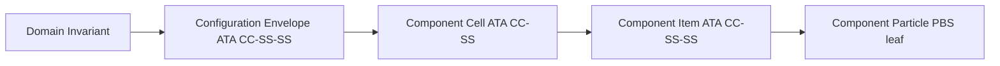

# Amedeo Pelliccia — Product Portfolio Quantum Lifecycle Assurance Testbench


Aerospace Systems Engineer · Digital‑Twin Architecture · Risk‑Optimized Design  
Project Coordinator — Capgemini Engineering (Madrid) · Founder of AQUA, GAIA AIR y AMPEL360  
Master's Candidate — Project Management (EAE Business School, 2025–2028)

---


**EstándarUniversal:** DocumentoTecnico-Difusion-ISO9001-01.00-PersonalPortfolioReadme-0001-v1.0-Aerospace and Quantum United Advanced Venture-GeneracionHybrida-CROSS-Amedeo Pelliccia-4a4596d0-RestoDeVidaUtil

> Identificador UTCS‑MI v5.0 (13 campos) aplicado a este artefacto público.

**Evidencia (anclas)**
- DET anchor: `DET:PORTFOLIO:README:V1` · `sha256:<a rellenar>` · `sig:Ed25519`
- QAUDIT tx: `qaudit://aqua/blocks/.../4a4596d0`

**Aviso de conformidad QAL**
- Este artefacto **no** genera S1000D; CAS es el único punto de publicación S1000D.  
- Este README emite un **evento QAL Bus** de registro documental y se encadena a DET/QAUDIT.

---

## Resumen Visual (QAL + Evidencia)

```mermaid
%%{init: {"themeVariables":{"fontFamily":"Inter,Segoe UI,Roboto,sans-serif"}}}%%
flowchart LR

subgraph STRATEGY["QAL Strategy & Ideation"]
  CAO(["CAO (Org/Gov)\n🏛️ Strategy, Req. & Budget"])
  CAB(["CAB (Ideation)\n💡 Brainstorm, Concepts"])
end

subgraph UTCS_BLOCKCHAIN["UTCS_BLOCKCHAIN"]
  CADET(["CADET (KPI Ledger)\nQC:0.79 | Risk:0.10"])
  DET["DET (Evidence Pkg)"]
  TRACES{{"TRACES (Req. linking)\nCobertura 94%"}}
  QAUDIT(("QAUDIT\nPQC-Dilithium3\nsha3-256"))
end

TEKTOK(["🪙 TekTok Tokenization\nMilestone DAO Rewards"])

subgraph BWB_Q100["BWB_Q100"]
  GAMMA["⚙️ Gamma Conf. (QC 0.79)\nICDs, CVaR, DETs"]
  CAT{{"CAT (Test/Sensors)\n🧪 QAOA DoE Sensors"}}
  CAV(("📑 CAV (Cert Dossier)\n• CAE Results\n• Test DET\n• QAUDIT Sign"))
end

AMPEL360["AMPEL360 CAE Pipeline:\nCVaR opt. & Gamma Sim"]

%% Relations
CAO -- "Governance, Budget" --> TRACES
CAB -- "Concepts, Risk Vector" --> TRACES
CAO -.->|Inputs, KPI Strat.| CADET
CAB -.->|Portfolio, Risk| CADET
CAO -.->|Audit Pol.| QAUDIT

CAV -- "Findings/Policy" --> CAO
CADET -- "KPI Insights" --> CAO
CADET -- "KPI Signals" --> CAB

CADET -- KPIs --> GAMMA
DET -- "Anchors Evidence" --> GAMMA
TRACES -- "Links Req." --> GAMMA

GAMMA -- "Simulation" --> AMPEL360
AMPEL360 -- "CAE Results" --> DET
DET -- "Pkg CAE/ICD/Test" --> CAV
CAT -- "Test Result DET" --> CAV

GAMMA -- "Test Plan & Sensors" --> CAT
AMPEL360 -- "Loads & Env." --> CAT
TRACES -- "Req→Test Map" --> CAT
QAUDIT -.->|Fixture Sign| CAT

DET -->|"Submit for Signing"| QAUDIT
QAUDIT -. "Signature+Hash, Auditable" .-> DET
QAUDIT -. "Non-repudiation" .-> CAV
CAV -. "Sealing" .-> QAUDIT

TEKTOK -- "Tokens for events" --> GAMMA
CAV -- "Milestone Cert." --> TEKTOK

%% UNIVERSAL HIGH CONTRAST & LARGE FONT
classDef default fill:#fff,stroke:#222,stroke-width:3px,color:#1a237e,font-size:22px,font-weight:bold;
```



---

## Misión (one‑liner)

Unificar el ciclo aeroespacial —diseño (CAD/CAM/CAE/PLM), producción (SCADA/ROS/NC) y operaciones/servicios (ATM, cockpit/FBW, nav/comm, MRO/EOL/procurement)— bajo un **tejido operativo determinista, extensible a cuántica y productor de evidencia**.

---

## Amedeo Pelliccia Methodology to Handle Aerospace Projects

### UTCS-MI Header (canonical example)

**EstándarUniversal:Artefacto-DesgloseDeProducto-ATA+S1000D-01.00-ProductBreakdownStructure-0001-v1.1-Aerospace and Quantum United Advanced Venture-ProjectName-Phase-Amedeo Pelliccia-deadbeef-RestoDeVidaUtil**

> **Notas:**
> • Campo 4 = **Capítulo-Sección `NN.NN`** (p. ej., `01.00`).  
> • Campo 5 = **Categoría en CamelCase** (sin siglas).  
> • Campo 7 = **Versión `vX.Y`**.  
> • Dominio **Propulsión/Combustibles** usa ancla **`ppp`** en minúsculas.

### Project Lifecycle Pillars

| Pillar                            | Function           | Scope                                                    |
| --------------------------------- | ------------------ | -------------------------------------------------------- |
| [CAO](docs/c-amedeo/cao/README.md#ca-cao) | Organization       | Governance, policies, resource/risk allocation           |
| [CAB](#cab---brainstorming)       | Brainstorming      | Concept creation, trade studies, rationale               |
| [CAD](#cad---design)              | Design             | Parametric product definition, MBD, EBOM                 |
| [CAE](#cae---engineering)         | Engineering        | High-fidelity simulation (FEA/CFD/thermal), performance  |
| [CAT](#cat---testing)             | Testing            | Physical validation, test planning/DoE, data correlation |
| [CAV](#cav---vv-certification)    | V&V/Certification  | Compliance mapping, evidence roll-up (CS-25, DO-178C)    |
| [CAM](#cam---manufacturing)       | Manufacturing      | BOP/MBOM, processes, stations, QA gates                  |
| [CAP](#cap---production)          | Production         | MPS/MRP, takt, supply chain                              |
| [CAS](#cas---sustainment)         | Sustainment        | In-service support, IPC/IETP (S1000D), SBs/PHM           |
| [CAEpost](#caepost---end-of-life) | End-of-Life        | Decommissioning, recovery, circularity                   |

### 📐 Lifecycle Level Codes — Definiciones

| Código | Nombre completo                              | Descripción breve |
|--------|----------------------------------------------|-------------------|
| **TFA** | Tail‑Fined Aircraft                         | Nivel global de referencia del programa o aeronave completa. |
| **SI**  | System Integration                          | Integración de sistemas y subsistemas a nivel de plataforma. |
| **CV**  | Component Vendor                            | Gestión y control de proveedores de componentes. |
| **SE**  | Station Entanglement / Envelop              | Integración física y funcional en estaciones o entornos de montaje. |
| **DI**  | Domain Invariant / Interfaces               | Interfaces y elementos invariantes entre dominios. |
| **CE**  | Component Equipped / Envelop                | Componente equipado y su envolvente funcional/física. |
| **CC**  | Configuration Cell / Component              | Célula o unidad de configuración de un componente. |
| **CI**  | Configuration / Component Item              | Ítem de configuración o elemento individual del componente. |
| **CP**  | Component Part                              | Parte física específica de un componente o configuración. |
| **FE**  | Element / Extent / Endpoint                 | Elemento fundamental, su extensión o punto terminal. |
| **QS**  | Quantum Superposition State                 | Estado cuántico de superposición aplicado a modelado/simulación. |

### Aerospace Project Domain × Level Navigation Matrix (TFA → QS)

> Cada celda salta a su ancla `#<nivel>-<dom>`; **TFA** es global (`#tfa-bwb`).  
> Niveles: **TFA** · **SI** · **CV** · **SE** · **DI** · **CE** · **CC** · **CI** · **CP** · **FE** · **QS**.

| Domain  | Description     |       TFA       |       SI      |       CV      |       SE      |       DI      |       CE      |       CC      |       CI      |       CP      |       FE      |       QS      |
| ------- | --------------- | :-------------: | :-----------: | :-----------: | :-----------: | :-----------: | :-----------: | :-----------: | :-----------: | :-----------: | :-----------: | :-----------: |
| **AAA** | Structures/Aero | [TFA](#tfa-bwb) | [SI](#si-aaa) | [CV](#cv-aaa) | [SE](#se-aaa) | [DI](#di-aaa) | [CE](#ce-aaa) | [CC](#cc-aaa) | [CI](#ci-aaa) | [CP](#cp-aaa) | [FE](#fe-aaa) | [QS](#qs-aaa) |
| **AAP** | Ground Support  | [TFA](#tfa-bwb) | [SI](#si-aap) | [CV](#cv-aap) | [SE](#se-aap) | [DI](#di-aap) | [CE](#ce-aap) | [CC](#cc-aap) | [CI](#ci-aap) | [CP](#cp-aap) | [FE](#fe-aap) | [QS](#qs-aap) |
| **CCC** | Cabin/Cockpit   | [TFA](#tfa-bwb) | [SI](#si-ccc) | [CV](#cv-ccc) | [SE](#se-ccc) | [DI](#di-ccc) | [CE](#ce-ccc) | [CC](#cc-ccc) | [CI](#ci-ccc) | [CP](#cp-ccc) | [FE](#fe-ccc) | [QS](#qs-ccc) |
| **CQH** | Cryo/H₂         | [TFA](#tfa-bwb) | [SI](#si-cqh) | [CV](#cv-cqh) | [SE](#se-cqh) | [DI](#di-cqh) | [CE](#ce-cqh) | [CC](#cc-cqh) | [CI](#ci-cqh) | [CP](#cp-cqh) | [FE](#fe-cqh) | [QS](#qs-cqh) |
| **DDD** | Safety/Cyber    | [TFA](#tfa-bwb) | [SI](#si-ddd) | [CV](#cv-ddd) | [SE](#se-ddd) | [DI](#di-ddd) | [CE](#ce-ddd) | [CC](#cc-ddd) | [CI](#ci-ddd) | [CP](#cp-ddd) | [FE](#fe-ddd) | [QS](#qs-ddd) |
| **EDI** | Electronics     | [TFA](#tfa-bwb) | [SI](#si-edi) | [CV](#cv-edi) | [SE](#se-edi) | [DI](#di-edi) | [CE](#ce-edi) | [CC](#cc-edi) | [CI](#ci-edi) | [CP](#cp-edi) | [FE](#fe-edi) | [QS](#qs-edi) |
| **EEE** | Environmental   | [TFA](#tfa-bwb) | [SI](#si-eee) | [CV](#cv-eee) | [SE](#se-eee) | [DI](#di-eee) | [CE](#ce-eee) | [CC](#cc-eee) | [CI](#ci-eee) | [CP](#cp-eee) | [FE](#fe-eee) | [QS](#qs-eee) |
| **EER** | Energy/Battery  | [TFA](#tfa-bwb) | [SI](#si-eer) | [CV](#cv-eer) | [SE](#se-eer) | [DI](#di-eer) | [CE](#ce-eer) | [CC](#cc-eer) | [CI](#ci-eer) | [CP](#cp-eer) | [FE](#fe-eer) | [QS](#qs-eer) |
| **IIF** | Infrastructure  | [TFA](#tfa-bwb) | [SI](#si-iif) | [CV](#cv-iif) | [SE](#se-iif) | [DI](#di-iif) | [CE](#ce-iif) | [CC](#cc-iif) | [CI](#ci-iif) | [CP](#cp-iif) | [FE](#fe-iif) | [QS](#qs-iif) |
| **IIS** | AI Systems      | [TFA](#tfa-bwb) | [SI](#si-iis) | [CV](#cv-iis) | [SE](#se-iis) | [DI](#di-iis) | [CE](#ce-iis) | [CC](#cc-iis) | [CI](#ci-iis) | [CP](#cp-iis) | [FE](#fe-iis) | [QS](#qs-iis) |
| **LCC** | Controls/Comms  | [TFA](#tfa-bwb) | [SI](#si-lcc) | [CV](#cv-lcc) | [SE](#se-lcc) | [DI](#di-lcc) | [CE](#ce-lcc) | [CC](#cc-lcc) | [CI](#ci-lcc) | [CP](#cp-lcc) | [FE](#fe-lcc) | [QS](#qs-lcc) |
| **LIB** | Logistics/Chain | [TFA](#tfa-bwb) | [SI](#si-lib) | [CV](#cv-lib) | [SE](#se-lib) | [DI](#di-lib) | [CE](#ce-lib) | [CC](#cc-lib) | [CI](#ci-lib) | [CP](#cp-lib) | [FE](#fe-lib) | [QS](#qs-lib) |
| **MMM** | Mechanical      | [TFA](#tfa-bwb) | [SI](#si-mmm) | [CV](#cv-mmm) | [SE](#se-mmm) | [DI](#di-mmm) | [CE](#ce-mmm) | [CC](#cc-mmm) | [CI](#ci-mmm) | [CP](#cp-mmm) | [FE](#fe-mmm) | [QS](#qs-mmm) |
| **OOO** | OS/Navigation   | [TFA](#tfa-bwb) | [SI](#si-ooo) | [CV](#cv-ooo) | [SE](#se-ooo) | [DI](#di-ooo) | [CE](#ce-ooo) | [CC](#cc-ooo) | [CI](#ci-ooo) | [CP](#cp-ooo) | [FE](#fe-ooo) | [QS](#qs-ooo) |
| **PPP** | Propulsion/Fuel | [TFA](#tfa-bwb) | [SI](#si-ppp) | [CV](#cv-ppp) | [SE](#se-ppp) | [DI](#di-ppp) | [CE](#ce-ppp) | [CC](#cc-ppp) | [CI](#ci-ppp) | [CP](#cp-ppp) | [FE](#fe-ppp) | [QS](#qs-ppp) |

> **Anchor pack (pegar en cualquier parte del doc, sin bloque de código):**  
> `<a id="tfa-bwb"></a>`  
> Para cada dominio (`aaa…ppp`):  
> `<a id="si-<dom>"></a><a id="cv-<dom>"></a><a id="se-<dom>"></a><a id="di-<dom>"></a><a id="ce-<dom>"></a><a id="cc-<dom>"></a><a id="ci-<dom>"></a><a id="cp-<dom>"></a><a id="fe-<dom>"></a><a id="qs-<dom>"></a>`  
> Ej.: `si-aaa`, `cv-aaa`, …, `qs-ppp`.  
> *Alias legado:* `<a id="ta-bwb"></a>` → `#tfa-bwb`.

---

### Quick Reference

#### Critical Path Items
- Airframe fatigue validation (e.g., full-scale test article)
- Avionics system integration and reliability
- Propulsion system performance validation
- Advanced material qualification

#### Key Metrics
- **Structural Weight Fraction:** < 25% MTOW
- **Payload Capacity:** 20,000 kg
- **Power Requirement:** 20 MW
- **Fundamental Frequencies:** > 5 Hz

#### Gate Schedule
- **Preliminary Design Review ([PDR](#pdr)):** Q4 2025
- **Critical Design Review ([CDR](#cdr)):** Q2 2026
- **First Flight Readiness ([FFR](#ffr)):** Q1 2027

### Pillar Section Details

#### CAO - Organization
Resource allocation for primary structures (e.g., 50% fuselage, 30% wing, 20% empennage).

#### CAB - Brainstorming
Evaluation of multiple airframe configurations and novel propulsion systems.

#### CAD - Design
Detailed structural design per [ATA](#ata) chapters, interface control document ([ICD](#icd)) management.

#### CAE - Engineering
High-fidelity structural and aerodynamic analysis ([FEA](#fea)/[CFD](#cfd)), full airframe fatigue and damage tolerance analysis.

#### CAT - Testing
Full-scale static and fatigue testing, wind tunnel model testing, non-destructive inspection ([NDI](#ndi)) development.

#### CAV - V&V/Certification
Compliance demonstration against certification standards (e.g., [CS-25](#cs-25)), development of system safety cases.

#### CAM - Manufacturing
Definition of manufacturing processes (e.g., composite curing cycles, metallic machining), assembly line design.

#### CAP - Production
Production rate targets, takt time optimization, supply chain risk assessment.

#### CAS - Sustainment
Structural Health Monitoring ([SHM](#shm)) system design, scheduled maintenance plan, [S1000D](#s1000d)-compliant documentation.

#### CAEpost - End-of-Life
End-of-life plan, including material recovery and recycling processes.

---

## TL;DR (con gates QAL)

* **UTCS‑BLOCKCHAIN**: CAX completo con **105 nodos DET** (15 dominios × 7 pilares) bajo QAUDIT.
* **AMPEL360**: reduce $>2×10^{16}$ configuraciones a \~10 000 factibles (**G1→G2**); óptimo por **CVaR\@0.95** (**G2**).
* **AQUA‑OS BRIDGE**: columna digital determinista; **DET** + **QAL**; **G5** consolida evidencias de V\&V.
* **GAIA AIR RTOS**: particionado ARINC 653; soporte a rutas críticas (DAL).
* **CADET**: KPIs de circularidad con packs firmados desde DET (**G8/G9**).
* **Límite S1000D**: solo **CAS** publica IETP/IETM; el resto emite **punteros**.

---

## Alineación QAL (fases → contenido de este portfolio)

| Fase        | En este README                        | Evidencia / Métrica                 |
| ----------- | ------------------------------------- | ----------------------------------- |
| **CAO**     | Estrategia, alcance, normas, riesgo   | IRR/NPV, cobertura de conformidad   |
| **CAB**     | Genesis Prompt, mapa de convergencia  | Trazabilidad de ideas, priorización |
| **CAD**     | Reglas CAD‑first, DI→CE→CC→CI→CP      | Δpeso, Δcosto, reuse% en EBOM       |
| **CAE**     | FEM/global loads, márgenes, QoR       | Model error bound, reproducibilidad |
| **CAT**     | SBOM/SLSA, pipelines                  | SBOM coverage, vuln SLA             |
| **CAV**     | Matriz de certificación (trenzado)    | Requirement coverage, auditability  |
| **CAM**     | FAI/SPC, yield                        | Scrap−%, Rework−%, Cp/Cpk           |
| **CAP**     | Logística, MRP/MPS (resumen)          | OTD, turns, cost variance           |
| **CAS**     | SB/PHM, config state (puntero S1000D) | MTBF/MTBUR, disponibilidad          |
| **CAEpost** | EoL/recuperación                      | %valor recuperado, CO₂e ↓           |

---

## Evento QAL Bus — Registro de portfolio

```json
{
  "utcs_id": "EstándarUniversal: DocumentoTecnico-Difusion-ISO9001-01.00-PersonalPortfolioReadme-0001-v1.0-Aerospace and Quantum United Advanced Venture-GeneracionHybrida-CROSS-Amedeo Pelliccia-4a4596d0-RestoDeVidaUtil",
  "phase": "CAO",
  "artifact_type": "PortfolioReadme",
  "inputs": ["sha256:<prev-readme-orig>", "sha256:<policies-v>"],
  "outputs": ["sha256:<this-file>"],
  "req_trace": [{"req_id":"QAL-COMPLIANCE-README","status":"pass","evidence":"sha256:<this-file>"}],
  "risk": {"cvar_alpha": 0.95, "cvar_value": 0.0, "hazards":[]},
  "quantum": {"algo":"QML","seed":12345,"p":3,"backend":"simulator"},
  "pqc_signature": {"alg":"Dilithium3","sig":"<placeholder>"},
  "provenance": {"tool":"AQUA‑OS","version":"v22.0","agent":"GAIA AIR v4.0","time_utc":"<ISO8601>"}
}
```

> **Nota:** El evento debe validarse con `schemas/qal_bus.schema.json` y el ID UTCS con `UTCS-BLOCKCHAIN/validate_utcs_mi.py`.

---

## Genesis Prompt (CAB) y Mapa de Convergencia

> "crear un ecosistema donde IoT, IA/ML, Blockchain, Cuántica, sistemas complejos, nuevos materiales y nanotecnologías convergen"

* **IoT → LCC**: redes deterministas, AIDC (Spec 2000 Book 7), telemetría a **DET**.
* **IA/ML**: **IIS** a bordo; **AMPEL360** en tierra; particionado seguro **GAIA AIR RTOS** (DO‑178C/DO‑254).
* **Blockchain → LIB**: trazabilidad Spec 2000/2500; notarización de evidencia en **DET**.
* **Cuántica → QAL**: offload seguro (QAOA/VQE/QML) fuera de rutas DAL.
* **Sistemas complejos**: **C‑AMEDEO** (DI→CE→CC→CI→CP) + **ARP4754A/4761**.
* **Materiales/Nano → MMM**: CMH‑17, nano‑coatings, metamateriales; **CAM** aditiva (NADCAP).


---

## Qué estoy construyendo (resumen sobrio)

### AMPEL360 — Reducción + Selección por Riesgo (CAB→CAD→CAE)

* **Fase I:** MILP/CP‑SAT → \~10 000 candidatos (filtros de física/seguridad/compatibilidad).
* **Fase II:** **CVaR\@0.95** → selección robusta técnico‑financiera (**G2**).
* **Salida formal:** configuración óptima lista para diseño detallado en AQUA‑OS.

### AQUA‑OS BRIDGE — MOS determinista (CAT→CAV→CAP)

* Plano determinista (tiempo/espacio) con GAIA AIR RTOS (ARINC 653).
* **DET** WORM + **QAUDIT**; **QAL** para optimización no‑DAL.
* **Función:** fuente única de verdad, determinismo y evidencia.

### GAIA AIR RTOS — Ejecución en tiempo real (CAE→CAT)

* Particionado robusto: fallos no críticos **no** contaminan rutas DAL.
* **Infranet** determinista/segura para datos intra‑ecosistema.

### C‑AMEDEO — Flujo dual circular (DEOPTIMISE ⇄ OPTIMISED)

* DEOPTIMISE (creación) y OPTIMISED (restauración/evolución) con **pruebas de circularidad** auditadas por CADET.

### CADET — Auditor de circularidad (CAS→CAEpost)

* Verifica trazabilidad y calcula KPIs (Reuse %, CO₂e, Energía, Life‑extension).

---

## CAD‑first (constitución mínima, QAL‑ready)

* **Árbol DI→CE→CC→CI→CP** anclado a **ATA iSpec 2200 (SNS)**.
* **EBOM vs MBOM:** mantener traza EBOM↔MBOM (kitlists + pn); divergencias → CP hijos.
* **Intento de diseño:** `MASTER_SKELETON_PART`, datums `PLN_XY/PLN_YZ/PLN_ZX`, parámetros `CamelCase` (ej. `GridSpacingMm`).
* **Disparadores de evidencia (DET):** `save_model`, `solver_run`, `ebom_change`, `mbom_change` (firmados).
* **S1000D**: solo **CAS**; aquí **punteros** a DMRL/DMC.

**Descomposición atómica (atajo visual)**



---

## Trenzado de certificación (QAL‑aware)

* **ARP4754A/4761**: CAB/CAD (asignación/validación) · CAV (matriz de verificación).
* **DO‑178C / DO‑254**: CAD/CAE/CAT/CAV (planes/revisiones/pruebas); **DET** guarda cobertura y V\&V.
* **S1000D / iSpec 2200**: **CAS** publica IETP/IETM + IPD (UTCS‑tagged).
* **CS‑25**: CAV emite conformidad; CAM/CAP evidencian FAI/PC.

---

## Pruebas de valor (muestras, con ancla de evidencia)

| Pilar   | Artefacto                             | Evidencia DET                            | Disparador         | KPI (CADET)                                         |
| ------- | ------------------------------------- | ---------------------------------------- | ------------------ | --------------------------------------------------- |
| **CAD** | CI `.../53-10-01-CB-PRIMARY-GRID/` v2 | `DET:CAD:Q100:53-10:CB:V2` · `a9f3d2e1…` | Save/Rev/MBOM sync | Reuse **42%**, CO₂ **−120 kg**, energía **−38 kWh** |
| **CAE** | Global FEM Loads                      | `DET:CAE:FEM:GLB-V5` · `bb12c4…`         | solver\_run        | ΔMargen **+0.12**, Repro **100%**                   |
| **CAM** | FAI CB Assy                           | `DET:CAM:FAI:CB-ASSY-V3` · `ccaa11…`     | FAI OK, SPC        | Scrap **−22%**, Rework **−18%**                     |

> Si no hay **DET**, no pasó.

---

## DET + QAUDIT (UTCS‑MI v5.0, extracto alineado al diagrama)

```yaml
DET:
  program: BWB_Q100
  rollup_id: DET:ROLLUP:BWB_Q100:V1.1
  pillars: [CAO, CAB, CAD, CAE, CAT, CAV]
  kpis:
    qc: 0.79
    risk_cvar_alpha: 0.10
    throughput: 128
    energy_mwh: 4.7
    pareto_spark: "▄▆█▇▁▃▅"
  packages:
    - id: DET:CAD:ICD:CQH:V1.0
      source: ICD-AAA-CQH-001
      score: 8.9
      links: [TRACES://REQ/RQ-ICD-CQH]
    - id: DET:CAD:ICD:PPP:V1.0
      source: ICD-AAA-PPP-002
      score: 8.6
      links: [TRACES://REQ/RQ-ICD-PPP]
    - id: DET:CAD:ICD:DDD:V1.0
      source: ICD-AAA-DDD-003
      score: 8.7
      links: [TRACES://REQ/RQ-ICD-DDD]
    - id: DET:CAE:SIM:AMPEL360:RUN-042
      source: CAE://AMPEL360/RUNS/42
      metrics: {cvar_alpha: 0.10, samples: 4096}
    - id: DET:CAT:TEST:QAOA:RUN-015
      source: CAT://RUNS/15
      sensors: [NV_magnetometry, atomic_gyro, entangled_imaging]
  qaudit:
    signer: QAUDIT:BOT:SIG-01
    scheme: PQC-Dilithium3
    hash: sha3-256
    signatures:
      - target: DET:ROLLUP:BWB_Q100:V1.1
        sig: "base64:…"
      - target: DET:CAT:TEST:QAOA:RUN-015
        sig: "base64:…"
```

### Matriz de conformidad (extracto)

| Req ID        | Origen          | Artefacto DET                    | Cobertura | Estado   |
| ------------- | --------------- | -------------------------------- | --------: | -------- |
| RQ-ICD-CQH    | ICD-AAA-CQH-001 | DET\:CAD\:ICD\:CQH\:V1.0         |      100% | Conforme |
| RQ-ICD-PPP    | ICD-AAA-PPP-002 | DET\:CAD\:ICD\:PPP\:V1.0         |      100% | Conforme |
| RQ-ICD-DDD    | ICD-AAA-DDD-003 | DET\:CAD\:ICD\:DDD\:V1.0         |      100% | Conforme |
| RQ-CVAR-ALPHA | AMPEL360 policy | DET\:CAE\:SIM\:AMPEL360\:RUN-042 |       94% | Parcial  |
| RQ-SENS-CAL   | QAUDIT Policy   | DET\:CAT\:TEST\:QAOA\:RUN-015    |       88% | Parcial  |

---

## Gobernanza & Cumplimiento (conciso)

* **Seguridad/Sistemas:** ARP4754A, ARP4761, DO‑178C, DO‑254, DO‑297
* **Aerocertificación:** EASA CS‑25 / FAA 14 CFR Part 25
* **Seguridad info.:** DO‑326A/ED‑202A, NIST SP 800‑53
* **Sostenibilidad:** ISO 14001, CSRD, GRI
* **Calidad:** AS9100, ISO 9001
* **Soportabilidad:** MSG‑3, ATA iSpec 2200/S1000D

---

## Contribución & Contacto

* **Issues & Roadmap:** GitHub Issues/Projects (repos públicos).
* **Charlas/Advisory:** LinkedIn.
* **Licencias:** Código MIT; documentación CC BY‑SA 4.0 salvo indicación.

---

## Acrónimos (curado para UTCS‑MI)

| Acrónimo              | Expansión                                                         | Nota                                                                           |
| --------------------- | ----------------------------------------------------------------- | ------------------------------------------------------------------------------ |
| **UTCS‑MI**           | Universal Technical Communication Standard — Model Interface v5.0 | Cabecera de 13 campos                                                          |
| **EstándarUniversal** | Etiqueta de cabecera UTCS‑MI                                      | Debe ser exacta; **Generación/Periodo en español**; Capítulo‑Sección = `NN.NN` |
| **CAX**               | Pilares ciclo (CAD/CAE/CAO/CAP/CAT/CAM/CAI/CAS/CAEV)              | Uso libre en cuerpo (no en campos UTCS)                                        |
| **DET**               | Digital Evidence Twin                                             | Evidencia firmada                                                              |
| **QAL**               | Quantum Abstraction Layer / Quantum‑Aided Lifecycle               | Offload seguro (no DAL)                                                        |
| **RTOS**              | Real‑Time Operating System                                        | GAIA AIR RTOS (ARINC 653)                                                      |
| **CVaR**              | Conditional Value at Risk                                         | Selección robusta                                                              |
| **IETP/IETM**         | Interactive Electronic Technical Pub/Manual                       | Solo CAS                                                                       |

---

## Sugerencia de siguiente iteración

Añadir un *micro‑gantt* (Mermaid `gantt`) para **BWB\_Q100** (milestones: *ICD freeze → AMPEL360 batch → CAT campaign → CAV dossier → TEKTOK mint*) y una **frontera de Pareto** resumida (tres KPIs) como *tooltips* en CADET/AMPEL360 para inspección rápida.

---

## Versionado

* **Este archivo:** v1.1.0
* **Changelog:** v1.1.0: Enhanced strategic feedback loop flowchart with governance cycles (CAV → CAO, CADET → CAO/CAB), QAUDIT hardening (DET → QAUDIT signing), clickable UTCS-MI URI anchors, DET + QAUDIT structure, and conformity matrix. v1.0.0: Añadido identificador UTCS‑MI v5.0; aviso QAL; evento QAL Bus; límites S1000D; evidencias DET; TL;DR con gates; diagramas Mermaid QAL.

---

© 2025 AerospaceAndQuantumUnitedAdvancedVenture. All rights reserved.
