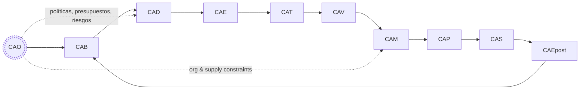

# Amedeo Pelliccia — Portfolio (QAL‑conforme)

Aerospace Systems Engineer · Digital‑Twin Architecture · Risk‑Optimized Design  
Project Coordinator — Capgemini Engineering (Madrid) · Founder of AQUA, GAIA AIR y AMPEL360  
Master's Candidate — Project Management (EAE Business School, 2025–2028)

---

**EstándarUniversal:** DocumentoTecnico-Difusion-ISO9001-01.00-PersonalPortfolioReadme-0001-v1.0-Aerospace and Quantum United Advanced Venture-GeneracionHybrida-CROSS-Amedeo Pelliccia-4a4596d0-RestoDeVidaUtil

> Identificador UTCS‑MI v5.0 (13 campos) aplicado a este artefacto público.

**Evidencia (anclas)**
- DET anchor: `DET:PORTFOLIO:README:V1` · `sha256:<a rellenar>` · `sig:Ed25519`
- QAUDIT tx: `qaudit://aqua/blocks/.../4a4596d0`

**Aviso de conformidad QAL**
- Este artefacto **no** genera S1000D; CAS es el único punto de publicación S1000D.  
- Este README emite un **evento QAL Bus** de registro documental y se encadena a DET/QAUDIT.

---

## Resumen Visual (QAL + Evidencia)



```mermaid
graph TD
  AMPEL360[AMPEL360 — Feasible Set · Selección CVaR]
  AQUAOS[AQUA‑OS BRIDGE — MOS determinista · Single Source of Truth]
  GAIA[GAIA AIR RTOS — ARINC 653]
  DET[Digital Evidence Twin · QAUDIT]
  CADET[CADET — Auditoría de Circularidad (KPIs)]

  AMPEL360 --> AQUAOS
  GAIA --> AQUAOS
  AQUAOS --> DET
  DET --> CADET
  CADET -->|KPIs| AMPEL360
```

---

## Misión (one‑liner)

Unificar el ciclo aeroespacial —diseño (CAD/CAM/CAE/PLM), producción (SCADA/ROS/NC) y operaciones/servicios (ATM, cockpit/FBW, nav/comm, MRO/EOL/procurement)— bajo un **tejido operativo determinista, extensible a cuántica y productor de evidencia**.

---

## Amedeo Pelliccia Methodology to Handle Aerospace Projects

### Aerospace Project Domain Hierarchy Navigation Index

**UniversalStandard:** Artifact-ProductBreakdown-ATA+S1000D-01.00-ProductBreakdownStructure-0001-v1.0-YourAerospaceCompany-ProjectName-Phase-YourName-uuid-LifecycleStatus

### Project Lifecycle Pillars

| Pillar | Function | Scope |
|--------|----------|-------|
| [CAO](#cao---organization) | Organization | Resource allocation, risk management |
| [CAB](#cab---brainstorming) | Brainstorming | Conceptual design studies, trade-off analyses |
| [CAD](#cad---design) | Design | Detailed design, system integration |
| [CAE](#cae---engineering) | Engineering | Simulation, analysis (FEA, CFD), performance modeling |
| [CAT](#cat---testing) | Testing | Component & system level testing, validation campaigns |
| [CAV](#cav---vv-certification) | V&V/Certification | Verification, Validation, Certification (e.g., CS-25, DO-178C) |
| [CAM](#cam---manufacturing) | Manufacturing | Manufacturing processes, assembly procedures |
| [CAP](#cap---production) | Production | Production planning, supply chain management |
| [CAS](#cas---sustainment) | Sustainment | In-service support, maintenance, technical documentation (S1000D) |
| [CAEpost](#caepost---end-of-life) | End-of-Life | Decommissioning, disposal, material recycling |

### Domain Navigation Matrix

| Domain | Description | [DI](#di) | [CE](#ce) | [CC](#cc) | [CI](#ci) | [CP](#cp) | [FE](#fe) |
|--------|-------------|-----------|-----------|-----------|-----------|-----------|-----------|
| **AAA** | Structures/Aero | [DI](#di) | [CE](#ce) | [CC](#cc) | [CI](#ci) | [CP](#cp) | [FE](#fe) |
| **AAP** | Ground Support | [DI](#di) | [CE](#ce) | [CC](#cc) | [CI](#ci) | [CP](#cp) | [FE](#fe) |
| **CCC** | Cabin/Cockpit | [DI](#di) | [CE](#ce) | [CC](#cc) | [CI](#ci) | [CP](#cp) | [FE](#fe) |
| **CQH** | Cryo/H₂ | [DI](#di) | [CE](#ce) | [CC](#cc) | [CI](#ci) | [CP](#cp) | [FE](#fe) |
| **DDD** | Safety/Cyber | [DI](#di) | [CE](#ce) | [CC](#cc) | [CI](#ci) | [CP](#cp) | [FE](#fe) |
| **EDI** | Electronics | [DI](#di) | [CE](#ce) | [CC](#cc) | [CI](#ci) | [CP](#cp) | [FE](#fe) |
| **EEE** | Environmental | [DI](#di) | [CE](#ce) | [CC](#cc) | [CI](#ci) | [CP](#cp) | [FE](#fe) |
| **EER** | Energy/Battery | [DI](#di) | [CE](#ce) | [CC](#cc) | [CI](#ci) | [CP](#cp) | [FE](#fe) |
| **IIF** | Infrastructure | [DI](#di) | [CE](#ce) | [CC](#cc) | [CI](#ci) | [CP](#cp) | [FE](#fe) |
| **IIS** | AI Systems | [DI](#di) | [CE](#ce) | [CC](#cc) | [CI](#ci) | [CP](#cp) | [FE](#fe) |
| **LCC** | Controls/Comms | [DI](#di) | [CE](#ce) | [CC](#cc) | [CI](#ci) | [CP](#cp) | [FE](#fe) |
| **LIB** | Logistics/Chain | [DI](#di) | [CE](#ce) | [CC](#cc) | [CI](#ci) | [CP](#cp) | [FE](#fe) |
| **MMM** | Mechanical | [DI](#di) | [CE](#ce) | [CC](#cc) | [CI](#ci) | [CP](#cp) | [FE](#fe) |
| **OOO** | OS/Navigation | [DI](#di) | [CE](#ce) | [CC](#cc) | [CI](#ci) | [CP](#cp) | [FE](#fe) |
| **PPP** | Propulsion/Fuel | [DI](#di) | [CE](#ce) | [CC](#cc) | [CI](#ci) | [CP](#cp) | [FE](#fe) |

### Quick Reference

#### Critical Path Items
- Airframe fatigue validation (e.g., full-scale test article)
- Avionics system integration and reliability
- Propulsion system performance validation
- Advanced material qualification

#### Key Metrics
- **Structural Weight Fraction:** < 25% MTOW
- **Payload Capacity:** 20,000 kg
- **Power Requirement:** 20 MW
- **Fundamental Frequencies:** > 5 Hz

#### Gate Schedule
- **Preliminary Design Review ([PDR](#pdr)):** Q4 2025
- **Critical Design Review ([CDR](#cdr)):** Q2 2026
- **First Flight Readiness ([FFR](#ffr)):** Q1 2027

### Pillar Section Details

#### CAO - Organization
Resource allocation for primary structures (e.g., 50% fuselage, 30% wing, 20% empennage).

#### CAB - Brainstorming
Evaluation of multiple airframe configurations and novel propulsion systems.

#### CAD - Design
Detailed structural design per [ATA](#ata) chapters, interface control document ([ICD](#icd)) management.

#### CAE - Engineering
High-fidelity structural and aerodynamic analysis ([FEA](#fea)/[CFD](#cfd)), full airframe fatigue and damage tolerance analysis.

#### CAT - Testing
Full-scale static and fatigue testing, wind tunnel model testing, non-destructive inspection ([NDI](#ndi)) development.

#### CAV - V&V/Certification
Compliance demonstration against certification standards (e.g., [CS-25](#cs-25)), development of system safety cases.

#### CAM - Manufacturing
Definition of manufacturing processes (e.g., composite curing cycles, metallic machining), assembly line design.

#### CAP - Production
Production rate targets, takt time optimization, supply chain risk assessment.

#### CAS - Sustainment
Structural Health Monitoring ([SHM](#shm)) system design, scheduled maintenance plan, [S1000D](#s1000d)-compliant documentation.

#### CAEpost - End-of-Life
End-of-life plan, including material recovery and recycling processes.

---

## TL;DR (con gates QAL)

* **UTCS‑BLOCKCHAIN**: CAX completo con **105 nodos DET** (15 dominios × 7 pilares) bajo QAUDIT.
* **AMPEL360**: reduce $>2×10^{16}$ configuraciones a \~10 000 factibles (**G1→G2**); óptimo por **CVaR\@0.95** (**G2**).
* **AQUA‑OS BRIDGE**: columna digital determinista; **DET** + **QAL**; **G5** consolida evidencias de V\&V.
* **GAIA AIR RTOS**: particionado ARINC 653; soporte a rutas críticas (DAL).
* **CADET**: KPIs de circularidad con packs firmados desde DET (**G8/G9**).
* **Límite S1000D**: solo **CAS** publica IETP/IETM; el resto emite **punteros**.

---

## Alineación QAL (fases → contenido de este portfolio)

| Fase        | En este README                        | Evidencia / Métrica                 |
| ----------- | ------------------------------------- | ----------------------------------- |
| **CAO**     | Estrategia, alcance, normas, riesgo   | IRR/NPV, cobertura de conformidad   |
| **CAB**     | Genesis Prompt, mapa de convergencia  | Trazabilidad de ideas, priorización |
| **CAD**     | Reglas CAD‑first, DI→CE→CC→CI→CP      | Δpeso, Δcosto, reuse% en EBOM       |
| **CAE**     | FEM/global loads, márgenes, QoR       | Model error bound, reproducibilidad |
| **CAT**     | SBOM/SLSA, pipelines                  | SBOM coverage, vuln SLA             |
| **CAV**     | Matriz de certificación (trenzado)    | Requirement coverage, auditability  |
| **CAM**     | FAI/SPC, yield                        | Scrap−%, Rework−%, Cp/Cpk           |
| **CAP**     | Logística, MRP/MPS (resumen)          | OTD, turns, cost variance           |
| **CAS**     | SB/PHM, config state (puntero S1000D) | MTBF/MTBUR, disponibilidad          |
| **CAEpost** | EoL/recuperación                      | %valor recuperado, CO₂e ↓           |

---

## Evento QAL Bus — Registro de portfolio

```json
{
  "utcs_id": "EstándarUniversal: DocumentoTecnico-Difusion-ISO9001-01.00-PersonalPortfolioReadme-0001-v1.0-Aerospace and Quantum United Advanced Venture-GeneracionHybrida-CROSS-Amedeo Pelliccia-4a4596d0-RestoDeVidaUtil",
  "phase": "CAO",
  "artifact_type": "PortfolioReadme",
  "inputs": ["sha256:<prev-readme-orig>", "sha256:<policies-v>"],
  "outputs": ["sha256:<this-file>"],
  "req_trace": [{"req_id":"QAL-COMPLIANCE-README","status":"pass","evidence":"sha256:<this-file>"}],
  "risk": {"cvar_alpha": 0.95, "cvar_value": 0.0, "hazards":[]},
  "quantum": {"algo":"QML","seed":12345,"p":3,"backend":"simulator"},
  "pqc_signature": {"alg":"Dilithium3","sig":"<placeholder>"},
  "provenance": {"tool":"AQUA‑OS","version":"v22.0","agent":"GAIA AIR v4.0","time_utc":"<ISO8601>"}
}
```

> **Nota:** El evento debe validarse con `schemas/qal_bus.schema.json` y el ID UTCS con `UTCS-BLOCKCHAIN/validate_utcs_mi.py`.

---

## Genesis Prompt (CAB) y Mapa de Convergencia

> "crear un ecosistema donde IoT, IA/ML, Blockchain, Cuántica, sistemas complejos, nuevos materiales y nanotecnologías convergen"

* **IoT → LCC**: redes deterministas, AIDC (Spec 2000 Book 7), telemetría a **DET**.
* **IA/ML**: **IIS** a bordo; **AMPEL360** en tierra; particionado seguro **GAIA AIR RTOS** (DO‑178C/DO‑254).
* **Blockchain → LIB**: trazabilidad Spec 2000/2500; notarización de evidencia en **DET**.
* **Cuántica → QAL**: offload seguro (QAOA/VQE/QML) fuera de rutas DAL.
* **Sistemas complejos**: **C‑AMEDEO** (DI→CE→CC→CI→CP) + **ARP4754A/4761**.
* **Materiales/Nano → MMM**: CMH‑17, nano‑coatings, metamateriales; **CAM** aditiva (NADCAP).

---

## Qué estoy construyendo (resumen sobrio)

### AMPEL360 — Reducción + Selección por Riesgo (CAB→CAD→CAE)

* **Fase I:** MILP/CP‑SAT → \~10 000 candidatos (filtros de física/seguridad/compatibilidad).
* **Fase II:** **CVaR\@0.95** → selección robusta técnico‑financiera (**G2**).
* **Salida formal:** configuración óptima lista para diseño detallado en AQUA‑OS.

### AQUA‑OS BRIDGE — MOS determinista (CAT→CAV→CAP)

* Plano determinista (tiempo/espacio) con GAIA AIR RTOS (ARINC 653).
* **DET** WORM + **QAUDIT**; **QAL** para optimización no‑DAL.
* **Función:** fuente única de verdad, determinismo y evidencia.

### GAIA AIR RTOS — Ejecución en tiempo real (CAE→CAT)

* Particionado robusto: fallos no críticos **no** contaminan rutas DAL.
* **Infranet** determinista/segura para datos intra‑ecosistema.

### C‑AMEDEO — Flujo dual circular (DEOPTIMISE ⇄ OPTIMISED)

* DEOPTIMISE (creación) y OPTIMISED (restauración/evolución) con **pruebas de circularidad** auditadas por CADET.

### CADET — Auditor de circularidad (CAS→CAEpost)

* Verifica trazabilidad y calcula KPIs (Reuse %, CO₂e, Energía, Life‑extension).

---

## CAD‑first (constitución mínima, QAL‑ready)

* **Árbol DI→CE→CC→CI→CP** anclado a **ATA iSpec 2200 (SNS)**.
* **EBOM vs MBOM:** mantener traza EBOM↔MBOM (kitlists + pn); divergencias → CP hijos.
* **Intento de diseño:** `MASTER_SKELETON_PART`, datums `PLN_XY/PLN_YZ/PLN_ZX`, parámetros `CamelCase` (ej. `GridSpacingMm`).
* **Disparadores de evidencia (DET):** `save_model`, `solver_run`, `ebom_change`, `mbom_change` (firmados).
* **S1000D**: solo **CAS**; aquí **punteros** a DMRL/DMC.

**Descomposición atómica (atajo visual)**

```mermaid
graph LR
  DI[Domain Invariant] --> CE[Configuration Envelope (ATA CC-SS[-SS])]
  CE --> CC[Component Cell (ATA CC-SS)]
  CC --> CI[Component Item (ATA CC-SS-SS)]
  CI --> CP[Component Particle (PBS leaf)]
```

---

## Trenzado de certificación (QAL‑aware)

* **ARP4754A/4761**: CAB/CAD (asignación/validación) · CAV (matriz de verificación).
* **DO‑178C / DO‑254**: CAD/CAE/CAT/CAV (planes/revisiones/pruebas); **DET** guarda cobertura y V\&V.
* **S1000D / iSpec 2200**: **CAS** publica IETP/IETM + IPD (UTCS‑tagged).
* **CS‑25**: CAV emite conformidad; CAM/CAP evidencian FAI/PC.

---

## Pruebas de valor (muestras, con ancla de evidencia)

| Pilar   | Artefacto                             | Evidencia DET                            | Disparador         | KPI (CADET)                                         |
| ------- | ------------------------------------- | ---------------------------------------- | ------------------ | --------------------------------------------------- |
| **CAD** | CI `.../53-10-01-CB-PRIMARY-GRID/` v2 | `DET:CAD:Q100:53-10:CB:V2` · `a9f3d2e1…` | Save/Rev/MBOM sync | Reuse **42%**, CO₂ **−120 kg**, energía **−38 kWh** |
| **CAE** | Global FEM Loads                      | `DET:CAE:FEM:GLB-V5` · `bb12c4…`         | solver\_run        | ΔMargen **+0.12**, Repro **100%**                   |
| **CAM** | FAI CB Assy                           | `DET:CAM:FAI:CB-ASSY-V3` · `ccaa11…`     | FAI OK, SPC        | Scrap **−22%**, Rework **−18%**                     |

> Si no hay **DET**, no pasó.

---

## Gobernanza & Cumplimiento (conciso)

* **Seguridad/Sistemas:** ARP4754A, ARP4761, DO‑178C, DO‑254, DO‑297
* **Aerocertificación:** EASA CS‑25 / FAA 14 CFR Part 25
* **Seguridad info.:** DO‑326A/ED‑202A, NIST SP 800‑53
* **Sostenibilidad:** ISO 14001, CSRD, GRI
* **Calidad:** AS9100, ISO 9001
* **Soportabilidad:** MSG‑3, ATA iSpec 2200/S1000D

---

## Contribución & Contacto

* **Issues & Roadmap:** GitHub Issues/Projects (repos públicos).
* **Charlas/Advisory:** LinkedIn.
* **Licencias:** Código MIT; documentación CC BY‑SA 4.0 salvo indicación.

---

## Acrónimos (curado para UTCS‑MI)

| Acrónimo              | Expansión                                                         | Nota                                                                           |
| --------------------- | ----------------------------------------------------------------- | ------------------------------------------------------------------------------ |
| **UTCS‑MI**           | Universal Technical Communication Standard — Model Interface v5.0 | Cabecera de 13 campos                                                          |
| **EstándarUniversal** | Etiqueta de cabecera UTCS‑MI                                      | Debe ser exacta; **Generación/Periodo en español**; Capítulo‑Sección = `NN.NN` |
| **CAX**               | Pilares ciclo (CAD/CAE/CAO/CAP/CAT/CAM/CAI/CAS/CAEV)              | Uso libre en cuerpo (no en campos UTCS)                                        |
| **DET**               | Digital Evidence Twin                                             | Evidencia firmada                                                              |
| **QAL**               | Quantum Abstraction Layer / Quantum‑Aided Lifecycle               | Offload seguro (no DAL)                                                        |
| **RTOS**              | Real‑Time Operating System                                        | GAIA AIR RTOS (ARINC 653)                                                      |
| **CVaR**              | Conditional Value at Risk                                         | Selección robusta                                                              |
| **IETP/IETM**         | Interactive Electronic Technical Pub/Manual                       | Solo CAS                                                                       |

---

## Versionado

* **Este archivo:** v1.0.0
* **Changelog:** Añadido identificador UTCS‑MI v5.0; aviso QAL; evento QAL Bus; límites S1000D; evidencias DET; TL;DR con gates; diagramas Mermaid QAL.

---

© 2024 AerospaceAndQuantumUnitedAdvancedVenture. All rights reserved.