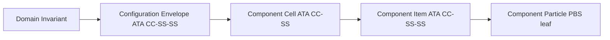

# Amedeo Pelliccia — Portfolio (QAL‑conforme)

Aerospace Systems Engineer · Digital‑Twin Architecture · Risk‑Optimized Design  
Project Coordinator — Capgemini Engineering (Madrid) · Founder of AQUA, GAIA AIR y AMPEL360  
Master's Candidate — Project Management (EAE Business School, 2025–2028)

---

**EstándarUniversal:** DocumentoTecnico-Difusion-ISO9001-01.00-PersonalPortfolioReadme-0001-v1.0-Aerospace and Quantum United Advanced Venture-GeneracionHybrida-CROSS-Amedeo Pelliccia-4a4596d0-RestoDeVidaUtil

> Identificador UTCS‑MI v5.0 (13 campos) aplicado a este artefacto público.

**Evidencia (anclas)**
- DET anchor: `DET:PORTFOLIO:README:V1` · `sha256:<a rellenar>` · `sig:Ed25519`
- QAUDIT tx: `qaudit://aqua/blocks/.../4a4596d0`

**Aviso de conformidad QAL**
- Este artefacto **no** genera S1000D; CAS es el único punto de publicación S1000D.  
- Este README emite un **evento QAL Bus** de registro documental y se encadena a DET/QAUDIT.

---

## Resumen Visual (QAL + Evidencia)

```mermaid
%%{init: {
  "theme": "base",
  "themeVariables": {
    "fontFamily": "Inter,Segoe UI,Roboto,sans-serif",
    "primaryColor": "#4CAF50",
    "primaryTextColor": "#fff",
    "tertiaryColor": "#B18BFE"
  }
}}%%
flowchart LR
  %% --- Subgraph: STRATEGY ROOT (CAO, CAB)---
  subgraph STRATEGY["QAL Strategy & Ideation"]
    direction TB
    CAO([CAO (Org/Governance)
🏛️ Strategy, Requirements &
Budgets/Policies ])
    CAB([CAB (Ideation)
💡 Brainstorm, Concepts, Risk Vectors])
    classDef caoClass fill:#009688,stroke:#fff,stroke-width:3px,color:#fff;
    class CAO caoClass;
    classDef cabClass fill:#ffb300,stroke:#fff,stroke-width:3px,color:#222;
    class CAB cabClass;
  end

  %% --- Subgraph: UTCS Blockchain ---
  subgraph UTCS_BLOCKCHAIN["UTCS_BLOCKCHAIN"]
    direction TB
    CADET([CADET (KPI Ledger)
📊 QC: 0.79 | Risk: 0.10 | Thru:128 | E:4.7MWh
Pareto: ▄▆█▇▁▃▅ ])
    DET[/DET (Evidence Packages)
📦 Concept, Interface, CAE, Test/]
    TRACES{{TRACES (Req. linking)
🔗 Cobertura 94%}}
    QAUDIT((QAUDIT 🔒
Signatures
PQC-Dilithium3
sha3-256))
    classDef kpiClass fill:#51c3d9,stroke:#222,stroke-width:2px,color:#fff;
    class CADET,QAUDIT kpiClass;
  end

  TEKTOK([🪙 TekTok Tokenization
Milestone DAO Rewards])

  %% --- Subgraph: BWB_Q100 ---
  subgraph BWB_Q100["BWB_Q100"]
    direction TB
    GAMMA["⚙️ Gamma Conf. (QC 0.79)<br/>ICDs, CVaR, DETs"]
    CAT{{CAT (Test/Sensors)
🧪 QAOA DoE Sensors}}
    CAV((📑 CAV (Certification Dossier)
• CAE Results
• Physical Test DET
• QAUDIT Signature))
    classDef catClass fill:#FF5722,stroke:#fff,stroke-width:3px,color:#fff;
    class CAT catClass;
    classDef cavClass fill:#B18BFE,stroke:#222,stroke-width:2px,color:#fff;
    class CAV cavClass;
  end

  AMPEL360[/AMPEL360 CAE Pipeline:
CVaR opt. & Gamma Sim Batch/]

  %% --- Relaciones de estrategia/linaje---
  CAO -- "Governance, Budget" --> TRACES
  CAB -- "Concepts, Risk Vector" --> TRACES
  CAO -.->|Inputs<br/>KPI Strat.| CADET
  CAB -.->|Portfolio, Risk| CADET
  CAO -.->|Audit Policies| QAUDIT

  %% Feedback (cierre de lazo)
  CAV -- "Findings, Waivers, Policy Update" --> CAO
  CADET -- "KPI Insights" --> CAO
  CADET -- "KPI Signals" --> CAB

  %% Relaciones UTCS/BWB_Q100
  CADET -- KPIs --> GAMMA
  DET -- "Anchors Evidence" --> GAMMA
  TRACES -- "Links Req." --> GAMMA

  GAMMA -- "Simulación" --> AMPEL360
  AMPEL360 -- "CAE Results & Metrics" --> DET
  DET -- "Paquetes CAE/ICD/Test" --> CAV
  CAT -- "Test Result DET" --> CAV

  %% CAT integración extra
  GAMMA -- "Test Plan & Sensor Configs" --> CAT
  AMPEL360 -- "Loads & Env. Cases" --> CAT
  TRACES -- "Req.→Test Map" --> CAT
  QAUDIT -.->|Fixture/Calib Sign| CAT

  %% QAUDIT signing (destacado)
  DET -->|"Submit for Signing"| QAUDIT
  QAUDIT -. "Signature+Hash" .->|Auditable| DET
  QAUDIT -. "Non-repudiation" .-> CAV
  CAV -. "Sealing" .-> QAUDIT

  %% ICD links (document style)
  GAMMA -- "ICD:AAA:8.9" --> ICD1[["📄 ICD-AAA-CQH-001\nScore: 8.9"]]
  GAMMA -- "ICD:PPP:8.6" --> ICD2[["📄 ICD-AAA-PPP-002\nScore: 8.6"]]
  GAMMA -- "ICD:DDD:8.7" --> ICD3[["📄 ICD-AAA-DDD-003\nScore: 8.7"]]
  ICD1 --> DET_AAA[["DET:CAD:ICD:CQH:V1.0"]]
  ICD2 --> DET_PPP[["DET:CAD:ICD:PPP:V1.0"]]
  ICD3 --> DET_DDD[["DET:CAD:ICD:DDD:V1.0"]]

  %% Tokens and milestone flow
  TEKTOK -- "Tokens for major events" --> GAMMA
  CAV -- "Milestone Cert." --> TEKTOK

  %% --- Leyenda Dinámica ---
  subgraph Legend["Legend"]
    direction LR
    L1([Stadium]):::l; 
    L2((Double)):::l; 
    L3{{Rhombus}}:::l;
    L4[/Parallelogram/]:::l; 
    L5[["Doc"]]:::l; 
    L6{{CAT: Test/Sensors}}:::catClass;
    L7([KPIs: Pareto ▄▆█▇▁▃▅ ]):::kpiClass;
    L8([CAO]):::caoClass;
    L9([CAB]):::cabClass;
  end
  classDef l fill:#f0f0f0,stroke:#bbb,color:#222;

  %% Estilos de subgrafos
  style STRATEGY fill:#26C6DA,stroke:#222,stroke-width:2px,color:#fff
  style UTCS_BLOCKCHAIN fill:#4CAF50,stroke:#222,stroke-width:2px,color:#fff
  style BWB_Q100 fill:#FFD700,stroke:#444,stroke-width:2px
  style TEKTOK fill:#6F42C1,stroke:#222,color:#fff

  %% Enlaces (anchors) UTCS-MI (opcionales; tooltips y URIs)
  click CADET "CADET://BWB_Q100/KPI" "Open CADET KPIs"
  click TRACES "TRACES://BWB_Q100/REQMAP" "Open TRACES coverage"
  click DET "DET://BWB_Q100/PKG" "Open DET package index"
  click QAUDIT "QAUDIT://BWB_Q100/SIGN" "Open QAUDIT signatures"
  click GAMMA "CFG://BWB_Q100/GAMMA" "Open Gamma Configuration"
  click AMPEL360 "CAE://AMPEL360/RUNS" "Open AMPEL360 runs"
  click CAT "CAT://BWB_Q100/TESTS" "Open CAT test runs"
  click CAV "CAV://BWB_Q100/DOSSIER" "Open Certification dossier"
  click TEKTOK "TOK://BWB_Q100/REWARDS" "Open tokenization ledger"
```

---

## Misión (one‑liner)

Unificar el ciclo aeroespacial —diseño (CAD/CAM/CAE/PLM), producción (SCADA/ROS/NC) y operaciones/servicios (ATM, cockpit/FBW, nav/comm, MRO/EOL/procurement)— bajo un **tejido operativo determinista, extensible a cuántica y productor de evidencia**.

---

## Amedeo Pelliccia Methodology to Handle Aerospace Projects

### Aerospace Project Domain Hierarchy Navigation Index

**UniversalStandard:** Artifact-ProductBreakdown-ATA+S1000D-01.00-ProductBreakdownStructure-0001-v1.0-YourAerospaceCompany-ProjectName-Phase-YourName-uuid-LifecycleStatus

### Project Lifecycle Pillars

| Pillar | Function | Scope |
|--------|----------|-------|
| [CAO](#cao---organization) | Organization | Resource allocation, risk management |
| [CAB](#cab---brainstorming) | Brainstorming | Conceptual design studies, trade-off analyses |
| [CAD](#cad---design) | Design | Detailed design, system integration |
| [CAE](#cae---engineering) | Engineering | Simulation, analysis (FEA, CFD), performance modeling |
| [CAT](#cat---testing) | Testing | Component & system level testing, validation campaigns |
| [CAV](#cav---vv-certification) | V&V/Certification | Verification, Validation, Certification (e.g., CS-25, DO-178C) |
| [CAM](#cam---manufacturing) | Manufacturing | Manufacturing processes, assembly procedures |
| [CAP](#cap---production) | Production | Production planning, supply chain management |
| [CAS](#cas---sustainment) | Sustainment | In-service support, maintenance, technical documentation (S1000D) |
| [CAEpost](#caepost---end-of-life) | End-of-Life | Decommissioning, disposal, material recycling |

### Domain Navigation Matrix

| Domain | Description | [DI](#di) | [CE](#ce) | [CC](#cc) | [CI](#ci) | [CP](#cp) | [FE](#fe) |
|--------|-------------|-----------|-----------|-----------|-----------|-----------|-----------|
| **AAA** | Structures/Aero | [DI](#di) | [CE](#ce) | [CC](#cc) | [CI](#ci) | [CP](#cp) | [FE](#fe) |
| **AAP** | Ground Support | [DI](#di) | [CE](#ce) | [CC](#cc) | [CI](#ci) | [CP](#cp) | [FE](#fe) |
| **CCC** | Cabin/Cockpit | [DI](#di) | [CE](#ce) | [CC](#cc) | [CI](#ci) | [CP](#cp) | [FE](#fe) |
| **CQH** | Cryo/H₂ | [DI](#di) | [CE](#ce) | [CC](#cc) | [CI](#ci) | [CP](#cp) | [FE](#fe) |
| **DDD** | Safety/Cyber | [DI](#di) | [CE](#ce) | [CC](#cc) | [CI](#ci) | [CP](#cp) | [FE](#fe) |
| **EDI** | Electronics | [DI](#di) | [CE](#ce) | [CC](#cc) | [CI](#ci) | [CP](#cp) | [FE](#fe) |
| **EEE** | Environmental | [DI](#di) | [CE](#ce) | [CC](#cc) | [CI](#ci) | [CP](#cp) | [FE](#fe) |
| **EER** | Energy/Battery | [DI](#di) | [CE](#ce) | [CC](#cc) | [CI](#ci) | [CP](#cp) | [FE](#fe) |
| **IIF** | Infrastructure | [DI](#di) | [CE](#ce) | [CC](#cc) | [CI](#ci) | [CP](#cp) | [FE](#fe) |
| **IIS** | AI Systems | [DI](#di) | [CE](#ce) | [CC](#cc) | [CI](#ci) | [CP](#cp) | [FE](#fe) |
| **LCC** | Controls/Comms | [DI](#di) | [CE](#ce) | [CC](#cc) | [CI](#ci) | [CP](#cp) | [FE](#fe) |
| **LIB** | Logistics/Chain | [DI](#di) | [CE](#ce) | [CC](#cc) | [CI](#ci) | [CP](#cp) | [FE](#fe) |
| **MMM** | Mechanical | [DI](#di) | [CE](#ce) | [CC](#cc) | [CI](#ci) | [CP](#cp) | [FE](#fe) |
| **OOO** | OS/Navigation | [DI](#di) | [CE](#ce) | [CC](#cc) | [CI](#ci) | [CP](#cp) | [FE](#fe) |
| **PPP** | Propulsion/Fuel | [DI](#di) | [CE](#ce) | [CC](#cc) | [CI](#ci) | [CP](#cp) | [FE](#fe) |

### Quick Reference

#### Critical Path Items
- Airframe fatigue validation (e.g., full-scale test article)
- Avionics system integration and reliability
- Propulsion system performance validation
- Advanced material qualification

#### Key Metrics
- **Structural Weight Fraction:** < 25% MTOW
- **Payload Capacity:** 20,000 kg
- **Power Requirement:** 20 MW
- **Fundamental Frequencies:** > 5 Hz

#### Gate Schedule
- **Preliminary Design Review ([PDR](#pdr)):** Q4 2025
- **Critical Design Review ([CDR](#cdr)):** Q2 2026
- **First Flight Readiness ([FFR](#ffr)):** Q1 2027

### Pillar Section Details

#### CAO - Organization
Resource allocation for primary structures (e.g., 50% fuselage, 30% wing, 20% empennage).

#### CAB - Brainstorming
Evaluation of multiple airframe configurations and novel propulsion systems.

#### CAD - Design
Detailed structural design per [ATA](#ata) chapters, interface control document ([ICD](#icd)) management.

#### CAE - Engineering
High-fidelity structural and aerodynamic analysis ([FEA](#fea)/[CFD](#cfd)), full airframe fatigue and damage tolerance analysis.

#### CAT - Testing
Full-scale static and fatigue testing, wind tunnel model testing, non-destructive inspection ([NDI](#ndi)) development.

#### CAV - V&V/Certification
Compliance demonstration against certification standards (e.g., [CS-25](#cs-25)), development of system safety cases.

#### CAM - Manufacturing
Definition of manufacturing processes (e.g., composite curing cycles, metallic machining), assembly line design.

#### CAP - Production
Production rate targets, takt time optimization, supply chain risk assessment.

#### CAS - Sustainment
Structural Health Monitoring ([SHM](#shm)) system design, scheduled maintenance plan, [S1000D](#s1000d)-compliant documentation.

#### CAEpost - End-of-Life
End-of-life plan, including material recovery and recycling processes.

---

## TL;DR (con gates QAL)

* **UTCS‑BLOCKCHAIN**: CAX completo con **105 nodos DET** (15 dominios × 7 pilares) bajo QAUDIT.
* **AMPEL360**: reduce $>2×10^{16}$ configuraciones a \~10 000 factibles (**G1→G2**); óptimo por **CVaR\@0.95** (**G2**).
* **AQUA‑OS BRIDGE**: columna digital determinista; **DET** + **QAL**; **G5** consolida evidencias de V\&V.
* **GAIA AIR RTOS**: particionado ARINC 653; soporte a rutas críticas (DAL).
* **CADET**: KPIs de circularidad con packs firmados desde DET (**G8/G9**).
* **Límite S1000D**: solo **CAS** publica IETP/IETM; el resto emite **punteros**.

---

## Alineación QAL (fases → contenido de este portfolio)

| Fase        | En este README                        | Evidencia / Métrica                 |
| ----------- | ------------------------------------- | ----------------------------------- |
| **CAO**     | Estrategia, alcance, normas, riesgo   | IRR/NPV, cobertura de conformidad   |
| **CAB**     | Genesis Prompt, mapa de convergencia  | Trazabilidad de ideas, priorización |
| **CAD**     | Reglas CAD‑first, DI→CE→CC→CI→CP      | Δpeso, Δcosto, reuse% en EBOM       |
| **CAE**     | FEM/global loads, márgenes, QoR       | Model error bound, reproducibilidad |
| **CAT**     | SBOM/SLSA, pipelines                  | SBOM coverage, vuln SLA             |
| **CAV**     | Matriz de certificación (trenzado)    | Requirement coverage, auditability  |
| **CAM**     | FAI/SPC, yield                        | Scrap−%, Rework−%, Cp/Cpk           |
| **CAP**     | Logística, MRP/MPS (resumen)          | OTD, turns, cost variance           |
| **CAS**     | SB/PHM, config state (puntero S1000D) | MTBF/MTBUR, disponibilidad          |
| **CAEpost** | EoL/recuperación                      | %valor recuperado, CO₂e ↓           |

---

## Evento QAL Bus — Registro de portfolio

```json
{
  "utcs_id": "EstándarUniversal: DocumentoTecnico-Difusion-ISO9001-01.00-PersonalPortfolioReadme-0001-v1.0-Aerospace and Quantum United Advanced Venture-GeneracionHybrida-CROSS-Amedeo Pelliccia-4a4596d0-RestoDeVidaUtil",
  "phase": "CAO",
  "artifact_type": "PortfolioReadme",
  "inputs": ["sha256:<prev-readme-orig>", "sha256:<policies-v>"],
  "outputs": ["sha256:<this-file>"],
  "req_trace": [{"req_id":"QAL-COMPLIANCE-README","status":"pass","evidence":"sha256:<this-file>"}],
  "risk": {"cvar_alpha": 0.95, "cvar_value": 0.0, "hazards":[]},
  "quantum": {"algo":"QML","seed":12345,"p":3,"backend":"simulator"},
  "pqc_signature": {"alg":"Dilithium3","sig":"<placeholder>"},
  "provenance": {"tool":"AQUA‑OS","version":"v22.0","agent":"GAIA AIR v4.0","time_utc":"<ISO8601>"}
}
```

> **Nota:** El evento debe validarse con `schemas/qal_bus.schema.json` y el ID UTCS con `UTCS-BLOCKCHAIN/validate_utcs_mi.py`.
> Blended Wing Body (BWB) hydrogen-powered passenger aircraft — AMPEL360 BwbQ100. Generate a pure wireframe / blueprint-style model of the external geometry only. Show continuous wing–body integration; wingspan ~52 m; length ~40 m; slight outer-wing anhedral; elevons along trailing edge. Six BLI ducted fans (Ø 3 m) at rear upper body (3+3) with blended intakes, drawn as clean cylindrical/torus ducts. No shading, no textures: single-color linework; uniform line thickness; orthographic-friendly geometry; emphasize topology and edge flow. Model must remain manifold and closed (suitable for downstream CAD), but visualize in wireframe/blueprint style. Negative: "no interior, no textures, no photoreal shading, no decals, no annotations or dimensions rendered onto the mesh"

---

## Genesis Prompt (CAB) y Mapa de Convergencia

> "crear un ecosistema donde IoT, IA/ML, Blockchain, Cuántica, sistemas complejos, nuevos materiales y nanotecnologías convergen"

* **IoT → LCC**: redes deterministas, AIDC (Spec 2000 Book 7), telemetría a **DET**.
* **IA/ML**: **IIS** a bordo; **AMPEL360** en tierra; particionado seguro **GAIA AIR RTOS** (DO‑178C/DO‑254).
* **Blockchain → LIB**: trazabilidad Spec 2000/2500; notarización de evidencia en **DET**.
* **Cuántica → QAL**: offload seguro (QAOA/VQE/QML) fuera de rutas DAL.
* **Sistemas complejos**: **C‑AMEDEO** (DI→CE→CC→CI→CP) + **ARP4754A/4761**.
* **Materiales/Nano → MMM**: CMH‑17, nano‑coatings, metamateriales; **CAM** aditiva (NADCAP).

  
```prompt
Blended Wing Body (BWB) hydrogen-powered passenger aircraft — AMPEL360 BwbQ100. Generate a pure wireframe / blueprint-style model of the external geometry only. Show continuous wing–body integration; wingspan ~52 m; length ~40 m; slight outer-wing anhedral; elevons along trailing edge. Six BLI ducted fans (Ø 3 m) at rear upper body (3+3) with blended intakes, drawn as clean cylindrical/torus ducts. No shading, no textures: single-color linework; uniform line thickness; orthographic-friendly geometry; emphasize topology and edge flow. Model must remain manifold and closed (suitable for downstream CAD), but visualize in wireframe/blueprint style. Negative: "no interior, no textures, no photoreal shading, no decals, no annotations or dimensions rendered onto the mesh"
```

---

## Qué estoy construyendo (resumen sobrio)

### AMPEL360 — Reducción + Selección por Riesgo (CAB→CAD→CAE)

* **Fase I:** MILP/CP‑SAT → \~10 000 candidatos (filtros de física/seguridad/compatibilidad).
* **Fase II:** **CVaR\@0.95** → selección robusta técnico‑financiera (**G2**).
* **Salida formal:** configuración óptima lista para diseño detallado en AQUA‑OS.

### AQUA‑OS BRIDGE — MOS determinista (CAT→CAV→CAP)

* Plano determinista (tiempo/espacio) con GAIA AIR RTOS (ARINC 653).
* **DET** WORM + **QAUDIT**; **QAL** para optimización no‑DAL.
* **Función:** fuente única de verdad, determinismo y evidencia.

### GAIA AIR RTOS — Ejecución en tiempo real (CAE→CAT)

* Particionado robusto: fallos no críticos **no** contaminan rutas DAL.
* **Infranet** determinista/segura para datos intra‑ecosistema.

### C‑AMEDEO — Flujo dual circular (DEOPTIMISE ⇄ OPTIMISED)

* DEOPTIMISE (creación) y OPTIMISED (restauración/evolución) con **pruebas de circularidad** auditadas por CADET.

### CADET — Auditor de circularidad (CAS→CAEpost)

* Verifica trazabilidad y calcula KPIs (Reuse %, CO₂e, Energía, Life‑extension).

---

## CAD‑first (constitución mínima, QAL‑ready)

* **Árbol DI→CE→CC→CI→CP** anclado a **ATA iSpec 2200 (SNS)**.
* **EBOM vs MBOM:** mantener traza EBOM↔MBOM (kitlists + pn); divergencias → CP hijos.
* **Intento de diseño:** `MASTER_SKELETON_PART`, datums `PLN_XY/PLN_YZ/PLN_ZX`, parámetros `CamelCase` (ej. `GridSpacingMm`).
* **Disparadores de evidencia (DET):** `save_model`, `solver_run`, `ebom_change`, `mbom_change` (firmados).
* **S1000D**: solo **CAS**; aquí **punteros** a DMRL/DMC.

**Descomposición atómica (atajo visual)**



---

## Trenzado de certificación (QAL‑aware)

* **ARP4754A/4761**: CAB/CAD (asignación/validación) · CAV (matriz de verificación).
* **DO‑178C / DO‑254**: CAD/CAE/CAT/CAV (planes/revisiones/pruebas); **DET** guarda cobertura y V\&V.
* **S1000D / iSpec 2200**: **CAS** publica IETP/IETM + IPD (UTCS‑tagged).
* **CS‑25**: CAV emite conformidad; CAM/CAP evidencian FAI/PC.

---

## Pruebas de valor (muestras, con ancla de evidencia)

| Pilar   | Artefacto                             | Evidencia DET                            | Disparador         | KPI (CADET)                                         |
| ------- | ------------------------------------- | ---------------------------------------- | ------------------ | --------------------------------------------------- |
| **CAD** | CI `.../53-10-01-CB-PRIMARY-GRID/` v2 | `DET:CAD:Q100:53-10:CB:V2` · `a9f3d2e1…` | Save/Rev/MBOM sync | Reuse **42%**, CO₂ **−120 kg**, energía **−38 kWh** |
| **CAE** | Global FEM Loads                      | `DET:CAE:FEM:GLB-V5` · `bb12c4…`         | solver\_run        | ΔMargen **+0.12**, Repro **100%**                   |
| **CAM** | FAI CB Assy                           | `DET:CAM:FAI:CB-ASSY-V3` · `ccaa11…`     | FAI OK, SPC        | Scrap **−22%**, Rework **−18%**                     |

> Si no hay **DET**, no pasó.

---

## DET + QAUDIT (UTCS‑MI v5.0, extracto alineado al diagrama)

```yaml
DET:
  program: BWB_Q100
  rollup_id: DET:ROLLUP:BWB_Q100:V1.1
  pillars: [CAO, CAB, CAD, CAE, CAT, CAV]
  kpis:
    qc: 0.79
    risk_cvar_alpha: 0.10
    throughput: 128
    energy_mwh: 4.7
    pareto_spark: "▄▆█▇▁▃▅"
  packages:
    - id: DET:CAD:ICD:CQH:V1.0
      source: ICD-AAA-CQH-001
      score: 8.9
      links: [TRACES://REQ/RQ-ICD-CQH]
    - id: DET:CAD:ICD:PPP:V1.0
      source: ICD-AAA-PPP-002
      score: 8.6
      links: [TRACES://REQ/RQ-ICD-PPP]
    - id: DET:CAD:ICD:DDD:V1.0
      source: ICD-AAA-DDD-003
      score: 8.7
      links: [TRACES://REQ/RQ-ICD-DDD]
    - id: DET:CAE:SIM:AMPEL360:RUN-042
      source: CAE://AMPEL360/RUNS/42
      metrics: {cvar_alpha: 0.10, samples: 4096}
    - id: DET:CAT:TEST:QAOA:RUN-015
      source: CAT://RUNS/15
      sensors: [NV_magnetometry, atomic_gyro, entangled_imaging]
  qaudit:
    signer: QAUDIT:BOT:SIG-01
    scheme: PQC-Dilithium3
    hash: sha3-256
    signatures:
      - target: DET:ROLLUP:BWB_Q100:V1.1
        sig: "base64:…"
      - target: DET:CAT:TEST:QAOA:RUN-015
        sig: "base64:…"
```

### Matriz de conformidad (extracto)

| Req ID        | Origen          | Artefacto DET                    | Cobertura | Estado   |
| ------------- | --------------- | -------------------------------- | --------: | -------- |
| RQ-ICD-CQH    | ICD-AAA-CQH-001 | DET\:CAD\:ICD\:CQH\:V1.0         |      100% | Conforme |
| RQ-ICD-PPP    | ICD-AAA-PPP-002 | DET\:CAD\:ICD\:PPP\:V1.0         |      100% | Conforme |
| RQ-ICD-DDD    | ICD-AAA-DDD-003 | DET\:CAD\:ICD\:DDD\:V1.0         |      100% | Conforme |
| RQ-CVAR-ALPHA | AMPEL360 policy | DET\:CAE\:SIM\:AMPEL360\:RUN-042 |       94% | Parcial  |
| RQ-SENS-CAL   | QAUDIT Policy   | DET\:CAT\:TEST\:QAOA\:RUN-015    |       88% | Parcial  |

---

## Gobernanza & Cumplimiento (conciso)

* **Seguridad/Sistemas:** ARP4754A, ARP4761, DO‑178C, DO‑254, DO‑297
* **Aerocertificación:** EASA CS‑25 / FAA 14 CFR Part 25
* **Seguridad info.:** DO‑326A/ED‑202A, NIST SP 800‑53
* **Sostenibilidad:** ISO 14001, CSRD, GRI
* **Calidad:** AS9100, ISO 9001
* **Soportabilidad:** MSG‑3, ATA iSpec 2200/S1000D

---

## Contribución & Contacto

* **Issues & Roadmap:** GitHub Issues/Projects (repos públicos).
* **Charlas/Advisory:** LinkedIn.
* **Licencias:** Código MIT; documentación CC BY‑SA 4.0 salvo indicación.

---

## Acrónimos (curado para UTCS‑MI)

| Acrónimo              | Expansión                                                         | Nota                                                                           |
| --------------------- | ----------------------------------------------------------------- | ------------------------------------------------------------------------------ |
| **UTCS‑MI**           | Universal Technical Communication Standard — Model Interface v5.0 | Cabecera de 13 campos                                                          |
| **EstándarUniversal** | Etiqueta de cabecera UTCS‑MI                                      | Debe ser exacta; **Generación/Periodo en español**; Capítulo‑Sección = `NN.NN` |
| **CAX**               | Pilares ciclo (CAD/CAE/CAO/CAP/CAT/CAM/CAI/CAS/CAEV)              | Uso libre en cuerpo (no en campos UTCS)                                        |
| **DET**               | Digital Evidence Twin                                             | Evidencia firmada                                                              |
| **QAL**               | Quantum Abstraction Layer / Quantum‑Aided Lifecycle               | Offload seguro (no DAL)                                                        |
| **RTOS**              | Real‑Time Operating System                                        | GAIA AIR RTOS (ARINC 653)                                                      |
| **CVaR**              | Conditional Value at Risk                                         | Selección robusta                                                              |
| **IETP/IETM**         | Interactive Electronic Technical Pub/Manual                       | Solo CAS                                                                       |

---

## Sugerencia de siguiente iteración

Añadir un *micro‑gantt* (Mermaid `gantt`) para **BWB\_Q100** (milestones: *ICD freeze → AMPEL360 batch → CAT campaign → CAV dossier → TEKTOK mint*) y una **frontera de Pareto** resumida (tres KPIs) como *tooltips* en CADET/AMPEL360 para inspección rápida.

---

## Versionado

* **Este archivo:** v1.1.0
* **Changelog:** v1.1.0: Enhanced strategic feedback loop flowchart with governance cycles (CAV → CAO, CADET → CAO/CAB), QAUDIT hardening (DET → QAUDIT signing), clickable UTCS-MI URI anchors, DET + QAUDIT structure, and conformity matrix. v1.0.0: Añadido identificador UTCS‑MI v5.0; aviso QAL; evento QAL Bus; límites S1000D; evidencias DET; TL;DR con gates; diagramas Mermaid QAL.

---

© 2025 AerospaceAndQuantumUnitedAdvancedVenture. All rights reserved.
