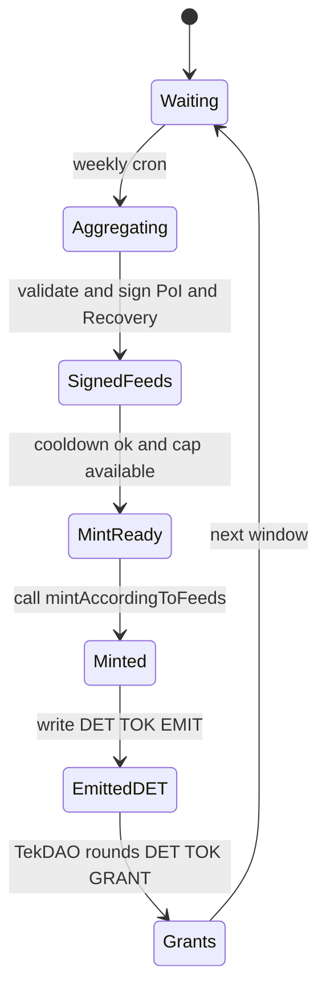

# Minting Flow — TeknIA Tokens (TekTok)

**Path:** `UTCS-BLOCKCHAIN/TekTok/workflows/minting-flow.md`  
**Purpose:** Weekly, deterministic token issuance driven by **verifiable engineering value** (DET/CADET) and **audited anti-corruption recoveries**.

---

## 0) Prerequisites

- **Tokenomics**: `UTCS-BLOCKCHAIN/TekTok/tokenomics.yaml` (weights, caps, guards)  
- **Oracles (weekly)**:  
  - PoI feed → `UTCS-BLOCKCHAIN/TekTok/oracle/feed.json` (DET+CADET normalized score, Ed25519)  
  - Recoveries feed → `UTCS-BLOCKCHAIN/TekTok/oracle/recovery_feed.json` (net USD 18-dec, Ed25519)  
- **Contracts deployed**: `TekTok`, `TekTokMonetaryPolicy`, `TekDAO` (timelock), `TekCred` (SBT), optional `TokenVesting`  
- **DET schemas**: `UTCS-BLOCKCHAIN/DET/schemas/*.json` (validation)

---

## 1) Weekly sequence (Happy path)

1. **Aggregate & sign feeds (oracle)**  
   - Read **DET/CADET** & recoveries for the window (7 d / 90 d).  
   - Produce **`feed.json`** (PoI) and **`recovery_feed.json`** with `previous_hash` + **Ed25519** signature.  
   - See: `TekTok/oracle/offchain-aggregator.md`.

2. **Mint (MonetaryPolicy)**  
   - On-chain call: `mintAccordingToFeeds(innovators, treasury, sustainability)`  
   - Policy checks: **cooldown**, **max weekly cap**, feed integrity (timestamp monotonicity assumed, per off-chain signer rules).  
   - Split (default): **55% Innovators**, **25% Treasury (grants)**, **10% Sustainability**, **10% Vesting/DAO-managed** *(vesting may be executed separately)*.

3. **Emit DET events (off-chain writer)**  
   - Record mint: `DET:TOK:EMIT:<DOMAIN>:<SNS>:mint_poi:V<n>`  
   - Reference **CE/CI** that most influenced the cut and the **CADET** KPI file.

4. **Grants by TekDAO**  
   - Treasury allocation funds **quadratic funding** rounds.  
   - Each award/milestone emits `DET:TOK:GRANT` events.

---

## 2) Validations (MUST)

- **Schema**: `feed.json` / `recovery_feed.json` conform to specs.  
- **Hash chain**: `previous_hash` = sha256 of prior file (per feed family).  
- **Signature**: Ed25519 signed over canonical JSON (sorted keys, minified).  
- **Cooldown**: one mint per cadence (default weekly).  
- **Caps & guards**: enforce tokenomics **max_weekly_percent_cap** and anti-gaming gates (σ filters, min sources).

---

## 3) Inputs & Outputs (shapes)

### 3.1 PoI feed — `TekTok/oracle/feed.json`
```json
{
  "version": "1.0.0",
  "timestamp": "2025-09-01T00:00:00Z",
  "window_days": 7,
  "kpis": {
    "reuse_percent": 41.8,
    "energy_saved_kwh": 38500,
    "co2_saved_kg": 1180,
    "life_extension_months": 12,
    "risk_reduction": 0.07
  },
  "score_18": "41800000000000000000",
  "weights_ref": "TekTok/tokenomics.yaml#proof_of_innovation.kpis",
  "sources": {
    "det": ["DET:CAD:AAA:53-10:design:V5","DET:CAE:AAA:53-10:solver_run:V3"],
    "cadet": ["CADET/kpis/2025-09.yaml"]
  },
  "guards": { "sigma_outlier": 3, "min_sources": 2 },
  "previous_hash": "sha256hex-of-last-feed",
  "signature": { "alg": "Ed25519", "signer": "oracle1@tek", "sig_b64": "BASE64_SIGNATURE" }
}
````

### 3.2 Recoveries feed — `TekTok/oracle/recovery_feed.json`

```json
{
  "version": "1.0.0",
  "timestamp": "2025-09-01T00:00:00Z",
  "window_days": 90,
  "recoupedUSD18": "250000000000000000000",
  "proof": {
    "det_recoveries": ["DET:TOK:RECOVER:ORG-42:case-2025-001:recovery_attest:V1"],
    "auditor_reports": ["TekTok/oracle/audits/ORG-42-case-2025-001.json"]
  },
  "compliance_checks": {
    "auditor_attestation": true, "legal_opinion": true,
    "kyc_aml_screening": true, "sanctions_check": true
  },
  "previous_hash": "sha256hex-of-last-recovery-feed",
  "signature": { "alg": "Ed25519", "signer": "oracle2@tek", "sig_b64": "BASE64_SIGNATURE" }
}
```

---

## 4) DET events (MINT & GRANTS)

### 4.1 Mint event — `DET:TOK:EMIT`

**Path:** `UTCS-BLOCKCHAIN/DET/TOK/EMIT/<DOMAIN>/<SNS>/mint_poi/V<n>/det_packet.json`

```json
{
  "det_id": "DET:TOK:EMIT:AAA:52-10:mint_poi:V1",
  "ts": "2025-09-08T00:00:00Z",
  "refs": { "ce": "CE-CAD-Q100-AAA-ATA-52-DOORS" },
  "inputs": { "poi_feed": "TekTok/oracle/feed.json", "recovery_feed": "TekTok/oracle/recovery_feed.json" },
  "processing": { "tool": "oracle-bridge@1.0", "params": {} },
  "outputs": { "units": "token", "metrics": { "mint_amount": 123456.0 } },
  "hash": "sha256-of-det-packet",
  "sig": { "alg": "Ed25519", "by": "oracle-bridge@tek" }
}
```

### 4.2 Grant award — `DET:TOK:GRANT`

**Path:** `UTCS-BLOCKCHAIN/DET/TOK/GRANT/<DOMAIN>/<SNS>/award/V<n>/det_packet.json`

```json
{
  "det_id": "DET:TOK:GRANT:AAA:20-40:award:V1",
  "ts": "2025-09-09T12:00:00Z",
  "refs": { "ce": "CE-CAD-Q100-AAA-ATA-20-STANDARD-PRACTICES" },
  "inputs": { "proposal": "DOMAINS/EEE-ENVIRONMENTAL_REMEDIATION_CIRCULARITY/proposals/SUST-EEE-2025-09-001/plan.yaml" },
  "processing": { "tool": "dao-exec@1.0", "params": { "vote_tx": "0x…" } },
  "outputs": { "units": "token", "metrics": { "grant_amount": 30000 } },
  "hash": "sha256-of-det-packet",
  "sig": { "alg": "Ed25519", "by": "dao-bot@tek" }
}
```

---

## 5) State machine & timing



**Cooldown:** one mint per week (`MonetaryPolicy.lastMintWeek`).
**Caps:** `maxWeeklyPercentCap` (tokenomics) → `amount ≤ cap · %/week`.

---

## 6) Security & compliance

* **Ed25519 keys**: store in KMS/HSM; rotate per policy.
* **Schema gates**: refuse feeds if schemas fail.
* **Outliers**: reject beyond **3σ** unless replicated by independent sources.
* **Recoveries**: require **auditor\_attestation**, **legal\_opinion**, **KYC/AML**, **sanctions** pass; net off legal costs (cap in tokenomics).
* **S1000D**: allowed **only** under CAS (downstream pointers elsewhere).

---

## 7) CI / Cron examples

**GitHub Actions (weekly)**

```yaml
name: tektok-minting
on:
  schedule: [{ cron: "0 3 * * 0" }]
  workflow_dispatch: {}
jobs:
  mint:
    runs-on: ubuntu-latest
    steps:
      - uses: actions/checkout@v4
      - uses: actions/setup-node@v4
      - uses: actions/setup-python@v5
        with: { python-version: '3.11' }
      - run: pip install pyyaml pynacl
      - name: Aggregate feeds (off-chain)
        env: { ED25519_SK_B64: ${{ secrets.TEKTOK_ED25519_SK_B64 }} }
        run: |
          python UTCS-BLOCKCHAIN/TekTok/oracle/aggregate_feeds.py \
            --root UTCS-BLOCKCHAIN \
            --sign-key "$ED25519_SK_B64"
      - name: Commit feeds
        run: |
          git config user.name "oracle-bot"
          git config user.email "oracle@bot"
          git add UTCS-BLOCKCHAIN/TekTok/oracle/*.json
          git commit -m "chore: weekly oracle feeds" || echo "no changes"
          git push
      # (optional) invoke on-chain mint via a secure runner or manual step
```

---

## 8) Error handling (common)

* **Zero score** → skip mint; still publish feeds with `score_18 = 0`.
* **Cooldown not elapsed** → retry next cycle.
* **Feed chain broken (`previous_hash`)** → halt; investigate.
* **Signature invalid** → halt; rotate keys; republish.
* **Cap exceeded** → mint at cap and log remainder; DAO may adjust weights/caps.

---

## 9) Observability

* Log counts: DET packets ingested, KPIs per cut, mints, grants.
* Keep a weekly digest in `TekTok/oracle/` with the chosen **weights**, **normalizers**, and resulting **score\_18** and **recoupedUSD18**.

---

### TL;DR (operator checklist)

1. **Run aggregators** → write & sign `feed.json` and `recovery_feed.json`
2. **Call mint** → `mintAccordingToFeeds(innovators, treasury, sustainability)`
3. **Write DET** → `DET:TOK:EMIT` (and `DET:TOK:GRANT` for awards/milestones)
4. **Archive** → commit feeds + DET packets to the repo (append-only)

```
::contentReference[oaicite:0]{index=0}
```
