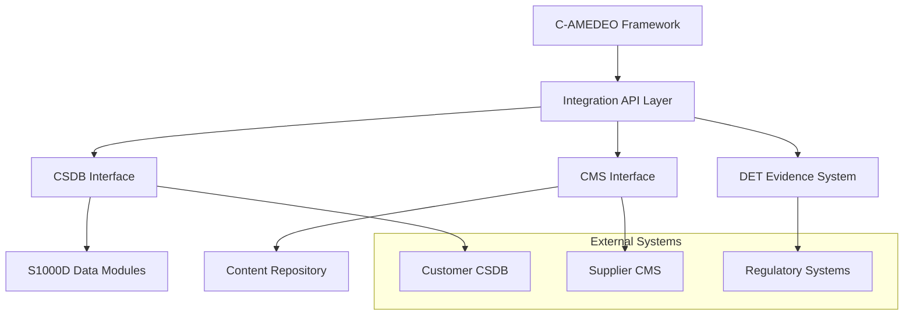

# CSDB/CMS Integration — Common Source Database & Content Management System

**UTCS-MI v5.0 Identifier**  
EstándarUniversal:Especificacion-Definicion-ARP4754A+DO178C+DO254+S1000D+CS25-00.00-CSDBCMSIntegrationSpecification-0001-v1.0-Aerospace and Quantum United Agency-GeneracionHybrida-CROSS-Amedeo Pelliccia-f74d3e06-RestoDeVidaUtil

## Overview

This document specifies the integration between the C-AMEDEO framework and Common Source Database (CSDB) / Content Management System (CMS) architectures, enabling seamless data exchange, content synchronization, and lifecycle management for S1000D-compliant technical publications.

## Architecture Overview

### Integration Layers



### Key Components
- **Integration API Layer**: Unified interface for external system connectivity
- **CSDB Interface**: S1000D-specific data exchange protocols
- **CMS Interface**: General content management integration
- **DET Evidence System**: Traceability and audit trail maintenance
- **Synchronization Engine**: Bi-directional data synchronization
- **Transformation Services**: Data format conversion and mapping

## CSDB Integration Specification

### S1000D Compliance Framework
Based on existing governance structure in `docs/S1000D-GOV/CAS/`:

```yaml
s1000d_integration:
  profile: "S1000D-PROFILE-CAS-v1"
  model_ident_code: "AMPEL360"
  supported_languages: ["en"]
  security_classification: ["unclassified", "restricted"]
  
  data_module_types:
    - "018": "Procedural"
    - "022": "Process"
    - "024": "Maintenance Planning"
    - "040": "Descriptive"
    - "060": "Fault Isolation"
```

### Data Exchange Protocols

#### Push Operations (C-AMEDEO → CSDB)
```yaml
push_workflow:
  trigger_events:
    - "DET:CAS:DOMAIN:SNS:dm_create:V1"
    - "DET:CAS:DOMAIN:SNS:dm_update:V1"
    - "DET:CAS:DOMAIN:SNS:dm_approve:V1"
  
  data_transformation:
    source_format: "C-AMEDEO YAML/JSON"
    target_format: "S1000D XML"
    mapping_rules: "./mappings/camedeo-to-s1000d.yaml"
    validation_schema: "./schemas/s1000d-strict.xsd"
  
  quality_gates:
    - "BREX validation against BREX-CAS.yaml"
    - "BRDP compliance check"
    - "Cross-reference validation"
    - "Media object integrity check"
```

#### Pull Operations (CSDB → C-AMEDEO)
```yaml
pull_workflow:
  sync_schedule: "hourly"
  change_detection: "timestamp_and_hash"
  
  data_transformation:
    source_format: "S1000D XML"
    target_format: "C-AMEDEO Reference"
    preservation_rules:
      - "Maintain original S1000D structure"
      - "Generate DET evidence for changes"
      - "Create downstream.dmc pointers only"
  
  integration_points:
    requirements: "Link to REQ-* identifiers"
    design: "Reference CE-* components"
    testing: "Trace to CAT evidence"
```

### CSDB Authentication and Security

#### Security Framework
```yaml
security_configuration:
  authentication:
    method: "OAuth 2.0 with PKCE"
    token_lifetime: "3600 seconds"
    refresh_enabled: true
    
  authorization:
    role_based: true
    permissions:
      read: ["dm_reader", "technical_author"]
      write: ["technical_author", "dm_approver"]
      approve: ["dm_approver", "publication_manager"]
  
  data_classification:
    unclassified: "Standard S1000D DMs"
    restricted: "Export controlled content"
    confidential: "Customer proprietary data"
```

#### Audit and Compliance
```yaml
audit_requirements:
  event_logging:
    - "All data exchange transactions"
    - "Authentication and authorization events"  
    - "Data transformation operations"
    - "Error conditions and recoveries"
  
  retention_policy:
    transaction_logs: "7 years"
    error_logs: "3 years"
    performance_logs: "1 year"
  
  compliance_reports:
    frequency: "monthly"
    recipients: ["Security Officer", "Compliance Manager"]
    content: ["Access patterns", "Data flows", "Anomalies"]
```

## CMS Integration Specification

### Content Repository Integration

#### Repository Structure Mapping
```yaml
cms_mapping:
  c_amedeo_domains:
    AAA: "/aerospace/airframes"
    PPP: "/propulsion/systems"
    CCC: "/cabin/systems"
    LIB: "/logistics/blockchain"
  
  content_types:
    requirements: "/specifications/requirements"
    designs: "/engineering/designs"
    procedures: "/operations/procedures"
    evidence: "/quality/evidence"
```

#### Metadata Synchronization
```yaml
metadata_sync:
  c_amedeo_fields:
    utcs_id: "cms.identifier"
    domain: "cms.category"
    version: "cms.version"
    status: "cms.workflow_state"
    owner: "cms.responsible_party"
  
  cms_enrichment:
    tags: "Auto-generated from content"
    keywords: "Extracted from text analysis"
    relationships: "Derived from references"
    usage_analytics: "Access patterns and frequency"
```

### Content Lifecycle Management

#### Version Synchronization
```yaml
version_sync:
  bidirectional: true
  conflict_resolution: "C-AMEDEO authoritative"
  
  sync_triggers:
    c_amedeo_to_cms:
      - "Document approval"
      - "Version baseline"
      - "Status change"
    
    cms_to_c_amedeo:
      - "External review completion"
      - "Publication approval"
      - "Access request"
```

#### Workflow Integration  
```yaml
workflow_integration:
  cms_workflows:
    - name: "Document Review"
      trigger: "C-AMEDEO document creation"
      steps: ["Assignment", "Review", "Approval", "Publication"]
      
    - name: "Change Management"
      trigger: "Version update detection"
      steps: ["Impact Analysis", "Approval", "Implementation", "Verification"]
  
  notification_system:
    channels: ["Email", "Slack", "Teams"]
    events: ["Workflow start", "Action required", "Completion"]
```

### Search and Discovery Integration

#### Federated Search
```yaml
search_integration:
  search_scope:
    - "C-AMEDEO documentation"
    - "S1000D data modules"
    - "CMS content repository"
    - "External reference libraries"
  
  search_features:
    full_text: "Elasticsearch backend"
    faceted: "Domain, CAX pillar, status filters"
    semantic: "AI-powered content understanding"
    visual: "Diagram and image search"
```

#### Content Recommendations
```yaml
recommendation_engine:
  algorithms:
    - "Collaborative filtering"
    - "Content-based similarity"
    - "Usage pattern analysis"
    - "Expert system rules"
  
  recommendation_types:
    related_documents: "Based on references and citations"
    suggested_updates: "When source content changes"
    best_practices: "Similar successful implementations"
    compliance_guidance: "Regulatory requirement alignment"
```

## Data Transformation and Mapping

### C-AMEDEO to S1000D Mapping

#### Requirements Transformation
```yaml
requirements_mapping:
  source: "requirements.yaml"
  target: "S1000D Procedural DM (018)"
  
  field_mappings:
    - camedeo: "requirements[].id"
      s1000d: "dmAddress/dmIdent/dmCode"
      transformation: "REQ-DOMAIN-SNS → DM-AMPEL360-Q-DOMAIN-SNS-A-018A-00A-00A-A"
    
    - camedeo: "requirements[].text"
      s1000d: "content/procedure/mainProcedure/proceduralStep/para"
      transformation: "Direct text mapping with formatting"
    
    - camedeo: "requirements[].verification"
      s1000d: "content/procedure/closeRqmts/reqCondGroup"
      transformation: "Verification method to requirement condition"
```

#### Design Data Transformation
```yaml
design_mapping:
  source: "CE-CAD-*.yaml"
  target: "S1000D Descriptive DM (040)"
  
  field_mappings:
    - camedeo: "component.description"
      s1000d: "content/description/levelledPara"
      transformation: "Hierarchical description structure"
    
    - camedeo: "component.specifications"
      s1000d: "content/description/table"
      transformation: "Specifications to tabular format"
    
    - camedeo: "component.interfaces"
      s1000d: "content/description/figure"
      transformation: "Interface diagrams with callouts"
```

### Reverse Mapping (S1000D to C-AMEDEO)

#### Data Module Reference Creation
```yaml
reverse_mapping:
  purpose: "Create C-AMEDEO pointers to S1000D content"
  output_format: "downstream.dmc files"
  
  pointer_structure:
    dm_reference:
      dm_code: "[Full S1000D DM code]"
      title: "[DM title]"
      issue: "[Current issue number]"
      language: "[Content language]"
    
    c_amedeo_links:
      source_component: "[CE/CC/CI identifier]"
      relationship: "[describes/implements/verifies]"
      traceability: "[DET evidence reference]"
```

## Integration APIs and Services

### RESTful API Specification

#### Authentication Endpoints
```yaml
auth_endpoints:
  POST /api/v1/auth/token:
    description: "Obtain access token"
    parameters:
      client_id: "string"
      client_secret: "string"
      scope: "string"
    response:
      access_token: "JWT token"
      expires_in: "integer"
      refresh_token: "string"
```

#### Data Exchange Endpoints
```yaml
data_endpoints:
  GET /api/v1/csdb/datamodules:
    description: "Retrieve data modules"
    parameters:
      domain: "string (optional)"
      status: "string (optional)"
      since: "ISO-8601 timestamp (optional)"
    response:
      data_modules: "array of DM metadata"
      pagination: "pagination info"
  
  POST /api/v1/csdb/datamodules:
    description: "Create new data module"
    request_body: "S1000D XML content"
    response:
      dm_code: "Generated DM code"
      status: "Creation status"
      validation_results: "BREX validation results"
  
  PUT /api/v1/csdb/datamodules/{dm_code}:
    description: "Update existing data module"
    parameters:
      dm_code: "S1000D DM identifier"
    request_body: "Updated S1000D XML content"
    response:
      version: "New version number"
      change_summary: "Summary of changes"
```

#### Content Management Endpoints
```yaml
cms_endpoints:
  GET /api/v1/cms/content/{path}:
    description: "Retrieve content by path"
    parameters:
      path: "Content repository path"
      version: "string (optional)"
    response:
      content: "Content data"
      metadata: "Content metadata"
  
  POST /api/v1/cms/search:
    description: "Search content repository"
    request_body:
      query: "Search query string"
      filters: "Search filters object"
      pagination: "Pagination parameters"
    response:
      results: "Search results array"
      facets: "Available facets"
      total_count: "Total result count"
```

### Event-Driven Integration

#### Event Types and Schemas
```yaml
event_definitions:
  camedeo.document.created:
    schema:
      document_id: "string"
      document_type: "string"
      domain: "string"
      version: "string"
      timestamp: "ISO-8601"
  
  csdb.datamodule.updated:
    schema:
      dm_code: "string"
      previous_version: "string"
      current_version: "string"
      change_type: "string"
      timestamp: "ISO-8601"
  
  cms.content.published:
    schema:
      content_path: "string"
      content_type: "string"
      version: "string"
      publication_date: "ISO-8601"
```

#### Message Processing
```yaml
message_processing:
  message_broker: "Apache Kafka"
  topics:
    - "camedeo-events"
    - "csdb-events" 
    - "cms-events"
    - "integration-errors"
  
  consumer_groups:
    - "csdb-sync-service"
    - "cms-sync-service"
    - "audit-service"
    - "notification-service"
  
  error_handling:
    retry_policy: "Exponential backoff, max 5 attempts"
    dead_letter_queue: "integration-dlq"
    alert_threshold: "3 consecutive failures"
```

## Monitoring and Observability

### Integration Health Monitoring

#### Key Performance Indicators
```yaml
integration_kpis:
  availability:
    target: "99.5%"
    measurement: "Uptime of integration services"
    
  latency:
    target: "< 2 seconds for sync operations"
    measurement: "End-to-end processing time"
    
  throughput:
    target: "> 100 documents/hour"
    measurement: "Documents processed per hour"
    
  error_rate:
    target: "< 1%"
    measurement: "Failed operations percentage"
```

#### Monitoring Infrastructure
```yaml
monitoring_stack:
  metrics: "Prometheus + Grafana"
  logging: "ELK Stack (Elasticsearch, Logstash, Kibana)"
  tracing: "Jaeger distributed tracing"
  alerting: "PagerDuty + Slack notifications"
  
  dashboards:
    - "Integration Overview"
    - "CSDB Sync Status"
    - "CMS Performance" 
    - "Error Analysis"
    - "Business Metrics"
```

### Data Quality Monitoring

#### Quality Metrics
```yaml
data_quality:
  completeness:
    measurement: "Required fields populated"
    target: "> 95%"
    
  accuracy:
    measurement: "Data validation success rate"
    target: "> 98%"
    
  consistency:
    measurement: "Cross-system data alignment"
    target: "> 99%"
    
  timeliness:
    measurement: "Data freshness"
    target: "< 1 hour lag"
```

#### Quality Assurance Processes
```yaml
qa_processes:
  automated_validation:
    - "Schema validation"
    - "Business rule checking"
    - "Referential integrity"
    - "Format compliance"
  
  manual_review:
    - "Sample-based content review"
    - "User acceptance testing"
    - "Process effectiveness assessment"
    
  continuous_improvement:
    - "Quality trend analysis"
    - "Root cause investigation"
    - "Process optimization"
    - "Tool enhancement"
```

## Deployment and Operations

### Infrastructure Requirements

#### System Architecture
```yaml
infrastructure:
  compute:
    integration_services: "Kubernetes cluster (3+ nodes)"
    database: "PostgreSQL cluster (HA setup)"
    message_broker: "Kafka cluster (3 brokers)"
    
  storage:
    document_storage: "S3-compatible object storage"
    metadata_cache: "Redis cluster"
    search_index: "Elasticsearch cluster"
    
  networking:
    load_balancer: "Layer 7 load balancing"
    security: "TLS 1.3, mTLS for service-to-service"
    monitoring: "Network performance monitoring"
```

#### Security Considerations
```yaml
security_controls:
  network_security:
    - "VPC with private subnets"
    - "Network segmentation"
    - "Firewall rules and ACLs"
    
  application_security:
    - "OAuth 2.0 authentication"
    - "Role-based authorization"
    - "Input validation and sanitization"
    - "SQL injection prevention"
    
  data_security:
    - "Encryption at rest (AES-256)"
    - "Encryption in transit (TLS 1.3)"
    - "Key management (HSM)"
    - "Data masking for non-production"
```

### Disaster Recovery and Business Continuity

#### Backup Strategy
```yaml
backup_strategy:
  frequency:
    database: "Continuous backup with PITR"
    documents: "Daily incremental, weekly full"
    configurations: "Version controlled, automated backup"
    
  retention:
    daily: "30 days"
    weekly: "12 weeks"
    monthly: "12 months"
    yearly: "7 years"
    
  testing:
    schedule: "Monthly backup restore tests"
    validation: "Automated integrity checks"
    documentation: "Test results and procedures"
```

#### Disaster Recovery Plan
```yaml
disaster_recovery:
  rto_target: "4 hours" # Recovery Time Objective
  rpo_target: "1 hour"  # Recovery Point Objective
  
  procedures:
    - "Service health assessment"
    - "Failover to backup systems"
    - "Data recovery validation"
    - "Service restoration testing"
    - "User communication and updates"
    
  testing_schedule:
    full_dr_test: "Annually"
    partial_tests: "Quarterly"
    runbook_updates: "After each test"
```

---

*This CSDB/CMS integration specification is part of the C-AMEDEO framework for the AMPEL360-BWB-Q Program.*  
*For integration support or technical questions, contact the Systems Integration Office.*