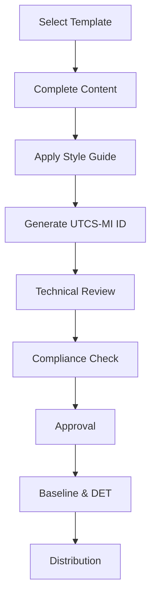
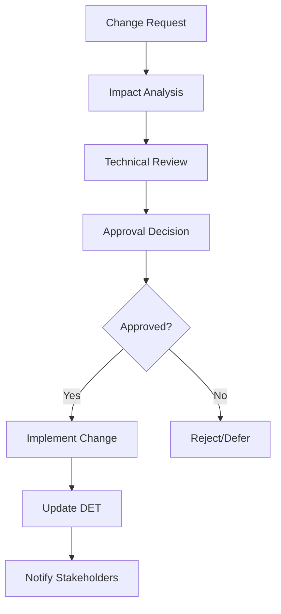
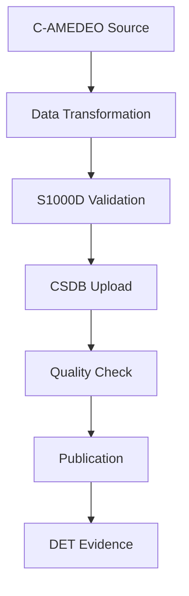

# Documentation Control Center — C-AMEDEO Framework

**UTCS-MI v5.0 Identifier**  
EstándarUniversal:Especificacion-Definicion-ARP4754A+DO178C+DO254+S1000D+CS25-00.00-DocumentationControlCenter-0001-v1.0-Aerospace and Quantum United Agency-GeneracionHybrida-CROSS-Amedeo Pelliccia-f74d3e06-RestoDeVidaUtil

## Overview

This document serves as the central index for all documentation control, templates, style guides, and CSDB/CMS integration resources within the C-AMEDEO framework. It provides a comprehensive guide to the documentation ecosystem supporting the AMPEL360-BWB-Q program.

## Quick Start Guide

### For New Team Members
1. Read the [Style Guide (Guía de Estilo)](STYLE-GUIDE.md) - formatting and language standards
2. Review [Templates (Plantillas)](TEMPLATES.md) - available document templates
3. Understand [Document Control Procedures](DOCUMENT-CONTROL-PROCEDURES.md) - lifecycle management
4. Learn [Version Control](VERSION-CONTROL.md) - change management practices
5. Complete [Training (Capacitación)](TRAINING.md) - competency development

### For Document Authors
1. Select appropriate template from [Templates Catalog](TEMPLATES.md)
2. Follow [Style Guide](STYLE-GUIDE.md) formatting requirements
3. Apply [Document Control Procedures](DOCUMENT-CONTROL-PROCEDURES.md) for review and approval
4. Use [Version Control](VERSION-CONTROL.md) guidelines for change management
5. Generate DET evidence as per framework requirements

### For System Integrators
1. Review [CSDB/CMS Integration](CSDB-CMS-INTEGRATION.md) specifications
2. Understand S1000D integration points and data flows
3. Implement API interfaces for external system connectivity
4. Configure authentication and authorization systems
5. Set up monitoring and quality assurance processes

## Core Documentation

### 📋 [Style Guide (Guía de Estilo)](STYLE-GUIDE.md)
Comprehensive style guide establishing consistent formatting, language, and structural conventions for all technical documentation within the C-AMEDEO framework.

**Key Features:**
- UTCS-MI v5.0 identifier formatting
- English-first language requirements
- DI → CE → CC → CI → CP hierarchy conventions
- Cross-reference formatting standards
- Technical specification guidelines

### 📝 [Templates (Plantillas)](TEMPLATES.md)
Standardized templates for all types of technical documentation, ensuring consistency and compliance with UTCS-MI v5.0 standards.

**Available Templates:**
- Requirements specifications
- Design documents
- Test procedures  
- DET evidence packages
- S1000D data modules
- Process procedures

### 🔄 [Document Control Procedures](DOCUMENT-CONTROL-PROCEDURES.md)
Comprehensive document control procedures ensuring document integrity, traceability, and compliance with aerospace standards while supporting the Digital Evidence Twin (DET) methodology.

**Key Processes:**
- Document lifecycle management
- Change control workflows
- Approval processes
- Version management
- DET integration

### 📊 [Version Control (Control de Versiones)](VERSION-CONTROL.md)
Version control guidelines and best practices ensuring consistent versioning strategies across all document types, software artifacts, and evidence packages.

**Core Features:**
- Semantic versioning strategy
- Git workflow integration
- DET version evidence
- Configuration management
- Compliance and audit support

### 🎓 [Training (Capacitación)](TRAINING.md)
Comprehensive training programs covering all CAX pillars, documentation standards, and Digital Evidence Twin (DET) methodology.

**Learning Paths:**
- New team member onboarding
- Domain expert certification
- CAX pillar specialization
- Competency framework
- Assessment and certification

### 🔗 [CSDB/CMS Integration](CSDB-CMS-INTEGRATION.md)
Integration specifications for Common Source Database (CSDB) and Content Management System (CMS) architectures, enabling seamless data exchange and S1000D compliance.

**Integration Features:**
- S1000D data exchange protocols
- API specifications
- Security and authentication
- Monitoring and observability
- Data transformation mapping

## Template Library

### Core Engineering Templates
| Template | Purpose | CAX Pillar | Compliance |
|----------|---------|------------|------------|
| [Requirements Template](templates/requirements-template.yaml) | Machine-readable requirements | CAD | ARP4754A, CS25 |
| [Design Specification Template](templates/design-spec-template.md) | Technical design docs | CAD | DO178C, DO254 |
| [DET Evidence Template](templates/det-template.json) | Digital evidence packages | All | UTCS-MI v5.0 |

### Specialized Templates
- **CAD**: Design specifications, feasibility studies, PBS structures
- **CAE**: Analysis procedures, simulation results, validation reports
- **CAM**: Manufacturing processes, MBOM specifications, quality control
- **CAT**: Test procedures, data analysis, correlation methods
- **CAI**: Integration procedures, ICD specifications, system validation
- **CAS**: S1000D data modules, maintenance procedures, logistics support

## Compliance Framework

### Regulatory Compliance
- **ARP4754A**: Guidelines and Methods for Conducting the Safety Assessment Process
- **DO178C**: Software Considerations in Airborne Systems and Equipment Certification
- **DO254**: Design Assurance Guidance for Airborne Electronic Hardware
- **CS25**: Certification Specifications and Acceptable Means of Compliance for Large Aeroplanes
- **S1000D**: International specification for technical publications using a common source database

### Quality Standards
- **UTCS-MI v5.0**: Universal standard for 13-field identifiers
- **DET Methodology**: Digital Evidence Twin for traceability
- **ATA iSpec 2200**: Air Transport Association specification
- **ISO 9001**: Quality management systems
- **AS9100**: Quality management systems for aerospace

## Process Workflows

### Document Creation Workflow

### Change Control Workflow

### S1000D Integration Workflow

## Tools and Systems

### Primary Tools
- **Git/GitHub**: Version control and collaboration
- **YAML/Markdown**: Documentation formats
- **S1000D Tools**: CSDB integration and publication
- **DET Generator**: Evidence package creation
- **Validation Tools**: Compliance and quality checking

### Integration Systems
- **Document Management System**: Centralized repository
- **Workflow Engine**: Automated processes
- **CSDB Interface**: S1000D integration
- **CMS Connector**: Content management integration
- **API Gateway**: External system connectivity

## Metrics and KPIs

### Documentation Quality
- Template adoption rate
- Style guide compliance
- Review cycle time
- Error rate reduction

### Process Efficiency
- Time to publication
- Change approval time
- Integration success rate
- User satisfaction scores

### Compliance Metrics
- Audit findings
- Standard compliance rate
- DET evidence completeness
- Regulatory alignment

## Support and Resources

### Getting Help
- **Documentation Team**: docs-team@company.com
- **Technical Support**: tech-support@company.com
- **Training Coordinator**: training@company.com
- **Integration Support**: integration@company.com

### Additional Resources
- **Knowledge Base**: Internal documentation portal
- **Video Tutorials**: Step-by-step guidance
- **Best Practices**: Lessons learned and recommendations
- **Community Forum**: Peer-to-peer support

### Emergency Contacts
- **Document Control Office**: Available 24/7 for critical issues
- **System Administrator**: Infrastructure and tool support
- **Compliance Manager**: Regulatory and audit support
- **Program Manager**: Strategic direction and priorities

## Continuous Improvement

### Feedback Mechanisms
- Regular user surveys and feedback collection
- Process effectiveness reviews
- Tool performance monitoring
- Industry benchmarking

### Update Process
- Quarterly review of procedures and templates
- Annual compliance assessment
- Technology evaluation and adoption
- User training and competency updates

### Innovation Initiatives
- Automation and AI integration
- Advanced analytics and reporting
- Enhanced user experience
- Integration with emerging standards

---

*This documentation control center is part of the C-AMEDEO framework for the AMPEL360-BWB-Q Program.*  
*For questions, suggestions, or support, contact the Documentation Working Group.*

**Document Status**: Active | **Last Updated**: 2024-01-15 | **Next Review**: 2024-07-15