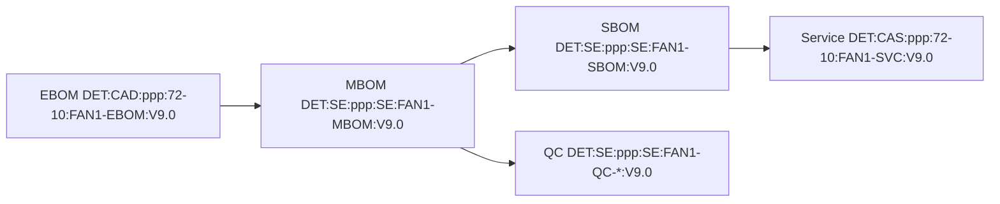

# EBOM→MBOM→SBOM Crosswalk Mapping for FAN1

**Documento:** Mapeo de Trazabilidad BOM  
**Asset:** FAN1 (Fan Section Assembly)  
**ATA:** 72.10 (Engine—Fan Section)  
**Versión:** V9.0  
**Fecha:** 2025-12-02

## Resumen Ejecutivo

Este documento establece la trazabilidad completa entre los tres niveles de Bill of Materials (BOM) para el ensamble de sección de ventilador FAN1, implementando los estándares UTCS-MI v5.0 y la metodología de transformación 1-a-N especificada en el problema.

## Tabla de Crosswalk Completo

| EBOM (CI_Code) | MBOM (Nivel/Ítem) | SBOM (N.º Servicio) | Transformación | Observaciones |
|---|---|---|---|---|
| **BLD1** Pala fan | L2: BLD1 ×24 (rotor) | **BLD1-SVC** (unidad) | 1:1 individual | EBOM pieza → MBOM igual; SBOM FRU individual, requiere re-equilibrado si >2 |
| **HUB2** Cubo | L2: HUB2 ×1 | **HUB2-NR** | 1:1 no-serviceable | En SBOM como **No-Reemplazable** (D-Level) |
| **BRH6** Aloj. raíz | L2: BRH6 ×24 | **BRH6-NR** | 1:1 no-serviceable | Integrado al cubo en servicio; D-Level |
| **FST7** Juego fijaciones | **Explosión MBOM**: FST7-B/N/W (96 c/u) | **KIT-BLD-FST-01** | Set → Kit | EBOM "set" → MBOM piezas; SBOM → **Kit** |
| **CWL3** Cowl | L1: CWL3 ×2 | **CWL3-SVC** | 1:1 paired | SBOM como par emparejado (matcheado en fabricación) |
| **SPN4** Spinner | L1: SPN4 ×1 | **SPN4-SVC** | 1:1 individual | FRU O-Level |
| **SHR8** Shroud | L1: SHR8 ×1 | **SHR8-SVC** | 1:1 individual | Inspección térmica previa (nota SBOM) |
| **QSN5** Nodo sensor | L2: QSN5 ×4 | **QSN5-SVC** | 1:1 calibrated | Requiere recalibración T-QCAL-100 (nota SBOM) |
| **QIC9** Cable cuántico | L2: QIC9 ×2 | **QIC9-SVC** | 1:1 specialized | Verif. conectores/prior routing |

## Reglas de Transformación

### EBOM → MBOM
- **Objetivo**: Pasar de perspectiva de diseño a perspectiva de fabricación
- **Transformaciones principales**:
  - Explosión de kits: FST7 set → FST7-B/N/W componentes individuales
  - Adición de consumibles (CNS10/11/12) no presentes en EBOM
  - Asignación de estaciones de trabajo (SE references)
  - Definición de secuencia de operaciones (BOP)

### MBOM → SBOM
- **Objetivo**: Pasar de perspectiva de fabricación a perspectiva de servicio
- **Transformaciones principales**:
  - Agrupación en FRU (Field Replaceable Units)
  - Clasificación por niveles de servicio (O/I/D-Level)
  - Reagrupación de piezas en kits de servicio
  - Mapeo a procedimientos S1000D (DMC)
  - Adición de información de proveedores (CV)

## Nivel de Servicio y FRU Classification

### O-Level (Organizational Level)
- **BLD1-SVC**: Pala individual, reemplazo en línea de vuelo
- **CWL3-SVC**: Cowl emparejado, reemplazo básico
- **SPN4-SVC**: Spinner, reemplazo básico
- **SHR8-SVC**: Shroud, requiere inspección térmica
- **KIT-BLD-FST-01**: Kit de fijaciones completo

### I-Level (Intermediate Level)
- **QSN5-SVC**: Sensores cuánticos, requiere clean room y calibración
- **QIC9-SVC**: Cables cuánticos, requiere clean room

### D-Level (Depot Level)
- **HUB2-NR**: Hub no reparable en campo
- **BRH6-NR**: Alojamientos de raíz integrados al hub
- **FAN-MOD-OH**: Módulo completo para overhaul

## Bill of Process (BOP) Mapping

| Operación | Estación (SE) | EBOM Items | MBOM Items | Observaciones |
|---|---|---|---|---|
| 010-020 | SE:ppp:ROT-A | HUB2, BRH6 | HUB2 ×1, BRH6 ×24 | Recepción e integración hub |
| 030-040 | SE:ppp:ROT-A | BLD1, FST7 | BLD1 ×24, FST7-B/N/W ×96 | Montaje palas con fijaciones |
| 050 | SE:ppp:BAL-01 | Assembly | Complete rotor | Balanceo dinámico QML-optimizado |
| 060 | SE:ppp:INTEG | CWL3, SHR8, SPN4 | CWL3 ×2, SHR8 ×1, SPN4 ×1 | Integración carcasas |
| 070 | SE:ppp:CLEAN | QSN5, QIC9 | QSN5 ×4, QIC9 ×2 | Instalación componentes cuánticos |
| 080 | SE:ppp:FINAL | Assembly | Complete FAN1 | Pruebas funcionales finales |

## Vendor y Supply Chain (CV) Mapping

| SBOM FRU | Vendor | CAGE | CV-PN | Observaciones |
|---|---|---|---|---|
| **QSN5-SVC** | Q-Sense NV | 3F7Q2 | QSN5-NV-2026 | Certif. DO-160G Sec. 20, Trazas QA lot/wafer |
| **KIT-BLD-FST-01** | HiLock Aero | 1XK21 | FST7-KIT-01 | Coating Ti, lote único por rotor |
| **CWL3-SVC** | CompositeWorks | 7C9L1 | CWL3-PAIR-M | Par emparejado con cert. emparejamiento |

## S1000D DMC Bridge Mapping

| SBOM FRU | Action | DMC (ej.) | AMM/FIM | Service Notes |
|---|---|---|---|---|
| **BLD1-SVC** | Rem/Inst | 72-10-01-020-801-A | AMM 72-10-01 | Re-equilibrar si >2 palas cambiadas |
| **CWL3-SVC** | Rem/Inst | 72-10-02-020-801-A | AMM 72-10-02 | Suministro pareado (matching) |
| **SPN4-SVC** | Rem/Inst | 72-10-03-020-801-A | AMM 72-10-03 | Revisión de holguras |
| **SHR8-SVC** | Rem/Inst | 72-10-04-020-801-A | AMM 72-10-04 | Inspección térmica previa |
| **KIT-BLD-FST-01** | Replace | 72-10-05-020-801-A | AMM 72-10-05 | Kit completo FST7-B/N/W |
| **QSN5-SVC** | Test/Cal | 72-10-10-720-801-A | FIM 72-10-F01 | Calibración T-QCAL-100 |
| **QIC9-SVC** | Rem/Inst | 72-10-10-020-801-A | AMM 72-10-10 | Radio curvatura ≥ 4×Ø |
| **FAN-MOD-OH** | Swap OH | 72-10-00-040-801-A | AMM 72-10-00 | Devolver core con etiquetas |

## Quantum Boost Integration

### Manufacturing (MBOM)
- **Op 050 (Balanceo)**: QML asiste con surrogate de convergencia (menos iteraciones)
- **Op 070 (QIC9 routing)**: QUBO sugiere ruteo libre de cruces
- **Op 070 (QSN5 validation)**: VQE valida cadena NV-center bajo perfil térmico DO-160G

### Service (SBOM)
- **QSN5-SVC**: Quantum sensor calibration con T-QCAL-100
- **QIC9-SVC**: Verificación de conectividad cuántica post-instalación

## DET Traceability Chain

## Beneficios Operacionales

### Fabricación
- **Lead-time reducido**: BOP optimizado con QML/QUBO reduce iteraciones
- **First-pass-yield mejorado**: QA gates trazables en cada operación
- **Consistencia**: Transformación automatizada EBOM→MBOM

### Servicio
- **Menos errores de pedido**: FRU claramente definidos con kits
- **SLAs previsibles**: Tiempos de servicio documentados por DMC
- **Core return controlado**: Políticas de devolución integradas en SBOM

### Auditoría
- **Conformidad auditable**: UTCS-MI + DET + eventos QAL Bus
- **Trazabilidad completa**: De requisito a servicio vía DET chain
- **Reproducibilidad**: Proceso QAL-tight documentado

## Validación y Cumplimiento

### Checks de Consistencia
- ✅ **DET V9.0**: Formato de dos segmentos compatible con det.ref.schema.json
- ✅ **FRU/NR Consistency**: Cantidades SBOM = EBOM (BLD1 24→24, QIC9 2→2)
- ✅ **Consumibles**: Solo en MBOM (CNS10/11/12), no en EBOM/SBOM
- ✅ **Estaciones SE**: Todas las referencias BOP mapeadas a SE:ppp:*
- ✅ **QS Hooks**: BLD1/QSN5/QIC9 mantienen eventos QS.Published vigentes

### Eventos QAL Bus
- **CAM.MBOMReleased**: Publicado en MBOM release con meta BOP
- **CAS.SBOMReleased**: Publicado en SBOM release con meta IPC

---

**Documento controlado por QAL Bus**  
**Próxima revisión**: En cambio de configuración FAN1  
**Responsable**: Manufacturing & MRO Engineering Leads  
**QAUDIT**: Pending compliance review