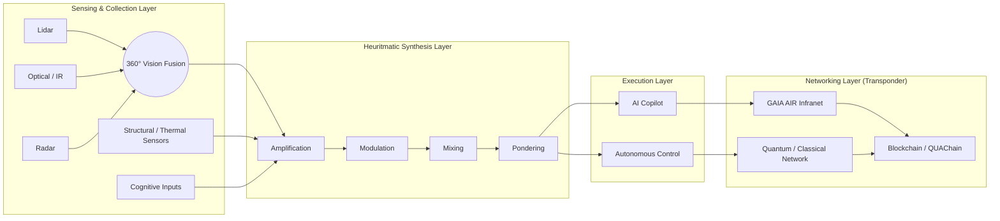

## AMPEL360 V Transponder — Heuritma Architecture (beta)

This page documents the AMPEL360 V Transponder as a sensorial synthesizer with a 360° execution layer, embodying the Heuritma core loop in AQUA V OS.

### Architecture diagram

### Heuritma: diagram legend & context panel

Definition

The Heuritma is the atomic, recursive framework at the heart of AMPEL360 hardware and AQUA V OS software. It operationalizes intelligence as a dynamic cycle—transforming raw sensory input into mapped control and validated feedback, then folding back into itself.

Five-dimensional structure (as shown in diagram)

- Intent — See everything, miss nothing 👁️
  - Represented by the Sensing & Collection Layer.
  - The 360° Fusion block unites lidar, optical/IR, radar, structural/thermal data, and cognitive input into a single awareness stream.

- Constraint — Boundaries and feasibility 🛡️
  - Encoded via structural/thermal sensors and environmental inputs.
  - Constraints shape downstream processing and ensure safe operational envelopes.

- Pattern — Experience structured into synthesis 🌊
  - The Heuritmatic Synthesis Layer embodies empirical shortcuts as flows: Amplify → Modulate → Mix → Ponder.
  - Encodes tacit rules of thumb into formalizable, automatable processes.

- Mapping — From pattern to decision ⚙️
  - The Execution Layer crystallizes synthesis into:
    - AI Copilot (collaborative reasoning with pilots).
    - Autonomous Control (direct actuation and adaptive flight logic).

- Evaluation — Validation and learning 🌐
  - The Networking Layer routes outcomes outward:
    - GAIA AIR Infranet distributes shared fleet knowledge.
    - Quantum/Classical Network handles real-time secure exchange.
    - Blockchain/QUAChain notarizes, validates, and records system states.
  - This closes the loop, feeding back improved knowledge to the sensing stage.

Cycle in action

Sensing → Synthesis → Execution → Networking/Evaluation → back to Sensing.
Each completed cycle forms a recursive circuit, seeding both immediate adaptation and long-term system evolution.

Context note

Every AMPEL360 V Transponder is not just a subsystem—it is an instantiation of the Heuritma itself: a persistent, living architecture. This makes intelligence distributed, evolvable, and network-native by design, forming a foundational kernel of AQUA V OS.
